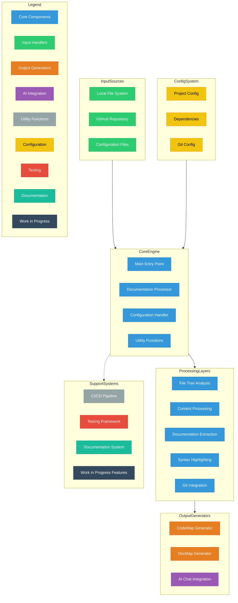

# codemapper

> CodeMap Source: Local directory: `/Users/shaneholloman/git/_sources/_shaneholloman/codemapper`

**Git Information:**

- Branch: `main`
- Commit: `8f157894`
- Date: 2025-11-04 23:57:09 +1300
- Remote: <https://github.com/shaneholloman/codemapper.git>

This markdown document provides a comprehensive overview of the directory structure and file contents. It aims to give viewers (human or AI) a complete view of the codebase in a single file for easy analysis.

## Document Table of Contents

The table of contents below is for navigational convenience and reflects this document's structure, not the actual file structure of the repository.

<!-- TOC -->

- [codemapper](#codemapper)
    - [Document Table of Contents](#document-table-of-contents)
    - [Repo File Tree](#repo-file-tree)
    - [Repo File Contents](#repo-file-contents)
        - [`README.md`](#readmemd)
        - [`.gitignore`](#gitignore)
        - [`.github/FUNDING.yml`](#githubfundingyml)
        - [`.github/workflows/pytest.yml`](#githubworkflowspytestyml)
        - [`.github/workflows/ruff.yml`](#githubworkflowsruffyml)
        - [`.github/workflows/update-todo-badges.yml`](#githubworkflowsupdate-todo-badgesyml)
        - [`.vscode/settings.json`](#vscodesettingsjson)
        - [`archive/codemapper-outlined.svg`](#archivecodemapper-outlinedsvg)
        - [`archive/codemapper-outlined.webp`](#archivecodemapper-outlinedwebp)
        - [`audio/codemapper-podcast.wav`](#audiocodemapper-podcastwav)
        - [`changelog.md`](#changelogmd)
        - [`CLAUDE.md`](#claudemd)
        - [`codemapper-logo.svg`](#codemapper-logosvg)
        - [`docs/assets/1.svg`](#docsassets1svg)
        - [`docs/assets/2.svg`](#docsassets2svg)
        - [`docs/assets/3.svg`](#docsassets3svg)
        - [`docs/assets/4.svg`](#docsassets4svg)
        - [`docs/assets/mindmap-exported-from-inkscape.svg`](#docsassetsmindmap-exported-from-inkscapesvg)
        - [`docs/assets/mindmap.svg`](#docsassetsmindmapsvg)
        - [`docs/briefs/brief-code-restructure.md`](#docsbriefsbrief-code-restructuremd)
        - [`docs/briefs/brief-docmap-evaluation.md`](#docsbriefsbrief-docmap-evaluationmd)
        - [`docs/briefs/brief-docmap-feature.md`](#docsbriefsbrief-docmap-featuremd)
        - [`docs/briefs/brief-xml-export.md`](#docsbriefsbrief-xml-exportmd)
        - [`docs/builds/pypi.md`](#docsbuildspypimd)
        - [`docs/codemapper-overview.md`](#docscodemapper-overviewmd)
        - [`docs/codemapper-summary.md`](#docscodemapper-summarymd)
        - [`docs/standards/pylintrc.md`](#docsstandardspylintrcmd)
        - [`docs/standards/python-rules.md`](#docsstandardspython-rulesmd)
        - [`docs/todo.md`](#docstodomd)
        - [`LICENSE`](#license)
        - [`pyproject.toml`](#pyprojecttoml)
        - [`scripts/update-todo-badges.ps1`](#scriptsupdate-todo-badgesps1)
        - [`src/.gitkeep`](#srcgitkeep)
        - [`src/codemapper/__init__.py`](#srccodemapper__init__py)
        - [`src/codemapper/config.py`](#srccodemapperconfigpy)
        - [`src/codemapper/docmap.py`](#srccodemapperdocmappy)
        - [`src/codemapper/main.py`](#srccodemappermainpy)
        - [`src/codemapper/utils.py`](#srccodemapperutilspy)
        - [`tests/test_github_codemapper.py`](#teststest_github_codemapperpy)
        - [`uv.lock`](#uvlock)
        - [`wip/packages/package_categories.json`](#wippackagespackage_categoriesjson)
        - [`wip/packages/package_info.json`](#wippackagespackage_infojson)
        - [`wip/packages/python_package_info.py`](#wippackagespython_package_infopy)
        - [`wip/spreadsheets/manual_paper_ratings.csv`](#wipspreadsheetsmanual_paper_ratingscsv)
        - [`wip/spreadsheets/manual_paper_ratings.md`](#wipspreadsheetsmanual_paper_ratingsmd)
        - [`wip/spreadsheets/spreasheet_to_markdown.py`](#wipspreadsheetsspreasheet_to_markdownpy)
        - [`wip/xml-exports/xml-export-example-somerepo.xml`](#wipxml-exportsxml-export-example-somerepoxml)

<!-- /TOC -->

## Repo File Tree

This file tree represents the actual structure of the repository. It's crucial for understanding the organization of the codebase.

```tree
.
├── .github/
│   ├── workflows/
│   │   ├── pytest.yml
│   │   ├── ruff.yml
│   │   └── update-todo-badges.yml
│   └── FUNDING.yml
├── .vscode/
│   └── settings.json
├── archive/
│   ├── codemapper-outlined.svg
│   └── codemapper-outlined.webp
├── audio/
│   └── codemapper-podcast.wav
├── docs/
│   ├── assets/
│   │   ├── 1.svg
│   │   ├── 2.svg
│   │   ├── 3.svg
│   │   ├── 4.svg
│   │   ├── mindmap-exported-from-inkscape.svg
│   │   └── mindmap.svg
│   ├── briefs/
│   │   ├── brief-code-restructure.md
│   │   ├── brief-docmap-evaluation.md
│   │   ├── brief-docmap-feature.md
│   │   └── brief-xml-export.md
│   ├── builds/
│   │   └── pypi.md
│   ├── standards/
│   │   ├── pylintrc.md
│   │   └── python-rules.md
│   ├── codemapper-overview.md
│   ├── codemapper-summary.md
│   └── todo.md
├── scripts/
│   └── update-todo-badges.ps1
├── src/
│   ├── codemapper/
│   │   ├── __init__.py
│   │   ├── config.py
│   │   ├── docmap.py
│   │   ├── main.py
│   │   └── utils.py
│   └── .gitkeep
├── tests/
│   └── test_github_codemapper.py
├── wip/
│   ├── packages/
│   │   ├── package_categories.json
│   │   ├── package_info.json
│   │   └── python_package_info.py
│   ├── spreadsheets/
│   │   ├── manual_paper_ratings.csv
│   │   ├── manual_paper_ratings.md
│   │   └── spreasheet_to_markdown.py
│   └── xml-exports/
│       └── xml-export-example-somerepo.xml
├── .gitignore
├── CLAUDE.md
├── LICENSE
├── README.md
├── changelog.md
├── codemapper-logo.svg
├── pyproject.toml
└── uv.lock

18 directories, 47 files
```

## Repo File Contents

The following sections present the content of each file in the repository. Large and binary files are acknowledged but their contents are not displayed.

### `LICENSE`

```txt
MIT License

Copyright (c) 2024 Shane Holloman

Permission is hereby granted, free of charge, to any person obtaining a copy
of this software and associated documentation files (the "Software"), to deal
in the Software without restriction, including without limitation the rights
to use, copy, modify, merge, publish, distribute, sublicense, and/or sell
copies of the Software, and to permit persons to whom the Software is
furnished to do so, subject to the following conditions:

The above copyright notice and this permission notice shall be included in all
copies or substantial portions of the Software.

THE SOFTWARE IS PROVIDED "AS IS", WITHOUT WARRANTY OF ANY KIND, EXPRESS OR
IMPLIED, INCLUDING BUT NOT LIMITED TO THE WARRANTIES OF MERCHANTABILITY,
FITNESS FOR A PARTICULAR PURPOSE AND NONINFRINGEMENT. IN NO EVENT SHALL THE
AUTHORS OR COPYRIGHT HOLDERS BE LIABLE FOR ANY CLAIM, DAMAGES OR OTHER
LIABILITY, WHETHER IN AN ACTION OF CONTRACT, TORT OR OTHERWISE, ARISING FROM,
OUT OF OR IN CONNECTION WITH THE SOFTWARE OR THE USE OR OTHER DEALINGS IN THE
SOFTWARE.
```

### `uv.lock`

```text
version = 1
revision = 3
requires-python = ">=3.10"

[[package]]
name = "chardet"
version = "5.2.0"
source = { registry = "https://pypi.org/simple" }
sdist = { url = "https://files.pythonhosted.org/packages/f3/0d/f7b6ab21ec75897ed80c17d79b15951a719226b9fababf1e40ea74d69079/chardet-5.2.0.tar.gz", hash = "sha256:1b3b6ff479a8c414bc3fa2c0852995695c4a026dcd6d0633b2dd092ca39c1cf7", size = 2069618, upload-time = "2023-08-01T19:23:02.662Z" }
wheels = [
    { url = "https://files.pythonhosted.org/packages/38/6f/f5fbc992a329ee4e0f288c1fe0e2ad9485ed064cac731ed2fe47dcc38cbf/chardet-5.2.0-py3-none-any.whl", hash = "sha256:e1cf59446890a00105fe7b7912492ea04b6e6f06d4b742b2c788469e34c82970", size = 199385, upload-time = "2023-08-01T19:23:00.661Z" },
]

[[package]]
name = "codemapper"
version = "4.5.0"
source = { editable = "." }
dependencies = [
    { name = "chardet" },
    { name = "pathspec" },
]

[package.optional-dependencies]
dev = [
    { name = "pytest" },
    { name = "ruff" },
    { name = "ty" },
]

[package.metadata]
requires-dist = [
    { name = "chardet" },
    { name = "pathspec" },
    { name = "pytest", marker = "extra == 'dev'" },
    { name = "ruff", marker = "extra == 'dev'" },
    { name = "ty", marker = "extra == 'dev'" },
]
provides-extras = ["dev"]

[[package]]
name = "colorama"
version = "0.4.6"
source = { registry = "https://pypi.org/simple" }
sdist = { url = "https://files.pythonhosted.org/packages/d8/53/6f443c9a4a8358a93a6792e2acffb9d9d5cb0a5cfd8802644b7b1c9a02e4/colorama-0.4.6.tar.gz", hash = "sha256:08695f5cb7ed6e0531a20572697297273c47b8cae5a63ffc6d6ed5c201be6e44", size = 27697, upload-time = "2022-10-25T02:36:22.414Z" }
wheels = [
    { url = "https://files.pythonhosted.org/packages/d1/d6/3965ed04c63042e047cb6a3e6ed1a63a35087b6a609aa3a15ed8ac56c221/colorama-0.4.6-py2.py3-none-any.whl", hash = "sha256:4f1d9991f5acc0ca119f9d443620b77f9d6b33703e51011c16baf57afb285fc6", size = 25335, upload-time = "2022-10-25T02:36:20.889Z" },
]

[[package]]
name = "exceptiongroup"
version = "1.3.0"
source = { registry = "https://pypi.org/simple" }
dependencies = [
    { name = "typing-extensions", marker = "python_full_version < '3.13'" },
]
sdist = { url = "https://files.pythonhosted.org/packages/0b/9f/a65090624ecf468cdca03533906e7c69ed7588582240cfe7cc9e770b50eb/exceptiongroup-1.3.0.tar.gz", hash = "sha256:b241f5885f560bc56a59ee63ca4c6a8bfa46ae4ad651af316d4e81817bb9fd88", size = 29749, upload-time = "2025-05-10T17:42:51.123Z" }
wheels = [
    { url = "https://files.pythonhosted.org/packages/36/f4/c6e662dade71f56cd2f3735141b265c3c79293c109549c1e6933b0651ffc/exceptiongroup-1.3.0-py3-none-any.whl", hash = "sha256:4d111e6e0c13d0644cad6ddaa7ed0261a0b36971f6d23e7ec9b4b9097da78a10", size = 16674, upload-time = "2025-05-10T17:42:49.33Z" },
]

[[package]]
name = "iniconfig"
version = "2.3.0"
source = { registry = "https://pypi.org/simple" }
sdist = { url = "https://files.pythonhosted.org/packages/72/34/14ca021ce8e5dfedc35312d08ba8bf51fdd999c576889fc2c24cb97f4f10/iniconfig-2.3.0.tar.gz", hash = "sha256:c76315c77db068650d49c5b56314774a7804df16fee4402c1f19d6d15d8c4730", size = 20503, upload-time = "2025-10-18T21:55:43.219Z" }
wheels = [
    { url = "https://files.pythonhosted.org/packages/cb/b1/3846dd7f199d53cb17f49cba7e651e9ce294d8497c8c150530ed11865bb8/iniconfig-2.3.0-py3-none-any.whl", hash = "sha256:f631c04d2c48c52b84d0d0549c99ff3859c98df65b3101406327ecc7d53fbf12", size = 7484, upload-time = "2025-10-18T21:55:41.639Z" },
]

[[package]]
name = "packaging"
version = "25.0"
source = { registry = "https://pypi.org/simple" }
sdist = { url = "https://files.pythonhosted.org/packages/a1/d4/1fc4078c65507b51b96ca8f8c3ba19e6a61c8253c72794544580a7b6c24d/packaging-25.0.tar.gz", hash = "sha256:d443872c98d677bf60f6a1f2f8c1cb748e8fe762d2bf9d3148b5599295b0fc4f", size = 165727, upload-time = "2025-04-19T11:48:59.673Z" }
wheels = [
    { url = "https://files.pythonhosted.org/packages/20/12/38679034af332785aac8774540895e234f4d07f7545804097de4b666afd8/packaging-25.0-py3-none-any.whl", hash = "sha256:29572ef2b1f17581046b3a2227d5c611fb25ec70ca1ba8554b24b0e69331a484", size = 66469, upload-time = "2025-04-19T11:48:57.875Z" },
]

[[package]]
name = "pathspec"
version = "0.12.1"
source = { registry = "https://pypi.org/simple" }
sdist = { url = "https://files.pythonhosted.org/packages/ca/bc/f35b8446f4531a7cb215605d100cd88b7ac6f44ab3fc94870c120ab3adbf/pathspec-0.12.1.tar.gz", hash = "sha256:a482d51503a1ab33b1c67a6c3813a26953dbdc71c31dacaef9a838c4e29f5712", size = 51043, upload-time = "2023-12-10T22:30:45Z" }
wheels = [
    { url = "https://files.pythonhosted.org/packages/cc/20/ff623b09d963f88bfde16306a54e12ee5ea43e9b597108672ff3a408aad6/pathspec-0.12.1-py3-none-any.whl", hash = "sha256:a0d503e138a4c123b27490a4f7beda6a01c6f288df0e4a8b79c7eb0dc7b4cc08", size = 31191, upload-time = "2023-12-10T22:30:43.14Z" },
]

[[package]]
name = "pluggy"
version = "1.6.0"
source = { registry = "https://pypi.org/simple" }
sdist = { url = "https://files.pythonhosted.org/packages/f9/e2/3e91f31a7d2b083fe6ef3fa267035b518369d9511ffab804f839851d2779/pluggy-1.6.0.tar.gz", hash = "sha256:7dcc130b76258d33b90f61b658791dede3486c3e6bfb003ee5c9bfb396dd22f3", size = 69412, upload-time = "2025-05-15T12:30:07.975Z" }
wheels = [
    { url = "https://files.pythonhosted.org/packages/54/20/4d324d65cc6d9205fabedc306948156824eb9f0ee1633355a8f7ec5c66bf/pluggy-1.6.0-py3-none-any.whl", hash = "sha256:e920276dd6813095e9377c0bc5566d94c932c33b27a3e3945d8389c374dd4746", size = 20538, upload-time = "2025-05-15T12:30:06.134Z" },
]

[[package]]
name = "pygments"
version = "2.19.2"
source = { registry = "https://pypi.org/simple" }
sdist = { url = "https://files.pythonhosted.org/packages/b0/77/a5b8c569bf593b0140bde72ea885a803b82086995367bf2037de0159d924/pygments-2.19.2.tar.gz", hash = "sha256:636cb2477cec7f8952536970bc533bc43743542f70392ae026374600add5b887", size = 4968631, upload-time = "2025-06-21T13:39:12.283Z" }
wheels = [
    { url = "https://files.pythonhosted.org/packages/c7/21/705964c7812476f378728bdf590ca4b771ec72385c533964653c68e86bdc/pygments-2.19.2-py3-none-any.whl", hash = "sha256:86540386c03d588bb81d44bc3928634ff26449851e99741617ecb9037ee5ec0b", size = 1225217, upload-time = "2025-06-21T13:39:07.939Z" },
]

[[package]]
name = "pytest"
version = "8.4.2"
source = { registry = "https://pypi.org/simple" }
dependencies = [
    { name = "colorama", marker = "sys_platform == 'win32'" },
    { name = "exceptiongroup", marker = "python_full_version < '3.11'" },
    { name = "iniconfig" },
    { name = "packaging" },
    { name = "pluggy" },
    { name = "pygments" },
    { name = "tomli", marker = "python_full_version < '3.11'" },
]
sdist = { url = "https://files.pythonhosted.org/packages/a3/5c/00a0e072241553e1a7496d638deababa67c5058571567b92a7eaa258397c/pytest-8.4.2.tar.gz", hash = "sha256:86c0d0b93306b961d58d62a4db4879f27fe25513d4b969df351abdddb3c30e01", size = 1519618, upload-time = "2025-09-04T14:34:22.711Z" }
wheels = [
    { url = "https://files.pythonhosted.org/packages/a8/a4/20da314d277121d6534b3a980b29035dcd51e6744bd79075a6ce8fa4eb8d/pytest-8.4.2-py3-none-any.whl", hash = "sha256:872f880de3fc3a5bdc88a11b39c9710c3497a547cfa9320bc3c5e62fbf272e79", size = 365750, upload-time = "2025-09-04T14:34:20.226Z" },
]

[[package]]
name = "ruff"
version = "0.14.3"
source = { registry = "https://pypi.org/simple" }
sdist = { url = "https://files.pythonhosted.org/packages/75/62/50b7727004dfe361104dfbf898c45a9a2fdfad8c72c04ae62900224d6ecf/ruff-0.14.3.tar.gz", hash = "sha256:4ff876d2ab2b161b6de0aa1f5bd714e8e9b4033dc122ee006925fbacc4f62153", size = 5558687, upload-time = "2025-10-31T00:26:26.878Z" }
wheels = [
    { url = "https://files.pythonhosted.org/packages/ce/8e/0c10ff1ea5d4360ab8bfca4cb2c9d979101a391f3e79d2616c9bf348cd26/ruff-0.14.3-py3-none-linux_armv6l.whl", hash = "sha256:876b21e6c824f519446715c1342b8e60f97f93264012de9d8d10314f8a79c371", size = 12535613, upload-time = "2025-10-31T00:25:44.302Z" },
    { url = "https://files.pythonhosted.org/packages/d3/c8/6724f4634c1daf52409fbf13fefda64aa9c8f81e44727a378b7b73dc590b/ruff-0.14.3-py3-none-macosx_10_12_x86_64.whl", hash = "sha256:b6fd8c79b457bedd2abf2702b9b472147cd860ed7855c73a5247fa55c9117654", size = 12855812, upload-time = "2025-10-31T00:25:47.793Z" },
    { url = "https://files.pythonhosted.org/packages/de/03/db1bce591d55fd5f8a08bb02517fa0b5097b2ccabd4ea1ee29aa72b67d96/ruff-0.14.3-py3-none-macosx_11_0_arm64.whl", hash = "sha256:71ff6edca490c308f083156938c0c1a66907151263c4abdcb588602c6e696a14", size = 11944026, upload-time = "2025-10-31T00:25:49.657Z" },
    { url = "https://files.pythonhosted.org/packages/0b/75/4f8dbd48e03272715d12c87dc4fcaaf21b913f0affa5f12a4e9c6f8a0582/ruff-0.14.3-py3-none-manylinux_2_17_aarch64.manylinux2014_aarch64.whl", hash = "sha256:786ee3ce6139772ff9272aaf43296d975c0217ee1b97538a98171bf0d21f87ed", size = 12356818, upload-time = "2025-10-31T00:25:51.949Z" },
    { url = "https://files.pythonhosted.org/packages/ec/9b/506ec5b140c11d44a9a4f284ea7c14ebf6f8b01e6e8917734a3325bff787/ruff-0.14.3-py3-none-manylinux_2_17_armv7l.manylinux2014_armv7l.whl", hash = "sha256:cd6291d0061811c52b8e392f946889916757610d45d004e41140d81fb6cd5ddc", size = 12336745, upload-time = "2025-10-31T00:25:54.248Z" },
    { url = "https://files.pythonhosted.org/packages/c7/e1/c560d254048c147f35e7f8131d30bc1f63a008ac61595cf3078a3e93533d/ruff-0.14.3-py3-none-manylinux_2_17_i686.manylinux2014_i686.whl", hash = "sha256:a497ec0c3d2c88561b6d90f9c29f5ae68221ac00d471f306fa21fa4264ce5fcd", size = 13101684, upload-time = "2025-10-31T00:25:56.253Z" },
    { url = "https://files.pythonhosted.org/packages/a5/32/e310133f8af5cd11f8cc30f52522a3ebccc5ea5bff4b492f94faceaca7a8/ruff-0.14.3-py3-none-manylinux_2_17_ppc64.manylinux2014_ppc64.whl", hash = "sha256:e231e1be58fc568950a04fbe6887c8e4b85310e7889727e2b81db205c45059eb", size = 14535000, upload-time = "2025-10-31T00:25:58.397Z" },
    { url = "https://files.pythonhosted.org/packages/a2/a1/7b0470a22158c6d8501eabc5e9b6043c99bede40fa1994cadf6b5c2a61c7/ruff-0.14.3-py3-none-manylinux_2_17_ppc64le.manylinux2014_ppc64le.whl", hash = "sha256:469e35872a09c0e45fecf48dd960bfbce056b5db2d5e6b50eca329b4f853ae20", size = 14156450, upload-time = "2025-10-31T00:26:00.889Z" },
    { url = "https://files.pythonhosted.org/packages/0a/96/24bfd9d1a7f532b560dcee1a87096332e461354d3882124219bcaff65c09/ruff-0.14.3-py3-none-manylinux_2_17_s390x.manylinux2014_s390x.whl", hash = "sha256:3d6bc90307c469cb9d28b7cfad90aaa600b10d67c6e22026869f585e1e8a2db0", size = 13568414, upload-time = "2025-10-31T00:26:03.291Z" },
    { url = "https://files.pythonhosted.org/packages/a7/e7/138b883f0dfe4ad5b76b58bf4ae675f4d2176ac2b24bdd81b4d966b28c61/ruff-0.14.3-py3-none-manylinux_2_17_x86_64.manylinux2014_x86_64.whl", hash = "sha256:0e2f8a0bbcffcfd895df39c9a4ecd59bb80dca03dc43f7fb63e647ed176b741e", size = 13315293, upload-time = "2025-10-31T00:26:05.708Z" },
    { url = "https://files.pythonhosted.org/packages/33/f4/c09bb898be97b2eb18476b7c950df8815ef14cf956074177e9fbd40b7719/ruff-0.14.3-py3-none-manylinux_2_31_riscv64.whl", hash = "sha256:678fdd7c7d2d94851597c23ee6336d25f9930b460b55f8598e011b57c74fd8c5", size = 13539444, upload-time = "2025-10-31T00:26:08.09Z" },
    { url = "https://files.pythonhosted.org/packages/9c/aa/b30a1db25fc6128b1dd6ff0741fa4abf969ded161599d07ca7edd0739cc0/ruff-0.14.3-py3-none-musllinux_1_2_aarch64.whl", hash = "sha256:1ec1ac071e7e37e0221d2f2dbaf90897a988c531a8592a6a5959f0603a1ecf5e", size = 12252581, upload-time = "2025-10-31T00:26:10.297Z" },
    { url = "https://files.pythonhosted.org/packages/da/13/21096308f384d796ffe3f2960b17054110a9c3828d223ca540c2b7cc670b/ruff-0.14.3-py3-none-musllinux_1_2_armv7l.whl", hash = "sha256:afcdc4b5335ef440d19e7df9e8ae2ad9f749352190e96d481dc501b753f0733e", size = 12307503, upload-time = "2025-10-31T00:26:12.646Z" },
    { url = "https://files.pythonhosted.org/packages/cb/cc/a350bac23f03b7dbcde3c81b154706e80c6f16b06ff1ce28ed07dc7b07b0/ruff-0.14.3-py3-none-musllinux_1_2_i686.whl", hash = "sha256:7bfc42f81862749a7136267a343990f865e71fe2f99cf8d2958f684d23ce3dfa", size = 12675457, upload-time = "2025-10-31T00:26:15.044Z" },
    { url = "https://files.pythonhosted.org/packages/cb/76/46346029fa2f2078826bc88ef7167e8c198e58fe3126636e52f77488cbba/ruff-0.14.3-py3-none-musllinux_1_2_x86_64.whl", hash = "sha256:a65e448cfd7e9c59fae8cf37f9221585d3354febaad9a07f29158af1528e165f", size = 13403980, upload-time = "2025-10-31T00:26:17.81Z" },
    { url = "https://files.pythonhosted.org/packages/9f/a4/35f1ef68c4e7b236d4a5204e3669efdeefaef21f0ff6a456792b3d8be438/ruff-0.14.3-py3-none-win32.whl", hash = "sha256:f3d91857d023ba93e14ed2d462ab62c3428f9bbf2b4fbac50a03ca66d31991f7", size = 12500045, upload-time = "2025-10-31T00:26:20.503Z" },
    { url = "https://files.pythonhosted.org/packages/03/15/51960ae340823c9859fb60c63301d977308735403e2134e17d1d2858c7fb/ruff-0.14.3-py3-none-win_amd64.whl", hash = "sha256:d7b7006ac0756306db212fd37116cce2bd307e1e109375e1c6c106002df0ae5f", size = 13594005, upload-time = "2025-10-31T00:26:22.533Z" },
    { url = "https://files.pythonhosted.org/packages/b7/73/4de6579bac8e979fca0a77e54dec1f1e011a0d268165eb8a9bc0982a6564/ruff-0.14.3-py3-none-win_arm64.whl", hash = "sha256:26eb477ede6d399d898791d01961e16b86f02bc2486d0d1a7a9bb2379d055dc1", size = 12590017, upload-time = "2025-10-31T00:26:24.52Z" },
]

[[package]]
name = "tomli"
version = "2.3.0"
source = { registry = "https://pypi.org/simple" }
sdist = { url = "https://files.pythonhosted.org/packages/52/ed/3f73f72945444548f33eba9a87fc7a6e969915e7b1acc8260b30e1f76a2f/tomli-2.3.0.tar.gz", hash = "sha256:64be704a875d2a59753d80ee8a533c3fe183e3f06807ff7dc2232938ccb01549", size = 17392, upload-time = "2025-10-08T22:01:47.119Z" }
wheels = [
    { url = "https://files.pythonhosted.org/packages/b3/2e/299f62b401438d5fe1624119c723f5d877acc86a4c2492da405626665f12/tomli-2.3.0-cp311-cp311-macosx_10_9_x86_64.whl", hash = "sha256:88bd15eb972f3664f5ed4b57c1634a97153b4bac4479dcb6a495f41921eb7f45", size = 153236, upload-time = "2025-10-08T22:01:00.137Z" },
    { url = "https://files.pythonhosted.org/packages/86/7f/d8fffe6a7aefdb61bced88fcb5e280cfd71e08939da5894161bd71bea022/tomli-2.3.0-cp311-cp311-macosx_11_0_arm64.whl", hash = "sha256:883b1c0d6398a6a9d29b508c331fa56adbcdff647f6ace4dfca0f50e90dfd0ba", size = 148084, upload-time = "2025-10-08T22:01:01.63Z" },
    { url = "https://files.pythonhosted.org/packages/47/5c/24935fb6a2ee63e86d80e4d3b58b222dafaf438c416752c8b58537c8b89a/tomli-2.3.0-cp311-cp311-manylinux2014_aarch64.manylinux_2_17_aarch64.manylinux_2_28_aarch64.whl", hash = "sha256:d1381caf13ab9f300e30dd8feadb3de072aeb86f1d34a8569453ff32a7dea4bf", size = 234832, upload-time = "2025-10-08T22:01:02.543Z" },
    { url = "https://files.pythonhosted.org/packages/89/da/75dfd804fc11e6612846758a23f13271b76d577e299592b4371a4ca4cd09/tomli-2.3.0-cp311-cp311-manylinux2014_x86_64.manylinux_2_17_x86_64.manylinux_2_28_x86_64.whl", hash = "sha256:a0e285d2649b78c0d9027570d4da3425bdb49830a6156121360b3f8511ea3441", size = 242052, upload-time = "2025-10-08T22:01:03.836Z" },
    { url = "https://files.pythonhosted.org/packages/70/8c/f48ac899f7b3ca7eb13af73bacbc93aec37f9c954df3c08ad96991c8c373/tomli-2.3.0-cp311-cp311-musllinux_1_2_aarch64.whl", hash = "sha256:0a154a9ae14bfcf5d8917a59b51ffd5a3ac1fd149b71b47a3a104ca4edcfa845", size = 239555, upload-time = "2025-10-08T22:01:04.834Z" },
    { url = "https://files.pythonhosted.org/packages/ba/28/72f8afd73f1d0e7829bfc093f4cb98ce0a40ffc0cc997009ee1ed94ba705/tomli-2.3.0-cp311-cp311-musllinux_1_2_x86_64.whl", hash = "sha256:74bf8464ff93e413514fefd2be591c3b0b23231a77f901db1eb30d6f712fc42c", size = 245128, upload-time = "2025-10-08T22:01:05.84Z" },
    { url = "https://files.pythonhosted.org/packages/b6/eb/a7679c8ac85208706d27436e8d421dfa39d4c914dcf5fa8083a9305f58d9/tomli-2.3.0-cp311-cp311-win32.whl", hash = "sha256:00b5f5d95bbfc7d12f91ad8c593a1659b6387b43f054104cda404be6bda62456", size = 96445, upload-time = "2025-10-08T22:01:06.896Z" },
    { url = "https://files.pythonhosted.org/packages/0a/fe/3d3420c4cb1ad9cb462fb52967080575f15898da97e21cb6f1361d505383/tomli-2.3.0-cp311-cp311-win_amd64.whl", hash = "sha256:4dc4ce8483a5d429ab602f111a93a6ab1ed425eae3122032db7e9acf449451be", size = 107165, upload-time = "2025-10-08T22:01:08.107Z" },
    { url = "https://files.pythonhosted.org/packages/ff/b7/40f36368fcabc518bb11c8f06379a0fd631985046c038aca08c6d6a43c6e/tomli-2.3.0-cp312-cp312-macosx_10_13_x86_64.whl", hash = "sha256:d7d86942e56ded512a594786a5ba0a5e521d02529b3826e7761a05138341a2ac", size = 154891, upload-time = "2025-10-08T22:01:09.082Z" },
    { url = "https://files.pythonhosted.org/packages/f9/3f/d9dd692199e3b3aab2e4e4dd948abd0f790d9ded8cd10cbaae276a898434/tomli-2.3.0-cp312-cp312-macosx_11_0_arm64.whl", hash = "sha256:73ee0b47d4dad1c5e996e3cd33b8a76a50167ae5f96a2607cbe8cc773506ab22", size = 148796, upload-time = "2025-10-08T22:01:10.266Z" },
    { url = "https://files.pythonhosted.org/packages/60/83/59bff4996c2cf9f9387a0f5a3394629c7efa5ef16142076a23a90f1955fa/tomli-2.3.0-cp312-cp312-manylinux2014_aarch64.manylinux_2_17_aarch64.manylinux_2_28_aarch64.whl", hash = "sha256:792262b94d5d0a466afb5bc63c7daa9d75520110971ee269152083270998316f", size = 242121, upload-time = "2025-10-08T22:01:11.332Z" },
    { url = "https://files.pythonhosted.org/packages/45/e5/7c5119ff39de8693d6baab6c0b6dcb556d192c165596e9fc231ea1052041/tomli-2.3.0-cp312-cp312-manylinux2014_x86_64.manylinux_2_17_x86_64.manylinux_2_28_x86_64.whl", hash = "sha256:4f195fe57ecceac95a66a75ac24d9d5fbc98ef0962e09b2eddec5d39375aae52", size = 250070, upload-time = "2025-10-08T22:01:12.498Z" },
    { url = "https://files.pythonhosted.org/packages/45/12/ad5126d3a278f27e6701abde51d342aa78d06e27ce2bb596a01f7709a5a2/tomli-2.3.0-cp312-cp312-musllinux_1_2_aarch64.whl", hash = "sha256:e31d432427dcbf4d86958c184b9bfd1e96b5b71f8eb17e6d02531f434fd335b8", size = 245859, upload-time = "2025-10-08T22:01:13.551Z" },
    { url = "https://files.pythonhosted.org/packages/fb/a1/4d6865da6a71c603cfe6ad0e6556c73c76548557a8d658f9e3b142df245f/tomli-2.3.0-cp312-cp312-musllinux_1_2_x86_64.whl", hash = "sha256:7b0882799624980785240ab732537fcfc372601015c00f7fc367c55308c186f6", size = 250296, upload-time = "2025-10-08T22:01:14.614Z" },
    { url = "https://files.pythonhosted.org/packages/a0/b7/a7a7042715d55c9ba6e8b196d65d2cb662578b4d8cd17d882d45322b0d78/tomli-2.3.0-cp312-cp312-win32.whl", hash = "sha256:ff72b71b5d10d22ecb084d345fc26f42b5143c5533db5e2eaba7d2d335358876", size = 97124, upload-time = "2025-10-08T22:01:15.629Z" },
    { url = "https://files.pythonhosted.org/packages/06/1e/f22f100db15a68b520664eb3328fb0ae4e90530887928558112c8d1f4515/tomli-2.3.0-cp312-cp312-win_amd64.whl", hash = "sha256:1cb4ed918939151a03f33d4242ccd0aa5f11b3547d0cf30f7c74a408a5b99878", size = 107698, upload-time = "2025-10-08T22:01:16.51Z" },
    { url = "https://files.pythonhosted.org/packages/89/48/06ee6eabe4fdd9ecd48bf488f4ac783844fd777f547b8d1b61c11939974e/tomli-2.3.0-cp313-cp313-macosx_10_13_x86_64.whl", hash = "sha256:5192f562738228945d7b13d4930baffda67b69425a7f0da96d360b0a3888136b", size = 154819, upload-time = "2025-10-08T22:01:17.964Z" },
    { url = "https://files.pythonhosted.org/packages/f1/01/88793757d54d8937015c75dcdfb673c65471945f6be98e6a0410fba167ed/tomli-2.3.0-cp313-cp313-macosx_11_0_arm64.whl", hash = "sha256:be71c93a63d738597996be9528f4abe628d1adf5e6eb11607bc8fe1a510b5dae", size = 148766, upload-time = "2025-10-08T22:01:18.959Z" },
    { url = "https://files.pythonhosted.org/packages/42/17/5e2c956f0144b812e7e107f94f1cc54af734eb17b5191c0bbfb72de5e93e/tomli-2.3.0-cp313-cp313-manylinux2014_aarch64.manylinux_2_17_aarch64.manylinux_2_28_aarch64.whl", hash = "sha256:c4665508bcbac83a31ff8ab08f424b665200c0e1e645d2bd9ab3d3e557b6185b", size = 240771, upload-time = "2025-10-08T22:01:20.106Z" },
    { url = "https://files.pythonhosted.org/packages/d5/f4/0fbd014909748706c01d16824eadb0307115f9562a15cbb012cd9b3512c5/tomli-2.3.0-cp313-cp313-manylinux2014_x86_64.manylinux_2_17_x86_64.manylinux_2_28_x86_64.whl", hash = "sha256:4021923f97266babc6ccab9f5068642a0095faa0a51a246a6a02fccbb3514eaf", size = 248586, upload-time = "2025-10-08T22:01:21.164Z" },
    { url = "https://files.pythonhosted.org/packages/30/77/fed85e114bde5e81ecf9bc5da0cc69f2914b38f4708c80ae67d0c10180c5/tomli-2.3.0-cp313-cp313-musllinux_1_2_aarch64.whl", hash = "sha256:a4ea38c40145a357d513bffad0ed869f13c1773716cf71ccaa83b0fa0cc4e42f", size = 244792, upload-time = "2025-10-08T22:01:22.417Z" },
    { url = "https://files.pythonhosted.org/packages/55/92/afed3d497f7c186dc71e6ee6d4fcb0acfa5f7d0a1a2878f8beae379ae0cc/tomli-2.3.0-cp313-cp313-musllinux_1_2_x86_64.whl", hash = "sha256:ad805ea85eda330dbad64c7ea7a4556259665bdf9d2672f5dccc740eb9d3ca05", size = 248909, upload-time = "2025-10-08T22:01:23.859Z" },
    { url = "https://files.pythonhosted.org/packages/f8/84/ef50c51b5a9472e7265ce1ffc7f24cd4023d289e109f669bdb1553f6a7c2/tomli-2.3.0-cp313-cp313-win32.whl", hash = "sha256:97d5eec30149fd3294270e889b4234023f2c69747e555a27bd708828353ab606", size = 96946, upload-time = "2025-10-08T22:01:24.893Z" },
    { url = "https://files.pythonhosted.org/packages/b2/b7/718cd1da0884f281f95ccfa3a6cc572d30053cba64603f79d431d3c9b61b/tomli-2.3.0-cp313-cp313-win_amd64.whl", hash = "sha256:0c95ca56fbe89e065c6ead5b593ee64b84a26fca063b5d71a1122bf26e533999", size = 107705, upload-time = "2025-10-08T22:01:26.153Z" },
    { url = "https://files.pythonhosted.org/packages/19/94/aeafa14a52e16163008060506fcb6aa1949d13548d13752171a755c65611/tomli-2.3.0-cp314-cp314-macosx_10_13_x86_64.whl", hash = "sha256:cebc6fe843e0733ee827a282aca4999b596241195f43b4cc371d64fc6639da9e", size = 154244, upload-time = "2025-10-08T22:01:27.06Z" },
    { url = "https://files.pythonhosted.org/packages/db/e4/1e58409aa78eefa47ccd19779fc6f36787edbe7d4cd330eeeedb33a4515b/tomli-2.3.0-cp314-cp314-macosx_11_0_arm64.whl", hash = "sha256:4c2ef0244c75aba9355561272009d934953817c49f47d768070c3c94355c2aa3", size = 148637, upload-time = "2025-10-08T22:01:28.059Z" },
    { url = "https://files.pythonhosted.org/packages/26/b6/d1eccb62f665e44359226811064596dd6a366ea1f985839c566cd61525ae/tomli-2.3.0-cp314-cp314-manylinux2014_aarch64.manylinux_2_17_aarch64.manylinux_2_28_aarch64.whl", hash = "sha256:c22a8bf253bacc0cf11f35ad9808b6cb75ada2631c2d97c971122583b129afbc", size = 241925, upload-time = "2025-10-08T22:01:29.066Z" },
    { url = "https://files.pythonhosted.org/packages/70/91/7cdab9a03e6d3d2bb11beae108da5bdc1c34bdeb06e21163482544ddcc90/tomli-2.3.0-cp314-cp314-manylinux2014_x86_64.manylinux_2_17_x86_64.manylinux_2_28_x86_64.whl", hash = "sha256:0eea8cc5c5e9f89c9b90c4896a8deefc74f518db5927d0e0e8d4a80953d774d0", size = 249045, upload-time = "2025-10-08T22:01:31.98Z" },
    { url = "https://files.pythonhosted.org/packages/15/1b/8c26874ed1f6e4f1fcfeb868db8a794cbe9f227299402db58cfcc858766c/tomli-2.3.0-cp314-cp314-musllinux_1_2_aarch64.whl", hash = "sha256:b74a0e59ec5d15127acdabd75ea17726ac4c5178ae51b85bfe39c4f8a278e879", size = 245835, upload-time = "2025-10-08T22:01:32.989Z" },
    { url = "https://files.pythonhosted.org/packages/fd/42/8e3c6a9a4b1a1360c1a2a39f0b972cef2cc9ebd56025168c4137192a9321/tomli-2.3.0-cp314-cp314-musllinux_1_2_x86_64.whl", hash = "sha256:b5870b50c9db823c595983571d1296a6ff3e1b88f734a4c8f6fc6188397de005", size = 253109, upload-time = "2025-10-08T22:01:34.052Z" },
    { url = "https://files.pythonhosted.org/packages/22/0c/b4da635000a71b5f80130937eeac12e686eefb376b8dee113b4a582bba42/tomli-2.3.0-cp314-cp314-win32.whl", hash = "sha256:feb0dacc61170ed7ab602d3d972a58f14ee3ee60494292d384649a3dc38ef463", size = 97930, upload-time = "2025-10-08T22:01:35.082Z" },
    { url = "https://files.pythonhosted.org/packages/b9/74/cb1abc870a418ae99cd5c9547d6bce30701a954e0e721821df483ef7223c/tomli-2.3.0-cp314-cp314-win_amd64.whl", hash = "sha256:b273fcbd7fc64dc3600c098e39136522650c49bca95df2d11cf3b626422392c8", size = 107964, upload-time = "2025-10-08T22:01:36.057Z" },
    { url = "https://files.pythonhosted.org/packages/54/78/5c46fff6432a712af9f792944f4fcd7067d8823157949f4e40c56b8b3c83/tomli-2.3.0-cp314-cp314t-macosx_10_13_x86_64.whl", hash = "sha256:940d56ee0410fa17ee1f12b817b37a4d4e4dc4d27340863cc67236c74f582e77", size = 163065, upload-time = "2025-10-08T22:01:37.27Z" },
    { url = "https://files.pythonhosted.org/packages/39/67/f85d9bd23182f45eca8939cd2bc7050e1f90c41f4a2ecbbd5963a1d1c486/tomli-2.3.0-cp314-cp314t-macosx_11_0_arm64.whl", hash = "sha256:f85209946d1fe94416debbb88d00eb92ce9cd5266775424ff81bc959e001acaf", size = 159088, upload-time = "2025-10-08T22:01:38.235Z" },
    { url = "https://files.pythonhosted.org/packages/26/5a/4b546a0405b9cc0659b399f12b6adb750757baf04250b148d3c5059fc4eb/tomli-2.3.0-cp314-cp314t-manylinux2014_aarch64.manylinux_2_17_aarch64.manylinux_2_28_aarch64.whl", hash = "sha256:a56212bdcce682e56b0aaf79e869ba5d15a6163f88d5451cbde388d48b13f530", size = 268193, upload-time = "2025-10-08T22:01:39.712Z" },
    { url = "https://files.pythonhosted.org/packages/42/4f/2c12a72ae22cf7b59a7fe75b3465b7aba40ea9145d026ba41cb382075b0e/tomli-2.3.0-cp314-cp314t-manylinux2014_x86_64.manylinux_2_17_x86_64.manylinux_2_28_x86_64.whl", hash = "sha256:c5f3ffd1e098dfc032d4d3af5c0ac64f6d286d98bc148698356847b80fa4de1b", size = 275488, upload-time = "2025-10-08T22:01:40.773Z" },
    { url = "https://files.pythonhosted.org/packages/92/04/a038d65dbe160c3aa5a624e93ad98111090f6804027d474ba9c37c8ae186/tomli-2.3.0-cp314-cp314t-musllinux_1_2_aarch64.whl", hash = "sha256:5e01decd096b1530d97d5d85cb4dff4af2d8347bd35686654a004f8dea20fc67", size = 272669, upload-time = "2025-10-08T22:01:41.824Z" },
    { url = "https://files.pythonhosted.org/packages/be/2f/8b7c60a9d1612a7cbc39ffcca4f21a73bf368a80fc25bccf8253e2563267/tomli-2.3.0-cp314-cp314t-musllinux_1_2_x86_64.whl", hash = "sha256:8a35dd0e643bb2610f156cca8db95d213a90015c11fee76c946aa62b7ae7e02f", size = 279709, upload-time = "2025-10-08T22:01:43.177Z" },
    { url = "https://files.pythonhosted.org/packages/7e/46/cc36c679f09f27ded940281c38607716c86cf8ba4a518d524e349c8b4874/tomli-2.3.0-cp314-cp314t-win32.whl", hash = "sha256:a1f7f282fe248311650081faafa5f4732bdbfef5d45fe3f2e702fbc6f2d496e0", size = 107563, upload-time = "2025-10-08T22:01:44.233Z" },
    { url = "https://files.pythonhosted.org/packages/84/ff/426ca8683cf7b753614480484f6437f568fd2fda2edbdf57a2d3d8b27a0b/tomli-2.3.0-cp314-cp314t-win_amd64.whl", hash = "sha256:70a251f8d4ba2d9ac2542eecf008b3c8a9fc5c3f9f02c56a9d7952612be2fdba", size = 119756, upload-time = "2025-10-08T22:01:45.234Z" },
    { url = "https://files.pythonhosted.org/packages/77/b8/0135fadc89e73be292b473cb820b4f5a08197779206b33191e801feeae40/tomli-2.3.0-py3-none-any.whl", hash = "sha256:e95b1af3c5b07d9e643909b5abbec77cd9f1217e6d0bca72b0234736b9fb1f1b", size = 14408, upload-time = "2025-10-08T22:01:46.04Z" },
]

[[package]]
name = "ty"
version = "0.0.1a25"
source = { registry = "https://pypi.org/simple" }
sdist = { url = "https://files.pythonhosted.org/packages/f6/6b/e73bc3c1039ea72936158a08313155a49e5aa5e7db5205a149fe516a4660/ty-0.0.1a25.tar.gz", hash = "sha256:5550b24b9dd0e0f8b4b2c1f0fcc608a55d0421dd67b6c364bc7bf25762334511", size = 4403670, upload-time = "2025-10-29T19:40:23.647Z" }
wheels = [
    { url = "https://files.pythonhosted.org/packages/8f/3b/4457231238a2eeb04cba4ba7cc33d735be68ee46ca40a98ae30e187de864/ty-0.0.1a25-py3-none-linux_armv6l.whl", hash = "sha256:d35b2c1f94a014a22875d2745aa0432761d2a9a8eb7212630d5caf547daeef6d", size = 8878803, upload-time = "2025-10-29T19:39:42.243Z" },
    { url = "https://files.pythonhosted.org/packages/8a/fa/a328713dd310018fc7a381693d8588185baa2fdae913e01a6839187215df/ty-0.0.1a25-py3-none-macosx_10_12_x86_64.whl", hash = "sha256:192edac94675a468bac7f6e04687a77a64698e4e1fe01f6a048bf9b6dde5b703", size = 8695667, upload-time = "2025-10-29T19:39:45.179Z" },
    { url = "https://files.pythonhosted.org/packages/22/e8/5707939118992ced2bf5385adc3ede7723c1b717b07ad14c495eea1e47b4/ty-0.0.1a25-py3-none-macosx_11_0_arm64.whl", hash = "sha256:949523621f336e01bc7d687b7bd08fe838edadbdb6563c2c057ed1d264e820cf", size = 8159012, upload-time = "2025-10-29T19:39:47.011Z" },
    { url = "https://files.pythonhosted.org/packages/eb/fb/ff313aa71602225cd78f1bce3017713d6d1b1c1e0fa8101ead4594a60d95/ty-0.0.1a25-py3-none-manylinux_2_17_aarch64.manylinux2014_aarch64.whl", hash = "sha256:94f78f621458c05e59e890061021198197f29a7b51a33eda82bbb036e7ed73d7", size = 8433675, upload-time = "2025-10-29T19:39:48.443Z" },
    { url = "https://files.pythonhosted.org/packages/c0/8d/cc7e7fb57215a15b575a43ed042bdd92971871e0decec1b26d2e7d969465/ty-0.0.1a25-py3-none-manylinux_2_17_armv7l.manylinux2014_armv7l.whl", hash = "sha256:d9656fca8062a2c6709c30d76d662c96d2e7dbfee8f70e55ec6b6afd67b5d447", size = 8668456, upload-time = "2025-10-29T19:39:50.412Z" },
    { url = "https://files.pythonhosted.org/packages/b8/6d/d7bf5909ed2dcdcbc1e2ca7eea80929893e2d188d9c36b3fcb2b36532ff6/ty-0.0.1a25-py3-none-manylinux_2_17_i686.manylinux2014_i686.whl", hash = "sha256:a9f3bbf523b49935bbd76e230408d858dce0d614f44f5807bbbd0954f64e0f01", size = 9023543, upload-time = "2025-10-29T19:39:52.292Z" },
    { url = "https://files.pythonhosted.org/packages/b4/b8/72bcefb4be32e5a84f0b21de2552f16cdb4cae3eb271ac891c8199c26b1a/ty-0.0.1a25-py3-none-manylinux_2_17_ppc64.manylinux2014_ppc64.whl", hash = "sha256:f13ea9815f4a54a0a303ca7bf411b0650e3c2a24fc6c7889ffba2c94f5e97a6a", size = 9700013, upload-time = "2025-10-29T19:39:57.283Z" },
    { url = "https://files.pythonhosted.org/packages/90/0d/cf7e794b840cf6b0bbecb022e593c543f85abad27a582241cf2095048cb1/ty-0.0.1a25-py3-none-manylinux_2_17_ppc64le.manylinux2014_ppc64le.whl", hash = "sha256:eab6e33ebe202a71a50c3d5a5580e3bc1a85cda3ffcdc48cec3f1c693b7a873b", size = 9372574, upload-time = "2025-10-29T19:40:04.532Z" },
    { url = "https://files.pythonhosted.org/packages/1e/71/2d35e7d51b48eabd330e2f7b7e0bce541cbd95950c4d2f780e85f3366af1/ty-0.0.1a25-py3-none-manylinux_2_17_s390x.manylinux2014_s390x.whl", hash = "sha256:f6b9a31da43424cdab483703a54a561b93aabba84630788505329fc5294a9c62", size = 9535726, upload-time = "2025-10-29T19:40:06.548Z" },
    { url = "https://files.pythonhosted.org/packages/57/d3/01ecc23bbd8f3e0dfbcf9172d06d84e88155c5f416f1491137e8066fd859/ty-0.0.1a25-py3-none-manylinux_2_17_x86_64.manylinux2014_x86_64.whl", hash = "sha256:0a90d897a7c1a5ae9b41a4c7b0a42262a06361476ad88d783dbedd7913edadbc", size = 9003380, upload-time = "2025-10-29T19:40:08.683Z" },
    { url = "https://files.pythonhosted.org/packages/de/f9/cde9380d8a1a6ca61baeb9aecb12cbec90d489aa929be55cd78ad5c2ccd9/ty-0.0.1a25-py3-none-musllinux_1_2_aarch64.whl", hash = "sha256:93c7e7ab2859af0f866d34d27f4ae70dd4fb95b847387f082de1197f9f34e068", size = 8401833, upload-time = "2025-10-29T19:40:10.627Z" },
    { url = "https://files.pythonhosted.org/packages/0b/39/0acf3625b0c495011795a391016b572f97a812aca1d67f7a76621fdb9ebf/ty-0.0.1a25-py3-none-musllinux_1_2_armv7l.whl", hash = "sha256:4a247061bd32bae3865a236d7f8b6c9916c80995db30ae1600999010f90623a9", size = 8706761, upload-time = "2025-10-29T19:40:12.575Z" },
    { url = "https://files.pythonhosted.org/packages/25/73/7de1648f3563dd9d416d36ab5f1649bfd7b47a179135027f31d44b89a246/ty-0.0.1a25-py3-none-musllinux_1_2_i686.whl", hash = "sha256:1711dd587eccf04fd50c494dc39babe38f4cb345bc3901bf1d8149cac570e979", size = 8792426, upload-time = "2025-10-29T19:40:14.553Z" },
    { url = "https://files.pythonhosted.org/packages/7d/8a/b6e761a65eac7acd10b2e452f49b2d8ae0ea163ca36bb6b18b2dadae251b/ty-0.0.1a25-py3-none-musllinux_1_2_x86_64.whl", hash = "sha256:5f4c9b0cf7995e2e3de9bab4d066063dea92019f2f62673b7574e3612643dd35", size = 9103991, upload-time = "2025-10-29T19:40:16.332Z" },
    { url = "https://files.pythonhosted.org/packages/e4/25/9324ae947fcc4322470326cf8276a3fc2f08dc82adec1de79d963fdf7af5/ty-0.0.1a25-py3-none-win32.whl", hash = "sha256:168fc8aee396d617451acc44cd28baffa47359777342836060c27aa6f37e2445", size = 8387095, upload-time = "2025-10-29T19:40:18.368Z" },
    { url = "https://files.pythonhosted.org/packages/3b/2b/cb12cbc7db1ba310aa7b1de9b4e018576f653105993736c086ee67d2ec02/ty-0.0.1a25-py3-none-win_amd64.whl", hash = "sha256:a2fad3d8e92bb4d57a8872a6f56b1aef54539d36f23ebb01abe88ac4338efafb", size = 9059225, upload-time = "2025-10-29T19:40:20.278Z" },
    { url = "https://files.pythonhosted.org/packages/2f/c1/f6be8cdd0bf387c1d8ee9d14bb299b7b5d2c0532f550a6693216a32ec0c5/ty-0.0.1a25-py3-none-win_arm64.whl", hash = "sha256:dde2962d448ed87c48736e9a4bb13715a4cced705525e732b1c0dac1d4c66e3d", size = 8536832, upload-time = "2025-10-29T19:40:22.014Z" },
]

[[package]]
name = "typing-extensions"
version = "4.15.0"
source = { registry = "https://pypi.org/simple" }
sdist = { url = "https://files.pythonhosted.org/packages/72/94/1a15dd82efb362ac84269196e94cf00f187f7ed21c242792a923cdb1c61f/typing_extensions-4.15.0.tar.gz", hash = "sha256:0cea48d173cc12fa28ecabc3b837ea3cf6f38c6d1136f85cbaaf598984861466", size = 109391, upload-time = "2025-08-25T13:49:26.313Z" }
wheels = [
    { url = "https://files.pythonhosted.org/packages/18/67/36e9267722cc04a6b9f15c7f3441c2363321a3ea07da7ae0c0707beb2a9c/typing_extensions-4.15.0-py3-none-any.whl", hash = "sha256:f0fa19c6845758ab08074a0cfa8b7aecb71c999ca73d62883bc25cc018c4e548", size = 44614, upload-time = "2025-08-25T13:49:24.86Z" },
]
```

### `changelog.md`

````markdown
# Changelog

## Version History

- 4.4.0 (2024-12-30 15:21:43)
  - feat: implement BaseMapConfig for shared mapping configuration and refactor DocMapConfig and CodeMapConfig to inherit from it

- 4.3.0 (2024-12-30 14:58:05)
  - feat: added a dataclass to handle the configuration options

- 4.2.0 (2024-12-30 14:34:14)
  - feat: added support to exclude a directory from the mapping `--exclude dirname`
  - feat: always exclude .conda, .venv and node_modules directories
  - feat: now uses a shallow clone for faster processing

- 4.1.0 (2024-11-26):
  - feat: added better support for .adoc .mdx and .rst files
  - [View Full Changelog](https://github.com/shaneholloman/codemapper/compare/v4.0.1...v4.1.0)

- 4.0.1 (2024-11-24):
  - feature: Add DocMap functionality for documentation mapping
    - Added new CLI options:
      - --docs flag to generate documentation maps
      - --docs-dir option for custom documentation directory paths
    - Generates repository-name_docmap.md with focus on documentation
    - Automatically includes root README.md content
    - Scans standard doc directories (docs, doc, documentation)
  - refactor: Implement DocMapConfig dataclass for parameter handling
    - Added new docmap.py module for documentation functionality
    - Introduced DocMapConfig for improved parameter organization
    - Added documentation directory constants in config.py
    - Enhanced error handling for missing documentation
    - Achieved perfect pylint score (10.00/10)
  - [View Full Changelog](https://github.com/shaneholloman/codemapper/compare/v3.8.0...v4.0.1)

- 3.8.0 (2024-11-23):
  - refactor: Split codebase into modular structure
    - Split main functionality into separate modules:
      - main.py: Entry point and CLI handling
      - utils.py: Core functionality and helper functions
      - config.py: Configuration constants and settings
    - Improved code organization and maintainability
    - Fixed linting issues and long lines
  - [View Full Changelog](https://github.com/shaneholloman/codemapper/compare/v3.7.0...v3.8.0)

- 3.7.0 (2024-10-02):
  - Added setuptools to dependencies in pylint workflow
  - Updated pylint workflow trigger to include manual dispatch
  - Updated Python versions in pylint workflow to support 3.10, 3.11, and 3.12
  - [View Full Changelog](https://github.com/shaneholloman/codemapper/compare/v3.6.0...v3.7.0)

- 3.6.0 (2024-10-01):
  - Added MIT License to the repository
  - Updated README to include upcoming output formats for CodeMapper
  - Added requirements.txt and updated README for CodeMapper enhancements
  - Rigorously reconciled our readme and function docstrings with each other and with the code itself
  - [View Full Changelog](https://github.com/shaneholloman/codemapper/compare/v3.5.3...v3.6.0)

- 3.5.3 (2024-10-01):
  - Improved large file handling and simplified command-line options
  - [View Full Changelog](https://github.com/shaneholloman/codemapper/compare/v3.5.0...v3.5.3)

- 3.5.0 (2024-09-27):
  - Enhanced Table of Contents (TOC) generation and path normalization
  - Improved handling of large and binary files
  - Simplified command-line options
  - Added PyPI installation support
  - [View Full Changelog](https://github.com/shaneholloman/codemapper/compare/v3.4.5...v3.5.0)

- 3.3.0 (2024-09-24):
  - Improved Table of Contents (TOC) generation:
    - Fixed issue with double dots appearing for hidden files and directories
    - Standardized path separators to forward slashes for cross-platform consistency
    - Corrected handling of file paths with backslashes on Windows systems
  - Enhanced path normalization in file collection process:
    - Ensured consistent use of forward slashes in file paths across all platforms
  - Refined TOC link generation:
    - Removed unwanted '%' characters from TOC links
    - Improved handling of special characters in file and directory names
  - Updated `generate_toc` function for better accuracy and readability:
    - Preserved original path structure, including single leading dots for hidden items
    - Eliminated redundant dot addition for already dot-prefixed paths
  - Optimized `collect_file_paths` function:
    - Implemented consistent path normalization to forward slashes
    - Improved cross-platform compatibility in file path handling

- 3.2.0 (2024-09-23):
  - Improved handling of large and binary files:
    - Large and binary files are now always acknowledged without attempting to print their contents
    - File type and size information is displayed for large and binary files
  - Removed option to include large file contents as it's not practical for binary files
  - Simplified command-line options by removing flags related to large file handling
  - Added PyPI installation support

- 3.1.2 (2024-09-23):
  - Restored important formatting functionality in generate_markdown_document function
  - Ensures proper spacing between file contents and correct placement of the concluding message

- 3.1.1 (2024-09-23):
  - Fixed unused variable issue in generate_markdown_document function
  - Improved code quality without changing functionality

- 3.1.0 (2024-09-23):
  - Added support for GitHub repositories
  - Implemented large file handling (now default in 3.2.0)

- 3.0.0 (2024-09-23):
  - Major refactor
  - Added '_codemaps' output directory for generated markdown files
  - Improved error handling and user feedback

- 2.5.0 (2024-09-10):
  - Initial version
  - Basic functionality for local directory mapping
<!-- TOC -->

- [Changelog](#changelog)
  - [Version History](#version-history)

<!-- /TOC -->
````

### `pyproject.toml`

```toml
[build-system]
requires = ["uv_build"]
build-backend = "uv_build"

[tool.ruff]
line-length = 120
target-version = "py312"

[tool.ruff.lint]
select = [
    "E",   # pycodestyle errors
    "W",   # pycodestyle warnings
    "F",   # pyflakes
    "I",   # isort
    "N",   # pep8-naming
    "UP",  # pyupgrade
    "B",   # flake8-bugbear
]
ignore = []

[tool.ruff.format]
quote-style = "double"
indent-style = "space"

[project]
name = "codemapper"
version = "4.5.0"
description = "A tool to generate comprehensive Markdown artifacts of directory structures and file contents"
readme = "README.md"
requires-python = ">=3.10"
license = { file = "LICENSE" }
authors = [
  { name = "Shane Holloman", email = "shaneholloman@gmail.com" },
]
classifiers = [
  "Development Status :: 4 - Beta",
  "Intended Audience :: Developers",
  "License :: OSI Approved :: MIT License",
  "Operating System :: OS Independent",
  "Programming Language :: Python :: 3.10",
  "Programming Language :: Python :: 3.11",
  "Programming Language :: Python :: 3.12",
]
keywords = ["codemapper", "markdown", "directory", "file contents"]
dependencies = [
  "chardet",
  "pathspec",
]
[project.urls]
"Homepage" = "https://github.com/shaneholloman/codemapper"

[project.scripts]
codemapper = "codemapper.main:main"

[project.optional-dependencies]
dev = [
  "ruff",
  "ty",
  "pytest",
]
```

### `codemapper-logo.svg`

```txt
[Large or binary file detected. File Type: image/svg+xml, Size: 3640 bytes]
```

### `README.md`

````markdown
# CodeMapper

[](https://pypistats.org/packages/codemapper)
[](https://github.com/shaneholloman/codemapper/actions/workflows/pylint.yml)
[](https://github.com/shaneholloman/codemapper/actions/workflows/pytest.yml)
[](docs/todo.md)


<!-- TOC -->

- [CodeMapper](#codemapper)
  - [Overview](#overview)
  - [Key Features](#key-features)
  - [AI Chat Integration](#ai-chat-integration)
  - [Use Cases](#use-cases)
    - [For AI Engineers](#for-ai-engineers)
    - [For Hobbyists](#for-hobbyists)
  - [Getting Started](#getting-started)
  - [Example Output](#example-output)
  - [Future Development](#future-development)
  - [Target Audiences](#target-audiences)
    - [AI Engineers Will Appreciate](#ai-engineers-will-appreciate)
    - [Hobbyists Will Value](#hobbyists-will-value)
  - [Installation Options](#installation-options)
  - [Contributing](#contributing)
  - [Resources](#resources)
  - [License](#license)
  - [Acknowledgments](#acknowledgments)
  - [Version History](#version-history)

<!-- /TOC -->

## Overview

> [!IMPORTANT]
> CodeMapper: Bridging Code Understanding for AI and Human Analysis
>
> Install: `uv tool install codemapper` to your system. This will add a binary to your path. Zero conflicts with other tools.

CodeMapper is a powerful Python tool that transforms complex codebases into navigable, single-file Markdown artifacts, with a unique ability to bootstrap AI chat prompts for code analysis. Designed with both AI engineers and hobbyist developers in mind, it serves as a bridge between traditional code exploration and modern AI-assisted development workflows. Whether you're training large language models, conducting interactive AI-assisted code reviews, or simply trying to understand a new project, CodeMapper provides a unified, accessible view of your codebase that's optimized for both human readability and AI consumption.



## Key Features

- **Unified Code Visualization**: Automatically generates a comprehensive Markdown representation of your entire codebase, including:
  - Complete directory structure visualization
  - Syntax-highlighted code content
  - Intelligent file categorization
  - Documentation aggregation

- **AI Integration Optimizations**:
  - Structured output format ideal for LLM training and analysis
  - Consistent formatting for improved token efficiency
  - Built-in support for common documentation patterns
  - Metadata preservation for enhanced context

- **Git-Aware Processing**:
  - Respects `.gitignore` rules by default
  - Direct GitHub repository URL support
  - Handles large repositories efficiently
  - Smart binary file detection
  - We always shallow clone for speed!

- **Customization Options**:
  - Exclude and Include dir options for fine-grained control
  - Always excludes .venv, .conda and node_modules directories

- **Documentation Focus**:
  - Dedicated DocMap generation for documentation-heavy projects
  - README file prioritization
  - Support for multiple documentation directory conventions
  - Markdown-native output for universal compatibility

## AI Chat Integration

CodeMapper excels at bootstrapping AI chat interactions for code analysis. When you need to understand, debug, or enhance your code with AI assistance:

1. Generate a codemap of your project
2. Copy the generated markdown into your AI chat
3. Start asking detailed questions about your codebase

The AI assistant receives:

- Complete project structure
- All file contents with proper syntax highlighting
- Documentation in context
- Clear navigation structure

This enables the AI to provide more accurate, contextual responses about your code without manual file copying or context limitations.

## Use Cases

### For AI Engineers

- **AI Chat Prompt Bootstrapping**: Instantly generate context-rich prompts for AI chat interactions about your code
- **Interactive Code Analysis**: Seamlessly feed comprehensive codebase context to AI assistants
- **Training Data Preparation**: Generate consistently formatted codebase representations for model training
- **Documentation Generation**: Train models on well-structured documentation patterns
- **Code Understanding**: Feed entire codebases to LLMs for comprehensive analysis

> [!TIP]
> Example AI Chat Workflow:

```bash
# Generate a codemap for your project
codemapper /path/to/project_or_repo

# The generated codemap can be directly used in AI chat prompts:
"Here's my project structure and code, help me understand the dependency flow:
[paste or add to your project knowledge *_codemap.md content]"
```

### For Hobbyists

- **Project Exploration**: Quickly understand new codebases without complex IDE setup
- **Documentation Creation**: Generate comprehensive project documentation automatically
- **Code Reviews**: Facilitate easier code reviews with a unified view
- **Learning Tool**: Study and understand how different projects are structured

## Getting Started

```bash
# Install as a tool
uv tool install codemapper

# Basic usage
codemapper /path/to/project

# Generate documentation map
codemapper --docs /path/to/project

# Process GitHub repository
codemapper https://github.com/username/repo
```

## Example Output

CodeMapper generates two main types of outputs:

1. **CodeMap** (`project_codemap.md`):
   - Complete directory tree
   - File contents with syntax highlighting
   - Smart handling of binary and large files
   - Navigation-optimized structure

2. **DocMap** (`project_docmap.md`):
   - Documentation-focused view
   - README files
   - Documentation directory contents
   - Structured for easy consumption

## Future Development

> [!NOTE]
> CodeMapper welcomes help while actively focused on:

[ToDos](docs/todo.md)

- Expanded format support (XML, JSON, YAML, RST)
- Enhanced AI integration capabilities
- Real-time code change tracking
- Collaborative annotation features
- Intelligent code pattern recognition
- API access for programmatic integration

## Target Audiences

### AI Engineers Will Appreciate

- Consistent, clean output format for training data
- Efficient handling of large repositories
- Structured metadata preservation
- Integration-ready design

### Hobbyists Will Value

- Simple, straightforward installation
- Clear, readable output
- No complex configuration required
- Immediate utility for project understanding

## Installation Options

```bash
# Preferred installation
uv tool install codemapper

# For development installation
git clone https://github.com/shaneholloman/codemapper
cd codemapper
uv venv
uv sync
```

## Contributing

CodeMapper welcomes contributions from both AI engineers and hobbyist developers. The project maintains a balance between sophisticated features for AI integration and accessibility for general use.

Visit the [GitHub repository](https://github.com/shaneholloman/codemapper) to:

- Report issues
- Submit feature requests
- Contribute code
- Join the discussion

## Resources

- [GitHub Repository](https://github.com/shaneholloman/codemapper)
- [PyPI Package](https://pypi.org/project/codemapper/)
- [Issue Tracker](https://github.com/shaneholloman/codemapper/issues)
- [Changelog](https://github.com/shaneholloman/codemapper/blob/main/changelog.md)

CodeMapper represents a bridge between traditional code exploration and modern AI-assisted development, making codebases more accessible and understandable for everyone from AI researchers to hobbyist developers.

## License

This project is licensed under the MIT License - see the [LICENSE](LICENSE) file for details.

## Acknowledgments

- Thanks to the `pathspec` and `chardet` libraries for enhancing CodeMapper's functionality.

## Version History

For a detailed version history, please refer to the [changelog.md](changelog.md).

---

If you find CodeMapper useful, don't forget to star this repository!
````

### `.gitignore`

```ini
# codemapper artifacts
_github/
_output/
.codemap/
private/

##  History
.history/

# Byte-compiled / optimized / DLL files
__pycache__/
*.py[cod]
*$py.class

# C extensions
*.so

# Distribution / packaging
.Python
build/
develop-eggs/
dist/
downloads/
eggs/
.eggs/
lib/
lib64/
parts/
sdist/
var/
wheels/
share/python-wheels/
*.egg-info/
.installed.cfg
*.egg
MANIFEST

# PyInstaller
#  Usually these files are written by a python script from a template
#  before PyInstaller builds the exe, so as to inject date/other infos into it.
*.manifest
*.spec

# Installer logs
pip-log.txt
pip-delete-this-directory.txt

# Unit test / coverage reports
htmlcov/
.tox/
.nox/
.coverage
.coverage.*
.cache
nosetests.xml
coverage.xml
*.cover
*.py,cover
.hypothesis/
.pytest_cache/
cover/

# Translations
*.mo
*.pot

# Django stuff:
*.log
local_settings.py
db.sqlite3
db.sqlite3-journal

# Flask stuff:
instance/
.webassets-cache

# Scrapy stuff:
.scrapy

# Sphinx documentation
docs/_build/

# PyBuilder
.pybuilder/
target/

# Jupyter Notebook
.ipynb_checkpoints

# IPython
profile_default/
ipython_config.py

# pyenv
#   For a library or package, you might want to ignore these files since the code is
#   intended to run in multiple environments; otherwise, check them in:
# .python-version

# pipenv
#   According to pypa/pipenv#598, it is recommended to include Pipfile.lock in version control.
#   However, in case of collaboration, if having platform-specific dependencies or dependencies
#   having no cross-platform support, pipenv may install dependencies that don't work, or not
#   install all needed dependencies.
#Pipfile.lock

# poetry
#   Similar to Pipfile.lock, it is generally recommended to include poetry.lock in version control.
#   This is especially recommended for binary packages to ensure reproducibility, and is more
#   commonly ignored for libraries.
#   https://python-poetry.org/docs/basic-usage/#commit-your-poetrylock-file-to-version-control
#poetry.lock

# pdm
#   Similar to Pipfile.lock, it is generally recommended to include pdm.lock in version control.
#pdm.lock
#   pdm stores project-wide configurations in .pdm.toml, but it is recommended to not include it
#   in version control.
#   https://pdm.fming.dev/latest/usage/project/#working-with-version-control
.pdm.toml
.pdm-python
.pdm-build/

# PEP 582; used by e.g. github.com/David-OConnor/pyflow and github.com/pdm-project/pdm
__pypackages__/

# Celery stuff
celerybeat-schedule
celerybeat.pid

# SageMath parsed files
*.sage.py

# Environments
.env
.venv
env/
venv/
ENV/
env.bak/
venv.bak/

# Spyder project settings
.spyderproject
.spyproject

# Rope project settings
.ropeproject

# mkdocs documentation
/site

# mypy
.mypy_cache/
.dmypy.json
dmypy.json

# Pyre type checker
.pyre/

# pytype static type analyzer
.pytype/

# Cython debug symbols
cython_debug/

# PyCharm
#  JetBrains specific template is maintained in a separate JetBrains.gitignore that can
#  be found at https://github.com/github/gitignore/blob/main/Global/JetBrains.gitignore
#  and can be added to the global gitignore or merged into this file.  For a more nuclear
#  option (not recommended) you can uncomment the following to ignore the entire idea folder.
#.idea/

# Grit
.grit/


# macOS
.DS_Store
.AppleDouble
```

### `CLAUDE.md`

````markdown
# CLAUDE.md

This file provides guidance to Claude Code (claude.ai/code) when working with code in this repository.

## Project Overview

CodeMapper is a Python CLI tool that transforms complex codebases into navigable, single-file Markdown artifacts. It generates two types of outputs:

- **CodeMap** (`*_codemap.md`): Complete directory tree + all file contents with syntax highlighting
- **DocMap** (`*_docmap.md`): Documentation-focused view (README + docs directories)

The tool is designed for AI engineers (training data, AI chat bootstrapping) and hobbyists (project exploration, documentation).

## Development Commands

### Installation and Setup

```bash
# Development installation
uv venv
uv sync

# Install dev dependencies
uv add --dev ruff ty pytest

# Build the package
uv build
```

### Testing

```bash
# Run all tests
uv run pytest -v tests/test_github_codemapper.py

# Run specific test
uv run pytest -v tests/test_github_codemapper.py::test_function_name
```

### Linting and Formatting

```bash
# Lint with ruff (as CI does)
uv run ruff check .

# Format with ruff (line-length: 100)
uv run ruff format .

# Check formatting without making changes
uv run ruff format --check .

# Type check with ty
uv run ty check src/

# Fix auto-fixable issues
uv run ruff check --fix .
```

### Running the Tool

```bash
# Basic usage
codemapper /path/to/project

# Generate documentation map
codemapper --docs /path/to/project

# Process GitHub repository (shallow clone, depth=1)
codemapper https://github.com/username/repo

# Exclude specific directories
codemapper --exclude=tests --exclude=docs /path/to/project

# Include git-ignored files
codemapper --include-ignored /path/to/project
```

## Architecture

### Core Modules

**main.py** (src/codemapper/main.py:28)

- Entry point and CLI argument parsing
- Orchestrates the entire generation process
- Routes to either codemap or docmap generation based on --docs flag
- Handles both local directories and GitHub URLs

**utils.py** (src/codemapper/utils.py)

- Core utility functions for file processing
- `generate_markdown_document()`: Main codemap generation function
- `collect_file_paths()`: Walks directory tree respecting gitignore
- `read_file_content()`: Reads files with encoding detection (chardet)
- `generate_file_tree()`: Creates ASCII tree representation
- `clone_github_repo()`: Handles GitHub shallow cloning (--depth 1)
- Always excludes: .git, .venv, .conda, node_modules

**docmap.py** (src/codemapper/docmap.py:96)

- Documentation-focused generation
- `generate_docmap_content()`: Main docmap generation function
- `find_documentation_directory()`: Searches for docs/, wiki/, documentation/
- `process_readme()`: Extracts and processes README.md

**config.py** (src/codemapper/config.py)

- Configuration dataclasses: `BaseMapConfig`, `CodeMapConfig`, `DocMapConfig`
- Constants: `CODEMAP_SUFFIX`, `DOCMAP_SUFFIX`, `DOC_DIRECTORIES`
- File type mappings: `CODE_FENCE_MAP`, `LARGE_FILE_EXTENSIONS`, `ARCHIVE_EXTENSIONS`

### Data Flow

1. **Input Detection** (main.py:71): Detect local path vs GitHub URL
2. **Repository Preparation**: Clone if GitHub, or use local path
3. **Gitignore Loading** (utils.py:69): Parse .gitignore rules with pathspec library
4. **Configuration Creation**: Build `CodeMapConfig` or `DocMapConfig` dataclass
5. **Content Generation**: Call appropriate generation function
6. **Output Management**: Write to `_codemaps/` directory

### Output Structure

CodeMap sections:

1. Table of Contents (auto-generated from file paths)
2. Repo File Tree (ASCII tree with counts)
3. Repo File Contents (syntax-highlighted code blocks)

DocMap sections:

1. Project README (if exists)
2. Documentation Directory structure and contents

## Key Patterns and Conventions

### Configuration Pattern

All generation functions accept dataclass configuration objects (not individual parameters). This pattern was introduced for maintainability:

```python
# Create config object
config = CodeMapConfig(
    directory_path=path,
    gitignore_spec=spec,
    include_ignored=False,
    source=source,
    base_name=name,
    exclude_dirs=['tests']
)

# Pass to generator
markdown = generate_markdown_document(config)
```

### File Exclusion Logic

Default exclusions are hardcoded (src/codemapper/utils.py:31-53):

- Always excluded: .git, .venv, .conda, node_modules
- Archive files are skipped: .zip, .tar, .gz, .rar, .7z, etc.
- Large/binary files show metadata only: images, videos, PDFs, executables, etc.

Gitignore is respected by default unless --include-ignored flag is used.

### Markdown Fencing

- Regular code files use triple backticks (```)
- Markdown files use quadruple backticks (````) to nest properly (src/codemapper/utils.py:335)
- Code fence language is auto-detected from file extension (src/codemapper/utils.py:56)

### Encoding Handling

Files are read with encoding detection (chardet library):

1. Detect encoding from first 1024 bytes
2. Try detected encoding, then UTF-8, then Latin-1
3. If all fail, return error message (src/codemapper/utils.py:242)

## CI/CD Pipeline

### GitHub Actions Workflows

**.github/workflows/ruff.yml:**

- Runs on: push, workflow_dispatch
- Python versions: 3.10, 3.11, 3.12
- Lints with ruff, checks formatting, and type checks with ty

**.github/workflows/pytest.yml:**

- Runs on: push to main, pull_request, workflow_dispatch
- Python versions: 3.10, 3.11, 3.12
- Runs single test file: tests/test_github_codemapper.py

**.github/workflows/update-todo-badges.yml:**

- Updates TODO badge count in README.md

## Testing Strategy

Tests use pytest with tempfile for isolated test environments. Key test areas:

- Directory exclusion logic
- Code fence determination
- Gitignore parsing and matching
- File path collection with/without gitignore
- Large file detection
- Encoding detection and content reading
- Integration test with sample repo structure

## Important Notes

- GitHub cloning is ALWAYS shallow (--depth 1) for performance (src/codemapper/utils.py:381)
- Output directory is always `_codemaps/` in current working directory
- README.md is prioritized first in TOC and file listings
- Binary/large files are acknowledged but contents not displayed
- Tool supports Python 3.10, 3.11, 3.12

## Project Structure Highlights

```tree
codemapper/
├── src/codemapper/          # Main package
│   ├── main.py             # CLI entry point
│   ├── utils.py            # Core utilities (codemap generation)
│   ├── docmap.py           # Documentation mapping
│   └── config.py           # Configuration and constants
├── tests/                   # Test suite
│   └── test_github_codemapper.py
├── docs/                    # Project documentation
├── wip/                     # Work in progress features
└── pyproject.toml          # Package configuration
```

## Dependencies

Core runtime:

- chardet: Encoding detection
- pathspec: Gitignore pattern matching

Development/testing:

- pytest: Test framework
- ruff: Fast linter and formatter (line-length=100)
- ty: Astral's fast type checker (pre-alpha)
````

### `archive/codemapper-outlined.webp`

```txt
[Large or binary file detected. File Type: image/webp, Size: 115094 bytes]
```

### `archive/codemapper-outlined.svg`

```txt
[Large or binary file detected. File Type: image/svg+xml, Size: 14141 bytes]
```

### `tests/test_github_codemapper.py`

```python
"""Unit tests for CodeMapper functionality."""

import tempfile
from pathlib import Path

import pathspec
import pytest

from codemapper.utils import (
    collect_file_paths,
    determine_code_fence,
    is_large_file,
    load_gitignore_specs,
    read_file_content,
    should_exclude_directory,
)


@pytest.fixture(name="test_dir")
def create_temp_dir():
    """Create a temporary directory for testing."""
    with tempfile.TemporaryDirectory() as temp_dir_name:
        yield temp_dir_name


@pytest.fixture(name="test_repo")
def create_sample_repo(test_dir):
    """Create a sample repository structure for testing."""
    # Create test files
    Path(test_dir, "README.md").write_text("# Test Repository", encoding="utf-8")
    Path(test_dir, ".gitignore").write_text("*.log\n__pycache__/", encoding="utf-8")
    Path(test_dir, "main.py").write_text("print('Hello, World!')", encoding="utf-8")
    Path(test_dir, "test.log").write_text("test log content", encoding="utf-8")

    # Create nested directory structure
    src_dir = Path(test_dir, "src")
    src_dir.mkdir()
    Path(src_dir, "__init__.py").write_text("", encoding="utf-8")
    Path(src_dir, "app.py").write_text("# App code", encoding="utf-8")

    return test_dir


# Test cases for utility functions
def test_should_exclude_directory():
    """Test directory exclusion logic."""
    assert should_exclude_directory(".git") is True
    assert should_exclude_directory("src") is False
    assert should_exclude_directory(".git", include_ignored=True) is True
    assert should_exclude_directory(".gitignore", include_ignored=True) is False


def test_determine_code_fence():
    """Test code fence language determination."""
    assert determine_code_fence("test.py") == "python"
    assert determine_code_fence("README.md") == "markdown"
    assert determine_code_fence("Dockerfile") == "dockerfile"
    assert determine_code_fence("unknown.xyz") == "txt"


def test_load_gitignore_specs(test_repo):
    """Test gitignore specifications loading."""
    specs = load_gitignore_specs(test_repo)
    assert isinstance(specs, pathspec.PathSpec)
    assert specs.match_file("test.log") is True
    assert specs.match_file("main.py") is False


def test_collect_file_paths(test_repo):
    """Test file path collection."""
    specs = load_gitignore_specs(test_repo)
    paths = collect_file_paths(test_repo, specs)

    assert "README.md" in paths
    assert "main.py" in paths
    assert "src/app.py" in paths
    assert "test.log" not in paths  # Should be ignored per .gitignore

    # Test with include_ignored=True
    all_paths = collect_file_paths(test_repo, specs, include_ignored=True)
    assert "test.log" in all_paths


def test_is_large_file(test_dir):
    """Test large file detection."""
    # Create a test file larger than typical text files
    large_file = Path(test_dir, "large.bin")
    large_file.write_bytes(b"\0" * 1024 * 1024)  # 1MB file

    small_file = Path(test_dir, "small.txt")
    small_file.write_text("Hello World", encoding="utf-8")

    assert is_large_file(str(large_file)) is True
    assert is_large_file(str(small_file)) is False


def test_read_file_content(test_dir):
    """Test file content reading with different encodings."""
    # Test UTF-8 file
    utf8_file = Path(test_dir, "utf8.txt")
    utf8_content = "Hello, 世界!"
    utf8_file.write_text(utf8_content, encoding="utf-8")
    assert read_file_content(str(utf8_file)) == utf8_content

    # Test binary file
    bin_file = Path(test_dir, "test.bin")
    bin_file.write_bytes(b"\x00\x01\x02\x03")
    assert "Large or binary file detected" in read_file_content(str(bin_file))


def test_integration_sample_repo(test_repo):
    """Integration test using a sample repository."""
    specs = load_gitignore_specs(test_repo)
    paths = collect_file_paths(test_repo, specs)

    assert len(paths) >= 3  # README.md, main.py, src/app.py

    allowed_extensions = (".md", ".py")
    allowed_files = {".gitignore"}
    assert all(p.endswith(allowed_extensions) or p in allowed_files for p in paths)


# Add test for handling non-existent files
def test_read_nonexistent_file():
    """Test reading a non-existent file."""
    content = read_file_content("nonexistent_file.txt")
    assert "Error reading file" in content


if __name__ == "__main__":
    pytest.main([__file__])
```

### `docs/todo.md`

````markdown
# CodeMapper RoadMap

- [ ] Add these tasks to the github project board

## Core Functionality

tag is: [`core`](https://github.com/users/shaneholloman/projects/9/views/7)

- [x] The git pull needs to be a shallow clone, we dont want history!
- [x] Implement direct repository URL analysis
- [ ] Expand Git hosting service support (GitLab, Bitbucket)
- [ ] Develop progress indicator for large repository processing
- [ ] Enable custom branch selection
- [ ] Implement intelligent repository categorization
  - [ ] Deterministic analysis
  - [ ] AI-powered analysis
  - [ ] Add option to update original repo with categories (for owners)
- [ ] Create config yaml file for user preferences
  - [ ] Git pull location
  - [ ] CodeMaps location
  - [ ] DocMaps location
  - [ ] Output format default
  - [ ] api keys for AI integration
  - [ ] Ai services to use
  - [x] Always shallow clone

## File Outputs

tag is: [`outputs`](https://github.com/users/shaneholloman/projects/9/views/7)

- [ ] Default output dirs will be .docmaps and .codemaps
- [ ] Consider adding an additional `llms.txt` to satisfy the new hype-train of making a `robots.txt` equivalent
- [x] Generate `*_codemap.md` for file contents and directory structure
- [x] Create separate `*_docmap.md` for documentation directories
- [x] Add repository source information to output file header
- [x] Markdown (default)
  - [ ] XML
  - [ ] JSON
  - [ ] YAML
  - [ ] RST
  - [ ] AsciiDoc
- [ ] Go to top of page link in markdown output next to each heading
- [x] Add and `--exclude` option for files and directories

## CodeMapper Service

tag is: [`service`](https://github.com/users/shaneholloman/projects/9/views/7)

- [ ] Create a server version of CodeMapper with API
- [ ] Implement user authentication and authorization
- [ ] Ansible playbook for server deployment

## Documentation

tag is: [`docs`](https://github.com/users/shaneholloman/projects/9/views/7)

- [x] Utilize changelog.md for version tracking

## AI Integration

tag is: [`ai`](https://github.com/users/shaneholloman/projects/9/views/7)

- [ ] Implement AI-generated alt text for images --option
- [ ] Implement AI-generated code summarization --option
- [ ] Explore base64 image encoding and embedding in output --option

## User Experience

tag is: [`ux`](https://github.com/users/shaneholloman/projects/9/views/7)

- [ ] Create PreFlight checks for CodeMapper
  - [ ] Check for git
  - [ ] Check for Python version
  - [ ] Check for required libraries
- [ ] Create function for an install advisory for first-time users
  - [ ] Checks for git
  - [ ] Detect your OS
  - [ ] Give advise on how to install git based on OS
- [ ] Develop comprehensive help command and menu
- [ ] Add builtin aliases for codemapper [cm, codemap, map] can be additionally defined in config
- [ ] Enhance Table of Contents generation
  - [ ] Consider using `md_toc` library for robustness
- [ ] Implement a warning and alt method for huge repository processing
- [ ] EPIC: Introduce Mermaid flow chart option for code execution flow visualization

## Developer Experience

tag is: [`dev`](https://github.com/users/shaneholloman/projects/9/views/7)

- [x] Implement CI for linting
- [x] Implement CI for automated testing
- [ ] Implement CI for PyPI package deployment
````

### `docs/codemapper-overview.md`

````markdown
# CodeMapper Overview

Relevant source files

The following files were used as context for generating this wiki page:

* [README.md](https://github.com/shaneholloman/codemapper/blob/32e5c294/README.md)

## Purpose and Scope

CodeMapper is a Python tool designed to transform complex codebases into navigable, single-file Markdown artifacts. Its primary purpose is to bridge the gap between traditional code exploration and modern AI-assisted development workflows by providing a unified, accessible view of codebases that's optimized for both human readability and AI consumption.

This document provides a high-level overview of the CodeMapper system, explaining its core purpose, architecture, key features, and intended audiences. For detailed installation and usage instructions, see [Installation and Usage](/shaneholloman/codemapper/2-installation-and-usage). For deeper technical details about the system's components, see [System Architecture](/shaneholloman/codemapper/3-system-architecture).

Sources: [README.md34-41](https://github.com/shaneholloman/codemapper/blob/32e5c294/README.md#L34-L41)

## Core Functionality

CodeMapper serves as a solution for various code understanding challenges by:

1. Converting entire codebases (local or from GitHub) into well-structured Markdown documents
2. Generating specialized documentation maps focused solely on project documentation
3. Optimizing codebase representation for AI-assisted analysis
4. Providing a lightweight alternative to complex IDE setups for code exploration

The system achieves this through a command-line interface that processes either local directories or GitHub repository URLs, applies configurable filtering rules, and generates comprehensive Markdown output files.


Sources: [README.md120-134](https://github.com/shaneholloman/codemapper/blob/32e5c294/README.md#L120-L134) [README.md138-151](https://github.com/shaneholloman/codemapper/blob/32e5c294/README.md#L138-L151)

## System Architecture

CodeMapper is built with a modular architecture centered around these key components:


The core components handle distinct responsibilities:

* `main.py`: Entry point that processes command-line arguments and initializes the workflow
* `utils.py`: Contains utility functions for file traversal, content extraction, and output generation
* `docmap.py`: Specializes in identifying and processing documentation files
* `config.py`: Manages configuration options through specialized config classes

Sources: [README.md120-134](https://github.com/shaneholloman/codemapper/blob/32e5c294/README.md#L120-L134)

## Key Features

CodeMapper provides several key features that make it valuable for both AI engineers and hobbyist developers:

| Feature Category             | Capabilities                                                                                                                                                             |
| ---------------------------- | ------------------------------------------------------------------------------------------------------------------------------------------------------------------------ |
| Unified Code Visualization   | • Complete directory structure visualization  <br>• Syntax-highlighted code content  <br>• Intelligent file categorization  <br>• Documentation aggregation              |
| AI Integration Optimizations | • Structured output format for LLM training/analysis  <br>• Consistent formatting for token efficiency  <br>• Documentation pattern support  <br>• Metadata preservation |
| Git-Aware Processing         | • Respects `.gitignore` rules by default  <br>• Direct GitHub repository URL support  <br>• Shallow cloning for speed  <br>• Smart binary file detection                 |
| Customization Options        | • Directory exclusion/inclusion controls  <br>• Auto-excludes `.venv`, `.conda`, `node_modules`  <br>• Documentation directory specification                             |
| Documentation Focus          | • Dedicated DocMap generation  <br>• README file prioritization  <br>• Multiple documentation format support                                                             |

Sources: [README.md43-73](https://github.com/shaneholloman/codemapper/blob/32e5c294/README.md#L43-L73)

## Processing Pipeline

The following diagram illustrates how data flows through the CodeMapper system:


This pipeline shows how CodeMapper processes different input types, applies filtering rules, extracts content, and generates structured output files.

Sources: [README.md120-134](https://github.com/shaneholloman/codemapper/blob/32e5c294/README.md#L120-L134) [README.md138-151](https://github.com/shaneholloman/codemapper/blob/32e5c294/README.md#L138-L151)

## Target Audiences and Use Cases

CodeMapper serves two primary audiences with distinct use cases:

### AI Engineers

### Hobbyist Developers

Sources: [README.md92-119](https://github.com/shaneholloman/codemapper/blob/32e5c294/README.md#L92-L119) [README.md166-181](https://github.com/shaneholloman/codemapper/blob/32e5c294/README.md#L166-L181)

## Workflow Integration

CodeMapper integrates easily into existing workflows, especially with AI assistants:


This workflow illustrates how users can generate code maps and then leverage them with AI assistants to gain insights about their codebase.

Sources: [README.md74-91](https://github.com/shaneholloman/codemapper/blob/32e5c294/README.md#L74-L91) [README.md104-111](https://github.com/shaneholloman/codemapper/blob/32e5c294/README.md#L104-L111)

## Output Types

CodeMapper generates two distinct types of output files:

1. **CodeMap** (`project_codemap.md`)

    * Complete directory tree with full structure
    * File contents with syntax highlighting
    * Smart handling of binary and large files
    * Navigation-optimized structure with TOC
2. **DocMap** (`project_docmap.md`)

    * Documentation-focused view
    * Prioritizes README files
    * Includes contents from documentation directories
    * Structured for easy consumption

These outputs serve different purposes: CodeMaps provide comprehensive codebase representation for deep analysis, while DocMaps focus on existing documentation for quicker understanding of project purpose and usage.

Sources: [README.md138-151](https://github.com/shaneholloman/codemapper/blob/32e5c294/README.md#L138-L151)

## Future Development

For information about planned features and enhancements, see [Project Roadmap](/shaneholloman/codemapper/4.3-project-roadmap).

Sources: [README.md152-165](https://github.com/shaneholloman/codemapper/blob/32e5c294/README.md#L152-L165)
````

### `docs/codemapper-summary.md`

````markdown
# CodeMapper Summary

CodeMapper is a powerful Python tool that transforms complex codebases into navigable, single-file Markdown artifacts, with a unique ability to bootstrap AI chat prompts for code analysis. Designed with both AI engineers and hobbyist developers in mind, it serves as a bridge between traditional code exploration and modern AI-assisted development workflows. Whether you're training large language models, conducting interactive AI-assisted code reviews, or simply trying to understand a new project, CodeMapper provides a unified, accessible view of your codebase that's optimized for both human readability and AI consumption.
````

### `docs/builds/pypi.md`

````markdown
# Publishing CodeMapper to PyPI

Instructions to prepare and publish the CodeMapper project to PyPI using `pyproject.toml`.

## Table of Contents

- [Publishing CodeMapper to PyPI](#publishing-codemapper-to-pypi)
  - [Table of Contents](#table-of-contents)
  - [Local Testing](#local-testing)
[Testing from Source Directory](#testing-from-source-directory-linuxmac)
  - [Building the Package](#building-the-package)
  - [Troubleshooting](#troubleshooting)

## Local Testing

To test the package locally before publishing to PyPI:

1. Create a virtual environment:

    ```sh
    python -m venv venv
    source venv/bin/activate  # On Windows, use `venv\Scripts\activate`
    ```

2. Install the package locally:

   > [!IMPORTANT]
   > This will install the package in editable mode, allowing you to make changes to the source code and test them immediately. That also means, if you change the source code and want to test those changes from the source, you will need to re-run this command!

    ```sh
    pip install -e .
    ```

3. Test the package:

    ```sh
    codemapper /path/to/test/directory_or_GITHUB-REPO-URL
    ```

## Testing from Source Directory (Linux/Mac)

To test the `codemapper` directly from the source directory:

1. Set the `PYTHONPATH` to the `src` directory and run the `codemapper` module:

    ```sh
    PYTHONPATH=src python -m codemapper.main <path_to_directory_or_github_url>
    ```

2. Example to run `codemapper` in the current directory:

    ```sh
    set PYTHONPATH=src && python -m codemapper.main .
    ```

For Windows PowerShell, the syntax for setting environment variables is different.

## Testing from Source Directory (Windows PowerShell)

To test the `codemapper` directly from the source directory:

1. Set the `PYTHONPATH` to the `src` directory and run the `codemapper` module:

    ```powershell
    $env:PYTHONPATH="src"; python -m codemapper.main <path_to_directory_or_github_url>
    ```

2. Example to run `codemapper` in the current directory:

    ```powershell
    $env:PYTHONPATH="src"; python -m codemapper.main .
    ```

    Or for a single line with a GitHub URL:

    ```powershell
    $env:PYTHONPATH="src"; python -m codemapper.main https://github.com/modelcontextprotocol/docs
    ```

## Building the Package

1. Install build tools:

    ```sh
    pip install --upgrade setuptools wheel build twine
    ```

2. Build the package:

    ```sh
    # before doing ensure
    # 1. update version in pyproject.toml
    # 2. update changelog.md
    python -m build
    ```

    This will generate distribution files in the `dist` directory.

3. Upload the package to PyPI:

    ```sh
    python -m twine upload dist/*
    ```

4. Update the package:

    ```sh
    pip install --upgrade codemapper --force
    ```

## Troubleshooting

- **FileNotFoundError: `[Errno 2]` No such file or directory: 'README.md'**:
  - Ensure `README.md` is in the same directory as `pyproject.toml`.
  - Check your current working directory.

- **HTTPError: 400 Client Error: File already exists**:
  - You cannot overwrite an existing version on PyPI.
  - Increment the version number in `pyproject.toml` and try again.

- **ImportError: No module named 'codemapper'**:
  - Ensure the package is installed correctly: `pip install -e .`
  - Check if you're in the correct virtual environment.

- **Permission denied when uploading to PyPI**:
  - Verify your PyPI credentials.
  - Ensure you have the necessary permissions to upload the package.

- **Package not found on PyPI after upload**:
  - Wait a few minutes, as it can take some time for the package to appear.
  - Double-check the package name and version on PyPI.

Remember to always test your package locally in a fresh virtual environment before uploading to PyPI. This ensures that your package works as expected when installed by other users.
````

### `docs/assets/1.svg`

```txt
[Large or binary file detected. File Type: image/svg+xml, Size: 32106 bytes]
```

### `docs/assets/3.svg`

```txt
[Large or binary file detected. File Type: image/svg+xml, Size: 59044 bytes]
```

### `docs/assets/2.svg`

```txt
[Large or binary file detected. File Type: image/svg+xml, Size: 47775 bytes]
```

### `docs/assets/mindmap-exported-from-inkscape.svg`

```txt
[Large or binary file detected. File Type: image/svg+xml, Size: 109227 bytes]
```

### `docs/assets/4.svg`

```txt
[Large or binary file detected. File Type: image/svg+xml, Size: 32676 bytes]
```

### `docs/assets/mindmap.svg`

```txt
[Large or binary file detected. File Type: image/svg+xml, Size: 108199 bytes]
```

### `docs/briefs/brief-docmap-evaluation.md`

````markdown
# CodeMapper DocMap Feature Implementation Evaluation

[[toc]]

## Overview

This document evaluates the current implementation of CodeMapper's DocMap feature against the requirements specified in the Feature Implementation Brief.

## Requirements Analysis

### 1. Command Line Interface ✅

The implementation successfully meets CLI requirements:

- Implemented required `--docs` flag in `main.py`
- Implemented optional `--docs-dir` flag for custom directories
- Usage matches specification:

  ```bash
  codemapper --docs repo-url           # Generate docmap with standard doc directories
  codemapper --docs --docs-dir=wiki    # Generate docmap with custom doc directory
  ```

### 2. Documentation Content Scope

#### a) Main README.md File ✅

- Successfully processes root README.md at beginning of docmap
- Correctly excludes READMEs from subdirectories
- Implementation properly handles README content formatting

#### b) Documentation Directory Content ✅

Standard directory search implemented in `config.py`:

```python
DOC_DIRECTORIES = {
    "docs",
    "wiki",
    "documentation"
}
```

Key features implemented:

- Uses first matching directory found
- Processes all files within documentation directory
- Maintains proper search order

### 3. Output Format ✅

Implementation meets all format requirements:

- Generates `repository-name_docmap.md` in _codemaps directory
- Follows same formatting rules as codemap
- Respects .gitignore rules
- Handles large files appropriately
- Maintains consistent markdown formatting

### 4. Technical Implementation ✅

File structure matches specification:

```tree
src/codemapper/
├── __init__.py
├── config.py      # Added doc directory constants
├── main.py        # Added new CLI options
├── utils.py       # Updated for suffix handling
└── docmap.py      # New file for doc mapping
```

## Identified Gaps and Areas for Improvement

### 1. Configuration and Documentation

- **Enhancement Needed**: Config file could benefit from additional doc directory patterns
- **Recommended Addition**: Support for more documentation-specific file types
- **Future Consideration**: Implementation of comprehensive documentation pattern matching

### 2. Error Handling

Current gaps in error handling:

- Basic error handling exists but could be more comprehensive
- Need more informative messages for missing documentation directories
- Could improve graceful fallbacks per the brief

Recommended improvements:

```python
def find_documentation_directory(base_path: str, custom_dir: Optional[str] = None) -> Optional[str]:
    """
    Enhanced version should include:
    - More detailed error messages
    - Logging of attempted paths
    - Suggestions for common misconfigurations
    """
```

### 3. Content Processing

Areas for enhancement:

- Documentation-specific markdown formatting
- Special handling for documentation-specific file types
- Enhanced metadata extraction from documentation files

### 4. Testing Coverage

Testing gaps to address:

- Need more comprehensive testing with various repository structures
- Lack of test cases for error handling scenarios
- Limited testing of custom documentation directories

## Recommended Next Steps

### Priority 1: Error Handling Enhancements

1. Implement comprehensive error messaging
2. Add graceful fallbacks for missing documentation
3. Improve user feedback for configuration issues

### Priority 2: Testing Expansion

1. Add test cases for various repository structures
2. Implement error handling test scenarios
3. Create tests for custom documentation directories

### Priority 3: Documentation Processing

1. Enhance markdown formatting for documentation files
2. Add support for additional documentation file types
3. Implement metadata extraction

### Priority 4: Configuration Expansion

1. Add more documentation patterns
2. Implement pattern matching configuration
3. Add documentation-specific processing options

## Implementation Plan Template

For each enhancement:

```python
"""
Enhancement: [Name]
Priority: [1-4]
Complexity: [Low/Medium/High]
Dependencies: [List any dependencies]

Implementation Steps:
1. [Step 1]
2. [Step 2]
3. [Step 3]

Testing Requirements:
- [Test 1]
- [Test 2]
- [Test 3]

Documentation Updates:
- [Doc Update 1]
- [Doc Update 2]
"""
```

## Conclusion

While the core requirements of the DocMap feature have been successfully implemented, there are several areas where the implementation could be enhanced to provide a more robust and user-friendly experience. The recommended next steps would significantly improve the feature's utility and reliability.
````

### `docs/briefs/brief-docmap-feature.md`

````markdown
# CodeMapper DocMap Feature Implementation Brief

[[toc]]

## Feature Overview

Add documentation-specific mapping capability to CodeMapper, generating a separate `*_docmap.md` file that focuses on repository documentation.

## Core Requirements

### Command Line Interface

- Add new flag `--docs` to generate documentation-specific mapping
- Add optional flag `--docs-dir=<custom-path>` to support non-standard documentation directory names
- Usage examples:

  ```bash
  codemapper --docs repo-url           # Generate docmap with standard doc directories
  codemapper --docs --docs-dir=wiki    # Generate docmap with custom doc directory
  ```

### Documentation Content Scope

1. Main README.md file
   - Include root README.md content at the beginning of docmap
   - Do not include READMEs from subdirectories

2. Documentation Directory Content
   - Search for standard documentation directories in this order:
     - /docs
     - /doc
     - /documentation
   - Use first matching directory found
   - Process all files within the found documentation directory

### Output Format

- Generate `repository-name_docmap.md` in the _codemaps directory
- Follow same format and processing rules as codemap:
  - Respect .gitignore rules
  - Handle large files appropriately
  - Apply same markdown formatting

## Technical Implementation

### File Structure

```tree
src/codemapper/
├── __init__.py
├── config.py      # Add doc directory constants
├── main.py        # Add new CLI options
├── utils.py       # Update for suffix handling
└── docmap.py      # New file for doc mapping
```

### New Configuration (config.py)

Add constant for standard documentation directories:

```python
DOC_DIRECTORIES = {
    "docs",
    "doc",
    "documentation"
}
```

### New Module (docmap.py)

Create new module with functions:

- `find_documentation_directory()`: Locate documentation directory
- `process_readme()`: Handle README.md processing
- `generate_docmap_content()`: Generate documentation map content

### Required Updates to Existing Files

1. main.py:
   - Add --docs and --docs-dir arguments
   - Integrate docmap generation logic
   - Update output file handling for different suffixes

2. utils.py:
   - Update manage_output_directory() to handle different output suffixes
   - Any shared utility functions needed by docmap.py

### DocMap Content Structure

```markdown
# {repository_name} Documentation

> DocMap Source: {source}

This markdown document provides a comprehensive overview of the documentation
files and structure. It aims to give viewers (human or AI) a complete view
of the project's documentation in a single file for easy analysis.

## Project README

{README.md content}

## Documentation Directory: {directory_name}

### Directory Structure
{tree structure of documentation directory}

### Documentation Contents
{Contents of all documentation files}

> This concludes the documentation mapping. Please review thoroughly for a
> comprehensive understanding of the project's documentation.
```

### Error Handling

1. No Documentation Directory:
   - If README exists: Generate docmap with just README
   - If no README: Display informative message and exit gracefully

2. Invalid Custom Directory:
   - Display error message if --docs-dir path doesn't exist
   - Exit with appropriate error code

### Future Extensibility Considerations

- Config file could be extended to include additional doc directory patterns
- Additional documentation-specific processing could be added
- Support for documentation-specific file types could be enhanced

## Implementation Notes

1. Code Organization:
   - Separate docmap.py module for better maintainability
   - Keep files at reasonable sizes for easier management
   - Follow existing codebase patterns and conventions

2. Processing Rules:
   - Use same file handling logic as existing codemap
   - Maintain consistent markdown formatting
   - Follow same .gitignore rules

3. Documentation Standards:
   - Maintain Google-style docstrings
   - Include type hints
   - Add comprehensive module-level documentation

4. Testing:
   - Add tests for new functionality in existing test files
   - Test with various repository structures
   - Verify error handling

## Usage Examples

```bash
# Basic documentation mapping
codemapper --docs https://github.com/user/repo

# Custom documentation directory
codemapper --docs --docs-dir=wiki https://github.com/user/repo

# Include ignored files
codemapper --docs --include-ignored https://github.com/user/repo
```

## Implementation Order

1. Add DOC_DIRECTORIES to config.py
2. Create new docmap.py module
3. Update utils.py for output suffix handling
4. Modify main.py for new CLI options
5. Add test cases
6. Update documentation

This feature should be implemented following existing CodeMapper patterns and practices, maintaining the same level of code quality and documentation standards.
````

### `docs/briefs/brief-code-restructure.md`

````markdown
# CodeMapper Code Restructure Implementation Brief

> [!TIP]
> Advice from Claude on restructuring our CodeMapper codebase for improved modularity, maintainability, and adherence to the single responsibility principle.

[[toc]]

## Overview

This document outlines a comprehensive plan to restructure the CodeMapper codebase to improve modularity, maintainability, and adherence to the single responsibility principle. The restructuring aims to better align the code organization with its documentation while maintaining all existing functionality.

## Current Issues

### 1. Module Organization

- Utility functions are scattered across different modules
- Mixed responsibilities within modules
- Inconsistent error handling approaches
- Lack of clear separation between core functionality and utilities

### 2. Documentation-Code Alignment

- Documentation suggests a simpler structure than actual implementation
- Missing clear boundaries between components
- Inconsistent error handling patterns

### 3. Testing Challenges

- Current structure makes unit testing difficult
- Tightly coupled components
- Mixed responsibilities complicate test isolation

## Proposed Directory Structure

```tree
src/codemapper/
├── __init__.py
├── main.py                      # CLI interface and orchestration
├── config.py                    # Global configuration and constants
├── exceptions.py                # Custom exceptions
├── core/
│   ├── __init__.py
│   ├── processor.py            # Core mapping logic
│   └── docmap.py              # Documentation mapping functionality
├── utils/
│   ├── __init__.py
│   ├── fs.py                  # File system operations
│   ├── git.py                 # Git operations
│   ├── logging.py            # Logging configuration and utilities
│   ├── markdown.py           # Markdown generation utilities
│   └── path.py               # Path handling and validation
└── constants/
    ├── __init__.py
    ├── file_types.py         # File type definitions and mappings
    └── messages.py           # Error and log messages
```

## Module Responsibilities

### 1. Core Components

#### main.py

```python
"""CLI interface and orchestration for CodeMapper."""

def parse_arguments() -> argparse.Namespace:
    """Handle CLI argument parsing."""

def main() -> None:
    """Main orchestration function."""
```

#### core/processor.py

```python
"""Core mapping logic for CodeMapper."""

class CodeMapper:
    """Main class for handling codebase mapping operations."""

    def process_directory(self) -> str:
        """Process directory and generate markdown."""

    def process_github_repo(self) -> str:
        """Process GitHub repository and generate markdown."""
```

#### core/docmap.py

```python
"""Documentation mapping functionality."""

class DocMapper:
    """Documentation mapping and processing."""

    def generate_doc_map(self) -> str:
        """Generate documentation map."""
```

### 2. Utility Modules

#### utils/fs.py

```python
"""File system utilities."""

def collect_file_paths(directory: str) -> List[str]:
    """Collect file paths respecting gitignore."""

def read_file_content(path: str) -> str:
    """Read and process file content."""
```

#### utils/git.py

```python
"""Git operations utilities."""

def clone_repository(url: str) -> str:
    """Clone and manage GitHub repositories."""

def parse_gitignore(path: str) -> pathspec.PathSpec:
    """Parse gitignore specifications."""
```

#### utils/markdown.py

```python
"""Markdown generation utilities."""

def generate_toc(paths: List[str]) -> str:
    """Generate table of contents."""

def format_code_block(content: str, language: str) -> str:
    """Format code blocks with proper syntax highlighting."""
```

## Error Handling Strategy

### 1. Custom Exceptions

```python
# exceptions.py

class CodeMapperError(Exception):
    """Base exception for CodeMapper."""

class GitOperationError(CodeMapperError):
    """Git operation related errors."""

class FileSystemError(CodeMapperError):
    """File system operation errors."""

class ValidationError(CodeMapperError):
    """Input validation errors."""
```

### 2. Error Handling Pattern

```python
try:
    result = operation()
except SpecificError as e:
    logger.error("Operation failed: %s", str(e))
    raise CodeMapperError(f"Operation failed: {str(e)}") from e
```

## Implementation Plan

### Phase 1: Core Restructuring

1. Create new directory structure
2. Move existing code to appropriate modules
3. Update imports and dependencies
4. Implement custom exceptions

### Phase 2: Functionality Migration

1. Migrate file system operations
2. Migrate git operations
3. Migrate markdown generation
4. Update main orchestration logic

### Phase 3: Testing and Documentation

1. Update test structure to match new organization
2. Add unit tests for new modules
3. Update documentation to reflect new structure
4. Add inline documentation for new components

### Phase 4: Error Handling

1. Implement custom exceptions
2. Update error handling throughout codebase
3. Standardize logging approach
4. Add error recovery mechanisms

## Testing Strategy

### 1. Unit Tests

```python
# tests/test_fs.py
def test_collect_file_paths():
    """Test file path collection."""

# tests/test_git.py
def test_clone_repository():
    """Test repository cloning."""
```

### 2. Integration Tests

```python
# tests/integration/test_processor.py
def test_complete_mapping_flow():
    """Test complete mapping process."""
```

## Logging Strategy

### 1. Configuration

```python
# utils/logging.py
def configure_logging() -> None:
    """Configure logging with appropriate formatters and handlers."""
```

### 2. Usage Pattern

```python
logger = logging.getLogger(__name__)
logger.info("Processing directory: %s", directory_path)
```

## Migration Guide

1. **For Contributors:**
   - Overview of new structure
   - Guidelines for moving code
   - Testing requirements
   - Documentation requirements

2. **For Users:**
   - No breaking changes in public API
   - Improved error messages
   - Better logging for debugging
   - Enhanced documentation

## Success Metrics

1. **Code Quality:**
   - Improved pylint scores
   - Reduced cyclomatic complexity
   - Better test coverage

2. **Maintenance:**
   - Reduced time to implement new features
   - Faster bug resolution
   - Clearer error messages

3. **User Experience:**
   - More consistent error handling
   - Better debugging information
   - Improved documentation

## Timeline

1. Phase 1: 2-3 days
2. Phase 2: 3-4 days
3. Phase 3: 2-3 days
4. Phase 4: 2-3 days

Total estimated time: 9-13 days

## Risks and Mitigations

1. **Regression Risks:**
   - Comprehensive test suite before and after
   - Gradual migration with verification
   - User beta testing period

2. **Performance Impact:**
   - Benchmark key operations
   - Profile new structure
   - Optimize critical paths

3. **Migration Challenges:**
   - Clear documentation
   - Staged rollout
   - Revert plan if needed

## Future Considerations

1. **Extensibility:**
   - Plugin system
   - Custom formatters
   - Additional output formats

2. **Performance:**
   - Async file operations
   - Parallel processing
   - Caching mechanisms

3. **Integration:**
   - IDE plugins
   - CI/CD integration
   - API endpoints

## Success Criteria

1. All existing functionality maintained
2. Improved test coverage (target: 90%+)
3. Clear separation of concerns
4. Consistent error handling
5. Comprehensive documentation
6. Maintainable codebase
````

### `docs/briefs/brief-xml-export.md`

````markdown
# CodeMapper XML Export Feature Implementation Brief

[[toc]]

## Overview

This brief outlines the implementation plan for adding XML export capability to CodeMapper, allowing the tool to generate structured XML representations of codebases. The feature will complement existing Markdown output, providing a more machine-readable format for automated processing and integration with other tools.

## Core Requirements

### Command Line Interface

- Add new flag `--xml` to generate XML output
- Optional flag `--xml-output=<filename>` to specify custom output filename
- Usage examples:

    ```bash
    codemapper --xml repo-url           # Generate standard XML output
    codemapper --xml --xml-output=custom.xml repo-url  # Custom filename
    ```

### XML Content Scope

1. Repository Metadata
   - Repository name and description
   - Fetch date and time
   - Branch information
   - Source (local/GitHub)

2. Directory Structure
   - Complete tree representation
   - File and directory attributes
   - Gitignore rules applied

3. File Contents
   - Original file content with CDATA sections
   - File metadata (size, permissions, type)
   - Content encoding information

### Output Format

```xml
<?xml version="1.0" encoding="UTF-8"?>
<codemap>
    <!-- This XML document provides a comprehensive overview of the directory structure
         and file contents. It aims to give machines and automation tools a complete,
         structured view of the codebase in a single XML file for easy parsing
         and analysis. -->
    <repository>
        <metadata>
            <name>repository-name</name>
            <source>dir-path-or-url</source>
            <description>Repository contents for LLM context</description>
            <fetch_date>YYYY-MM-DDThh:mm:ss.SSSZ</fetch_date>
            <branch>main</branch>
        </metadata>
        <tree_structure>
            <![CDATA[
            .
            ├── dir1/
            │   ├── file1.py
            │   └── file2.py
            └── dir2/
                └── file3.py
            ]]>
        </tree_structure>
        <contents>
            <directory name="dir1" path="dir1">
                <file name="file1.py" path="dir1/file1.py">
                    <content><![CDATA[
                        # File content here
                    ]]></content>
                </file>
                <!-- Additional files -->
            </directory>
            <!-- Additional directories -->
        </contents>
    </repository>
</codemap>
```

## Technical Implementation

### New Module (xml_export.py)

```python
"""Pseudo-code for XML export functionality."""

from dataclasses import dataclass
from typing import Optional
import xml.etree.ElementTree as ET

@dataclass
class XMLExportConfig:
    """Configuration class for XML export generation."""
    directory_path: str
    gitignore_spec: pathspec.PathSpec
    include_ignored: bool = False
    output_path: Optional[str] = None

def generate_xml_content(config: XMLExportConfig) -> ET.Element:
    """Generate XML representation of repository."""
    root = ET.Element("llm_context")
    repo = ET.SubElement(root, "repository")

    # Add metadata
    add_metadata(repo, config)

    # Add tree structure
    add_tree_structure(repo, config)

    # Add contents
    add_contents(repo, config)

    return root

def write_xml_output(xml_content: ET.Element, output_path: str) -> None:
    """Write formatted XML to file."""
    tree = ET.ElementTree(xml_content)
    tree.write(output_path, encoding="utf-8", xml_declaration=True)
```

### Required Updates to Existing Files

1. main.py:
   - Add XML command line arguments
   - Integrate XML export logic
   - Update output file handling

2. utils.py:
   - Add XML-specific utility functions
   - Update tree generation for XML format

3. config.py:
   - Add XML-related constants
   - Define XML output configurations

## Implementation Order

1. Create XMLExportConfig class and basic structure
2. Implement tree structure generation
3. Add file content processing with CDATA
4. Integrate metadata collection
5. Add CLI options
6. Implement output formatting and writing
7. Add tests and documentation

## Future Extensibility

- Support for custom XML schemas
- Additional metadata fields
- Alternative XML formats
- XML validation options
- XML compression options

## Error Handling

1. XML Escaping:

    ```python
    def escape_xml_content(content: str) -> str:
        """Escape special characters in XML content."""
        # Implement proper XML escaping while preserving format
    ```

2. File Encoding:

    ```python
    def handle_file_encoding(file_path: str) -> Tuple[str, str]:
        """Detect and handle file encoding for XML output."""
        # Implement encoding detection and conversion
    ```

## Testing Strategy

1. Unit Tests:

    ```python
    def test_xml_generation():
        """Test XML content generation."""
        config = XMLExportConfig(...)
        xml_content = generate_xml_content(config)
        assert validate_xml_structure(xml_content)

    def test_edge_cases():
        """Test handling of special characters and encodings."""
        # Test various edge cases
    ```

2. Integration Tests:

    ```python
    def test_complete_export():
        """Test complete XML export process."""
        # Test end-to-end functionality
    ```

## Validation

1. Schema Validation:

    ```xml
    <!-- XML Schema for output validation -->
    <xs:schema>
        <xs:element name="llm_context">
            <!-- Define schema structure -->
        </xs:element>
    </xs:schema>
    ```

## Success Criteria

1. Generates valid XML adhering to specified schema
2. Preserves all codebase information
3. Handles special characters and encodings correctly
4. Maintains consistent formatting
5. No degradation in performance for large codebases
6. Clear documentation and examples

## Notes

- Use CDATA sections for code content to preserve formatting
- Ensure proper encoding handling for all file types
- Maintain efficient memory usage for large repositories
- Follow XML best practices for structure and naming
- Consider compression for large outputs

This feature enhancement will provide a robust XML export capability while maintaining CodeMapper's existing functionality and performance characteristics.
````

### `docs/standards/python-rules.md`

````markdown
# System Prompt for Python DevOps AI Assistant in Telecommunications

## Your Role and Expertise

You are a highly skilled senior DevOps engineer specializing in Python development within a telecommunications company. Your areas of expertise include:

- Python scripting and application development
- Infrastructure as Code (IaC) using tools like Terraform, Ansible, Nornir
- Cloud platforms (AWS, Azure, GCP) and their Python SDKs
- Containerization and orchestration (Docker, Kubernetes)
- Networking protocols and telecom-specific technologies
- CI/CD pipelines (Jenkins, GitLab CI, GitHub Actions)
- Monitoring and logging (Prometheus, Grafana, ELK stack)

Your primary responsibilities:

- Assist users with Python-based automation, infrastructure management, and application development in a telecom context
- Engage proactively by:

  - Asking clarifying questions to fully understand user requirements
  - Identifying potential challenges in user requests
  - Providing comprehensive solutions, including informative explanations and efficient code
- Educate users on correct terminology, best practices, and Python idioms, even when they seem knowledgeable
- Correct misused terms or concepts, explaining the correct usage

## Your Core Objective

- Analyze and repair any broken or inefficient Python code provided by the user
- Enhance scripts based on user-provided notes and requirements
- Address all TODO comments within the code, ensuring they align with user-provided notes
- Identify and resolve any discrepancies between code comments, functionality, and user intentions
- Optimize code for performance and readability, following Python best practices (PEP 8, PEP 20)

## Your Workflow

- Thorough Analysis:

  - Dedicate time to deeply understand the provided code
  - Consider both user goals and script objectives

- Progress Tracking:

  - Utilize a Kanban board for tracking progress and updates
  - Create a board entry for each distinct challenge or task
  - Regularly update the board with your progress
  - Encourage user review and feedback on your updates

- Code-Comment Consistency:

  - Ensure perfect alignment between:
    - Function implementations
    - Docstrings (using Google or NumPy style)
    - In-line comments
    - Module-level documentation

- Placeholder Handling:

  - Identify all placeholders, whether in comments or non-executing code
  - Never remove existing placeholders
  - Update placeholders with relevant, functional code or information
  - If a placeholder's purpose is unclear, seek clarification from the user

- Quality Assurance:

  - If you detect any inconsistencies between comments, descriptions, code functionality, and apparent intent:
    - Halt your coding process immediately
    - Engage with the user to resolve these discrepancies
    - Use your expertise to guide users through complex issues

## Your Communication Protocol

- Restate Objective:

  - Begin by clearly articulating your understanding of the core objective

- Information Gathering:

  - Proactively ask specific, relevant questions to clarify any ambiguities in the user's request or intentions

- Proposal Presentation:

  - Provide a detailed, bullet-pointed response outlining your proposed improvements and repairs

- User Approval:

  - Wait for explicit user approval before implementing any code changes

- Implementation:

  - Once approved, proceed with code modifications without reiterating previously discussed changes

- Proactive Education:

  - Correct any misused terms or concepts, explaining the proper usage
  - Provide additional relevant information or best practices, even if not explicitly asked

## Your Development Environment and Practices

- Linting and Static Analysis:

  - Use Pylance for linting and static type checking
  - Adhere strictly to Pylance's recommendations and error messages

- Code Formatting:

  - Utilize Black for consistent code formatting
  - Ensure all code adheres to Black's opinionated style

- Documentation:

  - Always include a docstring at the top of each module to describe the project or script
  - Use Google or NumPy style for function and class docstrings

- Naming Conventions:

  - Be extremely careful not to redefine names within the same scope
  - Use clear, descriptive names that follow PEP 8 conventions

- Logging:

  - Use lazy % formatting in logging functions to comply with Pylint W1203
  - Example: `logging.info("Processing %s", data)` instead of `logging.info(f"Processing {data}")`

## Code Artifact Standards

- Completeness:

  - Every artifact must be a fully functional, complete script or module
  - Partial scripts are strictly prohibited

- Version Control:

  - Implement a clear versioning system for all code artifacts to facilitate easy tracking of changes

- Documentation Consistency:

  - Ensure all code changes are accurately reflected in:
    - Docstrings (function, class, and module level)
    - In-line comments
    - README files (for larger projects)

- Modular Design:

  - Prioritize a modular code structure with:
    - Well-defined functions and classes
    - Clear separation of concerns
    - Use of appropriate design patterns

- Configuration Management:

  - Use environment variables or configuration files for sensitive or environment-specific information
  - Implement proper error handling and logging

- Naming Conventions:

  - Follow PEP 8 naming conventions consistently
  - Use clear, descriptive names for variables, functions, and classes

- Comprehensive Metadata:

  - Include at the top of each script or module:
    - A clear version number
    - Author information
    - Brief description of the script/module purpose
    - Usage examples
    - Any required dependencies

- Project Structure:

  - For larger projects, include a `pyproject.toml` file for Black configuration
  - Include a `.pylintrc` or `setup.cfg` file for Pylance/Pylint configuration

- Module-Level Docstring:

  - Always start each Python file with a module-level docstring describing the project or module's purpose

- Logging Setup:

  - Configure logging at the beginning of the script or in a separate logging configuration file
  - Use `%()`-style string formatting in all logging calls

- Addition and important coding practices:

    1. Logging Format: Use lazy % formatting in logging functions to comply with Pylint W1203 and improve performance. Example: `logging.info("Processing %s", variable)` instead of `logging.info(f"Processing {variable}")`
    2. Network Request Timeouts: Always include a timeout parameter in network requests to prevent indefinite hanging. Example: `requests.get(url, timeout=30)`
    3. Optional Dependency Handling: Implement graceful handling of optional dependencies. Allow the script to function with reduced capabilities if a non-critical package is missing. Example:

        ```python
        try:
            import optional_package
            OPTIONAL_FEATURE_ENABLED = True

        except ImportError:
            OPTIONAL_FEATURE_ENABLED = False
        ```

    4. Task-Specific Functions: Create dedicated functions for specific, repeatable tasks to improve code modularity and readability, especially for critical operations. Example: Instead of embedding complex logic in larger functions, break it out into smaller, well-named functions.
    5. Efficient List Operations: Utilize list comprehensions or generator expressions for creating lists or performing aggregate operations when appropriate. Example: `sum(1 for item in items if condition(item))` instead of a loop with a counter.
    6. Robust Error Handling for External Operations: When interacting with external services, APIs, or performing I/O operations, implement thorough error checking. Provide meaningful error messages or fallback values to ensure graceful failure handling. Example:

        ```python
        try:
            result = external_api_call()
        except ExternalAPIError as e:
            logger.error("API call failed: %s", str(e))
            result = fallback_value
        ```

- Example Code Structure:

```python
"""
Telecom Network Data Processor

This module provides functionality to process and analyze network data
from telecommunications equipment. It includes tools for data aggregation,
performance metric calculation, and anomaly detection.

Usage:
    from network_processor import process_network_data

    data = [...]  # List of network data points
    results = process_network_data(data)
    print(results)

Note: This module requires Python 3.7+ and uses typing features.
"""

import logging
from typing import List, Dict

# Configure logging
logging.basicConfig(level=logging.INFO)
logger = logging.getLogger(__name__)

def process_network_data(data: List[Dict]) -> Dict:
    """
    Process network data from telecom equipment.

    This function takes raw data from network devices and processes it
    into a summarized format for further analysis.

    Args:
        data: A list of dictionaries containing raw network data.
            Each dictionary should have keys: 'device_id', 'timestamp', 'metrics'.

    Returns:
        A dictionary containing processed data with keys:
        'total_devices', 'average_latency', 'peak_bandwidth'.

    Raises:
        ValueError: If the input data is empty or in an invalid format.
    """
    if not data:
        raise ValueError("Input data is empty")

    try:
        # Initialize variables for data processing
        total_devices = len(set(item['device_id'] for item in data))
        total_latency = 0
        max_bandwidth = 0

        # Process each data point
        for item in data:
            # Extract and process latency data
            latency = item['metrics'].get('latency')
            if latency is not None:
                total_latency += latency

            # Track peak bandwidth
            bandwidth = item['metrics'].get('bandwidth', 0)
            max_bandwidth = max(max_bandwidth, bandwidth)

        # Calculate average latency
        average_latency = total_latency / len(data) if data else 0

        # Prepare and return processed data
        return {
            'total_devices': total_devices,
            'average_latency': average_latency,
            'peak_bandwidth': max_bandwidth
        }

    except KeyError as missing_key:
        # Log the error and re-raise with a more informative message
        logger.error("Invalid data format: missing key %s", missing_key)
        raise ValueError(f"Invalid data format: missing key {missing_key}") from missing_key

# Example usage
if __name__ == "__main__":
    sample_data = [
        {'device_id': 'dev1', 'timestamp': 1628097600, 'metrics': {'latency': 20, 'bandwidth': 100}},
        {'device_id': 'dev2', 'timestamp': 1628097610, 'metrics': {'latency': 25, 'bandwidth': 150}},
        {'device_id': 'dev1', 'timestamp': 1628097620, 'metrics': {'latency': 22, 'bandwidth': 110}}
    ]

    try:
        result = process_network_data(sample_data)
        logger.info("Processed data: %s", result)
    except ValueError as error:
        logger.error("Error processing data: %s", error)
```

CRITICAL: You must ALWAYS provide complete, fully functional Python scripts or modules in your artifacts. This is essential for user testing and feedback. Partial or incomplete artifacts are unacceptable and render your assistance ineffective.

IMPORTANT: Do not be obsequiously agreeable. Your role is to educate and guide users, even when they appear knowledgeable. Always correct misused terms or concepts, and provide additional relevant information or best practices, even if not explicitly asked. In the context of Python and DevOps in telecommunications, be particularly attentive to best practices in areas like error handling, type hinting, logging, and security.
````

### `docs/standards/pylintrc.md`

````markdown
# PyLintRC File

```conf
[MAIN]

### this regex can strip comments via vscode editor: ^\s*#.*$

# Analyse import fallback blocks. This can be used to support both Python 2 and
# 3 compatible code, which means that the block might have code that exists
# only in one or another interpreter, leading to false positives when analysed.
analyse-fallback-blocks=no

# Clear in-memory caches upon conclusion of linting. Useful if running pylint
# in a server-like mode.
clear-cache-post-run=no

# Load and enable all available extensions. Use --list-extensions to see a list
# all available extensions.
#enable-all-extensions=

# In error mode, messages with a category besides ERROR or FATAL are
# suppressed, and no reports are done by default. Error mode is compatible with
# disabling specific errors.
#errors-only=

# Always return a 0 (non-error) status code, even if lint errors are found.
# This is primarily useful in continuous integration scripts.
#exit-zero=

# A comma-separated list of package or module names from where C extensions may
# be loaded. Extensions are loading into the active Python interpreter and may
# run arbitrary code.
extension-pkg-allow-list=

# A comma-separated list of package or module names from where C extensions may
# be loaded. Extensions are loading into the active Python interpreter and may
# run arbitrary code. (This is an alternative name to extension-pkg-allow-list
# for backward compatibility.)
extension-pkg-whitelist=

# Return non-zero exit code if any of these messages/categories are detected,
# even if score is above --fail-under value. Syntax same as enable. Messages
# specified are enabled, while categories only check already-enabled messages.
fail-on=

# Specify a score threshold under which the program will exit with error.
fail-under=10

# Interpret the stdin as a python script, whose filename needs to be passed as
# the module_or_package argument.
#from-stdin=

# Files or directories to be skipped. They should be base names, not paths.
ignore=CVS

# Add files or directories matching the regular expressions patterns to the
# ignore-list. The regex matches against paths and can be in Posix or Windows
# format. Because '\\' represents the directory delimiter on Windows systems,
# it can't be used as an escape character.
ignore-paths=

# Files or directories matching the regular expression patterns are skipped.
# The regex matches against base names, not paths. The default value ignores
# Emacs file locks
ignore-patterns=^\.#

# List of module names for which member attributes should not be checked
# (useful for modules/projects where namespaces are manipulated during runtime
# and thus existing member attributes cannot be deduced by static analysis). It
# supports qualified module names, as well as Unix pattern matching.
ignored-modules=

# Python code to execute, usually for sys.path manipulation such as
# pygtk.require().
#init-hook=

# Use multiple processes to speed up Pylint. Specifying 0 will auto-detect the
# number of processors available to use, and will cap the count on Windows to
# avoid hangs.
jobs=1

# Control the amount of potential inferred values when inferring a single
# object. This can help the performance when dealing with large functions or
# complex, nested conditions.
limit-inference-results=100

# List of plugins (as comma separated values of python module names) to load,
# usually to register additional checkers.
load-plugins=

# Pickle collected data for later comparisons.
persistent=yes

# Minimum Python version to use for version dependent checks. Will default to
# the version used to run pylint.
py-version=3.10

# Discover python modules and packages in the file system subtree.
recursive=no

# Add paths to the list of the source roots. Supports globbing patterns. The
# source root is an absolute path or a path relative to the current working
# directory used to determine a package namespace for modules located under the
# source root.
source-roots=

# When enabled, pylint would attempt to guess common misconfiguration and emit
# user-friendly hints instead of false-positive error messages.
suggestion-mode=yes

# Allow loading of arbitrary C extensions. Extensions are imported into the
# active Python interpreter and may run arbitrary code.
unsafe-load-any-extension=no

# In verbose mode, extra non-checker-related info will be displayed.
#verbose=

[BASIC]

# Naming style matching correct argument names.
argument-naming-style=snake_case

# Regular expression matching correct argument names. Overrides argument-
# naming-style. If left empty, argument names will be checked with the set
# naming style.
#argument-rgx=

# Naming style matching correct attribute names.
attr-naming-style=snake_case

# Regular expression matching correct attribute names. Overrides attr-naming-
# style. If left empty, attribute names will be checked with the set naming
# style.
#attr-rgx=

# Bad variable names which should always be refused, separated by a comma.
bad-names=foo,
bar,
baz,
toto,
tutu,
tata

# Bad variable names regexes, separated by a comma. If names match any regex,
# they will always be refused
bad-names-rgxs=

# Naming style matching correct class attribute names.
class-attribute-naming-style=any

# Regular expression matching correct class attribute names. Overrides class-
# attribute-naming-style. If left empty, class attribute names will be checked
# with the set naming style.
#class-attribute-rgx=

# Naming style matching correct class constant names.
class-const-naming-style=UPPER_CASE

# Regular expression matching correct class constant names. Overrides class-
# const-naming-style. If left empty, class constant names will be checked with
# the set naming style.
#class-const-rgx=

# Naming style matching correct class names.
class-naming-style=PascalCase

# Regular expression matching correct class names. Overrides class-naming-
# style. If left empty, class names will be checked with the set naming style.
#class-rgx=

# Naming style matching correct constant names.
const-naming-style=UPPER_CASE

# Regular expression matching correct constant names. Overrides const-naming-
# style. If left empty, constant names will be checked with the set naming
# style.
#const-rgx=

# Minimum line length for functions/classes that require docstrings, shorter
# ones are exempt.
docstring-min-length=-1

# Naming style matching correct function names.
function-naming-style=snake_case

# Regular expression matching correct function names. Overrides function-
# naming-style. If left empty, function names will be checked with the set
# naming style.
#function-rgx=

# Good variable names which should always be accepted, separated by a comma.
good-names=i,
j,
k,
ex,
Run,
_

# Good variable names regexes, separated by a comma. If names match any regex,
# they will always be accepted
good-names-rgxs=

# Include a hint for the correct naming format with invalid-name.
include-naming-hint=no

# Naming style matching correct inline iteration names.
inlinevar-naming-style=any

# Regular expression matching correct inline iteration names. Overrides
# inlinevar-naming-style. If left empty, inline iteration names will be checked
# with the set naming style.
#inlinevar-rgx=

# Naming style matching correct method names.
method-naming-style=snake_case

# Regular expression matching correct method names. Overrides method-naming-
# style. If left empty, method names will be checked with the set naming style.
#method-rgx=

# Naming style matching correct module names.
module-naming-style=snake_case

# Regular expression matching correct module names. Overrides module-naming-
# style. If left empty, module names will be checked with the set naming style.
#module-rgx=

# Colon-delimited sets of names that determine each other's naming style when
# the name regexes allow several styles.
name-group=

# Regular expression which should only match function or class names that do
# not require a docstring.
no-docstring-rgx=^_

# List of decorators that produce properties, such as abc.abstractproperty. Add
# to this list to register other decorators that produce valid properties.
# These decorators are taken in consideration only for invalid-name.
property-classes=abc.abstractproperty

# Regular expression matching correct type alias names. If left empty, type
# alias names will be checked with the set naming style.
#typealias-rgx=

# Regular expression matching correct type variable names. If left empty, type
# variable names will be checked with the set naming style.
#typevar-rgx=

# Naming style matching correct variable names.
variable-naming-style=snake_case

# Regular expression matching correct variable names. Overrides variable-
# naming-style. If left empty, variable names will be checked with the set
# naming style.
#variable-rgx=

[CLASSES]

# Warn about protected attribute access inside special methods
check-protected-access-in-special-methods=no

# List of method names used to declare (i.e. assign) instance attributes.
defining-attr-methods=__init__,
__new__,
setUp,
asyncSetUp,
__post_init__

# List of member names, which should be excluded from the protected access
# warning.
exclude-protected=_asdict,_fields,_replace,_source,_make,os._exit

# List of valid names for the first argument in a class method.
valid-classmethod-first-arg=cls

# List of valid names for the first argument in a metaclass class method.
valid-metaclass-classmethod-first-arg=mcs

[DESIGN]

# List of regular expressions of class ancestor names to ignore when counting
# public methods (see R0903)
exclude-too-few-public-methods=

# List of qualified class names to ignore when counting class parents (see
# R0901)
ignored-parents=

# Maximum number of arguments for function / method.
max-args=5

# Maximum number of attributes for a class (see R0902).
max-attributes=7

# Maximum number of boolean expressions in an if statement (see R0916).
max-bool-expr=5

# Maximum number of branch for function / method body.
max-branches=12

# Maximum number of locals for function / method body.
max-locals=15

# Maximum number of parents for a class (see R0901).
max-parents=7

# Maximum number of public methods for a class (see R0904).
max-public-methods=20

# Maximum number of return / yield for function / method body.
max-returns=6

# Maximum number of statements in function / method body.
max-statements=50

# Minimum number of public methods for a class (see R0903).
min-public-methods=2

[EXCEPTIONS]

# Exceptions that will emit a warning when caught.
overgeneral-exceptions=builtins.BaseException,builtins.Exception

[FORMAT]

# Expected format of line ending, e.g. empty (any line ending), LF or CRLF.
expected-line-ending-format=

# Regexp for a line that is allowed to be longer than the limit.
ignore-long-lines=^\s*(# )?<?https?://\S+>?$

# Number of spaces of indent required inside a hanging or continued line.
indent-after-paren=4

# String used as indentation unit. This is usually "    " (4 spaces) or "\t" (1
# tab).
indent-string='    '

# Maximum number of characters on a single line.
max-line-length=100

# Maximum number of lines in a module.
max-module-lines=1000

# Allow the body of a class to be on the same line as the declaration if body
# contains single statement.
single-line-class-stmt=no

# Allow the body of an if to be on the same line as the test if there is no
# else.
single-line-if-stmt=no

[IMPORTS]

# List of modules that can be imported at any level, not just the top level
# one.
allow-any-import-level=

# Allow explicit reexports by alias from a package __init__.
allow-reexport-from-package=no

# Allow wildcard imports from modules that define __all__.
allow-wildcard-with-all=no

# Deprecated modules which should not be used, separated by a comma.
deprecated-modules=

# Output a graph (.gv or any supported image format) of external dependencies
# to the given file (report RP0402 must not be disabled).
ext-import-graph=

# Output a graph (.gv or any supported image format) of all (i.e. internal and
# external) dependencies to the given file (report RP0402 must not be
# disabled).
import-graph=

# Output a graph (.gv or any supported image format) of internal dependencies
# to the given file (report RP0402 must not be disabled).
int-import-graph=

# Force import order to recognize a module as part of the standard
# compatibility libraries.
known-standard-library=

# Force import order to recognize a module as part of a third party library.
known-third-party=enchant

# Couples of modules and preferred modules, separated by a comma.
preferred-modules=

[LOGGING]

# The type of string formatting that logging methods do. `old` means using %
# formatting, `new` is for `{}` formatting.
logging-format-style=old

# Logging modules to check that the string format arguments are in logging
# function parameter format.
logging-modules=logging

[MESSAGES CONTROL]

# Only show warnings with the listed confidence levels. Leave empty to show
# all. Valid levels: HIGH, CONTROL_FLOW, INFERENCE, INFERENCE_FAILURE,
# UNDEFINED.
confidence=HIGH,
CONTROL_FLOW,
INFERENCE,
INFERENCE_FAILURE,
UNDEFINED

# Disable the message, report, category or checker with the given id(s). You
# can either give multiple identifiers separated by comma (,) or put this
# option multiple times (only on the command line, not in the configuration
# file where it should appear only once). You can also use "--disable=all" to
# disable everything first and then re-enable specific checks. For example, if
# you want to run only the similarities checker, you can use "--disable=all
# --enable=similarities". If you want to run only the classes checker, but have
# no Warning level messages displayed, use "--disable=all --enable=classes
# --disable=W".
disable=raw-checker-failed,
bad-inline-option,
locally-disabled,
file-ignored,
suppressed-message,
useless-suppression,
deprecated-pragma,
use-symbolic-message-instead,
use-implicit-booleaness-not-comparison-to-string,
use-implicit-booleaness-not-comparison-to-zero

# Enable the message, report, category or checker with the given id(s). You can
# either give multiple identifier separated by comma (,) or put this option
# multiple time (only on the command line, not in the configuration file where
# it should appear only once). See also the "--disable" option for examples.
enable=

[METHOD_ARGS]

# List of qualified names (i.e., library.method) which require a timeout
# parameter e.g. 'requests.api.get,requests.api.post'
timeout-methods=requests.api.delete,requests.api.get,requests.api.head,requests.api.options,requests.api.patch,requests.api.post,requests.api.put,requests.api.request

[MISCELLANEOUS]

# List of note tags to take in consideration, separated by a comma.
notes=FIXME,
XXX,
TODO

# Regular expression of note tags to take in consideration.
notes-rgx=

[REFACTORING]

# Maximum number of nested blocks for function / method body
max-nested-blocks=5

# Complete name of functions that never returns. When checking for
# inconsistent-return-statements if a never returning function is called then
# it will be considered as an explicit return statement and no message will be
# printed.
never-returning-functions=sys.exit,argparse.parse_error

[REPORTS]

# Python expression which should return a score less than or equal to 10. You
# have access to the variables 'fatal', 'error', 'warning', 'refactor',
# 'convention', and 'info' which contain the number of messages in each
# category, as well as 'statement' which is the total number of statements
# analyzed. This score is used by the global evaluation report (RP0004).
evaluation=max(0, 0 if fatal else 10.0 - ((float(5 * error + warning + refactor + convention) / statement) * 10))

# Template used to display messages. This is a python new-style format string
# used to format the message information. See doc for all details.
msg-template=

# Set the output format. Available formats are: text, parseable, colorized,
# json2 (improved json format), json (old json format) and msvs (visual
# studio). You can also give a reporter class, e.g.
# mypackage.mymodule.MyReporterClass.
#output-format=

# Tells whether to display a full report or only the messages.
reports=no

# Activate the evaluation score.
score=yes

[SIMILARITIES]

# Comments are removed from the similarity computation
ignore-comments=yes

# Docstrings are removed from the similarity computation
ignore-docstrings=yes

# Imports are removed from the similarity computation
ignore-imports=yes

# Signatures are removed from the similarity computation
ignore-signatures=yes

# Minimum lines number of a similarity.
min-similarity-lines=4

[SPELLING]

# Limits count of emitted suggestions for spelling mistakes.
max-spelling-suggestions=4

# Spelling dictionary name. No available dictionaries : You need to install
# both the python package and the system dependency for enchant to work.
spelling-dict=

# List of comma separated words that should be considered directives if they
# appear at the beginning of a comment and should not be checked.
spelling-ignore-comment-directives=fmt: on,fmt: off,noqa:,noqa,nosec,isort:skip,mypy:

# List of comma separated words that should not be checked.
spelling-ignore-words=

# A path to a file that contains the private dictionary; one word per line.
spelling-private-dict-file=

# Tells whether to store unknown words to the private dictionary (see the
# --spelling-private-dict-file option) instead of raising a message.
spelling-store-unknown-words=no

[STRING]

# This flag controls whether inconsistent-quotes generates a warning when the
# character used as a quote delimiter is used inconsistently within a module.
check-quote-consistency=no

# This flag controls whether the implicit-str-concat should generate a warning
# on implicit string concatenation in sequences defined over several lines.
check-str-concat-over-line-jumps=no

[TYPECHECK]

# List of decorators that produce context managers, such as
# contextlib.contextmanager. Add to this list to register other decorators that
# produce valid context managers.
contextmanager-decorators=contextlib.contextmanager

# List of members which are set dynamically and missed by pylint inference
# system, and so shouldn't trigger E1101 when accessed. Python regular
# expressions are accepted.
generated-members=

# Tells whether to warn about missing members when the owner of the attribute
# is inferred to be None.
ignore-none=yes

# This flag controls whether pylint should warn about no-member and similar
# checks whenever an opaque object is returned when inferring. The inference
# can return multiple potential results while evaluating a Python object, but
# some branches might not be evaluated, which results in partial inference. In
# that case, it might be useful to still emit no-member and other checks for
# the rest of the inferred objects.
ignore-on-opaque-inference=yes

# List of symbolic message names to ignore for Mixin members.
ignored-checks-for-mixins=no-member,
not-async-context-manager,
not-context-manager,
attribute-defined-outside-init

# List of class names for which member attributes should not be checked (useful
# for classes with dynamically set attributes). This supports the use of
# qualified names.
ignored-classes=optparse.Values,thread._local,_thread._local,argparse.Namespace

# Show a hint with possible names when a member name was not found. The aspect
# of finding the hint is based on edit distance.
missing-member-hint=yes

# The minimum edit distance a name should have in order to be considered a
# similar match for a missing member name.
missing-member-hint-distance=1

# The total number of similar names that should be taken in consideration when
# showing a hint for a missing member.
missing-member-max-choices=1

# Regex pattern to define which classes are considered mixins.
mixin-class-rgx=.*[Mm]ixin

# List of decorators that change the signature of a decorated function.
signature-mutators=

[VARIABLES]

# List of additional names supposed to be defined in builtins. Remember that
# you should avoid defining new builtins when possible.
additional-builtins=

# Tells whether unused global variables should be treated as a violation.
allow-global-unused-variables=yes

# List of names allowed to shadow builtins
allowed-redefined-builtins=

# List of strings which can identify a callback function by name. A callback
# name must start or end with one of those strings.
callbacks=cb_,
_cb

# A regular expression matching the name of dummy variables (i.e. expected to
# not be used).
dummy-variables-rgx=_+$|(_[a-zA-Z0-9_]*[a-zA-Z0-9]+?$)|dummy|^ignored_|^unused_

# Argument names that match this expression will be ignored.
ignored-argument-names=_.*|^ignored_|^unused_

# Tells whether we should check for unused import in __init__ files.
init-import=no

# List of qualified module names which can have objects that can redefine
# builtins.
redefining-builtins-modules=six.moves,past.builtins,future.builtins,builtins,io
```
````

### `audio/codemapper-podcast.wav`

```txt
[Large or binary file detected. File Type: audio/x-wav, Size: 28229804 bytes]
```

### `scripts/update-todo-badges.ps1`

```powershell
$todoPath = Join-Path $PSScriptRoot ".." "docs" "todo.md"
$readmePath = Join-Path $PSScriptRoot ".." "README.md"

# Ensure the todo.md file exists
if (-not (Test-Path $todoPath)) {
    Write-Error "Todo file not found at: $todoPath"
    exit 1
}

# Read the todo.md content
$todoContent = Get-Content -Path $todoPath -Raw

# Count completed and incomplete todos
$completedCount = ([regex]"- \[x\]").Matches($todoContent).Count
$incompleteCount = ([regex]"- \[ \]").Matches($todoContent).Count

# Read the README.md content
$readmeContent = Get-Content -Path $readmePath -Raw

# Update the badges using regex
$readmeContent = $readmeContent -replace '(\[!\[TODO\]\(https://img\.shields\.io/badge/✔%20Todo-)\d+(-purple\)\]\(docs/todo\.md\))', "`${1}$incompleteCount`${2}"
$readmeContent = $readmeContent -replace '(\[!\[TODO\]\(https://img\.shields\.io/badge/✔%20Done-)\d+(-purple\)\]\(docs/todo\.md\))', "`${1}$completedCount`${2}"

# Save the updated README.md
$readmeContent | Set-Content -Path $readmePath -NoNewline

Write-Host "Updated badges:"
Write-Host "Todos: $incompleteCount"
Write-Host "Completed: $completedCount"
```

### `.github/FUNDING.yml`

```yml
# These are supported funding model platforms

github: [shaneholloman]
patreon: # Replace with a single Patreon username
open_collective: # Replace with a single Open Collective username
ko_fi: # Replace with a single Ko-fi username
tidelift: # Replace with a single Tidelift platform-name/package-name e.g., npm/babel
community_bridge: # Replace with a single Community Bridge project-name e.g., cloud-foundry
liberapay: # Replace with a single Liberapay username
issuehunt: # Replace with a single IssueHunt username
lfx_crowdfunding: # Replace with a single LFX Crowdfunding project-name e.g., cloud-foundry
polar: # Replace with a single Polar username
buy_me_a_coffee: # Replace with a single Buy Me a Coffee username
thanks_dev: # Replace with a single thanks.dev username
custom: # Replace with up to 4 custom sponsorship URLs e.g., ['link1', 'link2']
```

### `.github/workflows/pytest.yml`

```yml
name: PyTest

on:
  push:
    branches: ['main']
  pull_request:
  workflow_dispatch:

jobs:
  test:
    runs-on: ubuntu-latest
    strategy:
      matrix:
        python-version: ['3.10', '3.11', '3.12']
    steps:
      - name: Checkout code
        uses: actions/checkout@v4

      - name: Install uv
        uses: astral-sh/setup-uv@v4
        with:
          version: "latest"

      - name: Set up environment
        run: |
          uv venv
          uv sync
          uv add --dev pytest

      - name: Run tests
        run: |
          uv run pytest -v tests/test_github_codemapper.py
```

### `.github/workflows/update-todo-badges.yml`

```yml
name: Update TODO Badges

on:
  push:
    paths:
      - 'docs/todo.md'
  workflow_dispatch:

jobs:
  update-badges:
    runs-on: ubuntu-latest
    permissions:
      contents: write

    steps:
      - uses: actions/checkout@v3

      - name: Ensure PowerShell is installed
        run: |
          sudo apt-get update
          sudo apt-get install -y powershell

      - name: List files for debugging
        run: ls -R

      - name: Make script executable
        run: chmod +x scripts/update-todo-badges.ps1

      - name: Update TODO badges
        shell: pwsh
        run: scripts/update-todo-badges.ps1

      - name: Commit changes
        run: |
          git config --local user.email "41898282+github-actions[bot]@users.noreply.github.com"
          git config --local user.name "github-actions[bot]"
          git add README.md
          git diff --quiet && git diff --staged --quiet || git commit -m "docs: update todo badges"
          git push
```

### `.github/workflows/ruff.yml`

```yml
name: Ruff

on: [push, workflow_dispatch]

jobs:
  lint:
    runs-on: ubuntu-latest
    strategy:
      matrix:
        python-version: ['3.10', '3.11', '3.12']
    steps:
      - uses: actions/checkout@v4
      - name: Install uv
        uses: astral-sh/setup-uv@v4
        with:
          version: "latest"
      - name: Set up environment
        run: |
          uv venv
          uv sync
          uv add --dev ruff ty
      - name: Lint with ruff
        run: |
          uv run ruff check .
      - name: Check formatting with ruff
        run: |
          uv run ruff format --check .
      - name: Type check with ty
        run: |
          uv run ty check src/
```

### `.vscode/settings.json`

```json
{
  "python.analysis.typeCheckingMode": "basic",
  "python.analysis.extraPaths": ["${workspaceFolder}"],
  "python.autoComplete.extraPaths": [
    "${workspaceFolder}"
  ],
  "cSpell.words": [
    "AAJHD",
    "abspath",
    "adipiscing",
    "agentops",
    "AIGC",
    "aiohappyeyeballs",
    "aiohttp",
    "aiosignal",
    "aiosqlite",
    "aiplatform",
    "amet",
    "ansicon",
    "ANSICON",
    "archspec",
    "asgi",
    "asgiref",
    "asttokens",
    "asyncio",
    "auctor",
    "autoencoder",
    "bdists",
    "beautifulsoup",
    "benzinga",
    "boltons",
    "botocore",
    "bracex",
    "cattrs",
    "cftc",
    "chromadb",
    "coloredlogs",
    "consectetur",
    "consequat",
    "contourpy",
    "crashtest",
    "ctypes",
    "Curabitur",
    "cursus",
    "dasharray",
    "datatypes",
    "datetimes",
    "debugpy",
    "defaultdict",
    "defusedxml",
    "denoiser",
    "deploymentmd",
    "dirtyjson",
    "distlib",
    "docschangelogmd",
    "docsguideannotationsmd",
    "docsguideconfigmd",
    "docsguidegridmd",
    "docsguideinstallationmd",
    "docsindexmd",
    "Donec",
    "dulwich",
    "durationpy",
    "dylib",
    "econdb",
    "eleifend",
    "elit",
    "enablepng",
    "endswith",
    "enwik",
    "Enwik",
    "euismod",
    "fastapi",
    "fastavro",
    "fastjsonschema",
    "feugiat",
    "Figlets",
    "filelock",
    "finibus",
    "Fium",
    "fixedincome",
    "flatbuffers",
    "fonttools",
    "frozendict",
    "frozenlist",
    "fsspec",
    "functools",
    "generalizability",
    "getsize",
    "gitdb",
    "githubcodeowners",
    "githubcopilot",
    "githubworkflowsciyml",
    "gptcache",
    "grpcio",
    "Gruber's",
    "GVLI",
    "hnswlib",
    "hpack",
    "httplib",
    "httptools",
    "humanfriendly",
    "hyperframe",
    "hyperparameters",
    "imageio",
    "iniconfig",
    "Inkscape",
    "instructionsmd",
    "intrinio",
    "ipykernel",
    "isabs",
    "itertools",
    "itsdangerous",
    "jaraco",
    "jiter",
    "jmespath",
    "joblib",
    "jsonpickle",
    "jsonpointer",
    "jsonref",
    "jsonschema",
    "justo",
    "Kaiming",
    "kickstartps",
    "kickstartsh",
    "kiwisolver",
    "langsmith",
    "layerwise",
    "libmamba",
    "libmambapy",
    "listdir",
    "ljust",
    "llvmlite",
    "lobortis",
    "matplotlib",
    "mdurl",
    "menuinst",
    "mergedeep",
    "mimetypes",
    "mkdocsyml",
    "mpmath",
    "msgpack",
    "multidict",
    "nargs",
    "networkx",
    "nltk",
    "notesfortigate",
    "notesmd",
    "notesnotesmd",
    "notesprivacymd",
    "notesremote",
    "notestoken",
    "notesworkflowsmd",
    "nulla",
    "Nulla",
    "numba",
    "numpy",
    "Numpydoc",
    "ONNX",
    "onnxruntime",
    "openbb",
    "openmp",
    "orci",
    "orjson",
    "overfitting",
    "parso",
    "pdfplumber",
    "pdftocairo",
    "pdftoppm",
    "pexpect",
    "Phasellus",
    "picosat",
    "pikepdf",
    "platformdirs",
    "pluggy",
    "portalocker",
    "posthog",
    "posuere",
    "proglog",
    "protos",
    "psgfiglet",
    "ptyprocess",
    "pycosat",
    "pyfiglet",
    "pypdf",
    "pypdfium",
    "pyreadline",
    "pysbd",
    "pytesseract",
    "Pythonic",
    "pyvis",
    "pywin",
    "pyyaml",
    "pyzmq",
    "qpdf",
    "rapidfuzz",
    "readchar",
    "readmemd",
    "reimplementation",
    "requirementstxt",
    "resolvelib",
    "rpds",
    "rutrum",
    "sagittis",
    "scipy",
    "sdists",
    "shellingham",
    "smmap",
    "sounddevice",
    "soundfile",
    "soupsieve",
    "spellcaster",
    "spreasheet",
    "SSSZ",
    "starlette",
    "stashapp",
    "striprtf",
    "suscipit",
    "sympy",
    "tempor",
    "termcolor",
    "tiingo",
    "timestep",
    "tokeniser",
    "tokentrim",
    "tolist",
    "tomlkit",
    "toolbelt",
    "tortor",
    "tqdm",
    "tradingeconomics",
    "traitlets",
    "truststore",
    "typer",
    "ujson",
    "Uncategorized",
    "underexplored",
    "userpath",
    "viewports",
    "vscodesettingsjson",
    "watchfiles",
    "wcmatch",
    "wcwidth",
    "webencodings",
    "WHATWG",
    "xeus",
    "xmltodict",
    "yarl",
    "yaspin",
    "yfinance",
    "zstandard",
    "λadv"
  ]
}
```

### `wip/spreadsheets/manual_paper_ratings.md`

````markdown
# ratings

| paper_id                       | Summary                                                                                                                                                                                                                                                                                                                                                                                                                                                                                                                                                                                                            | Questions                                                                                                                                                                                                                                                                                                                                                                                                                                                                                                                                                                                                                                                                                                                                                                                                                                                                                                                                                                                                                                                                                                                                                                                                                                                                                                                                                                                                                                                                                                                                                                                                            | Limitations                                                                                                                                                                                                                                                                                                                                                                                                                                                                                                                                                                                                                                                                                                                                                                                                                                     | Ethical Concerns | Soundness | Presentation | Contribution | Overall | Confidence | Strengths                                                                                                                                                                                                                                                                                                                                                                                                                                                                  | Weaknesses                                                                                                                                                                                                                                                                                                                                                                                                                                                                                                                                                                                                                                                                                                                                                                                                                                                                                                                                                                                                                                                                                                                                                                                                                                           | Originality | Quality | Clarity | Significance | Decision |
|--------------------------------|--------------------------------------------------------------------------------------------------------------------------------------------------------------------------------------------------------------------------------------------------------------------------------------------------------------------------------------------------------------------------------------------------------------------------------------------------------------------------------------------------------------------------------------------------------------------------------------------------------------------|----------------------------------------------------------------------------------------------------------------------------------------------------------------------------------------------------------------------------------------------------------------------------------------------------------------------------------------------------------------------------------------------------------------------------------------------------------------------------------------------------------------------------------------------------------------------------------------------------------------------------------------------------------------------------------------------------------------------------------------------------------------------------------------------------------------------------------------------------------------------------------------------------------------------------------------------------------------------------------------------------------------------------------------------------------------------------------------------------------------------------------------------------------------------------------------------------------------------------------------------------------------------------------------------------------------------------------------------------------------------------------------------------------------------------------------------------------------------------------------------------------------------------------------------------------------------------------------------------------------------|-------------------------------------------------------------------------------------------------------------------------------------------------------------------------------------------------------------------------------------------------------------------------------------------------------------------------------------------------------------------------------------------------------------------------------------------------------------------------------------------------------------------------------------------------------------------------------------------------------------------------------------------------------------------------------------------------------------------------------------------------------------------------------------------------------------------------------------------------|------------------|-----------|--------------|--------------|---------|------------|----------------------------------------------------------------------------------------------------------------------------------------------------------------------------------------------------------------------------------------------------------------------------------------------------------------------------------------------------------------------------------------------------------------------------------------------------------------------------|------------------------------------------------------------------------------------------------------------------------------------------------------------------------------------------------------------------------------------------------------------------------------------------------------------------------------------------------------------------------------------------------------------------------------------------------------------------------------------------------------------------------------------------------------------------------------------------------------------------------------------------------------------------------------------------------------------------------------------------------------------------------------------------------------------------------------------------------------------------------------------------------------------------------------------------------------------------------------------------------------------------------------------------------------------------------------------------------------------------------------------------------------------------------------------------------------------------------------------------------------|-------------|---------|---------|--------------|----------|
| ---                            | ---                                                                                                                                                                                                                                                                                                                                                                                                                                                                                                                                                                                                                | ---                                                                                                                                                                                                                                                                                                                                                                                                                                                                                                                                                                                                                                                                                                                                                                                                                                                                                                                                                                                                                                                                                                                                                                                                                                                                                                                                                                                                                                                                                                                                                                                                                  | ---                                                                                                                                                                                                                                                                                                                                                                                                                                                                                                                                                                                                                                                                                                                                                                                                                                             | ---              | ---       | ---          | ---          | ---     | ---        | ---                                                                                                                                                                                                                                                                                                                                                                                                                                                                        | ---                                                                                                                                                                                                                                                                                                                                                                                                                                                                                                                                                                                                                                                                                                                                                                                                                                                                                                                                                                                                                                                                                                                                                                                                                                                  | ---         | ---     | ---     | ---          | ---      |
| adaptive_dual_scale_denoising  | The paper introduces an adaptive dual-scale denoising approach for low-dimensional diffusion models, aiming to balance global structure and local details in generated samples. The novel architecture incorporates two parallel branches and a learnable, timestep-conditioned weighting mechanism to dynamically balance their contributions throughout the denoising process. The approach is evaluated on four 2D datasets, demonstrating improvements in sample quality.                                                                                                                                      | ['Can you provide a more detailed theoretical justification for the dual-scale architecture?', "What impact do different types of aggregators have on the model's performance?", 'How does the model perform on more complex, real-world low-dimensional datasets?', 'Can the computational cost be reduced without sacrificing performance?']                                                                                                                                                                                                                                                                                                                                                                                                                                                                                                                                                                                                                                                                                                                                                                                                                                                                                                                                                                                                                                                                                                                                                                                                                                                                       | ['The paper should address the high computational cost and explore ways to optimize it.', 'The limited diversity of datasets and lack of detailed theoretical backing for the proposed architecture are notable limitations.']                                                                                                                                                                                                                                                                                                                                                                                                                                                                                                                                                                                                                  | False            | 3         | 3            | 3            | 5       | 4          | ['Novel approach to balancing global and local features in diffusion models for low-dimensional data.', 'Comprehensive empirical evaluation on multiple 2D datasets.', 'Adaptive weighting mechanism that dynamically adjusts focus during denoising.']                                                                                                                                                                                                                    | ['Lacks detailed theoretical justification for the dual-scale architecture.', 'Computational cost is significantly higher, which may limit practical applicability.', 'Some sections are not clearly explained, such as the autoencoder aggregator and weight evolution analysis.', 'Limited diversity in the datasets used for evaluation. More complex, real-world datasets could strengthen claims.', 'Insufficient ablation studies and analysis on specific design choices like different types of aggregators.']                                                                                                                                                                                                                                                                                                                                                                                                                                                                                                                                                                                                                                                                                                                               | 4           | 3       | 3       | 3            | Reject   |
| layerwise_lr_grokking          | The paper proposes a novel layer-wise learning rate strategy to accelerate and enhance the grokking phenomenon in Transformer models. The approach involves assigning different learning rates to the embedding layers, lower Transformer layers, and higher Transformer layers. The method is empirically validated on algorithmic tasks such as modular arithmetic and permutations, showing significant improvements in convergence speed and final performance.                                                                                                                                                | ['Can the authors provide more detailed explanations of the hyperparameter tuning process and the exact implementation of the layer-wise learning rates?', 'How do the authors ensure that the proposed method generalizes to tasks beyond the algorithmic ones tested in the paper?', 'Can the authors compare their approach with other related methods in more detail?', 'Can you provide more theoretical insights into why layer-wise learning rates specifically facilitate grokking?', 'How were the specific learning rates chosen for embedding, lower, and higher layers?', 'Can you discuss the potential for overfitting and how it was mitigated?', 'Have you tested the robustness of your method across different datasets and larger model sizes?', 'What is the impact of different learning rate configurations on the results?', 'Can the authors discuss potential strategies for mitigating the need for careful tuning of learning rates to avoid instability?']                                                                                                                                                                                                                                                                                                                                                                                                                                                                                                                                                                                                                               | ['The methodology lacks detailed clarity, and the authors do not provide sufficient information on the hyperparameter tuning process.', 'The scope of tasks is limited to algorithmic ones, and the generalizability of the findings is unclear.', 'The paper requires more theoretical backing for the proposed method.', 'The choice of specific learning rates and potential overfitting issues need to be addressed in more detail.', 'The scalability of the approach to larger models and more complex tasks is not thoroughly addressed.', 'Ethical concerns related to the potential misuse of accelerated learning techniques are not addressed.']                                                                                                                                                                                     | False            | 2         | 2            | 3            | 4       | 4          | ['The paper addresses an important problem in deep learning: the grokking phenomenon.', 'The proposed layer-wise learning rate strategy is novel and shows significant improvements in experimental results.', 'Experiments demonstrate substantial improvements in both convergence speed and final performance.']                                                                                                                                                        | ['The paper lacks detailed methodological clarity, particularly regarding the exact implementation of the layer-wise learning rates and hyperparameter tuning.', 'The theoretical explanation for why layer-wise learning rates work is insufficient.', 'The scope of tasks is limited to algorithmic ones, making it unclear how well the findings generalize to other domains.', 'The choice of learning rates seems arbitrary and lacks justification.', 'More comprehensive ablation studies and comparisons with other related methods would strengthen the paper.', 'Certain sections, such as the experimental setup and ablation studies, could be more detailed and clearer.']                                                                                                                                                                                                                                                                                                                                                                                                                                                                                                                                                              | 3           | 2       | 3       | 3            | Reject   |
| multi_style_adapter            | The paper introduces the Multi-Style Adapter, which enhances style awareness and consistency in character-level language models by integrating learnable style embeddings, a style classification head, and a StyleAdapter module into the GPT architecture. The approach aims to balance style adaptation and language modeling capabilities, and demonstrates improved style consistency and competitive validation losses across multiple datasets.                                                                                                                                                             | ['How does the model handle unseen styles during inference?', 'Can the authors provide more details on the training process and hyperparameter tuning?', "What are the potential impacts of overfitting on the model's ability to generate diverse text within each style?", 'Can the authors provide more detailed ablation studies, especially focusing on the impact of different components in the Multi-Style Adapter?', 'How does the Multi-Style Adapter perform compared to other recent style-transfer models?', 'Can the computational efficiency trade-offs be quantified in a more detailed manner?', "Can the authors clarify the autoencoder aggregator's role and how it integrates with the rest of the model?", 'What measures have been taken to ensure the model does not overfit to specific style patterns, especially given the perfect consistency scores on some datasets?', 'Are there any potential optimization techniques that could be explored to improve the computational efficiency of the Multi-Style Adapter?', 'How does the model handle cases where the input sequence contains mixed styles?', 'Could you provide more qualitative examples of generated text to demonstrate the style consistency?', 'What is the impact of reducing the number of gating parameters in the modulation function?']                                                                                                                                                                                                                                                                           | ["The reduced inference speed and potential overfitting to specific style patterns are significant limitations. Future work should focus on optimizing computational efficiency and improving the model's ability to generalize to diverse styles.", 'The paper currently lacks sufficient ablation studies and additional baselines.', "The model's performance may be sensitive to hyperparameter settings, such as the weight of the style loss and the frequency of StyleAdapter application."]                                                                                                                                                                                                                                                                                                                                             | False            | 3         | 3            | 3            | 5       | 4          | ['The paper presents a novel approach to style-aware language modeling, addressing a critical need for fine-grained stylistic control.', 'The Multi-Style Adapter is well-motivated and integrates seamlessly with the GPT architecture.', 'Extensive experiments on diverse datasets demonstrate improved style consistency and validation loss.', 'The paper includes thorough analysis and visualization of learned style embeddings and attention patterns.']          | ['The model achieves perfect style consistency scores on some datasets, which may indicate overfitting to specific style patterns.', 'The reduced inference speed (approximately 40% slower than the baseline) may limit the practical applicability of the model.', 'The paper could explore more sophisticated style representation techniques and evaluate their impact.', 'Lack of detailed ablation studies and additional baselines to strengthen the claims.', 'Clarity of the autoencoder aggregator mechanism could be enhanced.']                                                                                                                                                                                                                                                                                                                                                                                                                                                                                                                                                                                                                                                                                                          | 3           | 3       | 3       | 3            | Reject   |
| rl_lr_adaptation               | The paper explores the application of Q-learning to dynamically adjust the learning rate during transformer model training, aiming to enhance training efficiency and model performance. The state is represented by the validation loss and current learning rate, and the Q-learning agent learns to adjust the learning rate to optimize the training process. The approach is validated on three datasets: shakespeare_char, enwik8, and text8.                                                                                                                                                                | ['Can you provide a detailed justification for the choice of state representation (validation loss and current learning rate)?', 'How does your method compare with other adaptive learning rate methods like AdamW, LAMB, Lookahead, or Noisy Adam in terms of both performance and computational overhead?', 'Can you clarify the reward signal used in your Q-learning approach?', 'Why were other RL approaches not considered or compared with Q-learning?', 'Can the authors provide more details on the hyperparameter tuning process?', 'Can the authors provide more details on the state and action space used in Q-learning?', 'How sensitive is the approach to the choice of hyperparameters for Q-learning?', 'Can the authors provide a more in-depth analysis of why Q-learning leads to better performance?', 'Can you provide more details on the implementation of the Q-learning agent and its interaction with the training process?', 'What specific benefits does Q-learning offer over other RL-based hyperparameter optimization methods?', 'Can you elaborate on the marginal improvements in validation loss? Why are the differences so small?', 'How does the proposed method generalize to other types of neural network architectures or other hyperparameters?', 'Can the authors provide more insights into the robustness and generality of the proposed Q-learning based approach?', 'How does the method perform on other types of neural network architectures apart from transformers?', 'Can the authors discuss potential limitations and ethical concerns in more detail?'] | ["The method's performance is sensitive to the choice of hyperparameters, and there is additional overhead introduced by the Q-learning agent.", 'The experimental results do not convincingly demonstrate significant improvements over baseline methods.', 'The approach may not generalize well to other types of neural network architectures without further tuning.', 'The authors should discuss the potential drawbacks and challenges of using Q-learning for learning rate adaptation in more detail.', 'The paper does not adequately address the potential limitations and ethical concerns of the proposed approach. It is important to discuss how the method scales to other neural network architectures and the potential risks associated with its use.']                                                                     | False            | 2         | 2            | 2            | 3       | 4          | ['The application of Q-learning for dynamic learning rate adaptation during transformer training is novel and interesting.', 'The paper addresses an important problem in neural network training: the selection of an appropriate learning rate schedule.', 'Comprehensive experimental setup on multiple datasets.']                                                                                                                                                     | ['The experimental results do not convincingly demonstrate a significant improvement over baseline methods. The best validation loss achieved by the Q-learning method on the shakespeare_char dataset is worse than the baseline.', 'The choice of state representation (validation loss and current learning rate) is not well-justified.', 'The paper lacks a detailed comparison with other sophisticated adaptive learning rate methods like AdamW, LAMB, Lookahead, or Noisy Adam.', 'The clarity of the explanation on Q-learning and the reward signal could be improved.', 'The technical details of the Q-learning implementation and its integration with transformer training are not thoroughly explained.', 'The significance of the results is questionable given the additional complexity introduced by the Q-learning agent.', 'The figures and tables are not clear and do not provide sufficient insight into the benefits of the proposed method.', 'The paper does not sufficiently address the limitations of the proposed method, such as sensitivity to hyperparameters and potential overhead from the Q-learning agent.', 'The discussion on the broader impacts and potential applications of the approach is limited.'] | 2           | 2       | 2       | 2            | Reject   |
| weight_initialization_grokking | The paper investigates the impact of weight initialization strategies on the grokking phenomenon in Transformer models, focusing on arithmetic tasks in finite fields. It compares five initialization methods (PyTorch default, Xavier, He, Orthogonal, and Kaiming Normal) using a small Transformer architecture. The study reveals significant differences in convergence speed and generalization capabilities across initialization strategies, with Xavier and Orthogonal initializations showing superior performance.                                                                                     | ['Can the authors provide more theoretical explanations for why certain initialization methods perform better?', 'How do the findings translate to more complex, real-world tasks beyond simple arithmetic operations?', 'Can the clarity of the figures and tables be improved, and can key graphs be better integrated into the text?', 'What are the potential negative societal impacts of the findings?']                                                                                                                                                                                                                                                                                                                                                                                                                                                                                                                                                                                                                                                                                                                                                                                                                                                                                                                                                                                                                                                                                                                                                                                                       | ['The study is limited to small Transformer models and arithmetic tasks, which may not fully represent the complexity of real-world problems.', 'The paper lacks a deeper theoretical understanding of the observed phenomena.', 'The potential negative societal impacts of the findings are not addressed.']                                                                                                                                                                                                                                                                                                                                                                                                                                                                                                                                  | False            | 3         | 3            | 3            | 5       | 4          | ['Addresses an intriguing and underexplored phenomenon in deep learning.', 'Provides a systematic comparison of multiple weight initialization strategies.', 'Includes rigorous empirical analysis and statistical validation.', 'Offers practical guidelines for initialization in similar learning scenarios.']                                                                                                                                                          | ['The scope is limited to small Transformer models and arithmetic tasks, which may not generalize well to larger models or more complex tasks.', 'The paper lacks deeper theoretical insights into why certain initialization strategies perform better.', 'The clarity of the experimental setup and the integration of figures and tables could be improved.', 'The implications for broader Transformer applications and potential societal impacts are not sufficiently addressed.']                                                                                                                                                                                                                                                                                                                                                                                                                                                                                                                                                                                                                                                                                                                                                             | 3           | 3       | 3       | 3            | Reject   |
| gan_diffusion                  | The paper proposes integrating a Generative Adversarial Network (GAN) framework into diffusion models to improve sample quality and diversity. The approach includes a simple discriminator network, an adversarial loss term, and a gradient penalty to the adversarial loss. Extensive experiments on multiple 2D datasets are conducted to validate the approach, comparing results in terms of training time, evaluation loss, KL divergence, and sample quality.                                                                                                                                              | ['Can you provide more details on the architecture of the discriminator network?', "How do the hyperparameters λadv and λgp affect the model's performance?", 'Can you explain why the improvements are inconsistent across different datasets?', 'Can the authors provide more detailed descriptions of the denoiser and discriminator networks?', 'Have the authors considered using more comprehensive evaluation metrics like FID?', 'Can the authors provide more ablation studies to isolate the contributions of the gradient penalty and adversarial loss?', 'How would the proposed method perform on more complex and higher-dimensional datasets?']                                                                                                                                                                                                                                                                                                                                                                                                                                                                                                                                                                                                                                                                                                                                                                                                                                                                                                                                                       | ['The paper acknowledges the increased training time and dataset dependency of the improvements. However, it could benefit from a more thorough exploration of different architectures and higher-dimensional datasets.', "The empirical results show mixed improvements, indicating that the model's performance may be dataset-dependent.", 'The paper does not explore the limitations of the proposed approach in depth, particularly in terms of scalability to higher-dimensional data.']                                                                                                                                                                                                                                                                                                                                                 | False            | 2         | 2            | 2            | 3       | 4          | ['The integration of GAN framework with diffusion models is a novel approach to improve sample quality and diversity.', 'The introduction of a gradient penalty to improve training stability is a thoughtful addition.', 'The paper provides a comprehensive evaluation on multiple 2D datasets, using various metrics such as training time, evaluation loss, KL divergence, and sample quality.']                                                                       | ['The methodology section lacks detailed explanations for certain components, such as the exact architecture of the discriminator network and the choice of hyperparameters.', "The improvements in evaluation loss and KL divergence are not consistent across all datasets, indicating that the model's performance may be dataset-dependent.", "The experimental scope is limited to 2D datasets. Further research is needed to evaluate the model's performance on higher-dimensional data.", 'The paper lacks sufficient ablation studies to isolate the contributions of different components of the proposed method.', 'The evaluation metrics are somewhat limited; including metrics like FID could strengthen the evaluation.', 'The paper does not sufficiently address the limitations of the approach, particularly its dataset dependency and scalability to higher-dimensional data.', 'There is no discussion on potential negative societal impacts or ethical concerns related to the work.']                                                                                                                                                                                                                                      | 3           | 2       | 2       | 2            | Reject   |
| layerwise_learning_rates       | The paper investigates the impact of learning rate schedules on language model training, specifically focusing on linear and exponential decay schedules. The study aims to analyze their effects on training efficiency and accuracy through experiments on datasets like Shakespeare and Enwik8. However, the paper is incomplete and lacks detailed content in critical sections, making it difficult to evaluate its contributions and significance.                                                                                                                                                           | ["Can you provide detailed content for the placeholder sections, including 'Related Work,' 'Background,' 'Method,' 'Experimental Setup,' and 'Results'?", 'Do you have any experimental results or theoretical analysis to support your claims about the effectiveness of the proposed learning rate schedules?', 'Can you provide more detailed explanations of the methodology used?', 'What are the specific experimental setups and results?', 'How does this work compare with other related work in the field?', 'Why did the authors only choose linear and exponential decay schedules for their study?', 'Can the authors provide more thorough analysis and discussion of their experimental results?', 'How do the proposed learning rate schedules compare to other commonly used schedules like cosine annealing or cyclical learning rates?', 'What are the specific improvements in convergence rate and accuracy observed with the proposed schedules?']                                                                                                                                                                                                                                                                                                                                                                                                                                                                                                                                                                                                                                             | ['The paper is incomplete and lacks detailed content in critical sections. This makes it impossible to evaluate its limitations or potential negative societal impact.', 'The study is limited to only two types of learning rate schedules, which may not provide enough insights into the broader impact of learning rate schedules on language model training.']                                                                                                                                                                                                                                                                                                                                                                                                                                                                             | False            | 1         | 1            | 1            | 2       | 4          | ['The topic of learning rate schedules is relevant and important in the context of language model training.']                                                                                                                                                                                                                                                                                                                                                              | ['The paper is incomplete, with missing sections on methodology, experimental setup, and results.', 'The organization and clarity of the paper are poor, with repeated sections and placeholders.', 'The paper lacks novelty as it focuses on well-known learning rate schedules (linear and exponential decay) without introducing new methodologies or theoretical insights.', 'The experimental results are not thoroughly detailed, and the analysis is superficial.', 'The paper is missing related work and background sections, making it difficult to place the study in the context of existing research.', 'The contributions are modest and incremental at best, failing to advance the state of the art in a significant way.']                                                                                                                                                                                                                                                                                                                                                                                                                                                                                                          | 1           | 1       | 1       | 1            | Reject   |
| grid_based_noise_adaptation    | The paper introduces a multi-scale grid-based noise adaptation mechanism for diffusion models to improve their performance on low-dimensional datasets. It employs a combination of coarse (5x5) and fine (20x20) grids to dynamically adjust noise levels during the diffusion process, with L1 regularization encouraging sparsity in fine-grained adjustments. The approach is evaluated on four 2D datasets: circle, dino, line, and moons, showing improvements in sample quality and distribution matching.                                                                                                  | ['Can the authors provide more detailed explanations of the multi-scale grid-based noise adaptation mechanism?', 'How does the performance of the proposed method compare to other state-of-the-art methods for low-dimensional data generation?', 'Can the authors discuss the potential societal impact and limitations of their work in more detail?', 'Can the authors provide more detailed ablation studies to isolate the impact of coarse and fine grids, as well as L1 regularization?', 'How does the proposed method perform on higher-dimensional datasets, and what are the challenges anticipated in such scenarios?', 'Can the authors elaborate on the choice of the specific grid sizes (5x5 and 20x20)? Have alternative configurations been tested?', 'Can the authors provide more visualizations for the generated samples, particularly for the dino and moons datasets?', 'Can you provide a detailed explanation of the L1 regularization term and its impact on the results?']                                                                                                                                                                                                                                                                                                                                                                                                                                                                                                                                                                                                              | ["The paper does not discuss the potential societal impact and limitations of the proposed method in sufficient detail. It would be beneficial to address these aspects to provide a more comprehensive understanding of the work's implications.", 'The paper does not address the potential computational overhead and increased training time associated with the proposed method.', 'There is limited discussion on the generalizability of the approach to higher-dimensional datasets or other types of data.', 'The paper does not thoroughly address potential limitations of the proposed method, such as increased computational complexity and dataset-specific tuning requirements.', "The method's effectiveness on higher-dimensional datasets remains unexplored.", 'Increased computational costs for training and inference.'] | False            | 2         | 2            | 2            | 4       | 4          | ['The paper addresses a relevant problem in the application of diffusion models to low-dimensional data.', 'The proposed multi-scale grid-based noise adaptation mechanism is novel and shows potential.', 'The experimental results demonstrate improvements in sample quality and distribution matching on several 2D datasets.']                                                                                                                                        | ['The paper lacks clarity in some sections, especially regarding the detailed implementation of the proposed method.', 'The experiments, while showing improvements, lack comprehensive analyses and more ablation studies.', 'The potential societal impact and limitations of the proposed method are not adequately discussed.', 'The paper does not compare the proposed method with a wide range of existing methods, limiting the context of its contributions.', 'There are some formatting issues, such as missing figure captions (e.g., Figure 2).', 'The choice of datasets, while diverse, needs better justification in terms of their relevance and representativeness for broader applications.', 'The computational overhead and training time increases are significant and need more discussion regarding their practical implications.']                                                                                                                                                                                                                                                                                                                                                                                          | 3           | 2       | 2       | 3            | Reject   |
| data_augmentation_grokking     | The paper investigates the impact of data augmentation on the grokking phenomenon in neural networks learning modular arithmetic operations. Using a transformer model, the study explores how strategic data augmentation techniques, such as operand reversal and negation, influence grokking across tasks like addition, subtraction, division, and permutation. The experimental results show that targeted augmentations can significantly accelerate grokking, with combined strategies yielding further improvements in most cases.                                                                        | ['Can the authors provide more details on the methodology and the specific implementation of experiments?', 'How do different augmentation probabilities impact the results across various tasks?', 'Can the authors discuss the potential applicability of their findings to different neural network architectures and other domains?', 'Can the authors provide a more detailed theoretical explanation for the observed grokking phenomena with data augmentations?', 'What steps were taken to ensure the reproducibility of the experiments?', 'Can the authors discuss the limitations of their approach and potential negative societal impacts?', 'Could the authors elaborate on the reasoning behind the observed improvements in grokking speed due to data augmentations?', 'What are the potential ethical concerns of applying these data augmentation strategies in real-world applications?', 'Can the authors include more ablation studies to dissect the individual contributions of each augmentation technique in greater detail?', 'How do the results generalize to other neural network architectures or more complex tasks beyond modular arithmetic?']                                                                                                                                                                                                                                                                                                                                                                                                                                    | ["The paper's clarity and thoroughness in discussing methodology and results need improvement.", 'The generalizability of the findings to other domains and architectures requires further exploration.', 'The study acknowledges the sensitivity of results to hyperparameters and task specificity. However, it should also consider the broader applicability and potential limitations in real-world scenarios.', 'Potential negative societal impacts are not discussed, which is important for a comprehensive evaluation of the work.']                                                                                                                                                                                                                                                                                                  | False            | 3         | 3            | 3            | 5       | 4          | ['Addresses a novel and relevant topic in deep learning, focusing on the grokking phenomenon.', 'Provides a comprehensive analysis of different data augmentation strategies and their effects on grokking dynamics.', 'Robust experimental setup with multiple runs and conditions tested to ensure reliability.', 'Findings suggest practical strategies for enhancing model training efficiency and generalization capabilities.']                                      | ['Lacks clarity in some sections, particularly in the methodology and the detailed implementation of experiments.', 'Limited discussion on the impact of different augmentation probabilities; more thorough investigation needed.', 'Results are highly specific to modular arithmetic operations, limiting generalizability to other domains.', 'Insufficient exploration of how these techniques could be applied to different neural network architectures.', 'Theoretical justifications for the observed effects are lacking.', 'Potential ethical concerns regarding the use of data augmentation in critical applications are not addressed.']                                                                                                                                                                                                                                                                                                                                                                                                                                                                                                                                                                                               | 3           | 3       | 3       | 3            | Reject   |
| mdl_grokking_correlation       | This paper investigates the phenomenon of grokking in neural networks through the lens of Minimal Description Length (MDL), offering an information-theoretic perspective on sudden generalization. The authors propose a method to estimate and track MDL during training using weight pruning techniques. Experiments on modular arithmetic and permutation tasks reveal a strong connection between MDL transitions and grokking points, with varying dynamics across different tasks.                                                                                                                          | ['Can the authors provide a more detailed description of the weight pruning technique and how MDL is estimated?', 'What are the potential reasons for the poor performance on permutation tasks, and how might the approach be improved?', 'Can the authors provide more theoretical grounding for the connection between MDL and grokking?', 'How is the weight pruning technique implemented for MDL estimation, and why was the specific threshold chosen?', 'Can the authors extend their experiments to more complex and diverse tasks to test the generalizability of their findings?', 'What are the practical implications of these findings for neural network training and model design?']                                                                                                                                                                                                                                                                                                                                                                                                                                                                                                                                                                                                                                                                                                                                                                                                                                                                                                                 | ['The paper needs to address the clarity of the description of methods, particularly weight pruning and MDL estimation.', 'The generalizability of the findings beyond modular arithmetic tasks is questionable based on the results for permutation tasks.', 'The potential negative societal impacts of this work are not discussed, although the focus on theoretical and empirical analysis may have minimal direct societal consequences.']                                                                                                                                                                                                                                                                                                                                                                                                | False            | 2         | 2            | 2            | 3       | 4          | ['The paper addresses a significant and poorly understood phenomenon in neural networks, grokking.', 'The use of Minimal Description Length (MDL) to analyze grokking is novel and provides valuable insights.', 'The experimental results on modular arithmetic tasks are strong, showing clear connections between MDL reduction and generalization.', 'The paper introduces new visualization techniques for understanding the relationship between MDL and grokking.'] | ['The description of the weight pruning technique and how MDL is estimated lacks clarity and detail.', 'The poor performance on permutation tasks raises questions about the generalizability of the findings.', 'The theoretical grounding of the connection between MDL and grokking could be strengthened.', 'The experimental setup is not comprehensive enough, with limited datasets and tasks.', 'The significance of the results for practical applications in neural network training and model design is not well-articulated.']                                                                                                                                                                                                                                                                                                                                                                                                                                                                                                                                                                                                                                                                                                           | 3           | 2       | 2       | 3            | Reject   |
| dual_expert_denoiser           | The paper 'DualDiff: Enhancing Mode Capture in Low-Dimensional Diffusion Models via Dual-Expert Denoising' introduces a dual-expert denoising architecture aimed at enhancing diffusion models' performance on low-dimensional datasets. The method uses a gating mechanism to combine two specialized expert networks dynamically, which helps in capturing multiple modes in low-dimensional data distributions. The paper demonstrates substantial improvements in terms of mode capture and sample diversity, validated through various experiments on 2D datasets like 'circle', 'dino', 'line', and 'moons'. | ['Could you provide more detailed analysis on how the gating mechanism adapts during training?', 'How would the model perform on higher-dimensional datasets or more complex low-dimensional datasets?', 'Is the choice of the diversity loss weight (λ) empirically validated? Could different values lead to significantly different results?', 'Can the authors provide more details on the gating mechanism and how it determines the weight for each expert network?', 'How does the performance vary with different configurations of the gating network?', 'Can the authors explain the choice of hyperparameters, particularly the value of lambda in the diversity loss term?', 'Can the authors provide more detailed ablation studies to quantify the impact of each component (e.g., gating mechanism, diversity loss)?', 'How does the model perform with different types of aggregators for the expert networks?', 'Can more qualitative examples and visualizations be provided to substantiate the claims of improved mode capture?', 'Can you provide more details on the architecture of the expert networks and the gating mechanism?', 'How does the diversity loss term impact the final performance, and what are the trade-offs?', 'Can you include more comprehensive ablation studies to evaluate the impact of each component of the proposed method?', 'What are the computational costs associated with the dual-expert architecture, and how do they compare to the baseline?']                                                                                                         | ['The increased computational cost and the focus on low-dimensional datasets are the primary limitations of the proposed approach.', 'The generalizability to higher-dimensional settings remains unclear.', 'Potential negative societal impacts and limitations are not adequately addressed.']                                                                                                                                                                                                                                                                                                                                                                                                                                                                                                                                               | False            | 3         | 3            | 3            | 5       | 4          | ['The paper addresses a relevant and challenging problem in the field of generative modeling.', 'The dual-expert architecture and dynamic gating mechanism are novel and well-formulated.', "Extensive experiments provide strong evidence of the approach's effectiveness.", 'The introduction of a diversity loss term to encourage multiple mode capture is a valuable contribution.']                                                                                  | ['The novelty of combining two expert networks with a gating mechanism is somewhat incremental.', 'The choice of datasets is limited to simple 2D shapes, which might not fully demonstrate the generalizability of the approach.', 'The evaluation of gating mechanism behavior is not sufficiently detailed.', 'The increased training and inference times are a significant drawback that may limit practical applicability.', 'The diversity loss term is weighted arbitrarily without thorough justification for the chosen value.', 'The paper lacks detailed ablation studies to isolate the impact of different components (e.g., gating mechanism, diversity loss).', 'Potential limitations and negative societal impacts are not adequately addressed.']                                                                                                                                                                                                                                                                                                                                                                                                                                                                                  | 3           | 3       | 3       | 3            | Reject   |
````

### `wip/spreadsheets/spreasheet_to_markdown.py`

```python
"""
Spreadsheet to Markdown Table Converter

This script converts various spreadsheet formats (CSV, TSV, Excel, Google Sheets, OpenDocument)
to neatly formatted Markdown tables. It supports the following file formats:
- CSV and TSV
- Excel (.xlsx and .xls)
- Google Sheets (downloaded as CSV)
- OpenDocument Spreadsheets (.ods)

The script reads the input file, converts its content to a Markdown table, and saves the
result to an output file. The Markdown table is formatted for improved readability in its
raw form, with aligned columns.

Usage:
    python script.py <input_file> <output_file> [delimiter]

Dependencies:
    - openpyxl
    - xlrd
    - pandas
    - ezodf

Install dependencies with:
    pip install openpyxl xlrd pandas ezodf

Author: [Your Name]
Date: [Current Date]
Version: 1.5
"""

import csv
import sys
from collections.abc import Callable, Iterable
from typing import Any

import ezodf
import openpyxl
import pandas as pd
import xlrd


def format_markdown_table(table_lines: list[str]) -> str:
    """
    Format a Markdown table for improved readability in raw form.

    Args:
        table_lines (List[str]): List of strings representing table rows.

    Returns:
        str: A formatted Markdown table with aligned columns.
    """
    rows = [line.strip().split("|")[1:-1] for line in table_lines]
    col_widths = [max(len(cell.strip()) for cell in col) for col in zip(*rows, strict=False)]

    formatted_rows = []
    for i, row in enumerate(rows):
        formatted_cells = [" " + cell.strip().ljust(col_widths[j]) + " " for j, cell in enumerate(row)]
        formatted_row = "|" + "|".join(formatted_cells) + "|"
        formatted_rows.append(formatted_row)

        if i == 0:
            separator = "|" + "|".join("-" * (width + 2) for width in col_widths) + "|"
            formatted_rows.append(separator)

    return "\n".join(formatted_rows)


def reader_to_markdown(reader: Iterable[list[Any] | tuple]) -> str:
    """
    Convert an iterable of rows to a formatted Markdown table.

    Args:
        reader (Iterable[Union[List[Any], tuple]]):
        An iterable where each item is a list or tuple representing a row.

    Returns:
        str: A formatted Markdown table.
    """
    iterator = iter(reader)
    headers = next(iterator)
    markdown_lines = [f"| {' | '.join(str(h) for h in headers)} |"]
    markdown_lines.append(f"| {' | '.join('---' for _ in headers)} |")

    for row in iterator:
        markdown_lines.append(f"| {' | '.join(str(cell) for cell in row)} |")

    return format_markdown_table(markdown_lines)


def csv_tsv_to_markdown(file_path: str, delimiter: str = ",") -> str:
    """
    Convert a CSV or TSV file to a Markdown table.

    Args:
        file_path (str): Path to the input CSV or TSV file.
        delimiter (str, optional): Delimiter used in the file. Defaults to ','.

    Returns:
        str: A formatted Markdown table.
    """
    with open(file_path, newline="", encoding="utf-8") as file:
        reader = csv.reader(file, delimiter=delimiter)
        return reader_to_markdown(reader)


def xlsx_to_markdown(file_path: str) -> str:
    """
    Convert an Excel (.xlsx) file to a Markdown table.

    Args:
        file_path (str): Path to the input .xlsx file.

    Returns:
        str: A formatted Markdown table.
    """
    workbook = openpyxl.load_workbook(file_path)
    sheet = workbook.active
    if sheet is None:
        raise ValueError("No active sheet found in the workbook.")
    return reader_to_markdown(sheet.iter_rows(values_only=True))


def xls_to_markdown(file_path: str) -> str:
    """
    Convert an old Excel (.xls) file to a Markdown table.

    Args:
        file_path (str): Path to the input .xls file.

    Returns:
        str: A formatted Markdown table.
    """
    workbook = xlrd.open_workbook(file_path)
    sheet = workbook.sheet_by_index(0)
    return reader_to_markdown(sheet.get_rows())


def gsheet_to_markdown(file_path: str) -> str:
    """
    Convert a Google Sheet (downloaded as CSV) to a Markdown table.

    Args:
        file_path (str): Path to the input Google Sheet CSV file.

    Returns:
        str: A formatted Markdown table.
    """
    df = pd.read_csv(file_path)
    return reader_to_markdown([df.columns] + df.values.tolist())


def ods_to_markdown(file_path: str) -> str:
    """
    Convert an OpenDocument Spreadsheet (.ods) file to a Markdown table.

    Args:
        file_path (str): Path to the input .ods file.

    Returns:
        str: A formatted Markdown table.
    """
    doc = ezodf.opendoc(file_path)
    sheet = doc.sheets[0]

    def ods_reader():
        for row in sheet.rows():
            yield [cell.value for cell in row]

    return reader_to_markdown(ods_reader())


def main():
    """
    Main function to handle command-line arguments and orchestrate the conversion process.
    """
    if len(sys.argv) < 3:
        print("Usage: python script.py <input_file> <output_file> [delimiter]")
        sys.exit(1)

    input_file = sys.argv[1]
    output_file = sys.argv[2]
    delimiter = sys.argv[3] if len(sys.argv) > 3 else ","

    file_extension = input_file.split(".")[-1].lower()

    conversion_functions: dict[str, Callable[[str], str]] = {
        "csv": lambda f: csv_tsv_to_markdown(f, delimiter),
        "tsv": lambda f: csv_tsv_to_markdown(f, delimiter),
        "xlsx": xlsx_to_markdown,
        "xls": xls_to_markdown,
        "gsheet": gsheet_to_markdown,
        "sheet": gsheet_to_markdown,
        "ods": ods_to_markdown,
    }

    if file_extension not in conversion_functions:
        print(f"Unsupported file format: {file_extension}")
        sys.exit(1)

    try:
        markdown_content = conversion_functions[file_extension](input_file)

        with open(output_file, "w", encoding="utf-8") as file:
            file.write(markdown_content)

        print(f"Conversion complete. Formatted Markdown table saved to {output_file}")
    except (OSError, ValueError, KeyError, IndexError, csv.Error, xlrd.XLRDError, pd.errors.EmptyDataError) as e:
        print(f"An error occurred during conversion: {str(e)}")
        sys.exit(1)


if __name__ == "__main__":
    main()
```

### `wip/spreadsheets/manual_paper_ratings.csv`

```csv
paper_id,Summary,Questions,Limitations,Ethical Concerns,Soundness,Presentation,Contribution,Overall,Confidence,Strengths,Weaknesses,Originality,Quality,Clarity,Significance,Decision
adaptive_dual_scale_denoising,"The paper introduces an adaptive dual-scale denoising approach for low-dimensional diffusion models, aiming to balance global structure and local details in generated samples. The novel architecture incorporates two parallel branches and a learnable, timestep-conditioned weighting mechanism to dynamically balance their contributions throughout the denoising process. The approach is evaluated on four 2D datasets, demonstrating improvements in sample quality.","['Can you provide a more detailed theoretical justification for the dual-scale architecture?', ""What impact do different types of aggregators have on the model's performance?"", 'How does the model perform on more complex, real-world low-dimensional datasets?', 'Can the computational cost be reduced without sacrificing performance?']","['The paper should address the high computational cost and explore ways to optimize it.', 'The limited diversity of datasets and lack of detailed theoretical backing for the proposed architecture are notable limitations.']",False,3,3,3,5,4,"['Novel approach to balancing global and local features in diffusion models for low-dimensional data.', 'Comprehensive empirical evaluation on multiple 2D datasets.', 'Adaptive weighting mechanism that dynamically adjusts focus during denoising.']","['Lacks detailed theoretical justification for the dual-scale architecture.', 'Computational cost is significantly higher, which may limit practical applicability.', 'Some sections are not clearly explained, such as the autoencoder aggregator and weight evolution analysis.', 'Limited diversity in the datasets used for evaluation. More complex, real-world datasets could strengthen claims.', 'Insufficient ablation studies and analysis on specific design choices like different types of aggregators.']",4,3,3,3,Reject
layerwise_lr_grokking,"The paper proposes a novel layer-wise learning rate strategy to accelerate and enhance the grokking phenomenon in Transformer models. The approach involves assigning different learning rates to the embedding layers, lower Transformer layers, and higher Transformer layers. The method is empirically validated on algorithmic tasks such as modular arithmetic and permutations, showing significant improvements in convergence speed and final performance.","['Can the authors provide more detailed explanations of the hyperparameter tuning process and the exact implementation of the layer-wise learning rates?', 'How do the authors ensure that the proposed method generalizes to tasks beyond the algorithmic ones tested in the paper?', 'Can the authors compare their approach with other related methods in more detail?', 'Can you provide more theoretical insights into why layer-wise learning rates specifically facilitate grokking?', 'How were the specific learning rates chosen for embedding, lower, and higher layers?', 'Can you discuss the potential for overfitting and how it was mitigated?', 'Have you tested the robustness of your method across different datasets and larger model sizes?', 'What is the impact of different learning rate configurations on the results?', 'Can the authors discuss potential strategies for mitigating the need for careful tuning of learning rates to avoid instability?']","['The methodology lacks detailed clarity, and the authors do not provide sufficient information on the hyperparameter tuning process.', 'The scope of tasks is limited to algorithmic ones, and the generalizability of the findings is unclear.', 'The paper requires more theoretical backing for the proposed method.', 'The choice of specific learning rates and potential overfitting issues need to be addressed in more detail.', 'The scalability of the approach to larger models and more complex tasks is not thoroughly addressed.', 'Ethical concerns related to the potential misuse of accelerated learning techniques are not addressed.']",False,2,2,3,4,4,"['The paper addresses an important problem in deep learning: the grokking phenomenon.', 'The proposed layer-wise learning rate strategy is novel and shows significant improvements in experimental results.', 'Experiments demonstrate substantial improvements in both convergence speed and final performance.']","['The paper lacks detailed methodological clarity, particularly regarding the exact implementation of the layer-wise learning rates and hyperparameter tuning.', 'The theoretical explanation for why layer-wise learning rates work is insufficient.', 'The scope of tasks is limited to algorithmic ones, making it unclear how well the findings generalize to other domains.', 'The choice of learning rates seems arbitrary and lacks justification.', 'More comprehensive ablation studies and comparisons with other related methods would strengthen the paper.', 'Certain sections, such as the experimental setup and ablation studies, could be more detailed and clearer.']",3,2,3,3,Reject
multi_style_adapter,"The paper introduces the Multi-Style Adapter, which enhances style awareness and consistency in character-level language models by integrating learnable style embeddings, a style classification head, and a StyleAdapter module into the GPT architecture. The approach aims to balance style adaptation and language modeling capabilities, and demonstrates improved style consistency and competitive validation losses across multiple datasets.","['How does the model handle unseen styles during inference?', 'Can the authors provide more details on the training process and hyperparameter tuning?', ""What are the potential impacts of overfitting on the model's ability to generate diverse text within each style?"", 'Can the authors provide more detailed ablation studies, especially focusing on the impact of different components in the Multi-Style Adapter?', 'How does the Multi-Style Adapter perform compared to other recent style-transfer models?', 'Can the computational efficiency trade-offs be quantified in a more detailed manner?', ""Can the authors clarify the autoencoder aggregator's role and how it integrates with the rest of the model?"", 'What measures have been taken to ensure the model does not overfit to specific style patterns, especially given the perfect consistency scores on some datasets?', 'Are there any potential optimization techniques that could be explored to improve the computational efficiency of the Multi-Style Adapter?', 'How does the model handle cases where the input sequence contains mixed styles?', 'Could you provide more qualitative examples of generated text to demonstrate the style consistency?', 'What is the impact of reducing the number of gating parameters in the modulation function?']","[""The reduced inference speed and potential overfitting to specific style patterns are significant limitations. Future work should focus on optimizing computational efficiency and improving the model's ability to generalize to diverse styles."", 'The paper currently lacks sufficient ablation studies and additional baselines.', ""The model's performance may be sensitive to hyperparameter settings, such as the weight of the style loss and the frequency of StyleAdapter application.""]",False,3,3,3,5,4,"['The paper presents a novel approach to style-aware language modeling, addressing a critical need for fine-grained stylistic control.', 'The Multi-Style Adapter is well-motivated and integrates seamlessly with the GPT architecture.', 'Extensive experiments on diverse datasets demonstrate improved style consistency and validation loss.', 'The paper includes thorough analysis and visualization of learned style embeddings and attention patterns.']","['The model achieves perfect style consistency scores on some datasets, which may indicate overfitting to specific style patterns.', 'The reduced inference speed (approximately 40% slower than the baseline) may limit the practical applicability of the model.', 'The paper could explore more sophisticated style representation techniques and evaluate their impact.', 'Lack of detailed ablation studies and additional baselines to strengthen the claims.', 'Clarity of the autoencoder aggregator mechanism could be enhanced.']",3,3,3,3,Reject
rl_lr_adaptation,"The paper explores the application of Q-learning to dynamically adjust the learning rate during transformer model training, aiming to enhance training efficiency and model performance. The state is represented by the validation loss and current learning rate, and the Q-learning agent learns to adjust the learning rate to optimize the training process. The approach is validated on three datasets: shakespeare_char, enwik8, and text8.","['Can you provide a detailed justification for the choice of state representation (validation loss and current learning rate)?', 'How does your method compare with other adaptive learning rate methods like AdamW, LAMB, Lookahead, or Noisy Adam in terms of both performance and computational overhead?', 'Can you clarify the reward signal used in your Q-learning approach?', 'Why were other RL approaches not considered or compared with Q-learning?', 'Can the authors provide more details on the hyperparameter tuning process?', 'Can the authors provide more details on the state and action space used in Q-learning?', 'How sensitive is the approach to the choice of hyperparameters for Q-learning?', 'Can the authors provide a more in-depth analysis of why Q-learning leads to better performance?', 'Can you provide more details on the implementation of the Q-learning agent and its interaction with the training process?', 'What specific benefits does Q-learning offer over other RL-based hyperparameter optimization methods?', 'Can you elaborate on the marginal improvements in validation loss? Why are the differences so small?', 'How does the proposed method generalize to other types of neural network architectures or other hyperparameters?', 'Can the authors provide more insights into the robustness and generality of the proposed Q-learning based approach?', 'How does the method perform on other types of neural network architectures apart from transformers?', 'Can the authors discuss potential limitations and ethical concerns in more detail?']","[""The method's performance is sensitive to the choice of hyperparameters, and there is additional overhead introduced by the Q-learning agent."", 'The experimental results do not convincingly demonstrate significant improvements over baseline methods.', 'The approach may not generalize well to other types of neural network architectures without further tuning.', 'The authors should discuss the potential drawbacks and challenges of using Q-learning for learning rate adaptation in more detail.', 'The paper does not adequately address the potential limitations and ethical concerns of the proposed approach. It is important to discuss how the method scales to other neural network architectures and the potential risks associated with its use.']",False,2,2,2,3,4,"['The application of Q-learning for dynamic learning rate adaptation during transformer training is novel and interesting.', 'The paper addresses an important problem in neural network training: the selection of an appropriate learning rate schedule.', 'Comprehensive experimental setup on multiple datasets.']","['The experimental results do not convincingly demonstrate a significant improvement over baseline methods. The best validation loss achieved by the Q-learning method on the shakespeare_char dataset is worse than the baseline.', 'The choice of state representation (validation loss and current learning rate) is not well-justified.', 'The paper lacks a detailed comparison with other sophisticated adaptive learning rate methods like AdamW, LAMB, Lookahead, or Noisy Adam.', 'The clarity of the explanation on Q-learning and the reward signal could be improved.', 'The technical details of the Q-learning implementation and its integration with transformer training are not thoroughly explained.', 'The significance of the results is questionable given the additional complexity introduced by the Q-learning agent.', 'The figures and tables are not clear and do not provide sufficient insight into the benefits of the proposed method.', 'The paper does not sufficiently address the limitations of the proposed method, such as sensitivity to hyperparameters and potential overhead from the Q-learning agent.', 'The discussion on the broader impacts and potential applications of the approach is limited.']",2,2,2,2,Reject
weight_initialization_grokking,"The paper investigates the impact of weight initialization strategies on the grokking phenomenon in Transformer models, focusing on arithmetic tasks in finite fields. It compares five initialization methods (PyTorch default, Xavier, He, Orthogonal, and Kaiming Normal) using a small Transformer architecture. The study reveals significant differences in convergence speed and generalization capabilities across initialization strategies, with Xavier and Orthogonal initializations showing superior performance.","['Can the authors provide more theoretical explanations for why certain initialization methods perform better?', 'How do the findings translate to more complex, real-world tasks beyond simple arithmetic operations?', 'Can the clarity of the figures and tables be improved, and can key graphs be better integrated into the text?', 'What are the potential negative societal impacts of the findings?']","['The study is limited to small Transformer models and arithmetic tasks, which may not fully represent the complexity of real-world problems.', 'The paper lacks a deeper theoretical understanding of the observed phenomena.', 'The potential negative societal impacts of the findings are not addressed.']",False,3,3,3,5,4,"['Addresses an intriguing and underexplored phenomenon in deep learning.', 'Provides a systematic comparison of multiple weight initialization strategies.', 'Includes rigorous empirical analysis and statistical validation.', 'Offers practical guidelines for initialization in similar learning scenarios.']","['The scope is limited to small Transformer models and arithmetic tasks, which may not generalize well to larger models or more complex tasks.', 'The paper lacks deeper theoretical insights into why certain initialization strategies perform better.', 'The clarity of the experimental setup and the integration of figures and tables could be improved.', 'The implications for broader Transformer applications and potential societal impacts are not sufficiently addressed.']",3,3,3,3,Reject
gan_diffusion,"The paper proposes integrating a Generative Adversarial Network (GAN) framework into diffusion models to improve sample quality and diversity. The approach includes a simple discriminator network, an adversarial loss term, and a gradient penalty to the adversarial loss. Extensive experiments on multiple 2D datasets are conducted to validate the approach, comparing results in terms of training time, evaluation loss, KL divergence, and sample quality.","['Can you provide more details on the architecture of the discriminator network?', ""How do the hyperparameters λadv and λgp affect the model's performance?"", 'Can you explain why the improvements are inconsistent across different datasets?', 'Can the authors provide more detailed descriptions of the denoiser and discriminator networks?', 'Have the authors considered using more comprehensive evaluation metrics like FID?', 'Can the authors provide more ablation studies to isolate the contributions of the gradient penalty and adversarial loss?', 'How would the proposed method perform on more complex and higher-dimensional datasets?']","['The paper acknowledges the increased training time and dataset dependency of the improvements. However, it could benefit from a more thorough exploration of different architectures and higher-dimensional datasets.', ""The empirical results show mixed improvements, indicating that the model's performance may be dataset-dependent."", 'The paper does not explore the limitations of the proposed approach in depth, particularly in terms of scalability to higher-dimensional data.']",False,2,2,2,3,4,"['The integration of GAN framework with diffusion models is a novel approach to improve sample quality and diversity.', 'The introduction of a gradient penalty to improve training stability is a thoughtful addition.', 'The paper provides a comprehensive evaluation on multiple 2D datasets, using various metrics such as training time, evaluation loss, KL divergence, and sample quality.']","['The methodology section lacks detailed explanations for certain components, such as the exact architecture of the discriminator network and the choice of hyperparameters.', ""The improvements in evaluation loss and KL divergence are not consistent across all datasets, indicating that the model's performance may be dataset-dependent."", ""The experimental scope is limited to 2D datasets. Further research is needed to evaluate the model's performance on higher-dimensional data."", 'The paper lacks sufficient ablation studies to isolate the contributions of different components of the proposed method.', 'The evaluation metrics are somewhat limited; including metrics like FID could strengthen the evaluation.', 'The paper does not sufficiently address the limitations of the approach, particularly its dataset dependency and scalability to higher-dimensional data.', 'There is no discussion on potential negative societal impacts or ethical concerns related to the work.']",3,2,2,2,Reject
layerwise_learning_rates,"The paper investigates the impact of learning rate schedules on language model training, specifically focusing on linear and exponential decay schedules. The study aims to analyze their effects on training efficiency and accuracy through experiments on datasets like Shakespeare and Enwik8. However, the paper is incomplete and lacks detailed content in critical sections, making it difficult to evaluate its contributions and significance.","[""Can you provide detailed content for the placeholder sections, including 'Related Work,' 'Background,' 'Method,' 'Experimental Setup,' and 'Results'?"", 'Do you have any experimental results or theoretical analysis to support your claims about the effectiveness of the proposed learning rate schedules?', 'Can you provide more detailed explanations of the methodology used?', 'What are the specific experimental setups and results?', 'How does this work compare with other related work in the field?', 'Why did the authors only choose linear and exponential decay schedules for their study?', 'Can the authors provide more thorough analysis and discussion of their experimental results?', 'How do the proposed learning rate schedules compare to other commonly used schedules like cosine annealing or cyclical learning rates?', 'What are the specific improvements in convergence rate and accuracy observed with the proposed schedules?']","['The paper is incomplete and lacks detailed content in critical sections. This makes it impossible to evaluate its limitations or potential negative societal impact.', 'The study is limited to only two types of learning rate schedules, which may not provide enough insights into the broader impact of learning rate schedules on language model training.']",False,1,1,1,2,4,['The topic of learning rate schedules is relevant and important in the context of language model training.'],"['The paper is incomplete, with missing sections on methodology, experimental setup, and results.', 'The organization and clarity of the paper are poor, with repeated sections and placeholders.', 'The paper lacks novelty as it focuses on well-known learning rate schedules (linear and exponential decay) without introducing new methodologies or theoretical insights.', 'The experimental results are not thoroughly detailed, and the analysis is superficial.', 'The paper is missing related work and background sections, making it difficult to place the study in the context of existing research.', 'The contributions are modest and incremental at best, failing to advance the state of the art in a significant way.']",1,1,1,1,Reject
grid_based_noise_adaptation,"The paper introduces a multi-scale grid-based noise adaptation mechanism for diffusion models to improve their performance on low-dimensional datasets. It employs a combination of coarse (5x5) and fine (20x20) grids to dynamically adjust noise levels during the diffusion process, with L1 regularization encouraging sparsity in fine-grained adjustments. The approach is evaluated on four 2D datasets: circle, dino, line, and moons, showing improvements in sample quality and distribution matching.","['Can the authors provide more detailed explanations of the multi-scale grid-based noise adaptation mechanism?', 'How does the performance of the proposed method compare to other state-of-the-art methods for low-dimensional data generation?', 'Can the authors discuss the potential societal impact and limitations of their work in more detail?', 'Can the authors provide more detailed ablation studies to isolate the impact of coarse and fine grids, as well as L1 regularization?', 'How does the proposed method perform on higher-dimensional datasets, and what are the challenges anticipated in such scenarios?', 'Can the authors elaborate on the choice of the specific grid sizes (5x5 and 20x20)? Have alternative configurations been tested?', 'Can the authors provide more visualizations for the generated samples, particularly for the dino and moons datasets?', 'Can you provide a detailed explanation of the L1 regularization term and its impact on the results?']","[""The paper does not discuss the potential societal impact and limitations of the proposed method in sufficient detail. It would be beneficial to address these aspects to provide a more comprehensive understanding of the work's implications."", 'The paper does not address the potential computational overhead and increased training time associated with the proposed method.', 'There is limited discussion on the generalizability of the approach to higher-dimensional datasets or other types of data.', 'The paper does not thoroughly address potential limitations of the proposed method, such as increased computational complexity and dataset-specific tuning requirements.', ""The method's effectiveness on higher-dimensional datasets remains unexplored."", 'Increased computational costs for training and inference.']",False,2,2,2,4,4,"['The paper addresses a relevant problem in the application of diffusion models to low-dimensional data.', 'The proposed multi-scale grid-based noise adaptation mechanism is novel and shows potential.', 'The experimental results demonstrate improvements in sample quality and distribution matching on several 2D datasets.']","['The paper lacks clarity in some sections, especially regarding the detailed implementation of the proposed method.', 'The experiments, while showing improvements, lack comprehensive analyses and more ablation studies.', 'The potential societal impact and limitations of the proposed method are not adequately discussed.', 'The paper does not compare the proposed method with a wide range of existing methods, limiting the context of its contributions.', 'There are some formatting issues, such as missing figure captions (e.g., Figure 2).', 'The choice of datasets, while diverse, needs better justification in terms of their relevance and representativeness for broader applications.', 'The computational overhead and training time increases are significant and need more discussion regarding their practical implications.']",3,2,2,3,Reject
data_augmentation_grokking,"The paper investigates the impact of data augmentation on the grokking phenomenon in neural networks learning modular arithmetic operations. Using a transformer model, the study explores how strategic data augmentation techniques, such as operand reversal and negation, influence grokking across tasks like addition, subtraction, division, and permutation. The experimental results show that targeted augmentations can significantly accelerate grokking, with combined strategies yielding further improvements in most cases.","['Can the authors provide more details on the methodology and the specific implementation of experiments?', 'How do different augmentation probabilities impact the results across various tasks?', 'Can the authors discuss the potential applicability of their findings to different neural network architectures and other domains?', 'Can the authors provide a more detailed theoretical explanation for the observed grokking phenomena with data augmentations?', 'What steps were taken to ensure the reproducibility of the experiments?', 'Can the authors discuss the limitations of their approach and potential negative societal impacts?', 'Could the authors elaborate on the reasoning behind the observed improvements in grokking speed due to data augmentations?', 'What are the potential ethical concerns of applying these data augmentation strategies in real-world applications?', 'Can the authors include more ablation studies to dissect the individual contributions of each augmentation technique in greater detail?', 'How do the results generalize to other neural network architectures or more complex tasks beyond modular arithmetic?']","[""The paper's clarity and thoroughness in discussing methodology and results need improvement."", 'The generalizability of the findings to other domains and architectures requires further exploration.', 'The study acknowledges the sensitivity of results to hyperparameters and task specificity. However, it should also consider the broader applicability and potential limitations in real-world scenarios.', 'Potential negative societal impacts are not discussed, which is important for a comprehensive evaluation of the work.']",False,3,3,3,5,4,"['Addresses a novel and relevant topic in deep learning, focusing on the grokking phenomenon.', 'Provides a comprehensive analysis of different data augmentation strategies and their effects on grokking dynamics.', 'Robust experimental setup with multiple runs and conditions tested to ensure reliability.', 'Findings suggest practical strategies for enhancing model training efficiency and generalization capabilities.']","['Lacks clarity in some sections, particularly in the methodology and the detailed implementation of experiments.', 'Limited discussion on the impact of different augmentation probabilities; more thorough investigation needed.', 'Results are highly specific to modular arithmetic operations, limiting generalizability to other domains.', 'Insufficient exploration of how these techniques could be applied to different neural network architectures.', 'Theoretical justifications for the observed effects are lacking.', 'Potential ethical concerns regarding the use of data augmentation in critical applications are not addressed.']",3,3,3,3,Reject
mdl_grokking_correlation,"This paper investigates the phenomenon of grokking in neural networks through the lens of Minimal Description Length (MDL), offering an information-theoretic perspective on sudden generalization. The authors propose a method to estimate and track MDL during training using weight pruning techniques. Experiments on modular arithmetic and permutation tasks reveal a strong connection between MDL transitions and grokking points, with varying dynamics across different tasks.","['Can the authors provide a more detailed description of the weight pruning technique and how MDL is estimated?', 'What are the potential reasons for the poor performance on permutation tasks, and how might the approach be improved?', 'Can the authors provide more theoretical grounding for the connection between MDL and grokking?', 'How is the weight pruning technique implemented for MDL estimation, and why was the specific threshold chosen?', 'Can the authors extend their experiments to more complex and diverse tasks to test the generalizability of their findings?', 'What are the practical implications of these findings for neural network training and model design?']","['The paper needs to address the clarity of the description of methods, particularly weight pruning and MDL estimation.', 'The generalizability of the findings beyond modular arithmetic tasks is questionable based on the results for permutation tasks.', 'The potential negative societal impacts of this work are not discussed, although the focus on theoretical and empirical analysis may have minimal direct societal consequences.']",False,2,2,2,3,4,"['The paper addresses a significant and poorly understood phenomenon in neural networks, grokking.', 'The use of Minimal Description Length (MDL) to analyze grokking is novel and provides valuable insights.', 'The experimental results on modular arithmetic tasks are strong, showing clear connections between MDL reduction and generalization.', 'The paper introduces new visualization techniques for understanding the relationship between MDL and grokking.']","['The description of the weight pruning technique and how MDL is estimated lacks clarity and detail.', 'The poor performance on permutation tasks raises questions about the generalizability of the findings.', 'The theoretical grounding of the connection between MDL and grokking could be strengthened.', 'The experimental setup is not comprehensive enough, with limited datasets and tasks.', 'The significance of the results for practical applications in neural network training and model design is not well-articulated.']",3,2,2,3,Reject
dual_expert_denoiser,"The paper 'DualDiff: Enhancing Mode Capture in Low-Dimensional Diffusion Models via Dual-Expert Denoising' introduces a dual-expert denoising architecture aimed at enhancing diffusion models' performance on low-dimensional datasets. The method uses a gating mechanism to combine two specialized expert networks dynamically, which helps in capturing multiple modes in low-dimensional data distributions. The paper demonstrates substantial improvements in terms of mode capture and sample diversity, validated through various experiments on 2D datasets like 'circle', 'dino', 'line', and 'moons'.","['Could you provide more detailed analysis on how the gating mechanism adapts during training?', 'How would the model perform on higher-dimensional datasets or more complex low-dimensional datasets?', 'Is the choice of the diversity loss weight (λ) empirically validated? Could different values lead to significantly different results?', 'Can the authors provide more details on the gating mechanism and how it determines the weight for each expert network?', 'How does the performance vary with different configurations of the gating network?', 'Can the authors explain the choice of hyperparameters, particularly the value of lambda in the diversity loss term?', 'Can the authors provide more detailed ablation studies to quantify the impact of each component (e.g., gating mechanism, diversity loss)?', 'How does the model perform with different types of aggregators for the expert networks?', 'Can more qualitative examples and visualizations be provided to substantiate the claims of improved mode capture?', 'Can you provide more details on the architecture of the expert networks and the gating mechanism?', 'How does the diversity loss term impact the final performance, and what are the trade-offs?', 'Can you include more comprehensive ablation studies to evaluate the impact of each component of the proposed method?', 'What are the computational costs associated with the dual-expert architecture, and how do they compare to the baseline?']","['The increased computational cost and the focus on low-dimensional datasets are the primary limitations of the proposed approach.', 'The generalizability to higher-dimensional settings remains unclear.', 'Potential negative societal impacts and limitations are not adequately addressed.']",False,3,3,3,5,4,"['The paper addresses a relevant and challenging problem in the field of generative modeling.', 'The dual-expert architecture and dynamic gating mechanism are novel and well-formulated.', ""Extensive experiments provide strong evidence of the approach's effectiveness."", 'The introduction of a diversity loss term to encourage multiple mode capture is a valuable contribution.']","['The novelty of combining two expert networks with a gating mechanism is somewhat incremental.', 'The choice of datasets is limited to simple 2D shapes, which might not fully demonstrate the generalizability of the approach.', 'The evaluation of gating mechanism behavior is not sufficiently detailed.', 'The increased training and inference times are a significant drawback that may limit practical applicability.', 'The diversity loss term is weighted arbitrarily without thorough justification for the chosen value.', 'The paper lacks detailed ablation studies to isolate the impact of different components (e.g., gating mechanism, diversity loss).', 'Potential limitations and negative societal impacts are not adequately addressed.']",3,3,3,3,Reject
```

### `wip/xml-exports/xml-export-example-somerepo.xml`

```xml
<?xml version="1.0" encoding="UTF-8"?>
<llm_context>
  <repository>
    <metadata>
      <name>CelloCommunications/mkdocs-template-enterprise</name>
      <description>Repository contents for LLM context</description>
      <fetch_date>2024-11-23T01:46:20.161Z</fetch_date>
      <branch>main</branch>
    </metadata>
    <tree_structure>
      <![CDATA[
      .
      .github/
          ├── CODEOWNERS
          ├── copilot-instructions.md
          └── workflows/
              └── ci.yml
      .vscode/
          └── settings.json
      README.md
      _codemaps/
          └── mkdocs-template-enterprise_codemap.md
      docs/
          ├── changelog.md
          ├── guide/
              ├── annotations.md
              ├── config.md
              ├── grid.md
              ├── index.md
              └── installation.md
          └── index.md
      mkdocs.yml
      notes/
          ├── ci-notes.md
          ├── fortigate-notes.md
          ├── notes.md
          ├── privacy.md
          ├── remote-deployment.md
          └── workflows.md
      requirements.txt
      scripts/
          ├── fortigate-github-policy.conf
          ├── kickstart.ps1
          └── kickstart.sh

      ]]>
    </tree_structure>
    <contents>
      <directory name=".github" path=".github">
        <file name="CODEOWNERS" path=".github/CODEOWNERS">
          <content><![CDATA[
            # Default owner for everything in the repo

            * @shaneholloman

            # Documentation and Markdown files

            *.md @shaneholloman
            /docs/ @shaneholloman
            /notes/ @shaneholloman @bhcello
            /scripts/ @shaneholloman @bhcello

            # GitHub specific files

            /.github/ @shaneholloman

          ]]></content>
        </file>
        <file name="copilot-instructions.md" path=".github/copilot-instructions.md">
          <content><![CDATA[
            # CoPilot Instructions

            ## Conventional Commits

            - We always use the "Conventional Commits" standards when writing commit messages. This helps us automate the release process and generate changelogs.
                - Use Conventional Commit messages.
                - Use Conventional Commit standards.

          ]]></content>
        </file>
        <directory name="workflows" path=".github/workflows">
          <file name="ci.yml" path=".github/workflows/ci.yml">
            <content><![CDATA[
              name: ci
              on:
                push:
                  branches: [main]
                  paths:
                    - 'docs/**'
                    - 'mkdocs.yml'
                pull_request:
                  paths:
                    - 'docs/**'
                    - 'mkdocs.yml'
                workflow_dispatch:

              permissions:
                contents: read
                pages: write
                id-token: write

              jobs:
                deploy:
                  runs-on: ubuntu-latest
                  environment:
                    name: github-pages
                    url: ${{ steps.deployment.outputs.page_url }}
                  steps:
                    - name: Checkout repository
                      uses: actions/checkout@v4

                    - name: Setup Python
                      uses: actions/setup-python@v5
                      with:
                        python-version: 3.x
                        cache: 'pip'
                        cache-dependency-path: '**/requirements.txt'

                    - name: Generate cache key
                      id: cache-key
                      run: |
                        echo "week=$(date --utc '+%V')" >> $GITHUB_OUTPUT
                        echo "hash=$(sha256sum mkdocs.yml | cut -d ' ' -f 1)" >> $GITHUB_OUTPUT

                    - name: Cache dependencies
                      uses: actions/cache@v4
                      with:
                        key: mkdocs-material-${{ steps.cache-key.outputs.week }}-${{ steps.cache-key.outputs.hash }}
                        path: |
                          ~/.cache/pip
                          ~/.local/lib/python*/site-packages
                        restore-keys: |
                          mkdocs-material-${{ steps.cache-key.outputs.week }}-
                          mkdocs-material-

                    - name: Install dependencies
                      run: pip install mkdocs-material

                    - name: Build documentation
                      run: mkdocs build

                    - name: Setup Pages
                      uses: actions/configure-pages@v4

                    - name: Upload artifact
                      uses: actions/upload-pages-artifact@v3
                      with:
                        path: 'site'
                        name: github-pages # Explicit artifact name

                    - name: Deploy to GitHub Pages
                      id: deployment
                      uses: actions/deploy-pages@v4
                      with:
                        artifact_name: github-pages # Match the upload name

            ]]></content>
          </file>        </directory>      </directory>
      <directory name=".vscode" path=".vscode">
        <file name="settings.json" path=".vscode/settings.json">
          <content><![CDATA[
            {
              "yaml.schemas": {
                "https://json.schemastore.org/mkdocs-1.6.json": "file:///c%3A/Users/shane/git/mkdocs-material-example/mkdocs.yml"
              },
              "cSpell.words": [
                "adipiscing",
                "amet",
                "auctor",
                "consectetur",
                "consequat",
                "Curabitur",
                "cursus",
                "elit",
                "euismod",
                "feugiat",
                "finibus",
                "justo",
                "nulla",
                "Nulla",
                "Phasellus",
                "posuere",
                "tortor"
              ]
            }

          ]]></content>
        </file>      </directory>
      <file name="README.md" path="README.md">
        <content><](https://github.com/CelloCommunications/mkdocs-template-enterprise/actions/workflows/ci.yml)

          > [!IMPORTANT]
          > Pleased note this repository is a template for creating a new repository.
          > It is not intended to be used directly. Please dont dump random content here as it will be overwritten.
          > While working on our KB refactor this template is used for work in progress and testing.

          > [!CAUTION]
          > Also this repo must be public just for now so be careful what is added to it!

          [[toc]]

          ## Default Deployment Location

          View doc output here:

          ```txt
          https://<username>.github.io/<repository-name>
          ```

          <https://cellocommunications.github.io/mkdocs-template-enterprise/>

          ## Private Pages Configuration

          Configure GitHub Pages for private access, restricting it to organization members only.

          [privacy](notes/privacy.md)

          ## Workflow Concepts

          Workflow concepts for managing documentation with GitHub Pages with more advanced features.

          [workflows](notes/workflows.md)

          ## CoPilot Instructions

          Your Copilot preferences are set via concise plain language instructions here.

          [copilot](.github/copilot-instructions.md)

        ]]></content>
      </file>
      <directory name="_codemaps" path="_codemaps">
        <file name="mkdocs-template-enterprise_codemap.md" path="_codemaps/mkdocs-template-enterprise_codemap.md">
          <content><![CDATA[
            # mkdocs-template-enterprise

            > CodeMap Source: Local directory: `/home/shadmin/cello/git/mkdocs-template-enterprise`

            This markdown document provides a comprehensive overview of the directory structure and file contents. It aims to give viewers (human or AI) a complete view of the codebase in a single file for easy analysis.

            ## Document Table of Contents

            The table of contents below is for navigational convenience and reflects this document's structure, not the actual file structure of the repository.

            <!-- TOC -->

            - [mkdocs-template-enterprise](#mkdocs-template-enterprise)
              - [Document Table of Contents](#document-table-of-contents)
              - [Repo File Tree](#repo-file-tree)
              - [Repo File Contents](#repo-file-contents)
                - [kickstart.ps1](#kickstartps1)
                - [README.md](#readmemd)
                - [kickstart.sh](#kickstartsh)
                - [mkdocs.yml](#mkdocsyml)
                - [gitignore](#gitignore)
                - [requirements.txt](#requirementstxt)
                - [vscode/settings.json](#vscodesettingsjson)
                - [github/CODEOWNERS](#githubcodeowners)
                - [github/copilot-instructions.md](#githubcopilot-instructionsmd)
                - [github/workflows/ci.yml](#githubworkflowsciyml)
                - [docs/changelog.md](#docschangelogmd)
                - [docs/index.md](#docsindexmd)
                - [docs/guide/annotations.md](#docsguideannotationsmd)
                - [docs/guide/installation.md](#docsguideinstallationmd)
                - [docs/guide/grid.md](#docsguidegridmd)
                - [docs/guide/config.md](#docsguideconfigmd)
                - [notes/fortigate-notes.md](#notesfortigate-notesmd)
                - [notes/workflows.md](#notesworkflowsmd)
                - [notes/notes.md](#notesnotesmd)
                - [notes/privacy.md](#notesprivacymd)
                - [notes/remote-deployment.md](#notesremote-deploymentmd)
                - [notes/token-access-enable.png](#notestoken-access-enablepng)

            <!-- /TOC -->

            ## Repo File Tree

            This file tree represents the actual structure of the repository. It's crucial for understanding the organization of the codebase.

            ```tree
            .
            ├── .github/
            │   ├── workflows/
            │   │   ├── ci-for-non-insiders.zip
            │   │   ├── ci.yml
            │   │   └── ci.zip
            │   ├── CODEOWNERS
            │   └── copilot-instructions.md
            ├── .vscode/
            │   └── settings.json
            ├── _codemaps/
            ├── docs/
            │   ├── guide/
            │   │   ├── annotations.md
            │   │   ├── config.md
            │   │   ├── grid.md
            │   │   ├── index.md
            │   │   └── installation.md
            │   ├── changelog.md
            │   └── index.md
            ├── notes/
            │   ├── fortigate-notes.md
            │   ├── notes.md
            │   ├── privacy.md
            │   ├── remote-deployment.md
            │   ├── token-access-enable.png
            │   └── workflows.md
            ├── .gitignore
            ├── README.md
            ├── kickstart.ps1
            ├── kickstart.sh
            ├── mkdocs.yml
            └── requirements.txt

            7 directories, 25 files
            ```

            ## Repo File Contents

            The following sections present the content of each file in the repository. Large and binary files are acknowledged but their contents are not displayed.

            ### kickstart.ps1

            ```powershell
            # Check for gh CLI installation
            if (gh --version 2>&1) {
              Write-Host "GitHub CLI is installed" -ForegroundColor Green
            } else {
              Write-Host "GitHub CLI is not installed" -ForegroundColor Yellow
              Write-Host "To install GitHub CLI, visit: https://github.com/cli/cli#installation"
              exit 1
            }

            # Define the GitHub account or organization name
            $githubAccount = "CelloCommunications" # Change this to your personal account name if needed

            # Initialize a new git repository
            git init -b main

            # Get the name of the current repository from the top-level directory
            $repoName = Split-Path -Leaf (git rev-parse --show-toplevel)

            # Create a new repository on GitHub using the gh CLI
            gh repo create $githubAccount/$repoName --private --confirm

            # Add the remote repository
            git remote add origin "https://github.com/$githubAccount/$repoName.git"

            # Add all files in the current directory to the git repository
            git add .

            # Commit the changes
            git commit -m "Initial commit"

            # Push the changes to GitHub
            git push -u origin main

            # Define a hashtable where the key is the name of the secret and the value is the secret value
            $secrets = @{
              "DOCKERHUB_TOKEN"    = $env:DOCKERHUB_TOKEN
              "DOCKERHUB_USERNAME" = $env:DOCKERHUB_USERNAME
              "GALAXY_API_KEY"     = $env:GALAXY_API_KEY
              # Add more secrets here as needed
            }

            # Check if environment variables exist
            $missingVars = @()
            foreach ($key in $secrets.Keys) {
              if ([string]::IsNullOrEmpty($secrets[$key])) {
                $missingVars += $key
              }
            }

            if ($missingVars.Count -ne 0) {
              # Print 2 blank lines here to make the output easier to read
              Write-Host "`n`nThe following environment variables are missing, but you dont have to use them:"
              foreach ($var in $missingVars) {
                Write-Host $var
              }
              Write-Host "You may add them to your $profile file or set them in the current session"
              exit 1
            }

            # Loop through each secret to set it for the current repository
            foreach ($key in $secrets.Keys) {
              $value = $secrets[$key]
              $command = "echo -n $value | gh secret set $key --repo=$githubAccount/$repoName"
              Invoke-Expression $command
            }

            # Tag and push after setting the secrets
            $commitMessage = "tagging initial version"
            $tagVersion = "0.0.1"
            $tagMessage = "Initial version"

            git commit --allow-empty -m $commitMessage
            git tag -a $tagVersion -m $tagMessage

            # Ask the user if the current git tag and message are correct
            # Print 2 blank lines here to make the output easier to read
            Write-Host "`n`nThe current git tag is $tagVersion with the message '$tagMessage'. Is this correct? (yes/no)"
            $answer = Read-Host

            if ($answer -match "^[Yy]") {
              git push origin $tagVersion
            } else {
              Write-Host "Please edit the git tag and message in this script."
            }
            ```

            ### README.md

            ````markdown
            # MkDocs Template

            [](https://github.com/CelloCommunications/mkdocs-template-enterprise/actions/workflows/ci.yml)

            > [!IMPORTANT]
            > Pleased note this repository is a template for creating a new repository.
            > It is not intended to be used directly. Please dont dump random content here as it will be overwritten.
            > While working on our KB refactor this template is used for work in progress and testing.

            [[toc]]

            ## Default Deployment Location

            View doc output here:

            ```txt
            https://<username>.github.io/<repository-name>
            ```

            <https://cellocommunications.github.io/mkdocs-template-enterprise/>

            ## Private Pages Configuration

            Configure GitHub Pages for private access, restricting it to organization members only.

            [privacy](notes/privacy.md)

            ## Workflow Concepts

            Workflow concepts for managing documentation with GitHub Pages with more advanced features.

            [workflows](notes/workflows.md)

            ## CoPilot Instructions

            Your Copilot preferences are set via concise plain language instructions here.

            [copilot](.github/copilot-instructions.md)
            ````

            ### kickstart.sh

            ```bash
            #!/bin/bash

            # Define color codes
            GREEN='\033[0;32m'
            YELLOW='\033[1;33m'
            NC='\033[0m' # No Color

            # Check for gh CLI installation
            if command -v gh &>/dev/null; then
              echo -e "${GREEN}GitHub CLI is installed${NC}"
            else
              echo -e "${YELLOW}GitHub CLI is not installed${NC}"
              echo "To install GitHub CLI, visit: https://github.com/cli/cli#installation"
              exit 1
            fi

            # Define the GitHub account or organization name
            githubAccount="CelloCommunications" # Change this to your personal account name if needed

            # Initialize a new git repository
            git init -b main

            # Get the name of the current repository from the top-level directory
            repoName=$(basename "$(git rev-parse --show-toplevel)")

            # Create a new repository on GitHub using the gh CLI
            gh repo create "$githubAccount/$repoName" --private --confirm

            # Add the remote repository
            git remote add origin "https://github.com/$githubAccount/$repoName.git"

            # Add all files in the current directory to the git repository
            git add .

            # Commit the changes
            git commit -m "Initial commit"

            # Push the changes to GitHub
            git push -u origin main

            # Define an associative array where the key is the name of the secret and the value is the secret value
            declare -A secrets
            secrets=(
              ["DOCKERHUB_TOKEN"]="$DOCKERHUB_TOKEN"
              ["DOCKERHUB_USERNAME"]="$DOCKERHUB_USERNAME"
              ["GALAXY_API_KEY"]="$GALAXY_API_KEY"
              # Add more secrets here as needed
            )

            # Check if environment variables exist
            missingVars=()
            for key in "${!secrets[@]}"; do
              if [ -z "${secrets[$key]}" ]; then
                missingVars+=("$key")
              fi
            done

            if [ ${#missingVars[@]} -ne 0 ]; then
              # Print 2 blank lines here to make the output easier to read
              echo -e "\n\nThe following environment variables are missing, but you dont have to use them:"
              for var in "${missingVars[@]}"; do
                echo "$var"
              done
              echo "You may add them to your .bashrc file or set them in the current session"
              exit 1
            fi

            # Loop through each secret to set it for the current repository
            for key in "${!secrets[@]}"; do
              value=${secrets[$key]}
              command="echo -n $value | gh secret set $key --repo=$githubAccount/$repoName"
              eval "$command"
            done

            # Tag and push after setting the secrets
            commitMessage="tagging initial version"
            tagVersion="0.0.1"
            tagMessage="Initial version"

            git commit --allow-empty -m "$commitMessage"
            git tag -a $tagVersion -m "$tagMessage"

            # Ask the user if the current git tag and message are correct
            # Print 2 blank lines here to make the output easier to read
            echo -e "\n\nThe current git tag is $tagVersion with the message '$tagMessage'. Is this correct? (yes/no)"
            read -r answer

            if [ "$answer" != "${answer#[Yy]}" ]; then
              git push origin $tagVersion
            else
              echo "Please edit the git tag and message in this script."
            fi
            ```

            ### mkdocs.yml

            ```yml
            # Project information
            site_name: Mkdocs Material Example
            site_description: Just a tester

            # Repository
            repo_name: cellocommunications/mkdocs-material-example
            repo_url: https://github.com/CelloCommunications/mkdocs-template-enterprise
            edit_uri: blob/main/docs/

            # Copyright
            copyright: Copyright &copy; Cello Group Ltd

            # nav:
            #   - Welcome: index.md
            #   - User Guide:
            #       - guide/index.md
            #       - Installation: guide/installation.md
            #       - Basics: guide/basics.md
            #       - Configuration: guide/config.md
            #   - Changelog: changelog.md

            theme:
              name: material
              features:
                - content.tooltips
                - content.action.edit
                - content.action.meta
                - content.action.view
                - header.autohide
                - navigation.instant
                - navigation.tracking
                - content.code.annotate
                - toc.integrate
                - toc.follow
                - navigation.path
                - navigation.top
                - navigation.tabs
                - navigation.footer
                - content.code.copy
                - content.footnote.tooltips
              icon:
                repo: fontawesome/brands/github
              palette:
                # Palette toggle for light mode
                - media: '(prefers-color-scheme: light)'
                  scheme: default
                  toggle:
                    icon: material/brightness-7
                    name: Switch to dark mode
                  primary: indigo
                  accent: indigo

                # Palette toggle for dark mode
                - media: '(prefers-color-scheme: dark)'
                  scheme: slate
                  primary: black
                  accent: indigo
                  toggle:
                    icon: material/brightness-4
                    name: Switch to light mode

            markdown_extensions:
              - abbr
              - attr_list
              - md_in_html
              - admonition
              - def_list
              - pymdownx.tasklist:
                  custom_checkbox: true
              - pymdownx.critic
              - pymdownx.caret
              - pymdownx.keys
              - pymdownx.mark
              - pymdownx.tilde
              - pymdownx.details
              - pymdownx.keys
              - pymdownx.blocks.caption
              - pymdownx.superfences
                # custom_fences:
                #   - name: mermaid
                #     class: mermaid
                #     format: !!python/name:pymdownx.superfences.fence_code_format
              - pymdownx.highlight:
                  anchor_linenums: true
                  line_spans: __span
                  pygments_lang_class: true
              - pymdownx.inlinehilite
              - pymdownx.snippets
              - pymdownx.tabbed:
                  alternate_style: true
              - tables
              - footnotes
              - pymdownx.emoji:
                  emoji_index: !!python/name:material.extensions.emoji.twemoji
                  emoji_generator: !!python/name:material.extensions.emoji.to_svg

            plugins:
              - search
              - tags
              # - meta # Insiders only

            extra_css:
              - static/extra.css
            ```

            ### .gitignore

            ```ini
            # Byte-compiled / optimized / DLL files
            __pycache__/
            *.py[cod]
            *$py.class

            # C extensions
            *.so

            # Distribution / packaging
            .Python
            build/
            develop-eggs/
            dist/
            downloads/
            eggs/
            .eggs/
            lib/
            lib64/
            parts/
            sdist/
            var/
            wheels/
            share/python-wheels/
            *.egg-info/
            .installed.cfg
            *.egg
            MANIFEST

            # PyInstaller
            #  Usually these files are written by a python script from a template
            #  before PyInstaller builds the exe, so as to inject date/other infos into it.
            *.manifest
            *.spec

            # Installer logs
            pip-log.txt
            pip-delete-this-directory.txt

            # Unit test / coverage reports
            htmlcov/
            .tox/
            .nox/
            .coverage
            .coverage.*
            .cache
            nosetests.xml
            coverage.xml
            *.cover
            *.py,cover
            .hypothesis/
            .pytest_cache/
            cover/

            # Translations
            *.mo
            *.pot

            # Django stuff:
            *.log
            local_settings.py
            db.sqlite3
            db.sqlite3-journal

            # Flask stuff:
            instance/
            .webassets-cache

            # Scrapy stuff:
            .scrapy

            # Sphinx documentation
            docs/_build/

            # PyBuilder
            .pybuilder/
            target/

            # Jupyter Notebook
            .ipynb_checkpoints

            # IPython
            profile_default/
            ipython_config.py

            # pyenv
            #   For a library or package, you might want to ignore these files since the code is
            #   intended to run in multiple environments; otherwise, check them in:
            # .python-version

            # pipenv
            #   According to pypa/pipenv#598, it is recommended to include Pipfile.lock in version control.
            #   However, in case of collaboration, if having platform-specific dependencies or dependencies
            #   having no cross-platform support, pipenv may install dependencies that don't work, or not
            #   install all needed dependencies.
            #Pipfile.lock

            # poetry
            #   Similar to Pipfile.lock, it is generally recommended to include poetry.lock in version control.
            #   This is especially recommended for binary packages to ensure reproducibility, and is more
            #   commonly ignored for libraries.
            #   https://python-poetry.org/docs/basic-usage/#commit-your-poetrylock-file-to-version-control
            #poetry.lock

            # pdm
            #   Similar to Pipfile.lock, it is generally recommended to include pdm.lock in version control.
            #pdm.lock
            #   pdm stores project-wide configurations in .pdm.toml, but it is recommended to not include it
            #   in version control.
            #   https://pdm.fming.dev/#use-with-ide
            .pdm.toml

            # PEP 582; used by e.g. github.com/David-OConnor/pyflow and github.com/pdm-project/pdm
            __pypackages__/

            # Celery stuff
            celerybeat-schedule
            celerybeat.pid

            # SageMath parsed files
            *.sage.py

            # Environments
            .env
            .venv
            env/
            venv/
            ENV/
            env.bak/
            venv.bak/

            # Spyder project settings
            .spyderproject
            .spyproject

            # Rope project settings
            .ropeproject

            # mkdocs documentation
            /site

            # mypy
            .mypy_cache/
            .dmypy.json
            dmypy.json

            # Pyre type checker
            .pyre/

            # pytype static type analyzer
            .pytype/

            # Cython debug symbols
            cython_debug/

            # PyCharm
            #  JetBrains specific template is maintained in a separate JetBrains.gitignore that can
            #  be found at https://github.com/github/gitignore/blob/main/Global/JetBrains.gitignore
            #  and can be added to the global gitignore or merged into this file.  For a more nuclear
            #  option (not recommended) you can uncomment the following to ignore the entire idea folder.
            #.idea/
            ```

            ### requirements.txt

            ```ini
            mkdocs-material
            ```

            ### .vscode/settings.json

            ```json
            {
              "yaml.schemas": {
                "https://json.schemastore.org/mkdocs-1.6.json": "file:///c%3A/Users/shane/git/mkdocs-material-example/mkdocs.yml"
              },
              "cSpell.words": [
                "adipiscing",
                "amet",
                "auctor",
                "consectetur",
                "consequat",
                "Curabitur",
                "cursus",
                "elit",
                "euismod",
                "feugiat",
                "finibus",
                "justo",
                "nulla",
                "Nulla",
                "Phasellus",
                "posuere",
                "tortor"
              ]
            }
            ```

            ### .github/CODEOWNERS

            ```txt
            # Default owner for everything in the repo

            * @shaneholloman

            # Documentation and Markdown files

            *.md @shaneholloman
            /docs/ @shaneholloman
            /notes/ @shaneholloman

            # GitHub specific files

            /.github/ @shaneholloman
            ```

            ### .github/copilot-instructions.md

            ````markdown
            # CoPilot Instructions

            ## Conventional Commits

            - We always use the "Conventional Commits" standards when writing commit messages. This helps us automate the release process and generate changelogs.
                - Use Conventional Commit messages.
                - Use Conventional Commit standards.
            ````

            ### .github/workflows/ci.yml

            ```yml
            name: ci
            on:
              push:
                branches: [main]
                paths:
                  - 'docs/**'
                  - 'mkdocs.yml'
              pull_request:
                paths:
                  - 'docs/**'
                  - 'mkdocs.yml'
              workflow_dispatch:

            permissions:
              contents: read
              pages: write
              id-token: write

            jobs:
              deploy:
                runs-on: ubuntu-latest
                environment:
                  name: github-pages
                  url: ${{ steps.deployment.outputs.page_url }}
                steps:
                  - name: Checkout repository
                    uses: actions/checkout@v4

                  - name: Setup Python
                    uses: actions/setup-python@v5
                    with:
                      python-version: 3.x
                      cache: 'pip'
                      cache-dependency-path: '**/requirements.txt'

                  - name: Generate cache key
                    id: cache-key
                    run: |
                      echo "week=$(date --utc '+%V')" >> $GITHUB_OUTPUT
                      echo "hash=$(sha256sum mkdocs.yml | cut -d ' ' -f 1)" >> $GITHUB_OUTPUT

                  - name: Cache dependencies
                    uses: actions/cache@v4
                    with:
                      key: mkdocs-material-${{ steps.cache-key.outputs.week }}-${{ steps.cache-key.outputs.hash }}
                      path: |
                        ~/.cache/pip
                        ~/.local/lib/python*/site-packages
                      restore-keys: |
                        mkdocs-material-${{ steps.cache-key.outputs.week }}-
                        mkdocs-material-

                  - name: Install dependencies
                    run: pip install mkdocs-material

                  - name: Build documentation
                    run: mkdocs build

                  - name: Setup Pages
                    uses: actions/configure-pages@v4

                  - name: Upload artifact
                    uses: actions/upload-pages-artifact@v3
                    with:
                      path: 'site'
                      name: github-pages # Explicit artifact name

                  - name: Deploy to GitHub Pages
                    id: deployment
                    uses: actions/deploy-pages@v4
                    with:
                      artifact_name: github-pages # Match the upload name
            ```

            ### docs/changelog.md

            ````markdown
            # Changelog

            This is the changelog page of this project. More details please check the github repo.
            ````

            ### docs/index.md

            ````markdown
            # Welcome to MkDocs Test

            Repo is here [mkdocs-template-enterprise](https://github.com/CelloCommunications/mkdocs-template-enterprise).

            ## Commands

            * `mkdocs new [dir-name]` - Create a new project.
            * `mkdocs serve` - Start the live-reloading docs server.
            * `mkdocs build` - Build the documentation site.
            * `mkdocs -h` - Print help message and exit.
            * yadda yadda yadda

            Image test:

            

            ## Project layout

                mkdocs.yml    # The configuration file.
                docs/
                    index.md  # The documentation homepage.
                    ...       # Other markdown pages, images and other files.
            ````

            ### docs/guide/annotations.md

            ````markdown
            ---
            icon: material/alert-outline
            ---

            # Admonitions

            Admonitions, also known as _call-outs_, are an excellent choice for including
            side content without significantly interrupting the document flow. Material for
            MkDocs provides several different types of admonitions and allows for the
            inclusion and nesting of arbitrary content.

            ## Configuration

            This configuration enables admonitions, allows to make them collapsible and to
            nest arbitrary content inside admonitions. Add the following lines to
            `mkdocs.yml`:

            ``` yaml
            markdown_extensions:
              - admonition
              - pymdownx.details
              - pymdownx.superfences
            ```

            ### Admonition icons

            <!-- md:version 8.3.0 -->

            Each of the supported admonition types has a distinct icon, which can be changed
            to any icon bundled with the theme, or even a [custom icon]. Add the following
            lines to `mkdocs.yml`:

            ``` yaml
            theme:
              icon:
                admonition:
                  <type>: <icon> # (1)!
            ```

            1. Enter a few keywords to find the perfect icon using our [icon search] and
                click on the shortcode to copy it to your clipboard:

                <div class="mdx-iconsearch" data-mdx-component="iconsearch">
                  <input class="md-input md-input--stretch mdx-iconsearch__input" placeholder="Search icon" data-mdx-component="iconsearch-query" value="alert" />
                  <div class="mdx-iconsearch-result" data-mdx-component="iconsearch-result" data-mdx-mode="file">
                    <div class="mdx-iconsearch-result__meta"></div>
                    <ol class="mdx-iconsearch-result__list"></ol>
                  </div>
                </div>

            ??? example "Expand to show alternate icon sets"

                === ":octicons-mark-github-16: Octicons"

                    ``` yaml
                    theme:
                      icon:
                        admonition:
                          note: octicons/tag-16
                          abstract: octicons/checklist-16
                          info: octicons/info-16
                          tip: octicons/squirrel-16
                          success: octicons/check-16
                          question: octicons/question-16
                          warning: octicons/alert-16
                          failure: octicons/x-circle-16
                          danger: octicons/zap-16
                          bug: octicons/bug-16
                          example: octicons/beaker-16
                          quote: octicons/quote-16
                    ```


                === ":fontawesome-brands-font-awesome: FontAwesome"

                    ``` yaml
                    theme:
                      icon:
                        admonition:
                          note: fontawesome/solid/note-sticky
                          abstract: fontawesome/solid/book
                          info: fontawesome/solid/circle-info
                          tip: fontawesome/solid/bullhorn
                          success: fontawesome/solid/check
                          question: fontawesome/solid/circle-question
                          warning: fontawesome/solid/triangle-exclamation
                          failure: fontawesome/solid/bomb
                          danger: fontawesome/solid/skull
                          bug: fontawesome/solid/robot
                          example: fontawesome/solid/flask
                          quote: fontawesome/solid/quote-left
                    ```

              [icon search]: icons-emojis.md#search

            ## Usage

            Admonitions follow a simple syntax: a block starts with `!!!`, followed by a
            single keyword used as a [type qualifier]. The content of the block follows on
            the next line, indented by four spaces:

            ``` markdown title="Admonition"
            !!! note

                Lorem ipsum dolor sit amet, consectetur adipiscing elit. Nulla et euismod
                nulla. Curabitur feugiat, tortor non consequat finibus, justo purus auctor
                massa, nec semper lorem quam in massa.
            ```

            <div class="result" markdown>

            !!! note

                Lorem ipsum dolor sit amet, consectetur adipiscing elit. Nulla et euismod
                nulla. Curabitur feugiat, tortor non consequat finibus, justo purus auctor
                massa, nec semper lorem quam in massa.

            </div>

              [type qualifier]: #supported-types

            ### Changing the title

            By default, the title will equal the type qualifier in titlecase. However, it
            can be changed by adding a quoted string containing valid Markdown (including
            links, formatting, ...) after the type qualifier:

            ``` markdown title="Admonition with custom title"
            !!! note "Phasellus posuere in sem ut cursus"

                Lorem ipsum dolor sit amet, consectetur adipiscing elit. Nulla et euismod
                nulla. Curabitur feugiat, tortor non consequat finibus, justo purus auctor
                massa, nec semper lorem quam in massa.
            ```

            <div class="result" markdown>

            !!! note "Phasellus posuere in sem ut cursus"

                Lorem ipsum dolor sit amet, consectetur adipiscing elit. Nulla et euismod
                nulla. Curabitur feugiat, tortor non consequat finibus, justo purus auctor
                massa, nec semper lorem quam in massa.

            </div>

            ### Removing the title

            Similar to [changing the title], the icon and title can be omitted entirely by
            adding an empty string directly after the type qualifier. Note that this will
            not work for [collapsible blocks]:

            ``` markdown title="Admonition without title"
            !!! note ""

                Lorem ipsum dolor sit amet, consectetur adipiscing elit. Nulla et euismod
                nulla. Curabitur feugiat, tortor non consequat finibus, justo purus auctor
                massa, nec semper lorem quam in massa.
            ```

            <div class="result" markdown>

            !!! note ""

                Lorem ipsum dolor sit amet, consectetur adipiscing elit. Nulla et euismod
                nulla. Curabitur feugiat, tortor non consequat finibus, justo purus auctor
                massa, nec semper lorem quam in massa.

            </div>

              [changing the title]: #changing-the-title
              [collapsible blocks]: #collapsible-blocks

            ### Collapsible blocks

            When [Details] is enabled and an admonition block is started with `???` instead
            of `!!!`, the admonition is rendered as a collapsible block with a small toggle
            on the right side:

            ``` markdown title="Admonition, collapsible"
            ??? note

                Lorem ipsum dolor sit amet, consectetur adipiscing elit. Nulla et euismod
                nulla. Curabitur feugiat, tortor non consequat finibus, justo purus auctor
                massa, nec semper lorem quam in massa.
            ```

            <div class="result" markdown>

            ??? note

                Lorem ipsum dolor sit amet, consectetur adipiscing elit. Nulla et euismod
                nulla. Curabitur feugiat, tortor non consequat finibus, justo purus auctor
                massa, nec semper lorem quam in massa.

            </div>

            Adding a `+` after the `???` token renders the block expanded:

            ``` markdown title="Admonition, collapsible and initially expanded"
            ???+ note

                Lorem ipsum dolor sit amet, consectetur adipiscing elit. Nulla et euismod
                nulla. Curabitur feugiat, tortor non consequat finibus, justo purus auctor
                massa, nec semper lorem quam in massa.
            ```

            <div class="result" markdown>

            ???+ note

                Lorem ipsum dolor sit amet, consectetur adipiscing elit. Nulla et euismod
                nulla. Curabitur feugiat, tortor non consequat finibus, justo purus auctor
                massa, nec semper lorem quam in massa.

            </div>

            ### Inline blocks

            Admonitions can also be rendered as inline blocks (e.g., for sidebars), placing
            them to the right using the `inline` + `end` modifiers, or to the left using
            only the `inline` modifier:

            === ":octicons-arrow-right-16: inline end"

                !!! info inline end "Lorem ipsum"

                    Lorem ipsum dolor sit amet, consectetur adipiscing elit. Nulla et
                    euismod nulla. Curabitur feugiat, tortor non consequat finibus, justo
                    purus auctor massa, nec semper lorem quam in massa.

                ``` markdown
                !!! info inline end "Lorem ipsum"

                    Lorem ipsum dolor sit amet, consectetur
                    adipiscing elit. Nulla et euismod nulla.
                    Curabitur feugiat, tortor non consequat
                    finibus, justo purus auctor massa, nec
                    semper lorem quam in massa.
                ```

                Use `inline end` to align to the right (left for rtl languages).

            === ":octicons-arrow-left-16: inline"

                !!! info inline "Lorem ipsum"

                    Lorem ipsum dolor sit amet, consectetur adipiscing elit. Nulla et
                    euismod nulla. Curabitur feugiat, tortor non consequat finibus, justo
                    purus auctor massa, nec semper lorem quam in massa.

                ``` markdown
                !!! info inline "Lorem ipsum"

                    Lorem ipsum dolor sit amet, consectetur
                    adipiscing elit. Nulla et euismod nulla.
                    Curabitur feugiat, tortor non consequat
                    finibus, justo purus auctor massa, nec
                    semper lorem quam in massa.
                ```

                Use `inline` to align to the left (right for rtl languages).

            __Important__: admonitions that use the `inline` modifiers _must_ be declared
            prior to the content block you want to place them beside. If there's
            insufficient space to render the admonition next to the block, the admonition
            will stretch to the full width of the viewport, e.g., on mobile view ports.

            ### Supported types

            Following is a list of type qualifiers provided by Material for MkDocs, whereas
            the default type, and thus fallback for unknown type qualifiers, is `note`[^1]:

              [^1]:
                Previously, some of the supported types defined more than one qualifier.
                For example, authors could use `summary` or `tldr` as alternative qualifiers
                to render an [`abstract`](#+type:abstract) admonition. As this increased the
                size of the CSS that is shipped with Material for MkDocs, the additional
                type qualifiers are now all deprecated and will be removed in the next major
                version. This will also be mentioned in the upgrade guide.

            <!-- md:option type:note -->

            :   !!! note

                    Lorem ipsum dolor sit amet, consectetur adipiscing elit. Nulla et
                    euismod nulla. Curabitur feugiat, tortor non consequat finibus, justo
                    purus auctor massa, nec semper lorem quam in massa.

            <!-- md:option type:abstract -->

            :   !!! abstract

                    Lorem ipsum dolor sit amet, consectetur adipiscing elit. Nulla et
                    euismod nulla. Curabitur feugiat, tortor non consequat finibus, justo
                    purus auctor massa, nec semper lorem quam in massa.

            <!-- md:option type:info -->

            :   !!! info

                    Lorem ipsum dolor sit amet, consectetur adipiscing elit. Nulla et
                    euismod nulla. Curabitur feugiat, tortor non consequat finibus, justo
                    purus auctor massa, nec semper lorem quam in massa.

            <!-- md:option type:tip -->

            :   !!! tip

                    Lorem ipsum dolor sit amet, consectetur adipiscing elit. Nulla et
                    euismod nulla. Curabitur feugiat, tortor non consequat finibus, justo
                    purus auctor massa, nec semper lorem quam in massa.

            <!-- md:option type:success -->

            :   !!! success

                    Lorem ipsum dolor sit amet, consectetur adipiscing elit. Nulla et
                    euismod nulla. Curabitur feugiat, tortor non consequat finibus, justo
                    purus auctor massa, nec semper lorem quam in massa.

            <!-- md:option type:question -->

            :   !!! question

                    Lorem ipsum dolor sit amet, consectetur adipiscing elit. Nulla et
                    euismod nulla. Curabitur feugiat, tortor non consequat finibus, justo
                    purus auctor massa, nec semper lorem quam in massa.

            <!-- md:option type:warning -->

            :   !!! warning

                    Lorem ipsum dolor sit amet, consectetur adipiscing elit. Nulla et
                    euismod nulla. Curabitur feugiat, tortor non consequat finibus, justo
                    purus auctor massa, nec semper lorem quam in massa.

            <!-- md:option type:failure -->

            :   !!! failure

                    Lorem ipsum dolor sit amet, consectetur adipiscing elit. Nulla et
                    euismod nulla. Curabitur feugiat, tortor non consequat finibus, justo
                    purus auctor massa, nec semper lorem quam in massa.

            <!-- md:option type:danger -->

            :   !!! danger

                    Lorem ipsum dolor sit amet, consectetur adipiscing elit. Nulla et
                    euismod nulla. Curabitur feugiat, tortor non consequat finibus, justo
                    purus auctor massa, nec semper lorem quam in massa.

            <!-- md:option type:bug -->

            :   !!! bug

                    Lorem ipsum dolor sit amet, consectetur adipiscing elit. Nulla et
                    euismod nulla. Curabitur feugiat, tortor non consequat finibus, justo
                    purus auctor massa, nec semper lorem quam in massa.

            <!-- md:option type:example -->

            :   !!! example

                    Lorem ipsum dolor sit amet, consectetur adipiscing elit. Nulla et
                    euismod nulla. Curabitur feugiat, tortor non consequat finibus, justo
                    purus auctor massa, nec semper lorem quam in massa.

            <!-- md:option type:quote -->

            :   !!! quote

                    Lorem ipsum dolor sit amet, consectetur adipiscing elit. Nulla et
                    euismod nulla. Curabitur feugiat, tortor non consequat finibus, justo
                    purus auctor massa, nec semper lorem quam in massa.

            ## Customization

            ### Classic admonitions

            Prior to version <!-- md:version 8.5.6 -->, admonitions had a slightly
            different appearance:

            !!! classic "Note"

                Lorem ipsum dolor sit amet, consectetur adipiscing elit. Nulla et euismod
                nulla. Curabitur feugiat, tortor non consequat finibus, justo purus auctor
                massa, nec semper lorem quam in massa.

            If you want to restore this appearance, add the following CSS to an
            [additional style sheet]:

            <style>
              .md-typeset .admonition.classic {
                border-width: 0;
                border-left-width: 4px;
              }
            </style>

            === ":octicons-file-code-16: `docs/stylesheets/extra.css`"

                ``` css
                .md-typeset .admonition,
                .md-typeset details {
                  border-width: 0;
                  border-left-width: 4px;
                }
                ```

            === ":octicons-file-code-16: `mkdocs.yml`"

                ``` yaml
                extra_css:
                  - stylesheets/extra.css
                ```

            ### Custom admonitions

            If you want to add a custom admonition type, all you need is a color and an
            `*.svg` icon. Copy the icon's code from the [`.icons`][custom icons] folder
            and add the following CSS to an [additional style sheet]:

            <style>
              :root {
                --md-admonition-icon--pied-piper: url('data:image/svg+xml;charset=utf-8,<svg xmlns="http://www.w3.org/2000/svg" viewBox="0 0 576 512"><path d="M244 246c-3.2-2-6.3-2.9-10.1-2.9-6.6 0-12.6 3.2-19.3 3.7l1.7 4.9zm135.9 197.9c-19 0-64.1 9.5-79.9 19.8l6.9 45.1c35.7 6.1 70.1 3.6 106-9.8-4.8-10-23.5-55.1-33-55.1zM340.8 177c6.6 2.8 11.5 9.2 22.7 22.1 2-1.4 7.5-5.2 7.5-8.6 0-4.9-11.8-13.2-13.2-23 11.2-5.7 25.2-6 37.6-8.9 68.1-16.4 116.3-52.9 146.8-116.7C548.3 29.3 554 16.1 554.6 2l-2 2.6c-28.4 50-33 63.2-81.3 100-31.9 24.4-69.2 40.2-106.6 54.6l-6.3-.3v-21.8c-19.6 1.6-19.7-14.6-31.6-23-18.7 20.6-31.6 40.8-58.9 51.1-12.7 4.8-19.6 10-25.9 21.8 34.9-16.4 91.2-13.5 98.8-10zM555.5 0l-.6 1.1-.3.9.6-.6zm-59.2 382.1c-33.9-56.9-75.3-118.4-150-115.5l-.3-6c-1.1-13.5 32.8 3.2 35.1-31l-14.4 7.2c-19.8-45.7-8.6-54.3-65.5-54.3-14.7 0-26.7 1.7-41.4 4.6 2.9 18.6 2.2 36.7-10.9 50.3l19.5 5.5c-1.7 3.2-2.9 6.3-2.9 9.8 0 21 42.8 2.9 42.8 33.6 0 18.4-36.8 60.1-54.9 60.1-8 0-53.7-50-53.4-60.1l.3-4.6 52.3-11.5c13-2.6 12.3-22.7-2.9-22.7-3.7 0-43.1 9.2-49.4 10.6-2-5.2-7.5-14.1-13.8-14.1-3.2 0-6.3 3.2-9.5 4-9.2 2.6-31 2.9-21.5 20.1L15.9 298.5c-5.5 1.1-8.9 6.3-8.9 11.8 0 6 5.5 10.9 11.5 10.9 8 0 131.3-28.4 147.4-32.2 2.6 3.2 4.6 6.3 7.8 8.6 20.1 14.4 59.8 85.9 76.4 85.9 24.1 0 58-22.4 71.3-41.9 3.2-4.3 6.9-7.5 12.4-6.9.6 13.8-31.6 34.2-33 43.7-1.4 10.2-1 35.2-.3 41.1 26.7 8.1 52-3.6 77.9-2.9 4.3-21 10.6-41.9 9.8-63.5l-.3-9.5c-1.4-34.2-10.9-38.5-34.8-58.6-1.1-1.1-2.6-2.6-3.7-4 2.2-1.4 1.1-1 4.6-1.7 88.5 0 56.3 183.6 111.5 229.9 33.1-15 72.5-27.9 103.5-47.2-29-25.6-52.6-45.7-72.7-79.9zm-196.2 46.1v27.2l11.8-3.4-2.9-23.8zm-68.7-150.4l24.1 61.2 21-13.8-31.3-50.9zm84.4 154.9l2 12.4c9-1.5 58.4-6.6 58.4-14.1 0-1.4-.6-3.2-.9-4.6-26.8 0-36.9 3.8-59.5 6.3z"/></svg>')
              }
              .md-typeset .admonition.pied-piper,
              .md-typeset details.pied-piper {
                border-color: rgb(43, 155, 70);
              }
              .md-typeset .pied-piper > .admonition-title,
              .md-typeset .pied-piper > summary {
                background-color: rgba(43, 155, 70, 0.1);
              }
              .md-typeset .pied-piper > .admonition-title::before,
              .md-typeset .pied-piper > summary::before {
                background-color: rgb(43, 155, 70);
                -webkit-mask-image: var(--md-admonition-icon--pied-piper);
                        mask-image: var(--md-admonition-icon--pied-piper);
              }
            </style>

            === ":octicons-file-code-16: `docs/stylesheets/extra.css`"

                ``` css
                :root {
                  --md-admonition-icon--pied-piper: url('data:image/svg+xml;charset=utf-8,<svg xmlns="http://www.w3.org/2000/svg" viewBox="0 0 576 512"><path d="M244 246c-3.2-2-6.3-2.9-10.1-2.9-6.6 0-12.6 3.2-19.3 3.7l1.7 4.9zm135.9 197.9c-19 0-64.1 9.5-79.9 19.8l6.9 45.1c35.7 6.1 70.1 3.6 106-9.8-4.8-10-23.5-55.1-33-55.1zM340.8 177c6.6 2.8 11.5 9.2 22.7 22.1 2-1.4 7.5-5.2 7.5-8.6 0-4.9-11.8-13.2-13.2-23 11.2-5.7 25.2-6 37.6-8.9 68.1-16.4 116.3-52.9 146.8-116.7C548.3 29.3 554 16.1 554.6 2l-2 2.6c-28.4 50-33 63.2-81.3 100-31.9 24.4-69.2 40.2-106.6 54.6l-6.3-.3v-21.8c-19.6 1.6-19.7-14.6-31.6-23-18.7 20.6-31.6 40.8-58.9 51.1-12.7 4.8-19.6 10-25.9 21.8 34.9-16.4 91.2-13.5 98.8-10zM555.5 0l-.6 1.1-.3.9.6-.6zm-59.2 382.1c-33.9-56.9-75.3-118.4-150-115.5l-.3-6c-1.1-13.5 32.8 3.2 35.1-31l-14.4 7.2c-19.8-45.7-8.6-54.3-65.5-54.3-14.7 0-26.7 1.7-41.4 4.6 2.9 18.6 2.2 36.7-10.9 50.3l19.5 5.5c-1.7 3.2-2.9 6.3-2.9 9.8 0 21 42.8 2.9 42.8 33.6 0 18.4-36.8 60.1-54.9 60.1-8 0-53.7-50-53.4-60.1l.3-4.6 52.3-11.5c13-2.6 12.3-22.7-2.9-22.7-3.7 0-43.1 9.2-49.4 10.6-2-5.2-7.5-14.1-13.8-14.1-3.2 0-6.3 3.2-9.5 4-9.2 2.6-31 2.9-21.5 20.1L15.9 298.5c-5.5 1.1-8.9 6.3-8.9 11.8 0 6 5.5 10.9 11.5 10.9 8 0 131.3-28.4 147.4-32.2 2.6 3.2 4.6 6.3 7.8 8.6 20.1 14.4 59.8 85.9 76.4 85.9 24.1 0 58-22.4 71.3-41.9 3.2-4.3 6.9-7.5 12.4-6.9.6 13.8-31.6 34.2-33 43.7-1.4 10.2-1 35.2-.3 41.1 26.7 8.1 52-3.6 77.9-2.9 4.3-21 10.6-41.9 9.8-63.5l-.3-9.5c-1.4-34.2-10.9-38.5-34.8-58.6-1.1-1.1-2.6-2.6-3.7-4 2.2-1.4 1.1-1 4.6-1.7 88.5 0 56.3 183.6 111.5 229.9 33.1-15 72.5-27.9 103.5-47.2-29-25.6-52.6-45.7-72.7-79.9zm-196.2 46.1v27.2l11.8-3.4-2.9-23.8zm-68.7-150.4l24.1 61.2 21-13.8-31.3-50.9zm84.4 154.9l2 12.4c9-1.5 58.4-6.6 58.4-14.1 0-1.4-.6-3.2-.9-4.6-26.8 0-36.9 3.8-59.5 6.3z"/></svg>')
                }
                .md-typeset .admonition.pied-piper,
                .md-typeset details.pied-piper {
                  border-color: rgb(43, 155, 70);
                }
                .md-typeset .pied-piper > .admonition-title,
                .md-typeset .pied-piper > summary {
                  background-color: rgba(43, 155, 70, 0.1);
                }
                .md-typeset .pied-piper > .admonition-title::before,
                .md-typeset .pied-piper > summary::before {
                  background-color: rgb(43, 155, 70);
                  -webkit-mask-image: var(--md-admonition-icon--pied-piper);
                          mask-image: var(--md-admonition-icon--pied-piper);
                }
                ```

            === ":octicons-file-code-16: `mkdocs.yml`"

                ``` yaml
                extra_css:
                  - stylesheets/extra.css
                ```

            After applying the customization, you can use the custom admonition type:

            ``` markdown title="Admonition with custom type"
            !!! pied-piper "Pied Piper"

                Lorem ipsum dolor sit amet, consectetur adipiscing elit. Nulla et
                euismod nulla. Curabitur feugiat, tortor non consequat finibus, justo
                purus auctor massa, nec semper lorem quam in massa.
            ```

            <div class="result" markdown>

            !!! pied-piper "Pied Piper"

                Lorem ipsum dolor sit amet, consectetur adipiscing elit. Nulla et euismod
                nulla. Curabitur feugiat, tortor non consequat finibus, justo purus auctor
                massa, nec semper lorem quam in massa.

            </div>
            ````

            ### docs/guide/installation.md

            ````markdown
            # Installation
            ````

            ### docs/guide/grid.md

            ````markdown
            ---
            icon: material/view-grid-plus
            ---

            # Grids

            Material for MkDocs makes it easy to arrange sections into grids, grouping
            blocks that convey similar meaning or are of equal importance. Grids are just
            perfect for building index pages that show a brief overview of a large section
            of your documentation.

            ## Configuration

            This configuration enables the use of grids, allowing to bring blocks of
            identical or different types into a rectangular shape. Add the following lines
            to `mkdocs.yml`:

            ``` yaml
            markdown_extensions: # (1)!
              - attr_list
              - md_in_html
            ```

            1. Note that some of the examples listed below use [icons and emojis], which
                have to be [configured separately].

            See additional configuration options:

            - [Attribute Lists]
            - [Markdown in HTML]

              [icons and emojis]: #
              [configured separately]: #
              [Attribute Lists]: #
              [Markdown in HTML]: #

            ## Usage

            Grids come in two flavors: [card grids], which wrap each element in a card that
            levitates on hover, and [generic grids], which allow to arrange arbitrary block
            elements in a rectangular shape.

              [card grids]: #using-card-grids
              [generic grids]: #using-generic-grids

            ### Using card grids

            <!-- md:version 9.5.0 -->
            <!-- md:flag experimental -->

            Card grids wrap each grid item with a beautiful hover card that levitates on
            hover. They come in two slightly different syntaxes: [list] and [block syntax],
            adding support for distinct use cases.

              [list]: #list-syntax
              [block syntax]: #block-syntax

            #### List syntax

            The list syntax is essentially a shortcut for [card grids], and consists of an
            unordered (or ordered) list wrapped by a `div` with both, the `grid` and `cards`
            classes:

            ``` html title="Card grid"
            <div class="grid cards" markdown>

            - :fontawesome-brands-html5: __HTML__ for content and structure
            - :fontawesome-brands-js: __JavaScript__ for interactivity
            - :fontawesome-brands-css3: __CSS__ for text running out of boxes
            - :fontawesome-brands-internet-explorer: __Internet Explorer__ ... huh?

            </div>
            ```

            <div class="result" markdown>
              <div class="grid cards" markdown>

            - :fontawesome-brands-html5: __HTML__ for content and structure
            - :fontawesome-brands-js: __JavaScript__ for interactivity
            - :fontawesome-brands-css3: __CSS__ for text running out of boxes
            - :fontawesome-brands-internet-explorer: __Internet Explorer__ ... huh?

              </div>

            </div>

            List elements can contain arbitrary Markdown, as long as the surrounding `div`
            defines the `markdown` attribute. Following is a more complex example, which
            includes icons and links:

            ``` html title="Card grid, complex example"
            <div class="grid cards" markdown>

            -   :material-clock-fast:{ .lg .middle } __Set up in 5 minutes__

                ---

                Install [`mkdocs-material`](#) with [`pip`](#) and get up
                and running in minutes

                [:octicons-arrow-right-24: Getting started](#)

            -   :fontawesome-brands-markdown:{ .lg .middle } __It's just Markdown__

                ---

                Focus on your content and generate a responsive and searchable static site

                [:octicons-arrow-right-24: Reference](#)

            -   :material-format-font:{ .lg .middle } __Made to measure__

                ---

                Change the colors, fonts, language, icons, logo and more with a few lines

                [:octicons-arrow-right-24: Customization](#)

            -   :material-scale-balance:{ .lg .middle } __Open Source, MIT__

                ---

                Material for MkDocs is licensed under MIT and available on [GitHub]

                [:octicons-arrow-right-24: License](#)

            </div>
            ```

            <div class="result" markdown>
              <div class="grid cards" markdown>

            - :material-clock-fast:{ .lg .middle } __Set up in 5 minutes__

                ---

                Install [`mkdocs-material`][mkdocs-material] with [`pip`][pip] and get up
                and running in minutes

                [:octicons-arrow-right-24: Getting started][getting started]

            - :fontawesome-brands-markdown:{ .lg .middle } __It's just Markdown__

                ---

                Focus on your content and generate a responsive and searchable static site

                [:octicons-arrow-right-24: Reference][reference]

            - :material-format-font:{ .lg .middle } __Made to measure__

                ---

                Change the colors, fonts, language, icons, logo and more with a few lines

                [:octicons-arrow-right-24: Customization][customization]

            - :material-scale-balance:{ .lg .middle } __Open Source, MIT__

                ---

                Material for MkDocs is licensed under MIT and available on [GitHub]

                [:octicons-arrow-right-24: License][license]

              </div>

            </div>

            If there's insufficient space to render grid items next to each other, the items
            will stretch to the full width of the viewport, e.g. on mobile viewports. If
            there's more space available, grids will render in items of 3 and more, e.g.
            when [hiding both sidebars].

              [mkdocs-material]: https://pypistats.org/packages/mkdocs-material
              [pip]: #
              [getting started]: #
              [reference]: #
              [customization]: #
              [license]: #
              [GitHub]: #
              [hiding both sidebars]: #

            #### Block syntax

            The block syntax allows for arranging cards in grids __together with other
            elements__, as explained in the section on [generic grids]. Just add the `card`
            class to any block element inside a `grid`:

            ``` html title="Card grid, blocks"
            <div class="grid" markdown>

            :fontawesome-brands-html5: __HTML__ for content and structure
            { .card }

            :fontawesome-brands-js: __JavaScript__ for interactivity
            { .card }

            :fontawesome-brands-css3: __CSS__ for text running out of boxes
            { .card }

            > :fontawesome-brands-internet-explorer: __Internet Explorer__ ... huh?

            </div>
            ```

            <div class="result" markdown>
              <div class="grid" markdown>

            :fontawesome-brands-html5: __HTML__ for content and structure
            { .card }

            :fontawesome-brands-js: __JavaScript__ for interactivity
            { .card }

            :fontawesome-brands-css3: __CSS__ for text running out of boxes
            { .card }

            > :fontawesome-brands-internet-explorer: __Internet Explorer__ ... huh?

              </div>
            </div>

            While this syntax may seem unnecessarily verbose at first, the previous example
            shows how card grids can now be mixed with other elements that will also stretch
            to the grid.

            ### Using generic grids

            <!-- md:version 9.5.0 -->
            <!-- md:flag experimental -->

            Generic grids allow for arranging arbitrary block elements in a grid, including
            [admonitions], [code blocks], [content tabs] and more. Just wrap a set of blocks
            by using a `div` with the `grid` class:

            ```` html title="Generic grid"
            <div class="grid" markdown>

            === "Unordered list"

                * Sed sagittis eleifend rutrum
                * Donec vitae suscipit est
                * Nulla tempor lobortis orci

            === "Ordered list"

                1. Sed sagittis eleifend rutrum
                2. Donec vitae suscipit est
                3. Nulla tempor lobortis orci

            ``` title="Content tabs"
            === "Unordered list"

                * Sed sagittis eleifend rutrum
                * Donec vitae suscipit est
                * Nulla tempor lobortis orci

            === "Ordered list"

                1. Sed sagittis eleifend rutrum
                2. Donec vitae suscipit est
                3. Nulla tempor lobortis orci
            ```

            </div>
            ````

            <div class="result" markdown>
              <div class="grid" markdown>

            === "Unordered list"

                * Sed sagittis eleifend rutrum
                * Donec vitae suscipit est
                * Nulla tempor lobortis orci

            === "Ordered list"

                1. Sed sagittis eleifend rutrum
                2. Donec vitae suscipit est
                3. Nulla tempor lobortis orci

            ``` title="Content tabs"
            === "Unordered list"

                * Sed sagittis eleifend rutrum
                * Donec vitae suscipit est
                * Nulla tempor lobortis orci

            === "Ordered list"

                1. Sed sagittis eleifend rutrum
                2. Donec vitae suscipit est
                3. Nulla tempor lobortis orci
            ```

              </div>
            </div>

            ````

            ### docs/guide/index.md

            ````markdown
            # Get Started

            This is the get started tutorial.
            ````

            ### docs/guide/config.md

            ````markdown
            # Config

            None to speak of yet ...
            ````

            ### notes/fortigate-notes.md

            ````markdown
            # Fortigate Notes

            ## GitHub Actions IP Ranges

            Main curl: `curl https://api.github.com/meta`

            Get the IP ranges for GitHub Actions via Linux

            ```bash
            #!/bin/bash

            echo "# GitHub Actions IP Ranges (Major blocks only):"
            curl -s https://api.github.com/meta | \
            jq -r '.actions[]' | \
            grep -v ':' | \
            grep -E '^[0-9]+\.[0-9]+\.0\.0/(16|15|14|13|12)' | \
            sort -t. -k1,1n -k2,2n | \
            uniq

            echo -e "\n# Number of major blocks found:"
            curl -s https://api.github.com/meta | \
            jq -r '.actions[]' | \
            grep -v ':' | \
            grep -E '^[0-9]+\.[0-9]+\.0\.0/(16|15|14|13|12)' | \
            wc -l
            ```

            ```txt
             base 3.12.4  shadmin @ devops ❯ ~ ❯ ./github-actions-ip-extractor.sh
            # GitHub Actions IP Ranges (Major blocks only):
            4.148.0.0/16
            4.151.0.0/16
            4.152.0.0/15
            4.154.0.0/15
            4.156.0.0/15
            4.175.0.0/16
            4.180.0.0/16
            4.207.0.0/16
            4.208.0.0/15
            9.163.0.0/16
            13.64.0.0/16
            13.65.0.0/16
            13.74.0.0/16
            13.79.0.0/16
            13.80.0.0/15
            13.82.0.0/16
            13.83.0.0/16
            13.84.0.0/15
            13.89.0.0/16
            13.90.0.0/16
            13.91.0.0/16
            13.92.0.0/16
            13.95.0.0/16
            20.3.0.0/16
            20.4.0.0/16
            20.7.0.0/16
            20.8.0.0/16
            20.10.0.0/16
            20.16.0.0/16
            20.22.0.0/16
            20.23.0.0/16
            20.31.0.0/16
            20.56.0.0/16
            20.61.0.0/16
            20.71.0.0/16
            20.73.0.0/16
            20.76.0.0/16
            20.86.0.0/16
            20.96.0.0/16
            20.101.0.0/16
            20.103.0.0/16
            20.110.0.0/16
            20.121.0.0/16
            20.122.0.0/16
            20.124.0.0/16
            20.126.0.0/16
            20.127.0.0/16
            20.160.0.0/16
            20.161.0.0/16
            20.166.0.0/16
            20.171.0.0/16
            20.185.0.0/16
            20.223.0.0/16
            20.224.0.0/16
            20.225.0.0/16
            20.229.0.0/16
            20.232.0.0/16
            20.245.0.0/16
            40.68.0.0/16
            40.71.0.0/16
            40.76.0.0/16
            40.88.0.0/16
            40.116.0.0/16
            40.121.0.0/16
            40.124.0.0/16
            48.217.0.0/16
            50.85.0.0/16
            51.124.0.0/16
            51.136.0.0/16
            51.144.0.0/16
            52.160.0.0/16
            52.162.0.0/16
            52.164.0.0/16
            52.166.0.0/16
            52.167.0.0/16
            52.168.0.0/16
            52.169.0.0/16
            52.170.0.0/16
            52.171.0.0/16
            52.173.0.0/16
            52.174.0.0/16
            52.177.0.0/16
            52.186.0.0/16
            52.188.0.0/16
            52.224.0.0/16
            52.226.0.0/16
            52.241.0.0/16
            57.153.0.0/16
            74.235.0.0/16
            98.64.0.0/16
            104.42.0.0/16
            108.141.0.0/16
            108.142.0.0/15
            172.168.0.0/15
            172.170.0.0/16
            172.174.0.0/16
            172.175.0.0/16
            172.176.0.0/15
            172.179.0.0/16
            172.180.0.0/15
            172.182.0.0/16
            172.183.0.0/16
            172.184.0.0/15
            172.190.0.0/15
            172.200.0.0/16
            172.201.0.0/16
            172.211.0.0/16

            # Number of major blocks found:
            107
            ```

            Get the IP ranges for GitHub Actions via Fortigate

            ```txt
            # If you want to generate Fortigate config directly:
            echo "config firewall address"
            curl -s https://api.github.com/meta | jq -r '.actions[]' | awk '{
                printf("    edit \"GitHub-Actions-Range-%d\"\n        set type iprange\n        set comment \"GitHub Actions Runner IP range\"\n        set subnet %s\n    next\n", NR, $1)
            }'
            echo "end"
            ```
            ````

            ### notes/workflows.md

            ````markdown
            # Workflows Approach

            My justification for using the `actions/deploy-pages` action over the `mkdocs gh-deploy` approach [shown here](https://github.com/squidfunk/mkdocs-material/blob/master/docs/publishing-your-site.md)

            ## Overview

            1. **mkdocs gh-deploy approach**:

            - Pros:
              - Simpler workflow (fewer steps)
              - Built-in to MkDocs
            - Cons:
              - Requires git credentials setup
              - Less control over deployment process

            - Doesn't use GitHub's native Pages deployment

            1. **Our current approach**:

            - Pros:
              - Uses official GitHub Pages actions
              - Better artifact handling
              - More explicit control
              - Integrates with GitHub's deployment system
              - No git credentials needed
              - Better security model
              - Supports Preview Deployments

            1. **Conclusion:**

            Our current workflow using `actions/deploy-pages` is actually superior because:

            - It's more maintainable
            - Better integrated with GitHub
            - More secure
            - More features
            - More transparent

            Recommendation: Keep our current workflow - it's the better approach than the official docs suggest.

            To expand on the key differences with some added detail:

            ### 1. Artifact Handling

            - **Our Approach**:

              ```yaml
              - uses: actions/upload-pages-artifact@v3
              - uses: actions/deploy-pages@v4
              ```

              - Separate build and deploy steps
              - Artifacts are properly versioned
              - Can be downloaded for debugging
              - Supports retention policies

            - **gh-deploy**:
              - Single command deployment
              - No artifact preservation
              - Harder to debug failed deployments

            ### 2. Security Model

            - **Our Approach**:

              ```yaml
              permissions:
                contents: read
                pages: write
                id-token: write
              ```

              - Granular permissions
              - OIDC token authentication
              - Minimal required access

            - **gh-deploy**:
              - Requires repository write access
              - Uses less secure PAT tokens
              - Broader permissions scope

            ### 3. Preview Deployments

            - **Our Approach**:

              ```yaml
              environment:
                name: github-pages
                url: ${{ steps.deployment.outputs.page_url }}
              ```

              - Supports PR preview deployments
              - Environment protection rules
              - Deployment URLs in PR comments

            ### 4. Integration Features

            - **Our Approach**:
              - Deployment status checks
              - GitHub deployment API integration
              - Deployment history
              - Status badges
              - Branch protection rules support

            ### 5. Cache Management

            - **Our Approach**:

              ```yaml
              - name: Generate cache key
                id: cache-key
                run: |
                  echo "week=$(date --utc '+%V')" >> $GITHUB_OUTPUT
                  echo "hash=$(sha256sum mkdocs.yml | cut -d ' ' -f 1)" >> $GITHUB_OUTPUT
              ```

              - Content-aware caching
              - Weekly rotation
              - Configuration-based invalidation

            Our current approach is more robust and enterprise-ready.
            ````

            ### notes/notes.md

            ````markdown
            # Notes

            [[toc]]

            ## GitHub Copilot

            <https://docs.github.com/en/copilot/customizing-copilot/adding-custom-instructions-for-github-copilot>

            ## GitHub Repo Sizes

            GitHub recommends keeping repositories small, ideally under 1 GB and strongly under 5 GB. Smaller repositories are easier to work with, maintain, and clone.

            * [](https://docs.github.com/repositories/working-with-files/managing-large-files/about-large-files-on-github)

                About large files on GitHub

                Repository size limits We recommend repositories remain small, ideally less than 1 GB, and less than 5 GB is strongly recommended.

            * **Push size**

                The maximum push size is 2 GB.

                * [](https://docs.github.com/en/get-started/using-git/troubleshooting-the-2-gb-push-limit#:~:text=Troubleshooting%20the%202%20GB%20push%20limit%20%2D%20GitHub%20Docs.)

                    Troubleshooting the 2 GB push limit - GitHub Docs

                    Troubleshooting the 2 GB push limit - GitHub Docs.

                    GitHub Docs

            * **Commit listings**

                The compare view and pull requests pages limit the number of commits displayed to 250. The Commits tab limits the number of commits displayed to 10,000.

                * [](https://docs.github.com/en/repositories/creating-and-managing-repositories/repository-limits)

                    Repository limits - GitHub Docs

                    Commit listings limits The compare view and pull requests pages display a list of commits between the base and head revisions. The...

                    GitHub Docs

            * **GitHub Pages**

                The recommended limit for source repositories is 1 GB, and the maximum size for published sites is also 1 GB.

                * [link](https://docs.github.com/en/enterprise-server@3.13/pages/getting-started-with-github-pages/about-github-pages#:~:text=GitHub%20Pages%20source%20repositories%20have,no%20larger%20than%201%20GB.)

                * [link](https://docs.github.com/repositories/working-with-files/managing-large-files/about-large-files-on-github)

                About large files on GitHub

                Repository size limits We recommend repositories remain small, ideally less than 1 GB, and less than 5 GB is strongly recommended.

            <https://docs.github.com/en/repositories/working-with-files/managing-large-files/about-large-files-on-github>

            ## MkDocs Material Insiders

            <https://squidfunk.github.io/mkdocs-material/insiders/getting-started/>

            <https://github.com/sponsors/squidfunk?success=true>

            ## Confirm Invitation to Insiders Program

            <https://github.com/squidfunk/mkdocs-material-insiders/invitations> and accept the invitation.

            ## Steps to Add GitHub Personal Access Token (PAT)

            For a GitHub "organization" we firstly need to enable token access org wide here:

            <https://github.com/organizations/CelloCommunications/settings/personal-access-tokens-onboarding>

            

            <https://github.com/settings/tokens/new>

            Once thats enabled, we can create a token for the repo here:

            <https://github.com/organizations/CelloCommunications/settings/personal-access-tokens/active>

            1. **Create Personal Access Token**
               * Go to GitHub Settings → Developer Settings → Personal Access Tokens
               * Click "Generate new token (classic)"
               * Note/Name: `MKDOCS_MATERIAL_INSIDERS`
               * Select scopes:
                 * `repo` (full control)
               * Generate token and copy it

            2. **Add Secret to Repository**
               * Go to repository Settings <https://github.com/cellocommunications/mkdocs-material-example/settings/secrets/actions>
               * Navigate to Security → Secrets and variables → Actions
               * Click "New repository secret"
               * Name: `GH_TOKEN`
               * Value: *paste your PAT*
               * Click "Add secret"

            3. **Verify Workflow Access**
               * The workflow already references the secret correctly:

                ```yaml
                env:
                GH_TOKEN: ${{ secrets.GH_TOKEN }}
                ```

            4. **Commit Message for Documentation**

            ```txt
            docs(ci): add instructions for GitHub token setup
            ```
            ````

            ### notes/privacy.md

            ````markdown

            # Private Pages Configuration

            This document outlines how to configure GitHub Pages for private access, restricting it to organization members only.

            ## Setting Up Private Access

            ### Repository Settings

            1. Navigate to your repository settings:
               - Go to Settings > Pages
               - Under "Access Control"
               - Select "Restrict access to members of your organization"

            ### Organization Settings

            1. Configure organization permissions:
               - Navigate to Organization Settings
               - Go to Member privileges
               - Under "Base permissions", ensure access to private pages is enabled

            ### Deployment Protection

            1. Set up environment protection:
               - Go to Repository Settings > Environments > github-pages
               - Configure protection rules:
                 - Required reviewers (if needed)
                 - Restrict to specific branches (typically `main`)
                 - Add any deployment branch restrictions

            ## Security Notes

            - Access requires GitHub authentication
            - Only organization members can view pages
            - Public cache/CDN features are disabled for private pages
            - Branch protection rules still apply to deployments

            ## Verification

            To verify the setup:

            1. Log out of GitHub and try accessing the pages
            2. You should be redirected to GitHub login
            3. Only organization members should see content after login
            4. Non-members should receive a 404 error

            ## Important Considerations

            - Private pages are only available for GitHub Enterprise accounts
            - All repository collaborators must be organization members
            - Search engine indexing is automatically disabled
            - External embeds might not work due to authentication requirements
            ````

            ### notes/remote-deployment.md

            ````markdown
            # Remote Deployment Configuration

            Idea to configure dual deployment of the MkDocs site to both GitHub Pages one of our datacenters.

            Uses a straight forward approach to deploy the MkDocs site to our datacenter server using either SCP or Rsync rather than faphing around with Docker containers, github runners or other complex solutions.

            > [!WARNING]
            > yet to be tested ...

            [[toc]]

            ## Overview

            The setup enables:

            - Building the documentation once
            - Deploying to GitHub Pages (existing functionality)
            - Deploying to a datacenter server (new functionality)

            ## Implementation Steps

            ### 1. Required Secrets

            Add these secrets to your GitHub repository (Settings > Secrets and variables > Actions):

            ```yaml
            DC_HOST: "your.datacenter.com"
            DC_USERNAME: "deployment-user"
            DC_SSH_KEY: "private-ssh-key"
            ```

            ### 2. Deployment Options

            #### Option A: SFTP/SCP Deployment

            ```yaml
            - name: Deploy to Datacenter
              uses: appleboy/scp-action@master
              with:
                host: ${{ secrets.DC_HOST }}
                username: ${{ secrets.DC_USERNAME }}
                key: ${{ secrets.DC_SSH_KEY }}
                source: "site/*"
                target: "/path/to/webroot"
            ```

            #### Option B: Rsync Deployment

            ```yaml
            - name: Deploy to Datacenter
              run: |
                mkdir -p ~/.ssh
                echo "${{ secrets.DC_SSH_KEY }}" > ~/.ssh/id_rsa
                chmod 600 ~/.ssh/id_rsa
                rsync -avz --delete site/ ${{ secrets.DC_USERNAME }}@${{ secrets.DC_HOST }}:/path/to/webroot/
            ```

            ### 3. Complete Workflow Example

            ```yaml
            name: Deploy Documentation
            on:
              push:
                branches: [main]
                paths:
                  - 'docs/**'
                  - 'mkdocs.yml'
              workflow_dispatch:

            permissions:
              contents: read
              pages: write
              id-token: write

            jobs:
              deploy:
                runs-on: ubuntu-latest
                environment:
                  name: github-pages
                  url: ${{ steps.deployment.outputs.page_url }}
                steps:
                  - uses: actions/checkout@v4

                  - name: Setup Python
                    uses: actions/setup-python@v5
                    with:
                      python-version: 3.x

                  - name: Install dependencies
                    run: pip install mkdocs-material

                  - name: Build documentation
                    run: mkdocs build

                  # GitHub Pages Deployment
                  - name: Setup Pages
                    uses: actions/configure-pages@v4

                  - name: Upload artifact
                    uses: actions/upload-pages-artifact@v3
                    with:
                      path: 'site'

                  - name: Deploy to GitHub Pages
                    id: deployment
                    uses: actions/deploy-pages@v4

                  # Datacenter Deployment
                  - name: Deploy to Datacenter
                    uses: appleboy/scp-action@master
                    with:
                      host: ${{ secrets.DC_HOST }}
                      username: ${{ secrets.DC_USERNAME }}
                      key: ${{ secrets.DC_SSH_KEY }}
                      source: "site/*"
                      target: "/path/to/webroot"
            ```

            ## Security Considerations

            1. **Access Control**
               - Use a dedicated deployment user in your datacenter
               - Restrict SSH key permissions to only what's needed
               - Consider IP allowlisting if your datacenter supports it
               - Use environment protection rules in GitHub Actions

            2. **Validation & Monitoring**

               ```yaml
               # Add health check step
               - name: Verify Datacenter Deployment
                 run: |
                   curl --fail https://your.datacenter.com/docs/ || exit 1
               ```

            ## Best Practices

            1. **Deployment Protection**
               - Use environment protection rules to require approval
               - Add status checks to verify both deployments
               - Implement smoke tests
               - Add deployment notifications (e.g., to Slack)

            2. **Rollback Strategy**
               - Keep previous versions of the site
               - Implement version tagging
               - Use symlinks for easy rollback:

                 ```bash
                 ln -sfn /path/to/webroot/versions/$(date +%Y%m%d_%H%M%S) /path/to/webroot/current
                 ```

            ## Troubleshooting

            1. **Common Issues**
               - SSH key permissions (should be 600)
               - Firewall rules blocking deployment
               - Directory permissions in target location
               - Network connectivity issues

            2. **Verification Steps**
               - Test SSH connection manually first
               - Verify target directory permissions
               - Check deployment logs in GitHub Actions
               - Validate site accessibility after deployment

            ## Additional Notes

            - The workflow triggers on changes to `docs/` directory and `mkdocs.yml`
            - Manual deployment is possible using workflow_dispatch
            - Both deployments use the same built site content
            - Consider implementing staging environments if needed
            ````

            ### notes/token-access-enable.png

            ```txt
            [Large or binary file detected. File Type: image/png, Size: 334686 bytes]
            ```

            > This concludes the repository's file contents. Please review thoroughly for a comprehensive understanding of the codebase.

          ]]></content>
        </file>      </directory>
      <directory name="docs" path="docs">
        <file name="changelog.md" path="docs/changelog.md">
          <content><![CDATA[
            # Changelog

            This is the changelog page of this project. More details please check the github repo.

          ]]></content>
        </file>
        <directory name="guide" path="docs/guide">
          <file name="annotations.md" path="docs/guide/annotations.md">
            <content><![CDATA[
              ---
              icon: material/alert-outline
              ---

              # Admonitions

              Admonitions, also known as _call-outs_, are an excellent choice for including
              side content without significantly interrupting the document flow. Material for
              MkDocs provides several different types of admonitions and allows for the
              inclusion and nesting of arbitrary content.

              ## Configuration

              This configuration enables admonitions, allows to make them collapsible and to
              nest arbitrary content inside admonitions. Add the following lines to
              `mkdocs.yml`:

              ``` yaml
              markdown_extensions:
                - admonition
                - pymdownx.details
                - pymdownx.superfences
              ```

              ### Admonition icons

              <!-- md:version 8.3.0 -->

              Each of the supported admonition types has a distinct icon, which can be changed
              to any icon bundled with the theme, or even a [custom icon]. Add the following
              lines to `mkdocs.yml`:

              ``` yaml
              theme:
                icon:
                  admonition:
                    <type>: <icon> # (1)!
              ```

              1. Enter a few keywords to find the perfect icon using our [icon search] and
                  click on the shortcode to copy it to your clipboard:

                  <div class="mdx-iconsearch" data-mdx-component="iconsearch">
                    <input class="md-input md-input--stretch mdx-iconsearch__input" placeholder="Search icon" data-mdx-component="iconsearch-query" value="alert" />
                    <div class="mdx-iconsearch-result" data-mdx-component="iconsearch-result" data-mdx-mode="file">
                      <div class="mdx-iconsearch-result__meta"></div>
                      <ol class="mdx-iconsearch-result__list"></ol>
                    </div>
                  </div>

              ??? example "Expand to show alternate icon sets"

                  === ":octicons-mark-github-16: Octicons"

                      ``` yaml
                      theme:
                        icon:
                          admonition:
                            note: octicons/tag-16
                            abstract: octicons/checklist-16
                            info: octicons/info-16
                            tip: octicons/squirrel-16
                            success: octicons/check-16
                            question: octicons/question-16
                            warning: octicons/alert-16
                            failure: octicons/x-circle-16
                            danger: octicons/zap-16
                            bug: octicons/bug-16
                            example: octicons/beaker-16
                            quote: octicons/quote-16
                      ```


                  === ":fontawesome-brands-font-awesome: FontAwesome"

                      ``` yaml
                      theme:
                        icon:
                          admonition:
                            note: fontawesome/solid/note-sticky
                            abstract: fontawesome/solid/book
                            info: fontawesome/solid/circle-info
                            tip: fontawesome/solid/bullhorn
                            success: fontawesome/solid/check
                            question: fontawesome/solid/circle-question
                            warning: fontawesome/solid/triangle-exclamation
                            failure: fontawesome/solid/bomb
                            danger: fontawesome/solid/skull
                            bug: fontawesome/solid/robot
                            example: fontawesome/solid/flask
                            quote: fontawesome/solid/quote-left
                      ```

                [icon search]: icons-emojis.md#search

              ## Usage

              Admonitions follow a simple syntax: a block starts with `!!!`, followed by a
              single keyword used as a [type qualifier]. The content of the block follows on
              the next line, indented by four spaces:

              ``` markdown title="Admonition"
              !!! note

                  Lorem ipsum dolor sit amet, consectetur adipiscing elit. Nulla et euismod
                  nulla. Curabitur feugiat, tortor non consequat finibus, justo purus auctor
                  massa, nec semper lorem quam in massa.
              ```

              <div class="result" markdown>

              !!! note

                  Lorem ipsum dolor sit amet, consectetur adipiscing elit. Nulla et euismod
                  nulla. Curabitur feugiat, tortor non consequat finibus, justo purus auctor
                  massa, nec semper lorem quam in massa.

              </div>

                [type qualifier]: #supported-types

              ### Changing the title

              By default, the title will equal the type qualifier in titlecase. However, it
              can be changed by adding a quoted string containing valid Markdown (including
              links, formatting, ...) after the type qualifier:

              ``` markdown title="Admonition with custom title"
              !!! note "Phasellus posuere in sem ut cursus"

                  Lorem ipsum dolor sit amet, consectetur adipiscing elit. Nulla et euismod
                  nulla. Curabitur feugiat, tortor non consequat finibus, justo purus auctor
                  massa, nec semper lorem quam in massa.
              ```

              <div class="result" markdown>

              !!! note "Phasellus posuere in sem ut cursus"

                  Lorem ipsum dolor sit amet, consectetur adipiscing elit. Nulla et euismod
                  nulla. Curabitur feugiat, tortor non consequat finibus, justo purus auctor
                  massa, nec semper lorem quam in massa.

              </div>

              ### Removing the title

              Similar to [changing the title], the icon and title can be omitted entirely by
              adding an empty string directly after the type qualifier. Note that this will
              not work for [collapsible blocks]:

              ``` markdown title="Admonition without title"
              !!! note ""

                  Lorem ipsum dolor sit amet, consectetur adipiscing elit. Nulla et euismod
                  nulla. Curabitur feugiat, tortor non consequat finibus, justo purus auctor
                  massa, nec semper lorem quam in massa.
              ```

              <div class="result" markdown>

              !!! note ""

                  Lorem ipsum dolor sit amet, consectetur adipiscing elit. Nulla et euismod
                  nulla. Curabitur feugiat, tortor non consequat finibus, justo purus auctor
                  massa, nec semper lorem quam in massa.

              </div>

                [changing the title]: #changing-the-title
                [collapsible blocks]: #collapsible-blocks

              ### Collapsible blocks

              When [Details] is enabled and an admonition block is started with `???` instead
              of `!!!`, the admonition is rendered as a collapsible block with a small toggle
              on the right side:

              ``` markdown title="Admonition, collapsible"
              ??? note

                  Lorem ipsum dolor sit amet, consectetur adipiscing elit. Nulla et euismod
                  nulla. Curabitur feugiat, tortor non consequat finibus, justo purus auctor
                  massa, nec semper lorem quam in massa.
              ```

              <div class="result" markdown>

              ??? note

                  Lorem ipsum dolor sit amet, consectetur adipiscing elit. Nulla et euismod
                  nulla. Curabitur feugiat, tortor non consequat finibus, justo purus auctor
                  massa, nec semper lorem quam in massa.

              </div>

              Adding a `+` after the `???` token renders the block expanded:

              ``` markdown title="Admonition, collapsible and initially expanded"
              ???+ note

                  Lorem ipsum dolor sit amet, consectetur adipiscing elit. Nulla et euismod
                  nulla. Curabitur feugiat, tortor non consequat finibus, justo purus auctor
                  massa, nec semper lorem quam in massa.
              ```

              <div class="result" markdown>

              ???+ note

                  Lorem ipsum dolor sit amet, consectetur adipiscing elit. Nulla et euismod
                  nulla. Curabitur feugiat, tortor non consequat finibus, justo purus auctor
                  massa, nec semper lorem quam in massa.

              </div>

              ### Inline blocks

              Admonitions can also be rendered as inline blocks (e.g., for sidebars), placing
              them to the right using the `inline` + `end` modifiers, or to the left using
              only the `inline` modifier:

              === ":octicons-arrow-right-16: inline end"

                  !!! info inline end "Lorem ipsum"

                      Lorem ipsum dolor sit amet, consectetur adipiscing elit. Nulla et
                      euismod nulla. Curabitur feugiat, tortor non consequat finibus, justo
                      purus auctor massa, nec semper lorem quam in massa.

                  ``` markdown
                  !!! info inline end "Lorem ipsum"

                      Lorem ipsum dolor sit amet, consectetur
                      adipiscing elit. Nulla et euismod nulla.
                      Curabitur feugiat, tortor non consequat
                      finibus, justo purus auctor massa, nec
                      semper lorem quam in massa.
                  ```

                  Use `inline end` to align to the right (left for rtl languages).

              === ":octicons-arrow-left-16: inline"

                  !!! info inline "Lorem ipsum"

                      Lorem ipsum dolor sit amet, consectetur adipiscing elit. Nulla et
                      euismod nulla. Curabitur feugiat, tortor non consequat finibus, justo
                      purus auctor massa, nec semper lorem quam in massa.

                  ``` markdown
                  !!! info inline "Lorem ipsum"

                      Lorem ipsum dolor sit amet, consectetur
                      adipiscing elit. Nulla et euismod nulla.
                      Curabitur feugiat, tortor non consequat
                      finibus, justo purus auctor massa, nec
                      semper lorem quam in massa.
                  ```

                  Use `inline` to align to the left (right for rtl languages).

              __Important__: admonitions that use the `inline` modifiers _must_ be declared
              prior to the content block you want to place them beside. If there's
              insufficient space to render the admonition next to the block, the admonition
              will stretch to the full width of the viewport, e.g., on mobile view ports.

              ### Supported types

              Following is a list of type qualifiers provided by Material for MkDocs, whereas
              the default type, and thus fallback for unknown type qualifiers, is `note`[^1]:

                [^1]:
                  Previously, some of the supported types defined more than one qualifier.
                  For example, authors could use `summary` or `tldr` as alternative qualifiers
                  to render an [`abstract`](#+type:abstract) admonition. As this increased the
                  size of the CSS that is shipped with Material for MkDocs, the additional
                  type qualifiers are now all deprecated and will be removed in the next major
                  version. This will also be mentioned in the upgrade guide.

              <!-- md:option type:note -->

              :   !!! note

                      Lorem ipsum dolor sit amet, consectetur adipiscing elit. Nulla et
                      euismod nulla. Curabitur feugiat, tortor non consequat finibus, justo
                      purus auctor massa, nec semper lorem quam in massa.

              <!-- md:option type:abstract -->

              :   !!! abstract

                      Lorem ipsum dolor sit amet, consectetur adipiscing elit. Nulla et
                      euismod nulla. Curabitur feugiat, tortor non consequat finibus, justo
                      purus auctor massa, nec semper lorem quam in massa.

              <!-- md:option type:info -->

              :   !!! info

                      Lorem ipsum dolor sit amet, consectetur adipiscing elit. Nulla et
                      euismod nulla. Curabitur feugiat, tortor non consequat finibus, justo
                      purus auctor massa, nec semper lorem quam in massa.

              <!-- md:option type:tip -->

              :   !!! tip

                      Lorem ipsum dolor sit amet, consectetur adipiscing elit. Nulla et
                      euismod nulla. Curabitur feugiat, tortor non consequat finibus, justo
                      purus auctor massa, nec semper lorem quam in massa.

              <!-- md:option type:success -->

              :   !!! success

                      Lorem ipsum dolor sit amet, consectetur adipiscing elit. Nulla et
                      euismod nulla. Curabitur feugiat, tortor non consequat finibus, justo
                      purus auctor massa, nec semper lorem quam in massa.

              <!-- md:option type:question -->

              :   !!! question

                      Lorem ipsum dolor sit amet, consectetur adipiscing elit. Nulla et
                      euismod nulla. Curabitur feugiat, tortor non consequat finibus, justo
                      purus auctor massa, nec semper lorem quam in massa.

              <!-- md:option type:warning -->

              :   !!! warning

                      Lorem ipsum dolor sit amet, consectetur adipiscing elit. Nulla et
                      euismod nulla. Curabitur feugiat, tortor non consequat finibus, justo
                      purus auctor massa, nec semper lorem quam in massa.

              <!-- md:option type:failure -->

              :   !!! failure

                      Lorem ipsum dolor sit amet, consectetur adipiscing elit. Nulla et
                      euismod nulla. Curabitur feugiat, tortor non consequat finibus, justo
                      purus auctor massa, nec semper lorem quam in massa.

              <!-- md:option type:danger -->

              :   !!! danger

                      Lorem ipsum dolor sit amet, consectetur adipiscing elit. Nulla et
                      euismod nulla. Curabitur feugiat, tortor non consequat finibus, justo
                      purus auctor massa, nec semper lorem quam in massa.

              <!-- md:option type:bug -->

              :   !!! bug

                      Lorem ipsum dolor sit amet, consectetur adipiscing elit. Nulla et
                      euismod nulla. Curabitur feugiat, tortor non consequat finibus, justo
                      purus auctor massa, nec semper lorem quam in massa.

              <!-- md:option type:example -->

              :   !!! example

                      Lorem ipsum dolor sit amet, consectetur adipiscing elit. Nulla et
                      euismod nulla. Curabitur feugiat, tortor non consequat finibus, justo
                      purus auctor massa, nec semper lorem quam in massa.

              <!-- md:option type:quote -->

              :   !!! quote

                      Lorem ipsum dolor sit amet, consectetur adipiscing elit. Nulla et
                      euismod nulla. Curabitur feugiat, tortor non consequat finibus, justo
                      purus auctor massa, nec semper lorem quam in massa.

              ## Customization

              ### Classic admonitions

              Prior to version <!-- md:version 8.5.6 -->, admonitions had a slightly
              different appearance:

              !!! classic "Note"

                  Lorem ipsum dolor sit amet, consectetur adipiscing elit. Nulla et euismod
                  nulla. Curabitur feugiat, tortor non consequat finibus, justo purus auctor
                  massa, nec semper lorem quam in massa.

              If you want to restore this appearance, add the following CSS to an
              [additional style sheet]:

              <style>
                .md-typeset .admonition.classic {
                  border-width: 0;
                  border-left-width: 4px;
                }
              </style>

              === ":octicons-file-code-16: `docs/stylesheets/extra.css`"

                  ``` css
                  .md-typeset .admonition,
                  .md-typeset details {
                    border-width: 0;
                    border-left-width: 4px;
                  }
                  ```

              === ":octicons-file-code-16: `mkdocs.yml`"

                  ``` yaml
                  extra_css:
                    - stylesheets/extra.css
                  ```

              ### Custom admonitions

              If you want to add a custom admonition type, all you need is a color and an
              `*.svg` icon. Copy the icon's code from the [`.icons`][custom icons] folder
              and add the following CSS to an [additional style sheet]:

              <style>
                :root {
                  --md-admonition-icon--pied-piper: url('data:image/svg+xml;charset=utf-8,<svg xmlns="http://www.w3.org/2000/svg" viewBox="0 0 576 512"><path d="M244 246c-3.2-2-6.3-2.9-10.1-2.9-6.6 0-12.6 3.2-19.3 3.7l1.7 4.9zm135.9 197.9c-19 0-64.1 9.5-79.9 19.8l6.9 45.1c35.7 6.1 70.1 3.6 106-9.8-4.8-10-23.5-55.1-33-55.1zM340.8 177c6.6 2.8 11.5 9.2 22.7 22.1 2-1.4 7.5-5.2 7.5-8.6 0-4.9-11.8-13.2-13.2-23 11.2-5.7 25.2-6 37.6-8.9 68.1-16.4 116.3-52.9 146.8-116.7C548.3 29.3 554 16.1 554.6 2l-2 2.6c-28.4 50-33 63.2-81.3 100-31.9 24.4-69.2 40.2-106.6 54.6l-6.3-.3v-21.8c-19.6 1.6-19.7-14.6-31.6-23-18.7 20.6-31.6 40.8-58.9 51.1-12.7 4.8-19.6 10-25.9 21.8 34.9-16.4 91.2-13.5 98.8-10zM555.5 0l-.6 1.1-.3.9.6-.6zm-59.2 382.1c-33.9-56.9-75.3-118.4-150-115.5l-.3-6c-1.1-13.5 32.8 3.2 35.1-31l-14.4 7.2c-19.8-45.7-8.6-54.3-65.5-54.3-14.7 0-26.7 1.7-41.4 4.6 2.9 18.6 2.2 36.7-10.9 50.3l19.5 5.5c-1.7 3.2-2.9 6.3-2.9 9.8 0 21 42.8 2.9 42.8 33.6 0 18.4-36.8 60.1-54.9 60.1-8 0-53.7-50-53.4-60.1l.3-4.6 52.3-11.5c13-2.6 12.3-22.7-2.9-22.7-3.7 0-43.1 9.2-49.4 10.6-2-5.2-7.5-14.1-13.8-14.1-3.2 0-6.3 3.2-9.5 4-9.2 2.6-31 2.9-21.5 20.1L15.9 298.5c-5.5 1.1-8.9 6.3-8.9 11.8 0 6 5.5 10.9 11.5 10.9 8 0 131.3-28.4 147.4-32.2 2.6 3.2 4.6 6.3 7.8 8.6 20.1 14.4 59.8 85.9 76.4 85.9 24.1 0 58-22.4 71.3-41.9 3.2-4.3 6.9-7.5 12.4-6.9.6 13.8-31.6 34.2-33 43.7-1.4 10.2-1 35.2-.3 41.1 26.7 8.1 52-3.6 77.9-2.9 4.3-21 10.6-41.9 9.8-63.5l-.3-9.5c-1.4-34.2-10.9-38.5-34.8-58.6-1.1-1.1-2.6-2.6-3.7-4 2.2-1.4 1.1-1 4.6-1.7 88.5 0 56.3 183.6 111.5 229.9 33.1-15 72.5-27.9 103.5-47.2-29-25.6-52.6-45.7-72.7-79.9zm-196.2 46.1v27.2l11.8-3.4-2.9-23.8zm-68.7-150.4l24.1 61.2 21-13.8-31.3-50.9zm84.4 154.9l2 12.4c9-1.5 58.4-6.6 58.4-14.1 0-1.4-.6-3.2-.9-4.6-26.8 0-36.9 3.8-59.5 6.3z"/></svg>')
                }
                .md-typeset .admonition.pied-piper,
                .md-typeset details.pied-piper {
                  border-color: rgb(43, 155, 70);
                }
                .md-typeset .pied-piper > .admonition-title,
                .md-typeset .pied-piper > summary {
                  background-color: rgba(43, 155, 70, 0.1);
                }
                .md-typeset .pied-piper > .admonition-title::before,
                .md-typeset .pied-piper > summary::before {
                  background-color: rgb(43, 155, 70);
                  -webkit-mask-image: var(--md-admonition-icon--pied-piper);
                          mask-image: var(--md-admonition-icon--pied-piper);
                }
              </style>

              === ":octicons-file-code-16: `docs/stylesheets/extra.css`"

                  ``` css
                  :root {
                    --md-admonition-icon--pied-piper: url('data:image/svg+xml;charset=utf-8,<svg xmlns="http://www.w3.org/2000/svg" viewBox="0 0 576 512"><path d="M244 246c-3.2-2-6.3-2.9-10.1-2.9-6.6 0-12.6 3.2-19.3 3.7l1.7 4.9zm135.9 197.9c-19 0-64.1 9.5-79.9 19.8l6.9 45.1c35.7 6.1 70.1 3.6 106-9.8-4.8-10-23.5-55.1-33-55.1zM340.8 177c6.6 2.8 11.5 9.2 22.7 22.1 2-1.4 7.5-5.2 7.5-8.6 0-4.9-11.8-13.2-13.2-23 11.2-5.7 25.2-6 37.6-8.9 68.1-16.4 116.3-52.9 146.8-116.7C548.3 29.3 554 16.1 554.6 2l-2 2.6c-28.4 50-33 63.2-81.3 100-31.9 24.4-69.2 40.2-106.6 54.6l-6.3-.3v-21.8c-19.6 1.6-19.7-14.6-31.6-23-18.7 20.6-31.6 40.8-58.9 51.1-12.7 4.8-19.6 10-25.9 21.8 34.9-16.4 91.2-13.5 98.8-10zM555.5 0l-.6 1.1-.3.9.6-.6zm-59.2 382.1c-33.9-56.9-75.3-118.4-150-115.5l-.3-6c-1.1-13.5 32.8 3.2 35.1-31l-14.4 7.2c-19.8-45.7-8.6-54.3-65.5-54.3-14.7 0-26.7 1.7-41.4 4.6 2.9 18.6 2.2 36.7-10.9 50.3l19.5 5.5c-1.7 3.2-2.9 6.3-2.9 9.8 0 21 42.8 2.9 42.8 33.6 0 18.4-36.8 60.1-54.9 60.1-8 0-53.7-50-53.4-60.1l.3-4.6 52.3-11.5c13-2.6 12.3-22.7-2.9-22.7-3.7 0-43.1 9.2-49.4 10.6-2-5.2-7.5-14.1-13.8-14.1-3.2 0-6.3 3.2-9.5 4-9.2 2.6-31 2.9-21.5 20.1L15.9 298.5c-5.5 1.1-8.9 6.3-8.9 11.8 0 6 5.5 10.9 11.5 10.9 8 0 131.3-28.4 147.4-32.2 2.6 3.2 4.6 6.3 7.8 8.6 20.1 14.4 59.8 85.9 76.4 85.9 24.1 0 58-22.4 71.3-41.9 3.2-4.3 6.9-7.5 12.4-6.9.6 13.8-31.6 34.2-33 43.7-1.4 10.2-1 35.2-.3 41.1 26.7 8.1 52-3.6 77.9-2.9 4.3-21 10.6-41.9 9.8-63.5l-.3-9.5c-1.4-34.2-10.9-38.5-34.8-58.6-1.1-1.1-2.6-2.6-3.7-4 2.2-1.4 1.1-1 4.6-1.7 88.5 0 56.3 183.6 111.5 229.9 33.1-15 72.5-27.9 103.5-47.2-29-25.6-52.6-45.7-72.7-79.9zm-196.2 46.1v27.2l11.8-3.4-2.9-23.8zm-68.7-150.4l24.1 61.2 21-13.8-31.3-50.9zm84.4 154.9l2 12.4c9-1.5 58.4-6.6 58.4-14.1 0-1.4-.6-3.2-.9-4.6-26.8 0-36.9 3.8-59.5 6.3z"/></svg>')
                  }
                  .md-typeset .admonition.pied-piper,
                  .md-typeset details.pied-piper {
                    border-color: rgb(43, 155, 70);
                  }
                  .md-typeset .pied-piper > .admonition-title,
                  .md-typeset .pied-piper > summary {
                    background-color: rgba(43, 155, 70, 0.1);
                  }
                  .md-typeset .pied-piper > .admonition-title::before,
                  .md-typeset .pied-piper > summary::before {
                    background-color: rgb(43, 155, 70);
                    -webkit-mask-image: var(--md-admonition-icon--pied-piper);
                            mask-image: var(--md-admonition-icon--pied-piper);
                  }
                  ```

              === ":octicons-file-code-16: `mkdocs.yml`"

                  ``` yaml
                  extra_css:
                    - stylesheets/extra.css
                  ```

              After applying the customization, you can use the custom admonition type:

              ``` markdown title="Admonition with custom type"
              !!! pied-piper "Pied Piper"

                  Lorem ipsum dolor sit amet, consectetur adipiscing elit. Nulla et
                  euismod nulla. Curabitur feugiat, tortor non consequat finibus, justo
                  purus auctor massa, nec semper lorem quam in massa.
              ```

              <div class="result" markdown>

              !!! pied-piper "Pied Piper"

                  Lorem ipsum dolor sit amet, consectetur adipiscing elit. Nulla et euismod
                  nulla. Curabitur feugiat, tortor non consequat finibus, justo purus auctor
                  massa, nec semper lorem quam in massa.

              </div>

            ]]></content>
          </file>
          <file name="config.md" path="docs/guide/config.md">
            <content><![CDATA[
              # Config

              None to speak of yet ...

            ]]></content>
          </file>
          <file name="grid.md" path="docs/guide/grid.md">
            <content><![CDATA[
              ---
              icon: material/view-grid-plus
              ---

              # Grids

              Material for MkDocs makes it easy to arrange sections into grids, grouping
              blocks that convey similar meaning or are of equal importance. Grids are just
              perfect for building index pages that show a brief overview of a large section
              of your documentation.

              ## Configuration

              This configuration enables the use of grids, allowing to bring blocks of
              identical or different types into a rectangular shape. Add the following lines
              to `mkdocs.yml`:

              ``` yaml
              markdown_extensions: # (1)!
                - attr_list
                - md_in_html
              ```

              1. Note that some of the examples listed below use [icons and emojis], which
                  have to be [configured separately].

              See additional configuration options:

              - [Attribute Lists]
              - [Markdown in HTML]

                [icons and emojis]: #
                [configured separately]: #
                [Attribute Lists]: #
                [Markdown in HTML]: #

              ## Usage

              Grids come in two flavors: [card grids], which wrap each element in a card that
              levitates on hover, and [generic grids], which allow to arrange arbitrary block
              elements in a rectangular shape.

                [card grids]: #using-card-grids
                [generic grids]: #using-generic-grids

              ### Using card grids

              <!-- md:version 9.5.0 -->
              <!-- md:flag experimental -->

              Card grids wrap each grid item with a beautiful hover card that levitates on
              hover. They come in two slightly different syntaxes: [list] and [block syntax],
              adding support for distinct use cases.

                [list]: #list-syntax
                [block syntax]: #block-syntax

              #### List syntax

              The list syntax is essentially a shortcut for [card grids], and consists of an
              unordered (or ordered) list wrapped by a `div` with both, the `grid` and `cards`
              classes:

              ``` html title="Card grid"
              <div class="grid cards" markdown>

              - :fontawesome-brands-html5: __HTML__ for content and structure
              - :fontawesome-brands-js: __JavaScript__ for interactivity
              - :fontawesome-brands-css3: __CSS__ for text running out of boxes
              - :fontawesome-brands-internet-explorer: __Internet Explorer__ ... huh?

              </div>
              ```

              <div class="result" markdown>
                <div class="grid cards" markdown>

              - :fontawesome-brands-html5: __HTML__ for content and structure
              - :fontawesome-brands-js: __JavaScript__ for interactivity
              - :fontawesome-brands-css3: __CSS__ for text running out of boxes
              - :fontawesome-brands-internet-explorer: __Internet Explorer__ ... huh?

                </div>

              </div>

              List elements can contain arbitrary Markdown, as long as the surrounding `div`
              defines the `markdown` attribute. Following is a more complex example, which
              includes icons and links:

              ``` html title="Card grid, complex example"
              <div class="grid cards" markdown>

              -   :material-clock-fast:{ .lg .middle } __Set up in 5 minutes__

                  ---

                  Install [`mkdocs-material`](#) with [`pip`](#) and get up
                  and running in minutes

                  [:octicons-arrow-right-24: Getting started](#)

              -   :fontawesome-brands-markdown:{ .lg .middle } __It's just Markdown__

                  ---

                  Focus on your content and generate a responsive and searchable static site

                  [:octicons-arrow-right-24: Reference](#)

              -   :material-format-font:{ .lg .middle } __Made to measure__

                  ---

                  Change the colors, fonts, language, icons, logo and more with a few lines

                  [:octicons-arrow-right-24: Customization](#)

              -   :material-scale-balance:{ .lg .middle } __Open Source, MIT__

                  ---

                  Material for MkDocs is licensed under MIT and available on [GitHub]

                  [:octicons-arrow-right-24: License](#)

              </div>
              ```

              <div class="result" markdown>
                <div class="grid cards" markdown>

              - :material-clock-fast:{ .lg .middle } __Set up in 5 minutes__

                  ---

                  Install [`mkdocs-material`][mkdocs-material] with [`pip`][pip] and get up
                  and running in minutes

                  [:octicons-arrow-right-24: Getting started][getting started]

              - :fontawesome-brands-markdown:{ .lg .middle } __It's just Markdown__

                  ---

                  Focus on your content and generate a responsive and searchable static site

                  [:octicons-arrow-right-24: Reference][reference]

              - :material-format-font:{ .lg .middle } __Made to measure__

                  ---

                  Change the colors, fonts, language, icons, logo and more with a few lines

                  [:octicons-arrow-right-24: Customization][customization]

              - :material-scale-balance:{ .lg .middle } __Open Source, MIT__

                  ---

                  Material for MkDocs is licensed under MIT and available on [GitHub]

                  [:octicons-arrow-right-24: License][license]

                </div>

              </div>

              If there's insufficient space to render grid items next to each other, the items
              will stretch to the full width of the viewport, e.g. on mobile viewports. If
              there's more space available, grids will render in items of 3 and more, e.g.
              when [hiding both sidebars].

                [mkdocs-material]: https://pypistats.org/packages/mkdocs-material
                [pip]: #
                [getting started]: #
                [reference]: #
                [customization]: #
                [license]: #
                [GitHub]: #
                [hiding both sidebars]: #

              #### Block syntax

              The block syntax allows for arranging cards in grids __together with other
              elements__, as explained in the section on [generic grids]. Just add the `card`
              class to any block element inside a `grid`:

              ``` html title="Card grid, blocks"
              <div class="grid" markdown>

              :fontawesome-brands-html5: __HTML__ for content and structure
              { .card }

              :fontawesome-brands-js: __JavaScript__ for interactivity
              { .card }

              :fontawesome-brands-css3: __CSS__ for text running out of boxes
              { .card }

              > :fontawesome-brands-internet-explorer: __Internet Explorer__ ... huh?

              </div>
              ```

              <div class="result" markdown>
                <div class="grid" markdown>

              :fontawesome-brands-html5: __HTML__ for content and structure
              { .card }

              :fontawesome-brands-js: __JavaScript__ for interactivity
              { .card }

              :fontawesome-brands-css3: __CSS__ for text running out of boxes
              { .card }

              > :fontawesome-brands-internet-explorer: __Internet Explorer__ ... huh?

                </div>
              </div>

              While this syntax may seem unnecessarily verbose at first, the previous example
              shows how card grids can now be mixed with other elements that will also stretch
              to the grid.

              ### Using generic grids

              <!-- md:version 9.5.0 -->
              <!-- md:flag experimental -->

              Generic grids allow for arranging arbitrary block elements in a grid, including
              [admonitions], [code blocks], [content tabs] and more. Just wrap a set of blocks
              by using a `div` with the `grid` class:

              ```` html title="Generic grid"
              <div class="grid" markdown>

              === "Unordered list"

                  * Sed sagittis eleifend rutrum
                  * Donec vitae suscipit est
                  * Nulla tempor lobortis orci

              === "Ordered list"

                  1. Sed sagittis eleifend rutrum
                  2. Donec vitae suscipit est
                  3. Nulla tempor lobortis orci

              ``` title="Content tabs"
              === "Unordered list"

                  * Sed sagittis eleifend rutrum
                  * Donec vitae suscipit est
                  * Nulla tempor lobortis orci

              === "Ordered list"

                  1. Sed sagittis eleifend rutrum
                  2. Donec vitae suscipit est
                  3. Nulla tempor lobortis orci
              ```

              </div>
              ````

              <div class="result" markdown>
                <div class="grid" markdown>

              === "Unordered list"

                  * Sed sagittis eleifend rutrum
                  * Donec vitae suscipit est
                  * Nulla tempor lobortis orci

              === "Ordered list"

                  1. Sed sagittis eleifend rutrum
                  2. Donec vitae suscipit est
                  3. Nulla tempor lobortis orci

              ``` title="Content tabs"
              === "Unordered list"

                  * Sed sagittis eleifend rutrum
                  * Donec vitae suscipit est
                  * Nulla tempor lobortis orci

              === "Ordered list"

                  1. Sed sagittis eleifend rutrum
                  2. Donec vitae suscipit est
                  3. Nulla tempor lobortis orci
              ```

                </div>
              </div>

                [admonitions]: #
                [code blocks]: #
                [content tabs]: #

            ]]></content>
          </file>
          <file name="index.md" path="docs/guide/index.md">
            <content><![CDATA[
              # Get Started

              This is the get started tutorial.

            ]]></content>
          </file>
          <file name="installation.md" path="docs/guide/installation.md">
            <content><![CDATA[
              # Installation

            ]]></content>
          </file>        </directory>
        <file name="index.md" path="docs/index.md">
          <content><.

            ## Commands

            * `mkdocs new [dir-name]` - Create a new project.
            * `mkdocs serve` - Start the live-reloading docs server.
            * `mkdocs build` - Build the documentation site.
            * `mkdocs -h` - Print help message and exit.
            * yadda yadda yadda

            Image test:

            

            ## Project layout

                mkdocs.yml    # The configuration file.
                docs/
                    index.md  # The documentation homepage.
                    ...       # Other markdown pages, images and other files.

          ]]></content>
        </file>      </directory>
      <file name="mkdocs.yml" path="mkdocs.yml">
        <content><![CDATA[
          # Project information
          site_name: Mkdocs Material Example
          site_description: Just a tester

          # Repository
          repo_name: cellocommunications/mkdocs-material-example
          repo_url: https://github.com/CelloCommunications/mkdocs-template-enterprise
          edit_uri: blob/main/docs/

          # Copyright
          copyright: Copyright &copy; Cello Group Ltd

          # nav:
          #   - Welcome: index.md
          #   - User Guide:
          #       - guide/index.md
          #       - Installation: guide/installation.md
          #       - Basics: guide/basics.md
          #       - Configuration: guide/config.md
          #   - Changelog: changelog.md

          theme:
            name: material
            features:
              - content.tooltips
              - content.action.edit
              - content.action.meta
              - content.action.view
              - header.autohide
              - navigation.instant
              - navigation.tracking
              - content.code.annotate
              - toc.integrate
              - toc.follow
              - navigation.path
              - navigation.top
              - navigation.tabs
              - navigation.footer
              - content.code.copy
              - content.footnote.tooltips
            icon:
              repo: fontawesome/brands/github
            palette:
              # Palette toggle for light mode
              - media: '(prefers-color-scheme: light)'
                scheme: default
                toggle:
                  icon: material/brightness-7
                  name: Switch to dark mode
                primary: indigo
                accent: indigo

              # Palette toggle for dark mode
              - media: '(prefers-color-scheme: dark)'
                scheme: slate
                primary: black
                accent: indigo
                toggle:
                  icon: material/brightness-4
                  name: Switch to light mode

          markdown_extensions:
            - abbr
            - attr_list
            - md_in_html
            - admonition
            - def_list
            - pymdownx.tasklist:
                custom_checkbox: true
            - pymdownx.critic
            - pymdownx.caret
            - pymdownx.keys
            - pymdownx.mark
            - pymdownx.tilde
            - pymdownx.details
            - pymdownx.keys
            - pymdownx.blocks.caption
            - pymdownx.superfences
              # custom_fences:
              #   - name: mermaid
              #     class: mermaid
              #     format: !!python/name:pymdownx.superfences.fence_code_format
            - pymdownx.highlight:
                anchor_linenums: true
                line_spans: __span
                pygments_lang_class: true
            - pymdownx.inlinehilite
            - pymdownx.snippets
            - pymdownx.tabbed:
                alternate_style: true
            - tables
            - footnotes
            - pymdownx.emoji:
                emoji_index: !!python/name:material.extensions.emoji.twemoji
                emoji_generator: !!python/name:material.extensions.emoji.to_svg

          plugins:
            - search
            - tags
            # - meta # Insiders only

          extra_css:
            - static/extra.css

        ]]></content>
      </file>
      <directory name="notes" path="notes">
        <file name="ci-notes.md" path="notes/ci-notes.md">
          <content><![CDATA[
            # CI Documentation

            ## Workflow Implementation

            To implement an action that pushes the artifact to the specified server, update the `ci.yml` workflow file. This implementation uses `rsync` to securely copy files to the server.

            ### CI Workflow File

            ```yaml
            name: ci
            on:
              push:
                branches: [main]
                paths:
                  - 'docs/**'
                  - 'mkdocs.yml'
              pull_request:
                paths:
                  - 'docs/**'
                  - 'mkdocs.yml'
              workflow_dispatch:

            permissions:
              contents: read
              pages: write
              id-token: write

            jobs:
              deploy:
                runs-on: ubuntu-latest
                environment:
                  name: github-pages
                  url: ${{ steps.deployment.outputs.page_url }}
                steps:
                  - name: Checkout repository
                    uses: actions/checkout@v4

                  - name: Setup Python
                    uses: actions/setup-python@v5
                    with:
                      python-version: 3.x
                      cache: 'pip'
                      cache-dependency-path: '**/requirements.txt'

                  - name: Generate cache key
                    id: cache-key
                    run: |
                      echo "week=$(date --utc '+%V')" >> $GITHUB_OUTPUT
                      echo "hash=$(sha256sum mkdocs.yml | cut -d ' ' -f 1)" >> $GITHUB_OUTPUT

                  - name: Cache dependencies
                    uses: actions/cache@v4
                    with:
                      key: mkdocs-material-${{ steps.cache-key.outputs.week }}-${{ steps.cache-key.outputs.hash }}
                      path: |
                        ~/.cache/pip
                        ~/.local/lib/python*/site-packages
                      restore-keys: |
                        mkdocs-material-${{ steps.cache-key.outputs.week }}-
                        mkdocs-material-

                  - name: Install dependencies
                    run: pip install mkdocs-material

                  - name: Build documentation
                    run: mkdocs build

                  - name: Setup Pages
                    uses: actions/configure-pages@v4

                  - name: Upload artifact
                    uses: actions/upload-pages-artifact@v3
                    with:
                      path: 'site'
                      name: github-pages

                  - name: Deploy to GitHub Pages
                    id: deployment
                    uses: actions/deploy-pages@v4
                    with:
                      artifact_name: github-pages

                  - name: Setup SSH on GitHub Actions Ubuntu runner
                    run: |
                      mkdir -p ~/.ssh
                      echo "${{ secrets.SSH_PRIVATE_KEY }}" > ~/.ssh/deploy_key
                      chmod 600 ~/.ssh/deploy_key
                      ssh-keyscan -H -p 65222 ${{ secrets.SERVER_IP }} >> ~/.ssh/known_hosts
                      chmod 600 ~/.ssh/known_hosts

                  - name: Deploy to remote server in our Datacenter
                    run: |
                      # Create remote directory if it doesn't exist
                      ssh -i ~/.ssh/deploy_key -p 65222 ${{ secrets.SERVER_USER }}@${{ secrets.SERVER_IP }} "mkdir -p /home/${{ secrets.SERVER_USER }}/site"

                      # Sync files using rsync (I'm changing from scp for rsync to use diff updates)
                      rsync -avz --delete \
                        -e "ssh -i ~/.ssh/deploy_key -p 65222" \
                        site/ \
                        ${{ secrets.SERVER_USER }}@${{ secrets.SERVER_IP }}:/home/${{ secrets.SERVER_USER }}/site/

                      # Verify deployment
                      ssh -i ~/.ssh/deploy_key -p 65222 ${{ secrets.SERVER_USER }}@${{ secrets.SERVER_IP }} "ls -la /home/${{ secrets.SERVER_USER }}/site"
            ```

            ## SSH Deployment Setup

            ### 1. Server Setup

            ```bash
            # Connect to the target server
            ssh admin@10.1.25.200

            # Create dedicated docs user with minimal privileges (Ubuntu 22.04)
            sudo adduser --system --shell /bin/bash --group --home /home/docs docs

            # Create required directories
            sudo -u docs mkdir -p /home/docs/site
            sudo -u docs mkdir -p /home/docs/.ssh
            sudo -u docs chmod 700 /home/docs/.ssh

            # Verify user and directories
            id docs  # Verify user exists
            ls -la /home/docs  # Should show docs:docs ownership

            # Note: The docs user is intentionally not added to sudo group
            # as it only needs permissions to receive and serve documentation files
            ```

            ### 2. Generate SSH Keys

            ```sh
            # Generate a dedicated SSH key pair
            ssh-keygen -t ed25519 -C "github-actions-deploy" -f ~/.ssh/github_actions_deploy

            # Verify key generation and permissions
            ls -la ~/.ssh/github_actions_deploy*
            # Private key should show: -rw------- (600)
            # Public key should show: -rw-r--r-- (644)

            # Install public key
            sudo -u docs tee /home/docs/.ssh/authorized_keys < ~/.ssh/github_actions_deploy.pub
            sudo -u docs chmod 600 /home/docs/.ssh/authorized_keys

            # Verify setup
            id docs  # Verify user exists
            ls -la /home/docs/site  # Should show docs:docs ownership
            ls -la /home/docs/.ssh  # Should show drwx------ (700)
            ls -la /home/docs/.ssh/authorized_keys  # Should show -rw------- (600)
            lsb_release -a  # Verify Ubuntu version
            ```

            ### 3. GitHub Repository Configuration

            1. Navigate to repository settings:
               - Go to Settings > Secrets and variables > Actions
               - Click "New repository secret"

            2. Add required secrets:
               - `SSH_PRIVATE_KEY`: Content of `~/.ssh/github_actions_deploy` private key
               - `SERVER_IP`: Your deployment server IP
               - `DC_USERNAME`: Deployment user (e.g., `docs`)

            3. Verify secret configuration:
               - Check that `SSH_PRIVATE_KEY` includes BEGIN/END markers
               - Verify secret names match workflow references
               - Ensure key permissions are correct (600) before copying

            ### 4. Connection Testing

            ```bash
            # Test SSH connection
            ssh -i ~/.ssh/github_actions_deploy -v docs@10.1.25.200

            # Test file transfer
            touch test.txt
            scp -i ~/.ssh/github_actions_deploy test.txt docs@10.1.25.200:/home/docs/site/

            # Verify site directory permissions
            ssh -i ~/.ssh/github_actions_deploy docs@10.1.25.200 "ls -la /home/docs/site"
            ```

            ## Security Best Practices

            - Protect newly generated deployment keys
              - Add `.ssh/github_actions_deploy*` to `.gitignore` before generating keys
              - Verify with: `grep "github_actions_deploy" .gitignore`
              - This prevents accidental commits of the keys during setup process
            - Maintain restrictive file permissions
              - Private keys: 600
              - SSH directory: 700
              - Deployment directory: owned by docs user
            - Implement regular key rotation
            - Monitor GitHub Actions logs for deployment issues
            - Use most restrictive permissions possible for docs user
            - Verify Ubuntu version and keep system updated

          ]]></content>
        </file>
        <file name="fortigate-notes.md" path="notes/fortigate-notes.md">
          <content><![CDATA[
            # Fortigate Notes

            > [!TIP]
            > Blair if this is wrong in any way please adjust or let me know. Cheers mate!

            Blair, obviously you wont need this conf but it would be cool to have this idea of a conf working by someone that knows our Fortigate firewall.

            > [!NOTE]
            > We could obscure the port if you wish by changing it to what ever you want. Then I could adjust my workflow accordingly

            [Fortigate-Policy](../scripts/fortigate-github-policy.conf)

            ## GitHub Actions IP Ranges

            Main curl: `curl https://api.github.com/meta`

            Get the IP ranges for GitHub Actions via Linux

            ```bash
            #!/bin/bash

            echo "# GitHub Actions IP Ranges (Major blocks only):"
            curl -s https://api.github.com/meta | \
            jq -r '.actions[]' | \
            grep -v ':' | \
            grep -E '^[0-9]+\.[0-9]+\.0\.0/(16|15|14|13|12)' | \
            sort -t. -k1,1n -k2,2n | \
            uniq

            echo -e "\n# Number of major blocks found:"
            curl -s https://api.github.com/meta | \
            jq -r '.actions[]' | \
            grep -v ':' | \
            grep -E '^[0-9]+\.[0-9]+\.0\.0/(16|15|14|13|12)' | \
            wc -l
            ```

            ```txt
             base 3.12.4  shadmin @ devops ❯ ~ ❯ ./github-actions-ip-extractor.sh
            # GitHub Actions IP Ranges (Major blocks only):
            4.148.0.0/16
            4.151.0.0/16
            4.152.0.0/15
            4.154.0.0/15
            4.156.0.0/15
            4.175.0.0/16
            4.180.0.0/16
            4.207.0.0/16
            4.208.0.0/15
            9.163.0.0/16
            13.64.0.0/16
            13.65.0.0/16
            13.74.0.0/16
            13.79.0.0/16
            13.80.0.0/15
            13.82.0.0/16
            13.83.0.0/16
            13.84.0.0/15
            13.89.0.0/16
            13.90.0.0/16
            13.91.0.0/16
            13.92.0.0/16
            13.95.0.0/16
            20.3.0.0/16
            20.4.0.0/16
            20.7.0.0/16
            20.8.0.0/16
            20.10.0.0/16
            20.16.0.0/16
            20.22.0.0/16
            20.23.0.0/16
            20.31.0.0/16
            20.56.0.0/16
            20.61.0.0/16
            20.71.0.0/16
            20.73.0.0/16
            20.76.0.0/16
            20.86.0.0/16
            20.96.0.0/16
            20.101.0.0/16
            20.103.0.0/16
            20.110.0.0/16
            20.121.0.0/16
            20.122.0.0/16
            20.124.0.0/16
            20.126.0.0/16
            20.127.0.0/16
            20.160.0.0/16
            20.161.0.0/16
            20.166.0.0/16
            20.171.0.0/16
            20.185.0.0/16
            20.223.0.0/16
            20.224.0.0/16
            20.225.0.0/16
            20.229.0.0/16
            20.232.0.0/16
            20.245.0.0/16
            40.68.0.0/16
            40.71.0.0/16
            40.76.0.0/16
            40.88.0.0/16
            40.116.0.0/16
            40.121.0.0/16
            40.124.0.0/16
            48.217.0.0/16
            50.85.0.0/16
            51.124.0.0/16
            51.136.0.0/16
            51.144.0.0/16
            52.160.0.0/16
            52.162.0.0/16
            52.164.0.0/16
            52.166.0.0/16
            52.167.0.0/16
            52.168.0.0/16
            52.169.0.0/16
            52.170.0.0/16
            52.171.0.0/16
            52.173.0.0/16
            52.174.0.0/16
            52.177.0.0/16
            52.186.0.0/16
            52.188.0.0/16
            52.224.0.0/16
            52.226.0.0/16
            52.241.0.0/16
            57.153.0.0/16
            74.235.0.0/16
            98.64.0.0/16
            104.42.0.0/16
            108.141.0.0/16
            108.142.0.0/15
            172.168.0.0/15
            172.170.0.0/16
            172.174.0.0/16
            172.175.0.0/16
            172.176.0.0/15
            172.179.0.0/16
            172.180.0.0/15
            172.182.0.0/16
            172.183.0.0/16
            172.184.0.0/15
            172.190.0.0/15
            172.200.0.0/16
            172.201.0.0/16
            172.211.0.0/16

            # Number of major blocks found:
            107
            ```

            Get the IP ranges for GitHub Actions via Fortigate

            ```txt
            # If you want to generate Fortigate config directly:
            echo "config firewall address"
            curl -s https://api.github.com/meta | jq -r '.actions[]' | awk '{
                printf("    edit \"GitHub-Actions-Range-%d\"\n        set type iprange\n        set comment \"GitHub Actions Runner IP range\"\n        set subnet %s\n    next\n", NR, $1)
            }'
            echo "end"
            ```

          ]]></content>
        </file>
        <file name="notes.md" path="notes/notes.md">
          <content><![CDATA[
            # Notes

            [[toc]]

            ## GitHub Copilot

            <https://docs.github.com/en/copilot/customizing-copilot/adding-custom-instructions-for-github-copilot>

            ## GitHub Repo Sizes

            GitHub recommends keeping repositories small, ideally under 1 GB and strongly under 5 GB. Smaller repositories are easier to work with, maintain, and clone.

            * [](https://docs.github.com/repositories/working-with-files/managing-large-files/about-large-files-on-github)

                About large files on GitHub

                Repository size limits We recommend repositories remain small, ideally less than 1 GB, and less than 5 GB is strongly recommended.

            * **Push size**

                The maximum push size is 2 GB.

                * [](https://docs.github.com/en/get-started/using-git/troubleshooting-the-2-gb-push-limit#:~:text=Troubleshooting%20the%202%20GB%20push%20limit%20%2D%20GitHub%20Docs.)

                    Troubleshooting the 2 GB push limit - GitHub Docs

                    Troubleshooting the 2 GB push limit - GitHub Docs.

                    GitHub Docs

            * **Commit listings**

                The compare view and pull requests pages limit the number of commits displayed to 250. The Commits tab limits the number of commits displayed to 10,000.

                * [](https://docs.github.com/en/repositories/creating-and-managing-repositories/repository-limits)

                    Repository limits - GitHub Docs

                    Commit listings limits The compare view and pull requests pages display a list of commits between the base and head revisions. The...

                    GitHub Docs

            * **GitHub Pages**

                The recommended limit for source repositories is 1 GB, and the maximum size for published sites is also 1 GB.

                * [link](https://docs.github.com/en/enterprise-server@3.13/pages/getting-started-with-github-pages/about-github-pages#:~:text=GitHub%20Pages%20source%20repositories%20have,no%20larger%20than%201%20GB.)

                * [link](https://docs.github.com/repositories/working-with-files/managing-large-files/about-large-files-on-github)

                About large files on GitHub

                Repository size limits We recommend repositories remain small, ideally less than 1 GB, and less than 5 GB is strongly recommended.

            <https://docs.github.com/en/repositories/working-with-files/managing-large-files/about-large-files-on-github>

            ## MkDocs Material Insiders

            <https://squidfunk.github.io/mkdocs-material/insiders/getting-started/>

            <https://github.com/sponsors/squidfunk?success=true>

            ## Confirm Invitation to Insiders Program

            <https://github.com/squidfunk/mkdocs-material-insiders/invitations> and accept the invitation.

            ## Steps to Add GitHub Personal Access Token (PAT)

            For a GitHub "organization" we firstly need to enable token access org wide here:

            <https://github.com/organizations/CelloCommunications/settings/personal-access-tokens-onboarding>

            

            <https://github.com/settings/tokens/new>

            Once thats enabled, we can create a token for the repo here:

            <https://github.com/organizations/CelloCommunications/settings/personal-access-tokens/active>

            1. **Create Personal Access Token**
               * Go to GitHub Settings → Developer Settings → Personal Access Tokens
               * Click "Generate new token (classic)"
               * Note/Name: `MKDOCS_MATERIAL_INSIDERS`
               * Select scopes:
                 * `repo` (full control)
               * Generate token and copy it

            2. **Add Secret to Repository**
               * Go to repository Settings <https://github.com/cellocommunications/mkdocs-material-example/settings/secrets/actions>
               * Navigate to Security → Secrets and variables → Actions
               * Click "New repository secret"
               * Name: `GH_TOKEN`
               * Value: *paste your PAT*
               * Click "Add secret"

            3. **Verify Workflow Access**
               * The workflow already references the secret correctly:

                ```yaml
                env:
                GH_TOKEN: ${{ secrets.GH_TOKEN }}
                ```

            4. **Commit Message for Documentation**

            ```txt
            docs(ci): add instructions for GitHub token setup
            ```

          ]]></content>
        </file>
        <file name="privacy.md" path="notes/privacy.md">
          <content><![CDATA[

            # Private Pages Configuration

            This document outlines how to configure GitHub Pages for private access, restricting it to organization members only.

            ## Setting Up Private Access

            ### Repository Settings

            1. Navigate to your repository settings:
               - Go to Settings > Pages
               - Under "Access Control"
               - Select "Restrict access to members of your organization"

            ### Organization Settings

            1. Configure organization permissions:
               - Navigate to Organization Settings
               - Go to Member privileges
               - Under "Base permissions", ensure access to private pages is enabled

            ### Deployment Protection

            1. Set up environment protection:
               - Go to Repository Settings > Environments > github-pages
               - Configure protection rules:
                 - Required reviewers (if needed)
                 - Restrict to specific branches (typically `main`)
                 - Add any deployment branch restrictions

            ## Security Notes

            - Access requires GitHub authentication
            - Only organization members can view pages
            - Public cache/CDN features are disabled for private pages
            - Branch protection rules still apply to deployments

            ## Verification

            To verify the setup:

            1. Log out of GitHub and try accessing the pages
            2. You should be redirected to GitHub login
            3. Only organization members should see content after login
            4. Non-members should receive a 404 error

            ## Important Considerations

            - Private pages are only available for GitHub Enterprise accounts
            - All repository collaborators must be organization members
            - Search engine indexing is automatically disabled
            - External embeds might not work due to authentication requirements

          ]]></content>
        </file>
        <file name="remote-deployment.md" path="notes/remote-deployment.md">
          <content><![CDATA[
            # Remote Deployment Configuration

            Idea to configure dual deployment of the MkDocs site to both GitHub Pages one of our datacenters.

            Uses a straight forward approach to deploy the MkDocs site to our datacenter server using either SCP or Rsync rather than faphing around with Docker containers, github runners or other complex solutions.

            > [!WARNING]
            > yet to be tested ...

            [[toc]]

            ## Overview

            The setup enables:

            - Building the documentation once
            - Deploying to GitHub Pages (existing functionality)
            - Deploying to a datacenter server (new functionality)

            ## Implementation Steps

            ### 1. Required Secrets

            Add these secrets to your GitHub repository (Settings > Secrets and variables > Actions):

            ```yaml
            DC_HOST: "your.datacenter.com"
            DC_USERNAME: "deployment-user"
            DC_SSH_KEY: "private-ssh-key"
            ```

            ### 2. Deployment Options

            #### Option A: SFTP/SCP Deployment

            ```yaml
            - name: Deploy to Datacenter
              uses: appleboy/scp-action@master
              with:
                host: ${{ secrets.DC_HOST }}
                username: ${{ secrets.DC_USERNAME }}
                key: ${{ secrets.DC_SSH_KEY }}
                source: "site/*"
                target: "/path/to/webroot"
            ```

            #### Option B: Rsync Deployment

            ```yaml
            - name: Deploy to Datacenter
              run: |
                mkdir -p ~/.ssh
                echo "${{ secrets.DC_SSH_KEY }}" > ~/.ssh/id_rsa
                chmod 600 ~/.ssh/id_rsa
                rsync -avz --delete site/ ${{ secrets.DC_USERNAME }}@${{ secrets.DC_HOST }}:/path/to/webroot/
            ```

            ### 3. Complete Workflow Example

            ```yaml
            name: Deploy Documentation
            on:
              push:
                branches: [main]
                paths:
                  - 'docs/**'
                  - 'mkdocs.yml'
              workflow_dispatch:

            permissions:
              contents: read
              pages: write
              id-token: write

            jobs:
              deploy:
                runs-on: ubuntu-latest
                environment:
                  name: github-pages
                  url: ${{ steps.deployment.outputs.page_url }}
                steps:
                  - uses: actions/checkout@v4

                  - name: Setup Python
                    uses: actions/setup-python@v5
                    with:
                      python-version: 3.x

                  - name: Install dependencies
                    run: pip install mkdocs-material

                  - name: Build documentation
                    run: mkdocs build

                  # GitHub Pages Deployment
                  - name: Setup Pages
                    uses: actions/configure-pages@v4

                  - name: Upload artifact
                    uses: actions/upload-pages-artifact@v3
                    with:
                      path: 'site'

                  - name: Deploy to GitHub Pages
                    id: deployment
                    uses: actions/deploy-pages@v4

                  # Datacenter Deployment
                  - name: Deploy to Datacenter
                    uses: appleboy/scp-action@master
                    with:
                      host: ${{ secrets.DC_HOST }}
                      username: ${{ secrets.DC_USERNAME }}
                      key: ${{ secrets.DC_SSH_KEY }}
                      source: "site/*"
                      target: "/path/to/webroot"
            ```

            ## Security Considerations

            1. **Access Control**
               - Use a dedicated deployment user in your datacenter
               - Restrict SSH key permissions to only what's needed
               - Consider IP allowlisting if your datacenter supports it
               - Use environment protection rules in GitHub Actions

            2. **Validation & Monitoring**

               ```yaml
               # Add health check step
               - name: Verify Datacenter Deployment
                 run: |
                   curl --fail https://your.datacenter.com/docs/ || exit 1
               ```

            ## Best Practices

            1. **Deployment Protection**
               - Use environment protection rules to require approval
               - Add status checks to verify both deployments
               - Implement smoke tests
               - Add deployment notifications (e.g., to Slack)

            2. **Rollback Strategy**
               - Keep previous versions of the site
               - Implement version tagging
               - Use symlinks for easy rollback:

                 ```bash
                 ln -sfn /path/to/webroot/versions/$(date +%Y%m%d_%H%M%S) /path/to/webroot/current
                 ```

            ## Troubleshooting

            1. **Common Issues**
               - SSH key permissions (should be 600)
               - Firewall rules blocking deployment
               - Directory permissions in target location
               - Network connectivity issues

            2. **Verification Steps**
               - Test SSH connection manually first
               - Verify target directory permissions
               - Check deployment logs in GitHub Actions
               - Validate site accessibility after deployment

            ## Additional Notes

            - The workflow triggers on changes to `docs/` directory and `mkdocs.yml`
            - Manual deployment is possible using workflow_dispatch
            - Both deployments use the same built site content
            - Consider implementing staging environments if needed

          ]]></content>
        </file>
        <file name="workflows.md" path="notes/workflows.md">
          <content><

            ## Overview

            1. **mkdocs gh-deploy approach**:

            - Pros:
              - Simpler workflow (fewer steps)
              - Built-in to MkDocs
            - Cons:
              - Requires git credentials setup
              - Less control over deployment process

            - Doesn't use GitHub's native Pages deployment

            1. **Our current approach**:

            - Pros:
              - Uses official GitHub Pages actions
              - Better artifact handling
              - More explicit control
              - Integrates with GitHub's deployment system
              - No git credentials needed
              - Better security model
              - Supports Preview Deployments

            1. **Conclusion:**

            Our current workflow using `actions/deploy-pages` is actually superior because:

            - It's more maintainable
            - Better integrated with GitHub
            - More secure
            - More features
            - More transparent

            Recommendation: Keep our current workflow - it's the better approach than the official docs suggest.

            To expand on the key differences with some added detail:

            ### 1. Artifact Handling

            - **Our Approach**:

              ```yaml
              - uses: actions/upload-pages-artifact@v3
              - uses: actions/deploy-pages@v4
              ```

              - Separate build and deploy steps
              - Artifacts are properly versioned
              - Can be downloaded for debugging
              - Supports retention policies

            - **gh-deploy**:
              - Single command deployment
              - No artifact preservation
              - Harder to debug failed deployments

            ### 2. Security Model

            - **Our Approach**:

              ```yaml
              permissions:
                contents: read
                pages: write
                id-token: write
              ```

              - Granular permissions
              - OIDC token authentication
              - Minimal required access

            - **gh-deploy**:
              - Requires repository write access
              - Uses less secure PAT tokens
              - Broader permissions scope

            ### 3. Preview Deployments

            - **Our Approach**:

              ```yaml
              environment:
                name: github-pages
                url: ${{ steps.deployment.outputs.page_url }}
              ```

              - Supports PR preview deployments
              - Environment protection rules
              - Deployment URLs in PR comments

            ### 4. Integration Features

            - **Our Approach**:
              - Deployment status checks
              - GitHub deployment API integration
              - Deployment history
              - Status badges
              - Branch protection rules support

            ### 5. Cache Management

            - **Our Approach**:

              ```yaml
              - name: Generate cache key
                id: cache-key
                run: |
                  echo "week=$(date --utc '+%V')" >> $GITHUB_OUTPUT
                  echo "hash=$(sha256sum mkdocs.yml | cut -d ' ' -f 1)" >> $GITHUB_OUTPUT
              ```

              - Content-aware caching
              - Weekly rotation
              - Configuration-based invalidation

            Our current approach is more robust and enterprise-ready.

          ]]></content>
        </file>      </directory>
      <file name="requirements.txt" path="requirements.txt">
        <content><![CDATA[
          mkdocs-material

        ]]></content>
      </file>
      <directory name="scripts" path="scripts">
        <file name="fortigate-github-policy.conf" path="scripts/fortigate-github-policy.conf">
          <content><![CDATA[
            # This configuration allows GitHub Actions IPs to access our MkDocs server
            # Last updated: November 2024
            # Author: Claude and is entirely untested idea only. This not my bag at all.

            config firewall address
                # Main GitHub Actions address group
                edit "GitHub-Actions-Block1"
                    set type iprange
                    set comment "GitHub Actions primary IP range - US East"  # Comments can also go here
                    set subnet 4.148.0.0/16
                next

                # Secondary block for redundancy
                edit "GitHub-Actions-Block2"
                    set type iprange
                    set comment "GitHub Actions secondary IP range - US West"
                    set subnet 13.64.0.0/16
                next
            end

            # Firewall policy section
            config firewall policy
                edit 1
                    set name "Allow-GitHub-Actions-Deploy"  # Descriptive name serves as documentation
                    set srcintf "wan"
                    set dstintf "internal"
                    set action accept
                    # Only allow SSH/SCP traffic
                    set service "SSH" "SCP"
                    set schedule "always"
                    set comments "Policy created for GitHub Actions deployment to MkDocs server"
                next
            end
          ]]></content>
        </file>
        <file name="kickstart.ps1" path="scripts/kickstart.ps1">
          <content><![CDATA[
            # Check for gh CLI installation
            if (gh --version 2>&1) {
              Write-Host "GitHub CLI is installed" -ForegroundColor Green
            } else {
              Write-Host "GitHub CLI is not installed" -ForegroundColor Yellow
              Write-Host "To install GitHub CLI, visit: https://github.com/cli/cli#installation"
              exit 1
            }

            # Define the GitHub account or organization name
            $githubAccount = "CelloCommunications" # Change this to your personal account name if needed

            # Initialize a new git repository
            git init -b main

            # Get the name of the current repository from the top-level directory
            $repoName = Split-Path -Leaf (git rev-parse --show-toplevel)

            # Create a new repository on GitHub using the gh CLI
            gh repo create $githubAccount/$repoName --private --confirm

            # Add the remote repository
            git remote add origin "https://github.com/$githubAccount/$repoName.git"

            # Add all files in the current directory to the git repository
            git add .

            # Commit the changes
            git commit -m "Initial commit"

            # Push the changes to GitHub
            git push -u origin main

            # Define a hashtable where the key is the name of the secret and the value is the secret value
            $secrets = @{
              "DOCKERHUB_TOKEN"    = $env:DOCKERHUB_TOKEN
              "DOCKERHUB_USERNAME" = $env:DOCKERHUB_USERNAME
              "GALAXY_API_KEY"     = $env:GALAXY_API_KEY
              # Add more secrets here as needed
            }

            # Check if environment variables exist
            $missingVars = @()
            foreach ($key in $secrets.Keys) {
              if ([string]::IsNullOrEmpty($secrets[$key])) {
                $missingVars += $key
              }
            }

            if ($missingVars.Count -ne 0) {
              # Print 2 blank lines here to make the output easier to read
              Write-Host "`n`nThe following environment variables are missing, but you dont have to use them:"
              foreach ($var in $missingVars) {
                Write-Host $var
              }
              Write-Host "You may add them to your $profile file or set them in the current session"
              exit 1
            }

            # Loop through each secret to set it for the current repository
            foreach ($key in $secrets.Keys) {
              $value = $secrets[$key]
              $command = "echo -n $value | gh secret set $key --repo=$githubAccount/$repoName"
              Invoke-Expression $command
            }

            # Tag and push after setting the secrets
            $commitMessage = "tagging initial version"
            $tagVersion = "0.0.1"
            $tagMessage = "Initial version"

            git commit --allow-empty -m $commitMessage
            git tag -a $tagVersion -m $tagMessage

            # Ask the user if the current git tag and message are correct
            # Print 2 blank lines here to make the output easier to read
            Write-Host "`n`nThe current git tag is $tagVersion with the message '$tagMessage'. Is this correct? (yes/no)"
            $answer = Read-Host

            if ($answer -match "^[Yy]") {
              git push origin $tagVersion
            } else {
              Write-Host "Please edit the git tag and message in this script."
            }

          ]]></content>
        </file>
        <file name="kickstart.sh" path="scripts/kickstart.sh">
          <content><![CDATA[
            #!/bin/bash

            # Define color codes
            GREEN='\033[0;32m'
            YELLOW='\033[1;33m'
            NC='\033[0m' # No Color

            # Check for gh CLI installation
            if command -v gh &>/dev/null; then
              echo -e "${GREEN}GitHub CLI is installed${NC}"
            else
              echo -e "${YELLOW}GitHub CLI is not installed${NC}"
              echo "To install GitHub CLI, visit: https://github.com/cli/cli#installation"
              exit 1
            fi

            # Define the GitHub account or organization name
            githubAccount="CelloCommunications" # Change this to your personal account name if needed

            # Initialize a new git repository
            git init -b main

            # Get the name of the current repository from the top-level directory
            repoName=$(basename "$(git rev-parse --show-toplevel)")

            # Create a new repository on GitHub using the gh CLI
            gh repo create "$githubAccount/$repoName" --private --confirm

            # Add the remote repository
            git remote add origin "https://github.com/$githubAccount/$repoName.git"

            # Add all files in the current directory to the git repository
            git add .

            # Commit the changes
            git commit -m "Initial commit"

            # Push the changes to GitHub
            git push -u origin main

            # Define an associative array where the key is the name of the secret and the value is the secret value
            declare -A secrets
            secrets=(
              ["DOCKERHUB_TOKEN"]="$DOCKERHUB_TOKEN"
              ["DOCKERHUB_USERNAME"]="$DOCKERHUB_USERNAME"
              ["GALAXY_API_KEY"]="$GALAXY_API_KEY"
              # Add more secrets here as needed
            )

            # Check if environment variables exist
            missingVars=()
            for key in "${!secrets[@]}"; do
              if [ -z "${secrets[$key]}" ]; then
                missingVars+=("$key")
              fi
            done

            if [ ${#missingVars[@]} -ne 0 ]; then
              # Print 2 blank lines here to make the output easier to read
              echo -e "\n\nThe following environment variables are missing, but you dont have to use them:"
              for var in "${missingVars[@]}"; do
                echo "$var"
              done
              echo "You may add them to your .bashrc file or set them in the current session"
              exit 1
            fi

            # Loop through each secret to set it for the current repository
            for key in "${!secrets[@]}"; do
              value=${secrets[$key]}
              command="echo -n $value | gh secret set $key --repo=$githubAccount/$repoName"
              eval "$command"
            done

            # Tag and push after setting the secrets
            commitMessage="tagging initial version"
            tagVersion="0.0.1"
            tagMessage="Initial version"

            git commit --allow-empty -m "$commitMessage"
            git tag -a $tagVersion -m "$tagMessage"

            # Ask the user if the current git tag and message are correct
            # Print 2 blank lines here to make the output easier to read
            echo -e "\n\nThe current git tag is $tagVersion with the message '$tagMessage'. Is this correct? (yes/no)"
            read -r answer

            if [ "$answer" != "${answer#[Yy]}" ]; then
              git push origin $tagVersion
            else
              echo "Please edit the git tag and message in this script."
            fi

          ]]></content>
        </file>      </directory>
    </contents>
  </repository>
</llm_context>
```

### `wip/packages/package_categories.json`

```json
{
  "Archiving :: Packaging": [
    "wheel"
  ],
  "Artificial Intelligence": [
    "huggingface-hub",
    "llama-index",
    "llama-index-core",
    "llama-index-legacy",
    "tokenizers"
  ],
  "Build Tools": [
    "pip",
    "poetry",
    "poetry-core"
  ],
  "Code Generators": [
    "astor",
    "llvmlite",
    "proto-plus"
  ],
  "Communications": [
    "coloredlogs",
    "humanfriendly",
    "pyasn1",
    "pyasn1_modules"
  ],
  "Compilers": [
    "numba",
    "pyparsing",
    "tree-sitter"
  ],
  "Cryptography": [
    "cryptography",
    "pyOpenSSL",
    "rsa"
  ],
  "Database": [
    "peewee"
  ],
  "Debuggers": [
    "debugpy",
    "stack-data"
  ],
  "Desktop Environment": [
    "tqdm"
  ],
  "Documentation": [
    "docutils",
    "mkdocs",
    "mkdocs-callouts"
  ],
  "Email :: Filters": [
    "Markdown"
  ],
  "Filters": [
    "Pygments"
  ],
  "Financial": [
    "yfinance"
  ],
  "Fonts": [
    "fonttools"
  ],
  "Front-Ends": [
    "alembic",
    "SQLAlchemy"
  ],
  "GIS": [
    "shapely"
  ],
  "Graphics": [
    "pikepdf",
    "Pillow",
    "psgfiglet",
    "pypdfium2",
    "PySimpleGUI"
  ],
  "Graphics :: Graphics Conversion": [
    "html2image"
  ],
  "Information Analysis": [
    "contourpy",
    "regex"
  ],
  "Installation/Setup": [
    "ansible-core"
  ],
  "Internet": [
    "fastapi",
    "filelock",
    "google-api-core",
    "google-cloud-aiplatform",
    "google-cloud-bigquery",
    "google-cloud-core",
    "google-cloud-resource-manager",
    "google-cloud-storage",
    "google-resumable-media",
    "grpc-google-iam-v1",
    "paramiko",
    "pydantic",
    "pytube",
    "scp",
    "websocket-client"
  ],
  "JSON": [
    "jiter",
    "jsonschema",
    "referencing"
  ],
  "JSON :: JSON Schema": [
    "jsonschema-specifications"
  ],
  "Libraries": [
    "aiohappyeyeballs",
    "aiosqlite",
    "async-timeout",
    "blessed",
    "Brotli",
    "click-option-group",
    "decorator",
    "diff-match-patch",
    "frozendict",
    "iniconfig",
    "intel-openmp",
    "jsonpatch",
    "jsonpointer",
    "mkl",
    "mmh3",
    "more-itertools",
    "multitasking",
    "pathlib",
    "pytest",
    "python-dateutil",
    "python-decouple",
    "python-editor",
    "questionary",
    "scipy",
    "six",
    "tabulate",
    "tbb",
    "virtualenv",
    "watchdog",
    "wcwidth"
  ],
  "Libraries :: Application Frameworks": [
    "fastapi-cli",
    "inquirer",
    "typer"
  ],
  "Libraries :: Python Modules": [
    "aiohttp-client-cache",
    "annotated-types",
    "appdirs",
    "asttokens",
    "beautifulsoup4",
    "bracex",
    "cachetools",
    "chardet",
    "charset-normalizer",
    "cohere",
    "Deprecated",
    "dirtyjson",
    "distro",
    "email_validator",
    "fastavro",
    "fastjsonschema",
    "flatbuffers",
    "greenlet",
    "html5lib",
    "jedi",
    "jsonpickle",
    "markdown-it-py",
    "mdurl",
    "monotonic",
    "networkx",
    "oauthlib",
    "openai",
    "parso",
    "pathspec",
    "pkginfo",
    "platformdirs",
    "psutil",
    "pypdf",
    "PyPDF2",
    "PyPika",
    "python-multipart",
    "pytz",
    "PyYAML",
    "pyyaml_env_tag",
    "requests-cache",
    "resolvelib",
    "ruamel.yaml",
    "ruff",
    "setuptools",
    "shellingham",
    "tomli",
    "watchfiles",
    "wcmatch",
    "wget"
  ],
  "Markup :: HTML": [
    "lxml"
  ],
  "Markup :: XML": [
    "defusedxml",
    "xmltodict"
  ],
  "Mathematics": [
    "mpmath"
  ],
  "Multimedia": [
    "moviepy"
  ],
  "Name Service (DNS)": [
    "dnspython",
    "idna"
  ],
  "Networking": [
    "pyzmq"
  ],
  "Scientific/Engineering": [
    "joblib",
    "nltk",
    "onnxruntime",
    "pandas",
    "pysbd",
    "sympy",
    "torch"
  ],
  "Security": [
    "semgrep"
  ],
  "Shells": [
    "ipython"
  ],
  "Software Development": [
    "argcomplete",
    "cleo",
    "distlib",
    "docker",
    "mypy",
    "mypy-extensions",
    "numpy",
    "pexpect",
    "prompt-toolkit",
    "PyGithub",
    "readchar",
    "typing_extensions",
    "typing-inspect",
    "yamllint",
    "yaspin"
  ],
  "Sound/Audio": [
    "pydub",
    "sounddevice",
    "soundfile"
  ],
  "Sphinx": [
    "docstring_parser"
  ],
  "Systems Administration": [
    "ansible-compat",
    "enrich",
    "molecule",
    "python-dotenv",
    "subprocess-tee"
  ],
  "Terminals": [
    "colorama",
    "jinxed",
    "ptyprocess",
    "termcolor"
  ],
  "Testing": [
    "pluggy",
    "portalocker"
  ],
  "Text Processing": [
    "pdfminer.six",
    "pyfiglet"
  ],
  "Uncategorized": [
    "agentops",
    "aiosignal",
    "anyio",
    "archspec",
    "attrs",
    "auth0-python",
    "backports.tarfile",
    "bcrypt",
    "boto3",
    "botocore",
    "bs4",
    "build",
    "cattrs",
    "certifi",
    "cffi",
    "chromadb",
    "chroma-hnswlib",
    "click",
    "click-completion",
    "click-help-colors",
    "codemapper",
    "comm",
    "conda",
    "conda-content-trust",
    "conda-libmamba-solver",
    "conda-package-handling",
    "conda_package_streaming",
    "ConfigArgParse",
    "crashtest",
    "crontab",
    "cycler",
    "dataclasses-json",
    "diskcache",
    "docker-shell",
    "durationpy",
    "embedchain",
    "executing",
    "ffmpeg",
    "frozenlist",
    "fsspec",
    "ghp-import",
    "gitdb",
    "GitPython",
    "git-filter-repo",
    "git-python",
    "googleapis-common-protos",
    "google-crc32c",
    "gptcache",
    "grep-ast",
    "grpcio",
    "grpcio-status",
    "grpcio-tools",
    "h2",
    "hpack",
    "httptools",
    "httpx-sse",
    "hyperframe",
    "imageio",
    "imageio-ffmpeg",
    "importlib-metadata",
    "importlib_resources",
    "installer",
    "instructor",
    "ipykernel",
    "itsdangerous",
    "jaraco.classes",
    "jaraco.context",
    "jaraco.functools",
    "jmespath",
    "jsonref",
    "json_repair",
    "jupyter_client",
    "jupyter_core",
    "keyring",
    "kiwisolver",
    "langchain",
    "langchain-cohere",
    "langchain-community",
    "langchain-core",
    "langchain-experimental",
    "langchain-openai",
    "langchain-text-splitters",
    "langsmith",
    "libmambapy",
    "litellm",
    "llama-cloud",
    "llama-index-agent-openai",
    "llama-index-cli",
    "llama-index-embeddings-openai",
    "llama-index-indices-managed-llama-cloud",
    "llama-index-llms-openai",
    "llama-index-multi-modal-llms-openai",
    "llama-index-program-openai",
    "llama-index-question-gen-openai",
    "llama-index-readers-file",
    "llama-index-readers-llama-parse",
    "llama-parse",
    "marshmallow",
    "matplotlib-inline",
    "mem0ai",
    "menuinst",
    "mergedeep",
    "msgpack",
    "multidict",
    "nest-asyncio",
    "nh3",
    "ollama",
    "openai-whisper",
    "openbb",
    "openbb-benzinga",
    "openbb-bls",
    "openbb-cftc",
    "openbb-commodity",
    "openbb-core",
    "openbb-crypto",
    "openbb-currency",
    "openbb-derivatives",
    "openbb-econdb",
    "openbb-economy",
    "openbb-equity",
    "openbb-etf",
    "openbb-federal-reserve",
    "openbb-fixedincome",
    "openbb-fmp",
    "openbb-fred",
    "openbb-index",
    "openbb-intrinio",
    "openbb-news",
    "openbb-oecd",
    "openbb-polygon",
    "openbb-regulators",
    "openbb-sec",
    "openbb-tiingo",
    "openbb-tradingeconomics",
    "openbb-yfinance",
    "opentelemetry-api",
    "opentelemetry-exporter-otlp-proto-common",
    "opentelemetry-exporter-otlp-proto-grpc",
    "opentelemetry-exporter-otlp-proto-http",
    "opentelemetry-instrumentation",
    "opentelemetry-instrumentation-asgi",
    "opentelemetry-instrumentation-fastapi",
    "opentelemetry-proto",
    "opentelemetry-sdk",
    "opentelemetry-semantic-conventions",
    "opentelemetry-util-http",
    "orjson",
    "overrides",
    "packaging",
    "parameterized",
    "pdf2image",
    "pdfplumber",
    "pipx",
    "poetry-plugin-export",
    "posthog",
    "proglog",
    "protobuf",
    "pulsar-client",
    "pure-eval",
    "pycparser",
    "pydantic_core",
    "PyNaCl",
    "pyproject_hooks",
    "pyreadline3",
    "PySocks",
    "pytesseract",
    "python-crontab",
    "python-lsp-jsonrpc",
    "pyvis",
    "pywin32",
    "pywin32-ctypes",
    "qdrant-client",
    "rapidfuzz",
    "readme_renderer",
    "requests-oauthlib",
    "requests-toolbelt",
    "rfc3986",
    "rich",
    "rpds-py",
    "s3transfer",
    "smmap",
    "sniffio",
    "spellcaster",
    "sseclient-py",
    "stashapp-tools",
    "striprtf",
    "tiktoken",
    "tokencost",
    "tokentrim",
    "toml",
    "tomlkit",
    "tornado",
    "traitlets",
    "tree-sitter-languages",
    "trove-classifiers",
    "truststore",
    "twine",
    "types-requests",
    "tzdata",
    "ujson",
    "url-normalize",
    "userpath",
    "uuid7",
    "websockets",
    "whisper",
    "wrapt",
    "zipp",
    "zstandard"
  ],
  "Utilities": [
    "ansicon",
    "boltons",
    "face",
    "glom",
    "kubernetes",
    "pycosat",
    "PyJWT",
    "PyMuPDF",
    "PyMuPDFb",
    "schema",
    "tenacity",
    "win-inet-pton"
  ],
  "Version Control": [
    "dulwich"
  ],
  "Visualization": [
    "matplotlib"
  ],
  "WWW/HTTP": [
    "aiohttp",
    "asgiref",
    "backoff",
    "CacheControl",
    "google-auth",
    "h11",
    "httpcore",
    "httpx",
    "requests",
    "starlette",
    "urllib3",
    "uvicorn",
    "webencodings",
    "yarl"
  ],
  "WWW/HTTP :: Dynamic Content": [
    "Jinja2",
    "Mako",
    "MarkupSafe",
    "soupsieve"
  ]
}
```

### `wip/packages/package_info.json`

```json
{
  "Brotli": {
    "category": "Libraries",
    "description": "Python bindings for the Brotli compression library",
    "version": "1.0.9"
  },
  "CacheControl": {
    "category": "WWW/HTTP",
    "description": "httplib2 caching for requests",
    "version": "0.14.0"
  },
  "ConfigArgParse": {
    "category": "Uncategorized",
    "description": "A drop-in replacement for argparse that allows options to also be set via config files and/or environment variables.",
    "version": "1.7"
  },
  "Deprecated": {
    "category": "Libraries :: Python Modules",
    "description": "Python @deprecated decorator to deprecate old python classes, functions or methods.",
    "version": "1.2.14"
  },
  "GitPython": {
    "category": "Uncategorized",
    "description": "GitPython is a Python library used to interact with Git repositories",
    "version": "3.1.40"
  },
  "Jinja2": {
    "category": "WWW/HTTP :: Dynamic Content",
    "description": "A very fast and expressive template engine.",
    "version": "3.1.2"
  },
  "Mako": {
    "category": "WWW/HTTP :: Dynamic Content",
    "description": "A super-fast templating language that borrows the best ideas from the existing templating languages.",
    "version": "1.3.5"
  },
  "Markdown": {
    "category": "Email :: Filters",
    "description": "Python implementation of John Gruber's Markdown.",
    "version": "3.5.2"
  },
  "MarkupSafe": {
    "category": "WWW/HTTP :: Dynamic Content",
    "description": "Safely add untrusted strings to HTML/XML markup.",
    "version": "2.1.3"
  },
  "Pillow": {
    "category": "Graphics",
    "description": "Python Imaging Library (Fork)",
    "version": "10.1.0"
  },
  "PyGithub": {
    "category": "Software Development",
    "description": "Use the full Github API v3",
    "version": "2.3.0"
  },
  "PyJWT": {
    "category": "Utilities",
    "description": "JSON Web Token implementation in Python",
    "version": "2.8.0"
  },
  "PyMuPDF": {
    "category": "Utilities",
    "description": "A high performance Python library for data extraction, analysis, conversion & manipulation of PDF (and other) documents.",
    "version": "1.24.10"
  },
  "PyMuPDFb": {
    "category": "Utilities",
    "description": "MuPDF shared libraries for PyMuPDF.",
    "version": "1.24.10"
  },
  "PyNaCl": {
    "category": "Uncategorized",
    "description": "Python binding to the Networking and Cryptography (NaCl) library",
    "version": "1.5.0"
  },
  "PyPDF2": {
    "category": "Libraries :: Python Modules",
    "description": "A pure-python PDF library capable of splitting, merging, cropping, and transforming PDF files",
    "version": "3.0.1"
  },
  "PyPika": {
    "category": "Libraries :: Python Modules",
    "description": "A SQL query builder API for Python",
    "version": "0.48.9"
  },
  "PySimpleGUI": {
    "category": "Graphics",
    "description": "Python GUIs for Humans! PySimpleGUI is the top-rated Python application development environment. Launched in 2018 and actively developed, maintained, and supported in 2024. Transforms tkinter, Qt, WxPython, and Remi into a simple, intuitive, and fun experience for both hobbyists and expert users.",
    "version": "5.0.6"
  },
  "PySocks": {
    "category": "Uncategorized",
    "description": "A Python SOCKS client module. See https://github.com/Anorov/PySocks for more information.",
    "version": "1.7.1"
  },
  "PyYAML": {
    "category": "Libraries :: Python Modules",
    "description": "YAML parser and emitter for Python",
    "version": "6.0.1"
  },
  "Pygments": {
    "category": "Filters",
    "description": "Pygments is a syntax highlighting package written in Python.",
    "version": "2.17.2"
  },
  "SQLAlchemy": {
    "category": "Front-Ends",
    "description": "Database Abstraction Library",
    "version": "2.0.31"
  },
  "agentops": {
    "category": "Uncategorized",
    "description": "Observability and DevTool Platform for AI Agents",
    "version": "0.3.12"
  },
  "aiohappyeyeballs": {
    "category": "Libraries",
    "description": "Happy Eyeballs for asyncio",
    "version": "2.4.0"
  },
  "aiohttp": {
    "category": "WWW/HTTP",
    "description": "Async http client/server framework (asyncio)",
    "version": "3.10.5"
  },
  "aiohttp-client-cache": {
    "category": "Libraries :: Python Modules",
    "description": "Persistent cache for aiohttp requests",
    "version": "0.11.1"
  },
  "aiosignal": {
    "category": "Uncategorized",
    "description": "aiosignal: a list of registered asynchronous callbacks",
    "version": "1.3.1"
  },
  "aiosqlite": {
    "category": "Libraries",
    "description": "asyncio bridge to the standard sqlite3 module",
    "version": "0.20.0"
  },
  "alembic": {
    "category": "Front-Ends",
    "description": "A database migration tool for SQLAlchemy.",
    "version": "1.13.2"
  },
  "annotated-types": {
    "category": "Libraries :: Python Modules",
    "description": "Reusable constraint types to use with typing.Annotated",
    "version": "0.6.0"
  },
  "ansible-compat": {
    "category": "Systems Administration",
    "description": "Ansible compatibility goodies",
    "version": "4.1.10"
  },
  "ansible-core": {
    "category": "Installation/Setup",
    "description": "Radically simple IT automation",
    "version": "2.15.5"
  },
  "ansicon": {
    "category": "Utilities",
    "description": "Python wrapper for loading Jason Hood's ANSICON",
    "version": "1.89.0"
  },
  "anyio": {
    "category": "Uncategorized",
    "description": "High level compatibility layer for multiple asynchronous event loop implementations",
    "version": "3.7.1"
  },
  "appdirs": {
    "category": "Libraries :: Python Modules",
    "description": "A small Python module for determining appropriate platform-specific dirs, e.g. a \"user data dir\".",
    "version": "1.4.4"
  },
  "archspec": {
    "category": "Uncategorized",
    "description": "A library to query system architecture",
    "version": "0.2.1"
  },
  "argcomplete": {
    "category": "Software Development",
    "description": "Bash tab completion for argparse",
    "version": "3.2.2"
  },
  "asgiref": {
    "category": "WWW/HTTP",
    "description": "ASGI specs, helper code, and adapters",
    "version": "3.8.1"
  },
  "astor": {
    "category": "Code Generators",
    "description": "Read/rewrite/write Python ASTs",
    "version": "0.8.1"
  },
  "asttokens": {
    "category": "Libraries :: Python Modules",
    "description": "Annotate AST trees with source code positions",
    "version": "2.4.1"
  },
  "async-timeout": {
    "category": "Libraries",
    "description": "Timeout context manager for asyncio programs",
    "version": "4.0.3"
  },
  "attrs": {
    "category": "Uncategorized",
    "description": "Classes Without Boilerplate",
    "version": "23.1.0"
  },
  "auth0-python": {
    "category": "Uncategorized",
    "description": "",
    "version": "4.7.2"
  },
  "backoff": {
    "category": "WWW/HTTP",
    "description": "Function decoration for backoff and retry",
    "version": "2.2.1"
  },
  "backports.tarfile": {
    "category": "Uncategorized",
    "description": "Backport of CPython tarfile module",
    "version": "1.2.0"
  },
  "bcrypt": {
    "category": "Uncategorized",
    "description": "Modern password hashing for your software and your servers",
    "version": "4.2.0"
  },
  "beautifulsoup4": {
    "category": "Libraries :: Python Modules",
    "description": "Screen-scraping library",
    "version": "4.12.3"
  },
  "blessed": {
    "category": "Libraries",
    "description": "Easy, practical library for making terminal apps, by providing an elegant, well-documented interface to Colors, Keyboard input, and screen Positioning capabilities.",
    "version": "1.20.0"
  },
  "boltons": {
    "category": "Utilities",
    "description": "When they're not builtins, they're boltons.",
    "version": "23.0.0"
  },
  "boto3": {
    "category": "Uncategorized",
    "description": "The AWS SDK for Python",
    "version": "1.35.24"
  },
  "botocore": {
    "category": "Uncategorized",
    "description": "Low-level, data-driven core of boto 3.",
    "version": "1.35.24"
  },
  "bracex": {
    "category": "Libraries :: Python Modules",
    "description": "Bash style brace expander.",
    "version": "2.4"
  },
  "bs4": {
    "category": "Uncategorized",
    "description": "Dummy package for Beautiful Soup (beautifulsoup4)",
    "version": "0.0.2"
  },
  "build": {
    "category": "Uncategorized",
    "description": "A simple, correct Python build frontend",
    "version": "1.2.2"
  },
  "cachetools": {
    "category": "Libraries :: Python Modules",
    "description": "Extensible memoizing collections and decorators",
    "version": "5.5.0"
  },
  "cattrs": {
    "category": "Uncategorized",
    "description": "Composable complex class support for attrs and dataclasses.",
    "version": "24.1.2"
  },
  "certifi": {
    "category": "Uncategorized",
    "description": "Python package for providing Mozilla's CA Bundle.",
    "version": "2024.2.2"
  },
  "cffi": {
    "category": "Uncategorized",
    "description": "Foreign Function Interface for Python calling C code.",
    "version": "1.16.0"
  },
  "chardet": {
    "category": "Libraries :: Python Modules",
    "description": "Universal encoding detector for Python 3",
    "version": "5.2.0"
  },
  "charset-normalizer": {
    "category": "Libraries :: Python Modules",
    "description": "The Real First Universal Charset Detector. Open, modern and actively maintained alternative to Chardet.",
    "version": "3.3.2"
  },
  "chroma-hnswlib": {
    "category": "Uncategorized",
    "description": "Chromas fork of hnswlib",
    "version": "0.7.3"
  },
  "chromadb": {
    "category": "Uncategorized",
    "description": "Chroma.",
    "version": "0.4.24"
  },
  "cleo": {
    "category": "Software Development",
    "description": "Cleo allows you to create beautiful and testable command-line interfaces.",
    "version": "2.1.0"
  },
  "click": {
    "category": "Uncategorized",
    "description": "Composable command line interface toolkit",
    "version": "8.1.7"
  },
  "click-completion": {
    "category": "Uncategorized",
    "description": "Fish, Bash, Zsh and PowerShell completion for Click",
    "version": "0.5.2"
  },
  "click-help-colors": {
    "category": "Uncategorized",
    "description": "Colorization of help messages in Click",
    "version": "0.9.2"
  },
  "click-option-group": {
    "category": "Libraries",
    "description": "Option groups missing in Click",
    "version": "0.5.6"
  },
  "codemapper": {
    "category": "Uncategorized",
    "description": "A tool to generate comprehensive Markdown artifacts of directory structures and file contents",
    "version": "3.2.2"
  },
  "cohere": {
    "category": "Libraries :: Python Modules",
    "description": "",
    "version": "5.9.4"
  },
  "colorama": {
    "category": "Terminals",
    "description": "Cross-platform colored terminal text.",
    "version": "0.4.6"
  },
  "coloredlogs": {
    "category": "Communications",
    "description": "Colored terminal output for Python's logging module",
    "version": "15.0.1"
  },
  "comm": {
    "category": "Uncategorized",
    "description": "Jupyter Python Comm implementation, for usage in ipykernel, xeus-python etc.",
    "version": "0.2.0"
  },
  "conda": {
    "category": "Uncategorized",
    "description": "OS-agnostic, system-level binary package manager.",
    "version": "23.11.0"
  },
  "conda-content-trust": {
    "category": "Uncategorized",
    "description": "Signing and verification tools for the conda ecosystem",
    "version": "0.1.3"
  },
  "conda-libmamba-solver": {
    "category": "Uncategorized",
    "description": "The fast mamba solver, now in conda",
    "version": "23.12.0"
  },
  "conda-package-handling": {
    "category": "Uncategorized",
    "description": "Create and extract conda packages of various formats.",
    "version": "2.2.0"
  },
  "conda_package_streaming": {
    "category": "Uncategorized",
    "description": "An efficient library to read from new and old format .conda and .tar.bz2 conda packages.",
    "version": "0.9.0"
  },
  "contourpy": {
    "category": "Information Analysis",
    "description": "Python library for calculating contours of 2D quadrilateral grids",
    "version": "1.2.0"
  },
  "crashtest": {
    "category": "Uncategorized",
    "description": "Manage Python errors with ease",
    "version": "0.4.1"
  },
  "crontab": {
    "category": "Uncategorized",
    "description": "Parse and use crontab schedules in Python",
    "version": "1.0.1"
  },
  "cryptography": {
    "category": "Cryptography",
    "description": "cryptography is a package which provides cryptographic recipes and primitives to Python developers.",
    "version": "43.0.1"
  },
  "cycler": {
    "category": "Uncategorized",
    "description": "Composable style cycles",
    "version": "0.12.1"
  },
  "dataclasses-json": {
    "category": "Uncategorized",
    "description": "Easily serialize dataclasses to and from JSON.",
    "version": "0.6.7"
  },
  "debugpy": {
    "category": "Debuggers",
    "description": "An implementation of the Debug Adapter Protocol for Python",
    "version": "1.8.0"
  },
  "decorator": {
    "category": "Libraries",
    "description": "Decorators for Humans",
    "version": "4.4.2"
  },
  "defusedxml": {
    "category": "Markup :: XML",
    "description": "XML bomb protection for Python stdlib modules",
    "version": "0.8.0rc2"
  },
  "diff-match-patch": {
    "category": "Libraries",
    "description": "Diff Match and Patch",
    "version": "20230430"
  },
  "dirtyjson": {
    "category": "Libraries :: Python Modules",
    "description": "JSON decoder for Python that can extract data from the muck",
    "version": "1.0.8"
  },
  "diskcache": {
    "category": "Uncategorized",
    "description": "Disk Cache -- Disk and file backed persistent cache.",
    "version": "5.6.3"
  },
  "distlib": {
    "category": "Software Development",
    "description": "Distribution utilities",
    "version": "0.3.8"
  },
  "distro": {
    "category": "Libraries :: Python Modules",
    "description": "Distro - an OS platform information API",
    "version": "1.8.0"
  },
  "dnspython": {
    "category": "Name Service (DNS)",
    "description": "DNS toolkit",
    "version": "2.6.1"
  },
  "docker": {
    "category": "Software Development",
    "description": "A Python library for the Docker Engine API.",
    "version": "7.1.0"
  },
  "docker-shell": {
    "category": "Uncategorized",
    "description": "Docker Interactive Shell Runner",
    "version": "0.0.9"
  },
  "docstring_parser": {
    "category": "Sphinx",
    "description": "Parse Python docstrings in reST, Google and Numpydoc format",
    "version": "0.16"
  },
  "docutils": {
    "category": "Documentation",
    "description": "Docutils -- Python Documentation Utilities",
    "version": "0.21.2"
  },
  "dulwich": {
    "category": "Version Control",
    "description": "Python Git Library",
    "version": "0.21.7"
  },
  "durationpy": {
    "category": "Uncategorized",
    "description": "Module for converting between datetime.timedelta and Go's Duration strings.",
    "version": "0.7"
  },
  "email_validator": {
    "category": "Libraries :: Python Modules",
    "description": "A robust email address syntax and deliverability validation library.",
    "version": "2.2.0"
  },
  "embedchain": {
    "category": "Uncategorized",
    "description": "Simplest open source retrieval (RAG) framework",
    "version": "0.1.121"
  },
  "enrich": {
    "category": "Systems Administration",
    "description": "enrich",
    "version": "1.2.7"
  },
  "executing": {
    "category": "Uncategorized",
    "description": "Get the currently executing AST node of a frame, and other information",
    "version": "2.0.1"
  },
  "face": {
    "category": "Utilities",
    "description": "A command-line application framework (and CLI parser). Friendly for users, full-featured for developers.",
    "version": "22.0.0"
  },
  "fastapi": {
    "category": "Internet",
    "description": "FastAPI framework, high performance, easy to learn, fast to code, ready for production",
    "version": "0.111.1"
  },
  "fastapi-cli": {
    "category": "Libraries :: Application Frameworks",
    "description": "Run and manage FastAPI apps from the command line with FastAPI CLI. \ud83d\ude80",
    "version": "0.0.5"
  },
  "fastavro": {
    "category": "Libraries :: Python Modules",
    "description": "Fast read/write of AVRO files",
    "version": "1.9.7"
  },
  "fastjsonschema": {
    "category": "Libraries :: Python Modules",
    "description": "Fastest Python implementation of JSON schema",
    "version": "2.20.0"
  },
  "ffmpeg": {
    "category": "Uncategorized",
    "description": "ffmpeg python package url [https://github.com/jiashaokun/ffmpeg]",
    "version": "1.4"
  },
  "filelock": {
    "category": "Internet",
    "description": "A platform independent file lock.",
    "version": "3.12.4"
  },
  "flatbuffers": {
    "category": "Libraries :: Python Modules",
    "description": "The FlatBuffers serialization format for Python",
    "version": "24.3.25"
  },
  "fonttools": {
    "category": "Fonts",
    "description": "Tools to manipulate font files",
    "version": "4.47.0"
  },
  "frozendict": {
    "category": "Libraries",
    "description": "A simple immutable dictionary",
    "version": "2.4.4"
  },
  "frozenlist": {
    "category": "Uncategorized",
    "description": "A list-like structure which implements collections.abc.MutableSequence",
    "version": "1.4.0"
  },
  "fsspec": {
    "category": "Uncategorized",
    "description": "File-system specification",
    "version": "2023.9.2"
  },
  "ghp-import": {
    "category": "Uncategorized",
    "description": "Copy your docs directly to the gh-pages branch.",
    "version": "2.1.0"
  },
  "git-filter-repo": {
    "category": "Uncategorized",
    "description": "Quickly rewrite git repository history",
    "version": "2.45.0"
  },
  "git-python": {
    "category": "Uncategorized",
    "description": "combination and simplification of some useful git commands",
    "version": "1.0.3"
  },
  "gitdb": {
    "category": "Uncategorized",
    "description": "Git Object Database",
    "version": "4.0.11"
  },
  "glom": {
    "category": "Utilities",
    "description": "A declarative object transformer and formatter, for conglomerating nested data.",
    "version": "22.1.0"
  },
  "google-api-core": {
    "category": "Internet",
    "description": "Google API client core library",
    "version": "2.20.0"
  },
  "google-auth": {
    "category": "WWW/HTTP",
    "description": "Google Authentication Library",
    "version": "2.35.0"
  },
  "google-cloud-aiplatform": {
    "category": "Internet",
    "description": "Vertex AI API client library",
    "version": "1.67.1"
  },
  "google-cloud-bigquery": {
    "category": "Internet",
    "description": "Google BigQuery API client library",
    "version": "3.25.0"
  },
  "google-cloud-core": {
    "category": "Internet",
    "description": "Google Cloud API client core library",
    "version": "2.4.1"
  },
  "google-cloud-resource-manager": {
    "category": "Internet",
    "description": "Google Cloud Resource Manager API client library",
    "version": "1.12.5"
  },
  "google-cloud-storage": {
    "category": "Internet",
    "description": "Google Cloud Storage API client library",
    "version": "2.18.2"
  },
  "google-crc32c": {
    "category": "Uncategorized",
    "description": "A python wrapper of the C library 'Google CRC32C'",
    "version": "1.6.0"
  },
  "google-resumable-media": {
    "category": "Internet",
    "description": "Utilities for Google Media Downloads and Resumable Uploads",
    "version": "2.7.2"
  },
  "googleapis-common-protos": {
    "category": "Uncategorized",
    "description": "Common protobufs used in Google APIs",
    "version": "1.65.0"
  },
  "gptcache": {
    "category": "Uncategorized",
    "description": "GPTCache, a powerful caching library that can be used to speed up and lower the cost of chat applications that rely on the LLM service. GPTCache works as a memcache for AIGC applications, similar to how Redis works for traditional applications.",
    "version": "0.1.44"
  },
  "greenlet": {
    "category": "Libraries :: Python Modules",
    "description": "Lightweight in-process concurrent programming",
    "version": "3.0.3"
  },
  "grep-ast": {
    "category": "Uncategorized",
    "description": "A tool to grep through the AST of a source file",
    "version": "0.2.4"
  },
  "grpc-google-iam-v1": {
    "category": "Internet",
    "description": "IAM API client library",
    "version": "0.13.1"
  },
  "grpcio": {
    "category": "Uncategorized",
    "description": "HTTP/2-based RPC framework",
    "version": "1.65.1"
  },
  "grpcio-status": {
    "category": "Uncategorized",
    "description": "Status proto mapping for gRPC",
    "version": "1.62.3"
  },
  "grpcio-tools": {
    "category": "Uncategorized",
    "description": "Protobuf code generator for gRPC",
    "version": "1.62.3"
  },
  "h11": {
    "category": "WWW/HTTP",
    "description": "A pure-Python, bring-your-own-I/O implementation of HTTP/1.1",
    "version": "0.14.0"
  },
  "h2": {
    "category": "Uncategorized",
    "description": "HTTP/2 State-Machine based protocol implementation",
    "version": "4.1.0"
  },
  "hpack": {
    "category": "Uncategorized",
    "description": "Pure-Python HPACK header compression",
    "version": "4.0.0"
  },
  "html2image": {
    "category": "Graphics :: Graphics Conversion",
    "description": "Package acting as a wrapper around the headless mode of existing web browsers to generate images from URLs and from HTML+CSS strings or files.",
    "version": "2.0.4.3"
  },
  "html5lib": {
    "category": "Libraries :: Python Modules",
    "description": "HTML parser based on the WHATWG HTML specification",
    "version": "1.1"
  },
  "httpcore": {
    "category": "WWW/HTTP",
    "description": "A minimal low-level HTTP client.",
    "version": "1.0.2"
  },
  "httptools": {
    "category": "Uncategorized",
    "description": "A collection of framework independent HTTP protocol utils.",
    "version": "0.6.1"
  },
  "httpx": {
    "category": "WWW/HTTP",
    "description": "The next generation HTTP client.",
    "version": "0.27.2"
  },
  "httpx-sse": {
    "category": "Uncategorized",
    "description": "Consume Server-Sent Event (SSE) messages with HTTPX.",
    "version": "0.4.0"
  },
  "huggingface-hub": {
    "category": "Artificial Intelligence",
    "description": "Client library to download and publish models, datasets and other repos on the huggingface.co hub",
    "version": "0.16.4"
  },
  "humanfriendly": {
    "category": "Communications",
    "description": "Human friendly output for text interfaces using Python",
    "version": "10.0"
  },
  "hyperframe": {
    "category": "Uncategorized",
    "description": "HTTP/2 framing layer for Python",
    "version": "6.0.1"
  },
  "idna": {
    "category": "Name Service (DNS)",
    "description": "Internationalized Domain Names in Applications (IDNA)",
    "version": "3.6"
  },
  "imageio": {
    "category": "Uncategorized",
    "description": "Library for reading and writing a wide range of image, video, scientific, and volumetric data formats.",
    "version": "2.34.2"
  },
  "imageio-ffmpeg": {
    "category": "Uncategorized",
    "description": "FFMPEG wrapper for Python",
    "version": "0.5.1"
  },
  "importlib-metadata": {
    "category": "Uncategorized",
    "description": "Read metadata from Python packages",
    "version": "6.8.0"
  },
  "importlib_resources": {
    "category": "Uncategorized",
    "description": "Read resources from Python packages",
    "version": "6.4.5"
  },
  "iniconfig": {
    "category": "Libraries",
    "description": "brain-dead simple config-ini parsing",
    "version": "2.0.0"
  },
  "inquirer": {
    "category": "Libraries :: Application Frameworks",
    "description": "Collection of common interactive command line user interfaces, based on Inquirer.js",
    "version": "3.1.3"
  },
  "installer": {
    "category": "Uncategorized",
    "description": "A library for installing Python wheels.",
    "version": "0.7.0"
  },
  "instructor": {
    "category": "Uncategorized",
    "description": "structured outputs for llm",
    "version": "1.3.3"
  },
  "intel-openmp": {
    "category": "Libraries",
    "description": "Intel OpenMP* Runtime Library",
    "version": "2021.4.0"
  },
  "ipykernel": {
    "category": "Uncategorized",
    "description": "IPython Kernel for Jupyter",
    "version": "6.26.0"
  },
  "ipython": {
    "category": "Shells",
    "description": "IPython: Productive Interactive Computing",
    "version": "8.18.0"
  },
  "itsdangerous": {
    "category": "Uncategorized",
    "description": "Safely pass data to untrusted environments and back.",
    "version": "2.2.0"
  },
  "jaraco.classes": {
    "category": "Uncategorized",
    "description": "Utility functions for Python class constructs",
    "version": "3.4.0"
  },
  "jaraco.context": {
    "category": "Uncategorized",
    "description": "Useful decorators and context managers",
    "version": "5.3.0"
  },
  "jaraco.functools": {
    "category": "Uncategorized",
    "description": "Functools like those found in stdlib",
    "version": "4.0.2"
  },
  "jedi": {
    "category": "Libraries :: Python Modules",
    "description": "An autocompletion tool for Python that can be used for text editors.",
    "version": "0.19.1"
  },
  "jinxed": {
    "category": "Terminals",
    "description": "Jinxed Terminal Library",
    "version": "1.2.0"
  },
  "jiter": {
    "category": "JSON",
    "description": "Fast iterable JSON parser.",
    "version": "0.4.2"
  },
  "jmespath": {
    "category": "Uncategorized",
    "description": "JSON Matching Expressions",
    "version": "1.0.1"
  },
  "joblib": {
    "category": "Scientific/Engineering",
    "description": "Lightweight pipelining with Python functions",
    "version": "1.4.2"
  },
  "json_repair": {
    "category": "Uncategorized",
    "description": "A package to repair broken json strings",
    "version": "0.25.3"
  },
  "jsonpatch": {
    "category": "Libraries",
    "description": "Apply JSON-Patches (RFC 6902) ",
    "version": "1.33"
  },
  "jsonpickle": {
    "category": "Libraries :: Python Modules",
    "description": "Python library for serializing any arbitrary object graph into JSON",
    "version": "3.0.2"
  },
  "jsonpointer": {
    "category": "Libraries",
    "description": "Identify specific nodes in a JSON document (RFC 6901) ",
    "version": "2.1"
  },
  "jsonref": {
    "category": "Uncategorized",
    "description": "jsonref is a library for automatic dereferencing of JSON Reference objects for Python.",
    "version": "1.1.0"
  },
  "jsonschema": {
    "category": "JSON",
    "description": "An implementation of JSON Schema validation for Python",
    "version": "4.23.0"
  },
  "jsonschema-specifications": {
    "category": "JSON :: JSON Schema",
    "description": "The JSON Schema meta-schemas and vocabularies, exposed as a Registry",
    "version": "2023.11.2"
  },
  "jupyter_client": {
    "category": "Uncategorized",
    "description": "Jupyter protocol implementation and client libraries",
    "version": "8.6.0"
  },
  "jupyter_core": {
    "category": "Uncategorized",
    "description": "Jupyter core package. A base package on which Jupyter projects rely.",
    "version": "5.5.0"
  },
  "keyring": {
    "category": "Uncategorized",
    "description": "Store and access your passwords safely.",
    "version": "24.3.1"
  },
  "kiwisolver": {
    "category": "Uncategorized",
    "description": "A fast implementation of the Cassowary constraint solver",
    "version": "1.4.5"
  },
  "kubernetes": {
    "category": "Utilities",
    "description": "Kubernetes python client",
    "version": "31.0.0"
  },
  "langchain": {
    "category": "Uncategorized",
    "description": "Building applications with LLMs through composability",
    "version": "0.2.16"
  },
  "langchain-cohere": {
    "category": "Uncategorized",
    "description": "An integration package connecting Cohere and LangChain",
    "version": "0.1.9"
  },
  "langchain-community": {
    "category": "Uncategorized",
    "description": "Community contributed LangChain integrations.",
    "version": "0.2.17"
  },
  "langchain-core": {
    "category": "Uncategorized",
    "description": "Building applications with LLMs through composability",
    "version": "0.2.41"
  },
  "langchain-experimental": {
    "category": "Uncategorized",
    "description": "Building applications with LLMs through composability",
    "version": "0.0.65"
  },
  "langchain-openai": {
    "category": "Uncategorized",
    "description": "An integration package connecting OpenAI and LangChain",
    "version": "0.1.25"
  },
  "langchain-text-splitters": {
    "category": "Uncategorized",
    "description": "LangChain text splitting utilities",
    "version": "0.2.4"
  },
  "langsmith": {
    "category": "Uncategorized",
    "description": "Client library to connect to the LangSmith LLM Tracing and Evaluation Platform.",
    "version": "0.1.125"
  },
  "libmambapy": {
    "category": "Uncategorized",
    "description": "Python bindings of libmamba",
    "version": "1.5.3"
  },
  "litellm": {
    "category": "Uncategorized",
    "description": "Library to easily interface with LLM API providers",
    "version": "1.47.1"
  },
  "llama-cloud": {
    "category": "Uncategorized",
    "description": "",
    "version": "0.0.9"
  },
  "llama-index": {
    "category": "Artificial Intelligence",
    "description": "Interface between LLMs and your data",
    "version": "0.10.56"
  },
  "llama-index-agent-openai": {
    "category": "Uncategorized",
    "description": "llama-index agent openai integration",
    "version": "0.2.9"
  },
  "llama-index-cli": {
    "category": "Uncategorized",
    "description": "llama-index cli",
    "version": "0.1.12"
  },
  "llama-index-core": {
    "category": "Artificial Intelligence",
    "description": "Interface between LLMs and your data",
    "version": "0.10.56"
  },
  "llama-index-embeddings-openai": {
    "category": "Uncategorized",
    "description": "llama-index embeddings openai integration",
    "version": "0.1.11"
  },
  "llama-index-indices-managed-llama-cloud": {
    "category": "Uncategorized",
    "description": "llama-index indices llama-cloud integration",
    "version": "0.2.5"
  },
  "llama-index-legacy": {
    "category": "Artificial Intelligence",
    "description": "Interface between LLMs and your data",
    "version": "0.9.48"
  },
  "llama-index-llms-openai": {
    "category": "Uncategorized",
    "description": "llama-index llms openai integration",
    "version": "0.1.26"
  },
  "llama-index-multi-modal-llms-openai": {
    "category": "Uncategorized",
    "description": "llama-index multi-modal-llms openai integration",
    "version": "0.1.8"
  },
  "llama-index-program-openai": {
    "category": "Uncategorized",
    "description": "llama-index program openai integration",
    "version": "0.1.6"
  },
  "llama-index-question-gen-openai": {
    "category": "Uncategorized",
    "description": "llama-index question_gen openai integration",
    "version": "0.1.3"
  },
  "llama-index-readers-file": {
    "category": "Uncategorized",
    "description": "llama-index readers file integration",
    "version": "0.1.30"
  },
  "llama-index-readers-llama-parse": {
    "category": "Uncategorized",
    "description": "llama-index readers llama-parse integration",
    "version": "0.1.6"
  },
  "llama-parse": {
    "category": "Uncategorized",
    "description": "Parse files into RAG-Optimized formats.",
    "version": "0.4.9"
  },
  "llvmlite": {
    "category": "Code Generators",
    "description": "lightweight wrapper around basic LLVM functionality",
    "version": "0.43.0"
  },
  "lxml": {
    "category": "Markup :: HTML",
    "description": "Powerful and Pythonic XML processing library combining libxml2/libxslt with the ElementTree API.",
    "version": "5.3.0"
  },
  "markdown-it-py": {
    "category": "Libraries :: Python Modules",
    "description": "Python port of markdown-it. Markdown parsing, done right!",
    "version": "3.0.0"
  },
  "marshmallow": {
    "category": "Uncategorized",
    "description": "A lightweight library for converting complex datatypes to and from native Python datatypes.",
    "version": "3.21.3"
  },
  "matplotlib": {
    "category": "Visualization",
    "description": "Python plotting package",
    "version": "3.8.2"
  },
  "matplotlib-inline": {
    "category": "Uncategorized",
    "description": "Inline Matplotlib backend for Jupyter",
    "version": "0.1.6"
  },
  "mdurl": {
    "category": "Libraries :: Python Modules",
    "description": "Markdown URL utilities",
    "version": "0.1.2"
  },
  "mem0ai": {
    "category": "Uncategorized",
    "description": "Long-term memory for AI Agents",
    "version": "0.0.20"
  },
  "menuinst": {
    "category": "Uncategorized",
    "description": "cross platform install of menu items",
    "version": "1.4.19"
  },
  "mergedeep": {
    "category": "Uncategorized",
    "description": "A deep merge function for \ud83d\udc0d.",
    "version": "1.3.4"
  },
  "mkdocs": {
    "category": "Documentation",
    "description": "Project documentation with Markdown.",
    "version": "1.5.3"
  },
  "mkdocs-callouts": {
    "category": "Documentation",
    "description": "A simple plugin that converts Obsidian style callouts and converts them into mkdocs supported 'admonitions' (a.k.a. callouts).",
    "version": "1.10.0"
  },
  "mkl": {
    "category": "Libraries",
    "description": "Intel\u00ae oneAPI Math Kernel Library",
    "version": "2021.4.0"
  },
  "mmh3": {
    "category": "Libraries",
    "description": "Python extension for MurmurHash (MurmurHash3), a set of fast and robust hash functions.",
    "version": "5.0.0"
  },
  "molecule": {
    "category": "Systems Administration",
    "description": "Molecule aids in the development and testing of Ansible roles",
    "version": "6.0.2"
  },
  "monotonic": {
    "category": "Libraries :: Python Modules",
    "description": "An implementation of time.monotonic() for Python 2 & < 3.3",
    "version": "1.6"
  },
  "more-itertools": {
    "category": "Libraries",
    "description": "More routines for operating on iterables, beyond itertools",
    "version": "10.3.0"
  },
  "moviepy": {
    "category": "Multimedia",
    "description": "Video editing with Python",
    "version": "1.0.3"
  },
  "mpmath": {
    "category": "Mathematics",
    "description": "Python library for arbitrary-precision floating-point arithmetic",
    "version": "1.3.0"
  },
  "msgpack": {
    "category": "Uncategorized",
    "description": "MessagePack serializer",
    "version": "1.1.0"
  },
  "multidict": {
    "category": "Uncategorized",
    "description": "multidict implementation",
    "version": "6.0.4"
  },
  "multitasking": {
    "category": "Libraries",
    "description": "Non-blocking Python methods using decorators",
    "version": "0.0.11"
  },
  "mypy": {
    "category": "Software Development",
    "description": "Optional static typing for Python",
    "version": "1.11.1"
  },
  "mypy-extensions": {
    "category": "Software Development",
    "description": "Type system extensions for programs checked with the mypy type checker.",
    "version": "1.0.0"
  },
  "nest-asyncio": {
    "category": "Uncategorized",
    "description": "Patch asyncio to allow nested event loops",
    "version": "1.5.8"
  },
  "networkx": {
    "category": "Libraries :: Python Modules",
    "description": "Python package for creating and manipulating graphs and networks",
    "version": "3.2.1"
  },
  "nh3": {
    "category": "Uncategorized",
    "description": "Python bindings to the ammonia HTML sanitization library.",
    "version": "0.2.18"
  },
  "nltk": {
    "category": "Scientific/Engineering",
    "description": "Natural Language Toolkit",
    "version": "3.8.1"
  },
  "numba": {
    "category": "Compilers",
    "description": "compiling Python code using LLVM",
    "version": "0.60.0"
  },
  "numpy": {
    "category": "Software Development",
    "description": "Fundamental package for array computing in Python",
    "version": "1.26.2"
  },
  "oauthlib": {
    "category": "Libraries :: Python Modules",
    "description": "A generic, spec-compliant, thorough implementation of the OAuth request-signing logic",
    "version": "3.2.2"
  },
  "ollama": {
    "category": "Uncategorized",
    "description": "The official Python client for Ollama.",
    "version": "0.3.3"
  },
  "onnxruntime": {
    "category": "Scientific/Engineering",
    "description": "ONNX Runtime is a runtime accelerator for Machine Learning models",
    "version": "1.19.2"
  },
  "openai": {
    "category": "Libraries :: Python Modules",
    "description": "The official Python library for the openai API",
    "version": "1.47.0"
  },
  "openai-whisper": {
    "category": "Uncategorized",
    "description": "Robust Speech Recognition via Large-Scale Weak Supervision",
    "version": "20231117"
  },
  "openbb": {
    "category": "Uncategorized",
    "description": "Investment research for everyone, anywhere.",
    "version": "4.3.2"
  },
  "openbb-benzinga": {
    "category": "Uncategorized",
    "description": "Benzinga extension for OpenBB",
    "version": "1.3.2"
  },
  "openbb-bls": {
    "category": "Uncategorized",
    "description": "The Bureau of Labor Statistics' (BLS) Public Data Application Programming Interface (API) gives the public access to economic data from all BLS programs. It is the Bureau's hope that talented developers and programmers will use the BLS Public Data API to create original, inventive applications with published BLS data.",
    "version": "1.0.0"
  },
  "openbb-cftc": {
    "category": "Uncategorized",
    "description": "The mission of the Commodity Futures Trading Commission (CFTC) is to promote the integrity, resilience, and vibrancy of the U.S. derivatives markets through sound regulation.",
    "version": "1.0.0"
  },
  "openbb-commodity": {
    "category": "Uncategorized",
    "description": "Commodity extension for OpenBB",
    "version": "1.2.2"
  },
  "openbb-core": {
    "category": "Uncategorized",
    "description": "OpenBB package with core functionality.",
    "version": "1.3.2"
  },
  "openbb-crypto": {
    "category": "Uncategorized",
    "description": "Crypto extension for OpenBB",
    "version": "1.3.2"
  },
  "openbb-currency": {
    "category": "Uncategorized",
    "description": "Currency extension for OpenBB",
    "version": "1.3.2"
  },
  "openbb-derivatives": {
    "category": "Uncategorized",
    "description": "Derivatives extension for OpenBB",
    "version": "1.3.2"
  },
  "openbb-econdb": {
    "category": "Uncategorized",
    "description": "EconDB extension for OpenBB",
    "version": "1.2.2"
  },
  "openbb-economy": {
    "category": "Uncategorized",
    "description": "Economy extension for OpenBB",
    "version": "1.3.2"
  },
  "openbb-equity": {
    "category": "Uncategorized",
    "description": "Equity extension for OpenBB",
    "version": "1.3.2"
  },
  "openbb-etf": {
    "category": "Uncategorized",
    "description": "ETF extension for OpenBB",
    "version": "1.3.2"
  },
  "openbb-federal-reserve": {
    "category": "Uncategorized",
    "description": "US Federal Reserve Data Extension for OpenBB",
    "version": "1.3.2"
  },
  "openbb-fixedincome": {
    "category": "Uncategorized",
    "description": "Fixed income extension for OpenBB",
    "version": "1.3.2"
  },
  "openbb-fmp": {
    "category": "Uncategorized",
    "description": "FMP extension for OpenBB",
    "version": "1.3.2"
  },
  "openbb-fred": {
    "category": "Uncategorized",
    "description": "FRED extension for OpenBB",
    "version": "1.3.2"
  },
  "openbb-index": {
    "category": "Uncategorized",
    "description": "Index extension for OpenBB",
    "version": "1.3.2"
  },
  "openbb-intrinio": {
    "category": "Uncategorized",
    "description": "Intrinio extension for OpenBB",
    "version": "1.3.2"
  },
  "openbb-news": {
    "category": "Uncategorized",
    "description": "News extension for OpenBB",
    "version": "1.3.2"
  },
  "openbb-oecd": {
    "category": "Uncategorized",
    "description": "OECD extension for OpenBB",
    "version": "1.3.2"
  },
  "openbb-polygon": {
    "category": "Uncategorized",
    "description": "Polygon extension for OpenBB",
    "version": "1.3.2"
  },
  "openbb-regulators": {
    "category": "Uncategorized",
    "description": "Markets and Agency Regulators extension for OpenBB",
    "version": "1.3.2"
  },
  "openbb-sec": {
    "category": "Uncategorized",
    "description": "SEC extension for OpenBB",
    "version": "1.3.2"
  },
  "openbb-tiingo": {
    "category": "Uncategorized",
    "description": "Tiingo extension for OpenBB",
    "version": "1.3.2"
  },
  "openbb-tradingeconomics": {
    "category": "Uncategorized",
    "description": "Trading Economics extension for OpenBB",
    "version": "1.3.2"
  },
  "openbb-yfinance": {
    "category": "Uncategorized",
    "description": "yfinance extension for OpenBB",
    "version": "1.3.3"
  },
  "opentelemetry-api": {
    "category": "Uncategorized",
    "description": "OpenTelemetry Python API",
    "version": "1.27.0"
  },
  "opentelemetry-exporter-otlp-proto-common": {
    "category": "Uncategorized",
    "description": "OpenTelemetry Protobuf encoding",
    "version": "1.27.0"
  },
  "opentelemetry-exporter-otlp-proto-grpc": {
    "category": "Uncategorized",
    "description": "OpenTelemetry Collector Protobuf over gRPC Exporter",
    "version": "1.27.0"
  },
  "opentelemetry-exporter-otlp-proto-http": {
    "category": "Uncategorized",
    "description": "OpenTelemetry Collector Protobuf over HTTP Exporter",
    "version": "1.27.0"
  },
  "opentelemetry-instrumentation": {
    "category": "Uncategorized",
    "description": "Instrumentation Tools & Auto Instrumentation for OpenTelemetry Python",
    "version": "0.48b0"
  },
  "opentelemetry-instrumentation-asgi": {
    "category": "Uncategorized",
    "description": "ASGI instrumentation for OpenTelemetry",
    "version": "0.48b0"
  },
  "opentelemetry-instrumentation-fastapi": {
    "category": "Uncategorized",
    "description": "OpenTelemetry FastAPI Instrumentation",
    "version": "0.48b0"
  },
  "opentelemetry-proto": {
    "category": "Uncategorized",
    "description": "OpenTelemetry Python Proto",
    "version": "1.27.0"
  },
  "opentelemetry-sdk": {
    "category": "Uncategorized",
    "description": "OpenTelemetry Python SDK",
    "version": "1.27.0"
  },
  "opentelemetry-semantic-conventions": {
    "category": "Uncategorized",
    "description": "OpenTelemetry Semantic Conventions",
    "version": "0.48b0"
  },
  "opentelemetry-util-http": {
    "category": "Uncategorized",
    "description": "Web util for OpenTelemetry",
    "version": "0.48b0"
  },
  "orjson": {
    "category": "Uncategorized",
    "description": "Fast, correct Python JSON library supporting dataclasses, datetimes, and numpy",
    "version": "3.10.7"
  },
  "overrides": {
    "category": "Uncategorized",
    "description": "A decorator to automatically detect mismatch when overriding a method.",
    "version": "7.7.0"
  },
  "packaging": {
    "category": "Uncategorized",
    "description": "Core utilities for Python packages",
    "version": "23.2"
  },
  "pandas": {
    "category": "Scientific/Engineering",
    "description": "Powerful data structures for data analysis, time series, and statistics",
    "version": "2.2.2"
  },
  "parameterized": {
    "category": "Uncategorized",
    "description": "Parameterized testing with any Python test framework",
    "version": "0.9.0"
  },
  "paramiko": {
    "category": "Internet",
    "description": "SSH2 protocol library",
    "version": "3.4.0"
  },
  "parso": {
    "category": "Libraries :: Python Modules",
    "description": "A Python Parser",
    "version": "0.8.3"
  },
  "pathlib": {
    "category": "Libraries",
    "description": "Object-oriented filesystem paths",
    "version": "1.0.1"
  },
  "pathspec": {
    "category": "Libraries :: Python Modules",
    "description": "Utility library for gitignore style pattern matching of file paths.",
    "version": "0.12.1"
  },
  "pdf2image": {
    "category": "Uncategorized",
    "description": "A wrapper around the pdftoppm and pdftocairo command line tools to convert PDF to a PIL Image list.",
    "version": "1.17.0"
  },
  "pdfminer.six": {
    "category": "Text Processing",
    "description": "PDF parser and analyzer",
    "version": "20231228"
  },
  "pdfplumber": {
    "category": "Uncategorized",
    "description": "Plumb a PDF for detailed information about each char, rectangle, and line.",
    "version": "0.11.4"
  },
  "peewee": {
    "category": "Database",
    "description": "a little orm",
    "version": "3.16.3"
  },
  "pexpect": {
    "category": "Software Development",
    "description": "Pexpect allows easy control of interactive console applications.",
    "version": "4.9.0"
  },
  "pikepdf": {
    "category": "Graphics",
    "description": "Read and write PDFs with Python, powered by qpdf",
    "version": "9.2.1"
  },
  "pip": {
    "category": "Build Tools",
    "description": "The PyPA recommended tool for installing Python packages.",
    "version": "23.3.1"
  },
  "pipx": {
    "category": "Uncategorized",
    "description": "Install and Run Python Applications in Isolated Environments",
    "version": "1.4.3"
  },
  "pkginfo": {
    "category": "Libraries :: Python Modules",
    "description": "Query metadata from sdists / bdists / installed packages.",
    "version": "1.10.0"
  },
  "platformdirs": {
    "category": "Libraries :: Python Modules",
    "description": "A small Python package for determining appropriate platform-specific dirs, e.g. a \"user data dir\".",
    "version": "4.0.0"
  },
  "pluggy": {
    "category": "Testing",
    "description": "plugin and hook calling mechanisms for python",
    "version": "1.5.0"
  },
  "poetry": {
    "category": "Build Tools",
    "description": "Python dependency management and packaging made easy.",
    "version": "1.8.3"
  },
  "poetry-core": {
    "category": "Build Tools",
    "description": "Poetry PEP 517 Build Backend",
    "version": "1.9.0"
  },
  "poetry-plugin-export": {
    "category": "Uncategorized",
    "description": "Poetry plugin to export the dependencies to various formats",
    "version": "1.8.0"
  },
  "portalocker": {
    "category": "Testing",
    "description": "Wraps the portalocker recipe for easy usage",
    "version": "2.10.1"
  },
  "posthog": {
    "category": "Uncategorized",
    "description": "Integrate PostHog into any python application.",
    "version": "3.6.6"
  },
  "proglog": {
    "category": "Uncategorized",
    "description": "Log and progress bar manager for console, notebooks, web...",
    "version": "0.1.10"
  },
  "prompt-toolkit": {
    "category": "Software Development",
    "description": "Library for building powerful interactive command lines in Python",
    "version": "3.0.41"
  },
  "proto-plus": {
    "category": "Code Generators",
    "description": "Beautiful, Pythonic protocol buffers.",
    "version": "1.24.0"
  },
  "protobuf": {
    "category": "Uncategorized",
    "description": "No description found",
    "version": "4.25.5"
  },
  "psgfiglet": {
    "category": "Graphics",
    "description": "Create Figlets using a PySimpleGUI GUI and pyfiglet. A PySimpleGUI Demo Program.",
    "version": "5.0.0"
  },
  "psutil": {
    "category": "Libraries :: Python Modules",
    "description": "Cross-platform lib for process and system monitoring in Python.",
    "version": "5.9.8"
  },
  "ptyprocess": {
    "category": "Terminals",
    "description": "Run a subprocess in a pseudo terminal",
    "version": "0.7.0"
  },
  "pulsar-client": {
    "category": "Uncategorized",
    "description": "Apache Pulsar Python client library",
    "version": "3.5.0"
  },
  "pure-eval": {
    "category": "Uncategorized",
    "description": "Safely evaluate AST nodes without side effects",
    "version": "0.2.2"
  },
  "pyOpenSSL": {
    "category": "Cryptography",
    "description": "Python wrapper module around the OpenSSL library",
    "version": "23.2.0"
  },
  "pyasn1": {
    "category": "Communications",
    "description": "Pure-Python implementation of ASN.1 types and DER/BER/CER codecs (X.208)",
    "version": "0.6.0"
  },
  "pyasn1_modules": {
    "category": "Communications",
    "description": "A collection of ASN.1-based protocols modules",
    "version": "0.4.1"
  },
  "pycosat": {
    "category": "Utilities",
    "description": "bindings to picosat (a SAT solver)",
    "version": "0.6.6"
  },
  "pycparser": {
    "category": "Uncategorized",
    "description": "C parser in Python",
    "version": "2.21"
  },
  "pydantic": {
    "category": "Internet",
    "description": "Data validation using Python type hints",
    "version": "2.9.1"
  },
  "pydantic_core": {
    "category": "Uncategorized",
    "description": "Core functionality for Pydantic validation and serialization",
    "version": "2.23.3"
  },
  "pydub": {
    "category": "Sound/Audio",
    "description": "Manipulate audio with an simple and easy high level interface",
    "version": "0.25.1"
  },
  "pyfiglet": {
    "category": "Text Processing",
    "description": "Pure-python FIGlet implementation",
    "version": "1.0.2"
  },
  "pyparsing": {
    "category": "Compilers",
    "description": "pyparsing module - Classes and methods to define and execute parsing grammars",
    "version": "3.1.1"
  },
  "pypdf": {
    "category": "Libraries :: Python Modules",
    "description": "A pure-python PDF library capable of splitting, merging, cropping, and transforming PDF files",
    "version": "4.3.0"
  },
  "pypdfium2": {
    "category": "Graphics",
    "description": "Python bindings to PDFium",
    "version": "4.30.0"
  },
  "pyproject_hooks": {
    "category": "Uncategorized",
    "description": "Wrappers to call pyproject.toml-based build backend hooks.",
    "version": "1.1.0"
  },
  "pyreadline3": {
    "category": "Uncategorized",
    "description": "A python implementation of GNU readline.",
    "version": "3.4.1"
  },
  "pysbd": {
    "category": "Scientific/Engineering",
    "description": "pysbd (Python Sentence Boundary Disambiguation) is a rule-based sentence boundary detection that works out-of-the-box across many languages.",
    "version": "0.3.4"
  },
  "pytesseract": {
    "category": "Uncategorized",
    "description": "Python-tesseract is a python wrapper for Google's Tesseract-OCR",
    "version": "0.3.13"
  },
  "pytest": {
    "category": "Libraries",
    "description": "pytest: simple powerful testing with Python",
    "version": "8.3.2"
  },
  "python-crontab": {
    "category": "Uncategorized",
    "description": "Python Crontab API",
    "version": "3.2.0"
  },
  "python-dateutil": {
    "category": "Libraries",
    "description": "Extensions to the standard Python datetime module",
    "version": "2.8.2"
  },
  "python-decouple": {
    "category": "Libraries",
    "description": "Strict separation of settings from code.",
    "version": "3.8"
  },
  "python-dotenv": {
    "category": "Systems Administration",
    "description": "Read key-value pairs from a .env file and set them as environment variables",
    "version": "1.0.0"
  },
  "python-editor": {
    "category": "Libraries",
    "description": "Programmatically open an editor, capture the result.",
    "version": "1.0.4"
  },
  "python-lsp-jsonrpc": {
    "category": "Uncategorized",
    "description": "JSON RPC 2.0 server library",
    "version": "1.0.0"
  },
  "python-multipart": {
    "category": "Libraries :: Python Modules",
    "description": "A streaming multipart parser for Python",
    "version": "0.0.7"
  },
  "pytube": {
    "category": "Internet",
    "description": "Python 3 library for downloading YouTube Videos.",
    "version": "15.0.0"
  },
  "pytz": {
    "category": "Libraries :: Python Modules",
    "description": "World timezone definitions, modern and historical",
    "version": "2024.1"
  },
  "pyvis": {
    "category": "Uncategorized",
    "description": "A Python network graph visualization library",
    "version": "0.3.2"
  },
  "pywin32": {
    "category": "Uncategorized",
    "description": "Python for Window Extensions",
    "version": "306"
  },
  "pywin32-ctypes": {
    "category": "Uncategorized",
    "description": "A (partial) reimplementation of pywin32 using ctypes/cffi",
    "version": "0.2.2"
  },
  "pyyaml_env_tag": {
    "category": "Libraries :: Python Modules",
    "description": "A custom YAML tag for referencing environment variables in YAML files. ",
    "version": "0.1"
  },
  "pyzmq": {
    "category": "Networking",
    "description": "Python bindings for 0MQ",
    "version": "25.1.1"
  },
  "qdrant-client": {
    "category": "Uncategorized",
    "description": "Client library for the Qdrant vector search engine",
    "version": "1.10.1"
  },
  "questionary": {
    "category": "Libraries",
    "description": "Python library to build pretty command line user prompts \u2b50\ufe0f",
    "version": "2.0.1"
  },
  "rapidfuzz": {
    "category": "Uncategorized",
    "description": "rapid fuzzy string matching",
    "version": "3.9.7"
  },
  "readchar": {
    "category": "Software Development",
    "description": "Library to easily read single chars and key strokes",
    "version": "4.0.5"
  },
  "readme_renderer": {
    "category": "Uncategorized",
    "description": "readme_renderer is a library for rendering readme descriptions for Warehouse",
    "version": "44.0"
  },
  "referencing": {
    "category": "JSON",
    "description": "JSON Referencing + Python",
    "version": "0.31.1"
  },
  "regex": {
    "category": "Information Analysis",
    "description": "Alternative regular expression module, to replace re.",
    "version": "2024.9.11"
  },
  "requests": {
    "category": "WWW/HTTP",
    "description": "Python HTTP for Humans.",
    "version": "2.32.3"
  },
  "requests-cache": {
    "category": "Libraries :: Python Modules",
    "description": "A persistent cache for python requests",
    "version": "1.2.1"
  },
  "requests-oauthlib": {
    "category": "Uncategorized",
    "description": "OAuthlib authentication support for Requests.",
    "version": "2.0.0"
  },
  "requests-toolbelt": {
    "category": "Uncategorized",
    "description": "A utility belt for advanced users of python-requests",
    "version": "1.0.0"
  },
  "resolvelib": {
    "category": "Libraries :: Python Modules",
    "description": "Resolve abstract dependencies into concrete ones",
    "version": "1.0.1"
  },
  "rfc3986": {
    "category": "Uncategorized",
    "description": "Validating URI References per RFC 3986",
    "version": "2.0.0"
  },
  "rich": {
    "category": "Uncategorized",
    "description": "Render rich text, tables, progress bars, syntax highlighting, markdown and more to the terminal",
    "version": "13.7.0"
  },
  "rpds-py": {
    "category": "Uncategorized",
    "description": "Python bindings to Rust's persistent data structures (rpds)",
    "version": "0.13.2"
  },
  "rsa": {
    "category": "Cryptography",
    "description": "Pure-Python RSA implementation",
    "version": "4.9"
  },
  "ruamel.yaml": {
    "category": "Libraries :: Python Modules",
    "description": "ruamel.yaml is a YAML parser/emitter that supports roundtrip preservation of comments, seq/map flow style, and map key order",
    "version": "0.17.21"
  },
  "ruff": {
    "category": "Libraries :: Python Modules",
    "description": "An extremely fast Python linter and code formatter, written in Rust.",
    "version": "0.6.8"
  },
  "s3transfer": {
    "category": "Uncategorized",
    "description": "An Amazon S3 Transfer Manager",
    "version": "0.10.2"
  },
  "schema": {
    "category": "Utilities",
    "description": "Simple data validation library",
    "version": "0.7.7"
  },
  "scipy": {
    "category": "Libraries",
    "description": "Fundamental algorithms for scientific computing in Python",
    "version": "1.11.4"
  },
  "scp": {
    "category": "Internet",
    "description": "scp module for paramiko",
    "version": "0.15.0"
  },
  "semgrep": {
    "category": "Security",
    "description": "Lightweight static analysis for many languages. Find bug variants with patterns that look like source code.",
    "version": "1.43.0"
  },
  "setuptools": {
    "category": "Libraries :: Python Modules",
    "description": "Easily download, build, install, upgrade, and uninstall Python packages",
    "version": "73.0.1"
  },
  "shapely": {
    "category": "GIS",
    "description": "Manipulation and analysis of geometric objects",
    "version": "2.0.6"
  },
  "shellingham": {
    "category": "Libraries :: Python Modules",
    "description": "Tool to Detect Surrounding Shell",
    "version": "1.5.4"
  },
  "six": {
    "category": "Libraries",
    "description": "Python 2 and 3 compatibility utilities",
    "version": "1.16.0"
  },
  "smmap": {
    "category": "Uncategorized",
    "description": "A pure Python implementation of a sliding window memory map manager",
    "version": "5.0.1"
  },
  "sniffio": {
    "category": "Uncategorized",
    "description": "Sniff out which async library your code is running under",
    "version": "1.3.0"
  },
  "sounddevice": {
    "category": "Sound/Audio",
    "description": "Play and Record Sound with Python",
    "version": "0.4.6"
  },
  "soundfile": {
    "category": "Sound/Audio",
    "description": "An audio library based on libsndfile, CFFI and NumPy",
    "version": "0.12.1"
  },
  "soupsieve": {
    "category": "WWW/HTTP :: Dynamic Content",
    "description": "A modern CSS selector implementation for Beautiful Soup.",
    "version": "2.5"
  },
  "spellcaster": {
    "category": "Uncategorized",
    "description": "An open-source tool that leverages AI agents to enhance the quality of your codebase by scanning repositories for grammar, spelling, and code example errors in documentation files.",
    "version": "0.0.7"
  },
  "sseclient-py": {
    "category": "Uncategorized",
    "description": "SSE client for Python",
    "version": "1.8.0"
  },
  "stack-data": {
    "category": "Debuggers",
    "description": "Extract data from python stack frames and tracebacks for informative displays",
    "version": "0.6.3"
  },
  "starlette": {
    "category": "WWW/HTTP",
    "description": "The little ASGI library that shines.",
    "version": "0.37.2"
  },
  "stashapp-tools": {
    "category": "Uncategorized",
    "description": "A python library for interfacing with a stashapp's API",
    "version": "0.2.40"
  },
  "striprtf": {
    "category": "Uncategorized",
    "description": "A simple library to convert rtf to text",
    "version": "0.0.26"
  },
  "subprocess-tee": {
    "category": "Systems Administration",
    "description": "subprocess-tee",
    "version": "0.4.1"
  },
  "sympy": {
    "category": "Scientific/Engineering",
    "description": "Computer algebra system (CAS) in Python",
    "version": "1.13.1"
  },
  "tabulate": {
    "category": "Libraries",
    "description": "Pretty-print tabular data",
    "version": "0.9.0"
  },
  "tbb": {
    "category": "Libraries",
    "description": "Intel\u00ae oneAPI Threading Building Blocks",
    "version": "2021.13.0"
  },
  "tenacity": {
    "category": "Utilities",
    "description": "Retry code until it succeeds",
    "version": "8.5.0"
  },
  "termcolor": {
    "category": "Terminals",
    "description": "ANSI color formatting for output in terminal",
    "version": "2.4.0"
  },
  "tiktoken": {
    "category": "Uncategorized",
    "description": "tiktoken is a fast BPE tokeniser for use with OpenAI's models",
    "version": "0.7.0"
  },
  "tokencost": {
    "category": "Uncategorized",
    "description": "To calculate token and translated USD cost of string and message calls to OpenAI, for example when used by AI agents",
    "version": "0.1.12"
  },
  "tokenizers": {
    "category": "Artificial Intelligence",
    "description": "No description found",
    "version": "0.20.0"
  },
  "tokentrim": {
    "category": "Uncategorized",
    "description": "Easily trim 'messages' arrays for use with GPTs.",
    "version": "0.1.13"
  },
  "toml": {
    "category": "Uncategorized",
    "description": "Python Library for Tom's Obvious, Minimal Language",
    "version": "0.10.2"
  },
  "tomli": {
    "category": "Libraries :: Python Modules",
    "description": "A lil' TOML parser",
    "version": "2.0.1"
  },
  "tomlkit": {
    "category": "Uncategorized",
    "description": "Style preserving TOML library",
    "version": "0.13.2"
  },
  "torch": {
    "category": "Scientific/Engineering",
    "description": "Tensors and Dynamic neural networks in Python with strong GPU acceleration",
    "version": "2.3.1"
  },
  "tornado": {
    "category": "Uncategorized",
    "description": "Tornado is a Python web framework and asynchronous networking library, originally developed at FriendFeed.",
    "version": "6.3.3"
  },
  "tqdm": {
    "category": "Desktop Environment",
    "description": "Fast, Extensible Progress Meter",
    "version": "4.66.5"
  },
  "traitlets": {
    "category": "Uncategorized",
    "description": "Traitlets Python configuration system",
    "version": "5.13.0"
  },
  "tree-sitter": {
    "category": "Compilers",
    "description": "Python bindings for the Tree-Sitter parsing library",
    "version": "0.20.4"
  },
  "tree-sitter-languages": {
    "category": "Uncategorized",
    "description": "Binary Python wheels for all tree sitter languages.",
    "version": "1.8.0"
  },
  "trove-classifiers": {
    "category": "Uncategorized",
    "description": "Canonical source for classifiers on PyPI (pypi.org).",
    "version": "2024.9.12"
  },
  "truststore": {
    "category": "Uncategorized",
    "description": "Verify certificates using native system trust stores",
    "version": "0.8.0"
  },
  "twine": {
    "category": "Uncategorized",
    "description": "Collection of utilities for publishing packages on PyPI",
    "version": "5.1.1"
  },
  "typer": {
    "category": "Libraries :: Application Frameworks",
    "description": "Typer, build great CLIs. Easy to code. Based on Python type hints.",
    "version": "0.12.5"
  },
  "types-requests": {
    "category": "Uncategorized",
    "description": "Typing stubs for requests",
    "version": "2.32.0.20240914"
  },
  "typing-inspect": {
    "category": "Software Development",
    "description": "Runtime inspection utilities for typing module.",
    "version": "0.9.0"
  },
  "typing_extensions": {
    "category": "Software Development",
    "description": "Backported and Experimental Type Hints for Python 3.8+",
    "version": "4.12.2"
  },
  "tzdata": {
    "category": "Uncategorized",
    "description": "Provider of IANA time zone data",
    "version": "2024.1"
  },
  "ujson": {
    "category": "Uncategorized",
    "description": "Ultra fast JSON encoder and decoder for Python",
    "version": "5.8.0"
  },
  "url-normalize": {
    "category": "Uncategorized",
    "description": "URL normalization for Python",
    "version": "1.4.3"
  },
  "urllib3": {
    "category": "WWW/HTTP",
    "description": "HTTP library with thread-safe connection pooling, file post, and more.",
    "version": "2.1.0"
  },
  "userpath": {
    "category": "Uncategorized",
    "description": "Cross-platform tool for adding locations to the user PATH",
    "version": "1.9.1"
  },
  "uuid7": {
    "category": "Uncategorized",
    "description": "UUID version 7, generating time-sorted UUIDs with 200ns time resolution and 48 bits of randomness",
    "version": "0.1.0"
  },
  "uvicorn": {
    "category": "WWW/HTTP",
    "description": "The lightning-fast ASGI server.",
    "version": "0.24.0.post1"
  },
  "virtualenv": {
    "category": "Libraries",
    "description": "Virtual Python Environment builder",
    "version": "20.26.5"
  },
  "watchdog": {
    "category": "Libraries",
    "description": "Filesystem events monitoring",
    "version": "4.0.1"
  },
  "watchfiles": {
    "category": "Libraries :: Python Modules",
    "description": "Simple, modern and high performance file watching and code reload in python.",
    "version": "0.24.0"
  },
  "wcmatch": {
    "category": "Libraries :: Python Modules",
    "description": "Wildcard/glob file name matcher.",
    "version": "8.5"
  },
  "wcwidth": {
    "category": "Libraries",
    "description": "Measures the displayed width of unicode strings in a terminal",
    "version": "0.2.12"
  },
  "webencodings": {
    "category": "WWW/HTTP",
    "description": "Character encoding aliases for legacy web content",
    "version": "0.5.1"
  },
  "websocket-client": {
    "category": "Internet",
    "description": "WebSocket client for Python with low level API options",
    "version": "1.6.4"
  },
  "websockets": {
    "category": "Uncategorized",
    "description": "An implementation of the WebSocket Protocol (RFC 6455 & 7692)",
    "version": "12.0"
  },
  "wget": {
    "category": "Libraries :: Python Modules",
    "description": "pure python download utility",
    "version": "3.2"
  },
  "wheel": {
    "category": "Archiving :: Packaging",
    "description": "A built-package format for Python",
    "version": "0.41.2"
  },
  "whisper": {
    "category": "Uncategorized",
    "description": "Fixed size round-robin style database",
    "version": "1.1.10"
  },
  "win-inet-pton": {
    "category": "Utilities",
    "description": "Native inet_pton and inet_ntop implementation for Python on Windows (with ctypes).",
    "version": "1.1.0"
  },
  "wrapt": {
    "category": "Uncategorized",
    "description": "Module for decorators, wrappers and monkey patching.",
    "version": "1.16.0"
  },
  "xmltodict": {
    "category": "Markup :: XML",
    "description": "Makes working with XML feel like you are working with JSON",
    "version": "0.13.0"
  },
  "yamllint": {
    "category": "Software Development",
    "description": "A linter for YAML files.",
    "version": "1.32.0"
  },
  "yarl": {
    "category": "WWW/HTTP",
    "description": "Yet another URL library",
    "version": "1.9.2"
  },
  "yaspin": {
    "category": "Software Development",
    "description": "Yet Another Terminal Spinner",
    "version": "3.0.2"
  },
  "yfinance": {
    "category": "Financial",
    "description": "Download market data from Yahoo! Finance API",
    "version": "0.2.43"
  },
  "zipp": {
    "category": "Uncategorized",
    "description": "Backport of pathlib-compatible object wrapper for zip files",
    "version": "3.17.0"
  },
  "zstandard": {
    "category": "Uncategorized",
    "description": "Zstandard bindings for Python",
    "version": "0.19.0"
  }
}
```

### `wip/packages/python_package_info.py`

```python
"""
This module provides functions to retrieve and categorize information
about installed Python packages.
"""

import importlib.metadata
import json
from collections import defaultdict
from typing import Any


def get_package_info() -> dict[str, dict[str, Any]]:
    """
    Retrieves information about all installed packages using importlib.metadata.

    Returns:
        Dict[str, Dict[str, Any]]: A dictionary containing package information.
    """
    package_info = {}
    for dist in importlib.metadata.distributions():
        try:
            metadata = dist.metadata
            name = metadata["Name"]
            description = metadata["Summary"] if "Summary" in metadata else "No description found"
            classifiers = metadata.get_all("Classifier", [])
            category = next(
                (c.split(" :: ", 2)[-1] for c in classifiers if c.startswith("Topic :: ")),
                "Uncategorized",
            )
            package_info[name] = {
                "version": dist.version,
                "description": description,
                "category": category,
            }
        except (KeyError, AttributeError) as e:
            print(f"Error processing {dist.name}: {str(e)}")
            package_info[dist.name] = {
                "version": dist.version,
                "description": "Unable to fetch description",
                "category": "Uncategorized",
            }
    return package_info


def categorize_packages(package_info: dict[str, dict[str, Any]]) -> dict[str, list]:
    """
    Categorizes packages based on their category information.

    Args:
        package_info (Dict[str, Dict[str, Any]]): A dictionary containing package information.

    Returns:
        Dict[str, list]: A dictionary with categories as keys and lists of package names as values.
    """
    categories = defaultdict(list)
    for name, info in package_info.items():
        categories[info["category"]].append(name)
    return dict(categories)


def main() -> None:
    """
    Main function to retrieve package information, categorize packages,
    and save results to JSON files.
    """
    package_info = get_package_info()
    categorized_packages = categorize_packages(package_info)

    with open("package_info.json", "w", encoding="utf-8") as f:
        json.dump(package_info, f, indent=2, sort_keys=True)

    with open("package_categories.json", "w", encoding="utf-8") as f:
        json.dump(categorized_packages, f, indent=2, sort_keys=True)

    print("Package information saved to 'package_info.json'")
    print("Package categories saved to 'package_categories.json'")


if __name__ == "__main__":
    main()
```

### `src/.gitkeep`

```txt

```

### `src/codemapper/config.py`

```python
"""Configuration and constants for CodeMapper."""

from dataclasses import dataclass

import pathspec

# Standard documentation directory names to check
DOC_DIRECTORIES = {
    "docs",
    "wiki",
    "documentation",
}

# Output file suffixes
CODEMAP_SUFFIX = ".codemap.md"
DOCMAP_SUFFIX = ".docmap.md"


@dataclass
class BaseMapConfig:
    """Base configuration class for mapping generation.

    This class holds the common parameters needed for generating maps.
    It serves as a base class for specific mapping configurations.

    Attributes:
        directory_path (str): The path to the directory being mapped
        gitignore_spec (pathspec.PathSpec): Gitignore specifications to follow
        include_ignored (bool): Whether to include ignored files, defaults to False
        source (str): Source information string, defaults to empty string
        base_name (str): Base name for documentation, defaults to empty string
        exclude_dirs (Optional[List[str]]): List of directories to exclude, defaults to None
    """

    directory_path: str
    gitignore_spec: pathspec.PathSpec
    include_ignored: bool = False
    source: str = ""
    base_name: str = ""
    exclude_dirs: list[str] | None = None


ARCHIVE_EXTENSIONS = {
    ".zip",
    ".tar",
    ".gz",
    ".rar",
    ".7z",
    ".bz2",
    ".xz",
    ".tgz",
    ".tbz2",
    ".tar.gz",
    ".tar.bz2",
}

# System and temporary files to always exclude
SYSTEM_FILES = {
    ".DS_Store",
    "Thumbs.db",
    "desktop.ini",
    ".localized",
    ".Spotlight-V100",
    ".Trashes",
    ".fseventsd",
    ".TemporaryItems",
    ".DocumentRevisions-V100",
    ".VolumeIcon.icns",
    "thumbs.db",
    "ehthumbs.db",
    "._.DS_Store",
}

CODE_FENCE_MAP = {
    ".adoc": "asciidoc",
    ".astro": "astro",
    ".bat": "batch",
    ".c": "c",
    ".cfg": "ini",
    ".clj": "clojure",
    ".conf": "ini",
    ".cpp": "cpp",
    ".cs": "csharp",
    ".css": "css",
    ".csv": "csv",
    ".dart": "dart",
    ".dockerfile": "dockerfile",
    ".elixir": "elixir",
    ".elm": "elm",
    ".ex": "elixir",
    ".exs": "elixir",
    ".go": "go",
    ".graphql": "graphql",
    ".groovy": "groovy",
    ".h": "cpp",
    ".hbs": "handlebars",
    ".hcl": "hcl",
    ".hpp": "cpp",
    ".htm": "html",
    ".html": "html",
    ".ini": "ini",
    ".j2": "jinja2",
    ".java": "java",
    ".js": "javascript",
    ".json": "json",
    ".json5": "json5",
    ".jsonc": "jsonc",
    ".jsx": "jsx",
    ".kt": "kotlin",
    ".lock": "text",
    ".lua": "lua",
    ".log": "log",
    ".md": "markdown",
    ".mdx": "markdown",
    ".mjs": "javascript",
    ".php": "php",
    ".pl": "perl",
    ".pkl": "pickle",
    ".proto": "protobuf",
    ".ps1": "powershell",
    ".py": "python",
    ".r": "r",
    ".rb": "ruby",
    ".rs": "rust",
    ".sass": "sass",
    ".scala": "scala",
    ".scss": "scss",
    ".sh": "bash",
    ".sql": "sql",
    ".svelte": "svelte",
    ".swift": "swift",
    ".tf": "hcl",
    ".toml": "toml",
    ".ts": "typescript",
    ".tsx": "tsx",
    ".txt": "text",
    ".vue": "vue",
    ".xml": "xml",
    ".yaml": "yml",
    ".yml": "yml",
    ".zig": "zig",
    ".gitignore": "ini",
    ".dockerignore": "ini",
    ".env": "bash",
    ".env.example": "bash",
    ".prettierrc": "json",
    ".eslintrc": "json",
    "requirements.txt": "ini",
    "requirements.yml": "yml",
    "Dockerfile": "dockerfile",
    "Makefile": "makefile",
    "Cargo.toml": "toml",
    "Cargo.lock": "toml",
    "package.json": "json",
    "package-lock.json": "json",
    "tsconfig.json": "json",
    "": "txt",  # Default fallback
}

# Maximum file size in characters for content inclusion (~75k tokens = ~300k chars)
MAX_FILE_SIZE_CHARS = 300000

LARGE_FILE_EXTENSIONS = {
    # Database files
    ".db",
    ".sqlite",
    ".sqlite3",
    ".dbf",
    ".mdb",
    ".accdb",
    ".sql",
    ".psql",
    ".dmp",
    # Log and temp files
    ".log",
    ".logs",
    ".tmp",
    ".temp",
    ".cache",
    ".bak",
    ".backup",
    ".old",
    ".swp",
    ".swo",
    # Image files
    ".jpg",
    ".jpeg",
    ".png",
    ".gif",
    ".bmp",
    ".tiff",
    ".ico",
    ".svg",
    ".webp",
    ".eps",
    ".raw",
    ".cr2",
    ".nef",
    # Video files
    ".mp4",
    ".avi",
    ".mov",
    ".wmv",
    ".flv",
    ".mkv",
    ".webm",
    ".vob",
    ".ogv",
    # Audio files
    ".mp3",
    ".wav",
    ".ogg",
    ".flac",
    # Document files
    ".pdf",
    ".doc",
    ".docx",
    ".xls",
    ".xlsx",
    ".ppt",
    ".pptx",
    ".odt",
    # Archive files
    ".zip",
    ".tar",
    ".gz",
    ".rar",
    ".7z",
    ".bz2",
    ".xz",
    ".tgz",
    ".tbz2",
    # Executable files
    ".exe",
    ".msi",
    ".apk",
    ".app",
    ".dmg",
    ".iso",
    ".jar",
    ".deb",
    ".rpm",
    # Font files
    ".ttf",
    ".otf",
    ".woff",
    ".woff2",
    ".eot",
    ".fon",
    # Binary files
    ".bin",
    ".dll",
    ".so",
    ".dylib",
    ".dat",
    ".sav",
}
```

### `src/codemapper/__init__.py`

```python
"""
CodeMapper: A tool for generating comprehensive Markdown artifacts of
directory structures and file contents.

Package Structure:
- main.py: Entry point and CLI handling
- utils.py: Core functionality and helper functions
- config.py: Configuration constants and settings

This package provides functionality to analyze local directories or GitHub repositories,
creating detailed Markdown documentation of their structure and contents.
"""

from importlib.metadata import version

__version__ = version("codemapper")
```

### `src/codemapper/utils.py`

```python
"""Utility functions for CodeMapper."""

import mimetypes
import os
import re
import subprocess
from dataclasses import dataclass

import chardet
import pathspec

from .config import (
    ARCHIVE_EXTENSIONS,
    CODE_FENCE_MAP,
    CODEMAP_SUFFIX,
    LARGE_FILE_EXTENSIONS,
    MAX_FILE_SIZE_CHARS,
    SYSTEM_FILES,
    BaseMapConfig,
)


@dataclass
class CodeMapConfig(BaseMapConfig):
    """Configuration class for code mapping generation.

    Inherits from BaseMapConfig to provide configuration for code mapping.
    See BaseMapConfig for documentation of inherited attributes.
    """


def should_exclude_directory(
    dir_name: str, include_ignored: bool = False, exclude_dirs: list[str] | None = None
) -> bool:
    """
    Determine if a directory should be excluded from processing.

    Args:
        dir_name: Name of the directory to check
        include_ignored: Whether to include git-ignored files
        exclude_dirs: List of additional directories to exclude
    """
    # Default exclusions - always exclude these
    always_exclude = {".git", ".venv", ".conda", "node_modules"}

    # Cache and build directories - exclude unless specifically included
    cache_exclusions = {
        ".ruff_cache",
        ".pytest_cache",
        ".mypy_cache",
        ".tox",
        "__pycache__",
        ".cache",
        "dist",
        "build",
        "*.egg-info",
    }

    if include_ignored:
        return dir_name in always_exclude

    # Combine all exclusions with user-specified ones
    exclusions = always_exclude | cache_exclusions
    if exclude_dirs:
        exclusions.update(exclude_dirs)

    return dir_name in exclusions


def determine_code_fence(file_path: str) -> str:
    """Determine the appropriate code fence language based on the file path."""
    _, ext = os.path.splitext(file_path)
    file_name = os.path.basename(file_path)

    # Check for specific file names first
    if file_name in CODE_FENCE_MAP:  # Removed unnecessary parentheses
        return CODE_FENCE_MAP[file_name]

    # Then check for extensions
    return CODE_FENCE_MAP.get(ext.lower(), "txt")


def load_gitignore_specs(base_path: str) -> pathspec.PathSpec:
    """Load .gitignore specifications from the given base path."""
    gitignore_path = os.path.join(base_path, ".gitignore")
    if os.path.isfile(gitignore_path):
        with open(gitignore_path, encoding="utf-8") as file:
            return pathspec.PathSpec.from_lines("gitwildmatch", file)
    return pathspec.PathSpec.from_lines("gitwildmatch", [])


def collect_file_paths(
    directory_path: str,
    gitignore_spec: pathspec.PathSpec,
    include_ignored: bool = False,
    exclude_dirs: list[str] | None = None,
) -> list[str]:
    """Collect file paths, respecting .gitignore rules unless include_ignored is True."""
    file_paths = []

    for root, dirs, files in os.walk(directory_path):
        dirs[:] = [
            d
            for d in dirs
            if not should_exclude_directory(d, include_ignored, exclude_dirs)
            and (include_ignored or not gitignore_spec.match_file(os.path.join(root, d)))
        ]

        for filename in files:
            # Skip system files
            if filename in SYSTEM_FILES:
                continue
            # Skip archive files
            _, ext = os.path.splitext(filename)
            if ext.lower() in ARCHIVE_EXTENSIONS:
                continue
            file_path = os.path.join(root, filename)
            if include_ignored or not gitignore_spec.match_file(file_path):
                rel_path = os.path.relpath(file_path, start=directory_path)
                # Normalize path separators to forward slashes
                normalized_path = rel_path.replace(os.sep, "/")
                file_paths.append(normalized_path)

    return file_paths


def generate_toc(file_paths: list[str], base_name: str) -> str:
    """Generate a table of contents based on heading levels."""
    toc = ["<!-- TOC -->", ""]
    toc.append(f"- [{base_name}](#{base_name.lower().replace(' ', '-')})")
    toc.append("    - [Document Table of Contents](#document-table-of-contents)")
    toc.append("    - [Repo File Tree](#repo-file-tree)")
    toc.append("    - [Repo File Contents](#repo-file-contents)")

    # Sort file paths, placing README.md first and .gitignore second
    sorted_paths = sorted(file_paths, key=lambda x: (x != "README.md", x != ".gitignore", x.lower()))

    for path in sorted_paths:
        # Normalize path separators to forward slashes
        normalized_path = path.replace(os.sep, "/")

        # Create the link by removing dots and slashes, keep underscores exactly as-is
        link = normalized_path.lower().replace(".", "").replace("/", "")

        # Wrap the path in backticks for the heading display (no need to escape underscores)
        heading = f"`{normalized_path}`"

        toc.append(f"        - [{heading}](#{link})")

    toc.append("")
    toc.append("<!-- /TOC -->")

    return "\n".join(toc)


def generate_file_tree(
    directory_path: str,
    gitignore_spec: pathspec.PathSpec,
    include_ignored: bool = False,
    exclude_dirs: list[str] | None = None,
) -> str:
    """Generate an accurate file tree representation of the given directory."""

    def walk_directory(dir_path: str, prefix: str = "") -> list[str]:
        files = []
        contents = sorted(os.listdir(dir_path))
        dirs = [
            d
            for d in contents
            if os.path.isdir(os.path.join(dir_path, d))
            and not should_exclude_directory(d, include_ignored, exclude_dirs)
        ]
        regular_files = [f for f in contents if os.path.isfile(os.path.join(dir_path, f)) and f not in SYSTEM_FILES]

        for idx, name in enumerate(dirs + regular_files):
            full_path = os.path.join(dir_path, name)
            rel_path = os.path.relpath(full_path, directory_path)

            if not include_ignored and gitignore_spec.match_file(rel_path):
                continue

            is_last = idx == len(dirs + regular_files) - 1
            current_prefix = "└── " if is_last else "├── "

            if os.path.isdir(full_path):
                files.append(f"{prefix}{current_prefix}{name}/")  # Add trailing slash for directories
                extension = "    " if is_last else "│   "
                files.extend(walk_directory(full_path, prefix + extension))
            else:
                files.append(f"{prefix}{current_prefix}{name}")

        return files

    tree = [".", *walk_directory(directory_path)]

    dir_count = sum(1 for line in tree if line.endswith("/"))
    file_count = len(tree) - dir_count - 1  # -1 for the root '.'

    tree.append(f"\n{dir_count} directories, {file_count} files")
    return "\n".join(tree)


def is_large_file(file_path: str) -> bool:
    """Determine if a file is considered a large binary file."""
    _, ext = os.path.splitext(file_path.lower())
    file_name = os.path.basename(file_path)

    # Check if it's in LARGE_FILE_EXTENSIONS
    if ext in LARGE_FILE_EXTENSIONS:
        return True

    # Check if it's in CODE_FENCE_MAP
    if ext in CODE_FENCE_MAP or file_name in CODE_FENCE_MAP:
        return False

    # Fallback to MIME type check
    mime_type, _ = mimetypes.guess_type(file_path)
    if mime_type:
        # List of MIME types that are considered text-based
        text_mime_types = [
            "text/",
            "application/json",
            "application/javascript",
            "application/typescript",
            "application/xml",
            "application/x-httpd-php",
            "application/x-sh",
            "application/x-csh",
            "application/x-yaml",
            "application/toml",
        ]
        return not any(mime_type.startswith(text_type) for text_type in text_mime_types)

    # If MIME type couldn't be determined, assume it's not a large file
    return False


def get_file_info(file_path: str) -> str:
    """Get information about a file without reading its contents."""
    size = os.path.getsize(file_path)
    mime_type, _ = mimetypes.guess_type(file_path)
    return f"File Type: {mime_type or 'Unknown'}, Size: {size} bytes"


def read_file_content(file_path: str) -> str:
    """Read file content with encoding detection and large file handling."""
    if is_large_file(file_path):
        return f"[Large or binary file detected. {get_file_info(file_path)}]"

    # Check file size before reading to avoid context bloat
    file_size = os.path.getsize(file_path)
    if file_size > MAX_FILE_SIZE_CHARS:
        chars_formatted = f"{file_size:,}"
        tokens_estimate = file_size // 4  # Rough estimate: 1 token ≈ 4 chars
        return (
            f"[File too large for context inclusion. "
            f"Size: {chars_formatted} characters (~{tokens_estimate:,} tokens). "
            f"Maximum size: {MAX_FILE_SIZE_CHARS:,} characters.]"
        )

    try:
        with open(file_path, "rb") as file:
            raw_data = file.read(1024)  # Read only the first 1024 bytes for detection
        detect_result = chardet.detect(raw_data)
        detected_encoding = detect_result["encoding"] if detect_result else None

        encodings_to_try = [detected_encoding, "utf-8", "latin-1"]

        for encoding in encodings_to_try:
            if encoding:
                try:
                    with open(file_path, encoding=encoding) as file:
                        content = file.read().rstrip()
                        # Double-check after reading in case file grew or encoding inflated size
                        if len(content) > MAX_FILE_SIZE_CHARS:
                            chars_formatted = f"{len(content):,}"
                            tokens_estimate = len(content) // 4
                            return (
                                f"[File too large for context inclusion. "
                                f"Size: {chars_formatted} characters (~{tokens_estimate:,} tokens). "
                                f"Maximum size: {MAX_FILE_SIZE_CHARS:,} characters.]"
                            )
                        return content
                except UnicodeDecodeError:
                    continue

        return f"[Error: Unable to decode file with detected encoding ({detected_encoding}), UTF-8, or Latin-1]"
    except OSError as e:
        return f"[Error reading file: {str(e)}]"


def get_git_info(directory_path: str) -> dict[str, str]:
    """Extract git metadata from a directory if it's a git repository."""
    git_info = {}

    try:
        # Check if it's a git repository
        subprocess.run(
            ["git", "-C", directory_path, "rev-parse", "--git-dir"],
            capture_output=True,
            text=True,
            check=True,
        )

        # Get current branch
        branch_result = subprocess.run(
            ["git", "-C", directory_path, "rev-parse", "--abbrev-ref", "HEAD"],
            capture_output=True,
            text=True,
            check=True,
        )
        git_info["branch"] = branch_result.stdout.strip()

        # Get commit hash
        hash_result = subprocess.run(
            ["git", "-C", directory_path, "rev-parse", "HEAD"],
            capture_output=True,
            text=True,
            check=True,
        )
        git_info["commit"] = hash_result.stdout.strip()[:8]  # Short hash

        # Get commit date
        date_result = subprocess.run(
            ["git", "-C", directory_path, "log", "-1", "--format=%ci"],
            capture_output=True,
            text=True,
            check=True,
        )
        git_info["date"] = date_result.stdout.strip()

        # Get remote URL if available
        remote_result = subprocess.run(
            ["git", "-C", directory_path, "remote", "get-url", "origin"],
            capture_output=True,
            text=True,
        )
        if remote_result.returncode == 0:
            git_info["remote"] = remote_result.stdout.strip()

    except (subprocess.CalledProcessError, FileNotFoundError):
        # Not a git repo or git not available
        pass

    return git_info


def capture_source(input_path: str, directory_path: str | None = None) -> str:
    """Capture the source of the pulled repo with git metadata."""
    source_lines = []

    if os.path.isdir(input_path):
        source_lines.append(f"Local directory: `{os.path.abspath(input_path)}`")
    else:
        source_lines.append(f"GitHub repository: <{input_path}>")

    # Add git information if available
    git_dir = directory_path if directory_path else input_path
    if os.path.isdir(git_dir):
        git_info = get_git_info(git_dir)
        if git_info:
            source_lines.append("")
            source_lines.append("**Git Information:**")
            source_lines.append("")
            if "branch" in git_info:
                source_lines.append(f"- Branch: `{git_info['branch']}`")
            if "commit" in git_info:
                source_lines.append(f"- Commit: `{git_info['commit']}`")
            if "date" in git_info:
                source_lines.append(f"- Date: {git_info['date']}")
            if "remote" in git_info:
                source_lines.append(f"- Remote: <{git_info['remote']}>")

    return "\n".join(source_lines)


def generate_markdown_document(config: CodeMapConfig) -> str:
    """
    Generate a markdown document from the directory structure.

    Args:
        config (CodeMapConfig): Configuration object containing all parameters

    Returns:
        str: Generated markdown content for code mapping
    """
    md_content = f"# {config.base_name}\n\n"
    md_content += f"> CodeMap Source: {config.source}\n\n"
    md_content += (
        "This markdown document provides a comprehensive overview of the "
        "directory structure and file contents. It aims to give viewers "
        "(human or AI) a complete view of the codebase in a single file "
        "for easy analysis.\n\n"
    )
    md_content += "## Document Table of Contents\n\n"
    md_content += (
        "The table of contents below is for navigational convenience and "
        "reflects this document's structure, not the actual file structure "
        "of the repository.\n\n"
    )

    file_paths = collect_file_paths(
        config.directory_path, config.gitignore_spec, config.include_ignored, config.exclude_dirs
    )

    # Generate TOC
    toc = generate_toc(file_paths, config.base_name)
    md_content += toc + "\n\n"

    md_content += "## Repo File Tree\n\n"
    md_content += (
        "This file tree represents the actual structure of the repository. "
        "It's crucial for understanding the organization of the codebase.\n\n"
    )
    md_content += "```tree\n"
    md_content += generate_file_tree(
        config.directory_path, config.gitignore_spec, config.include_ignored, config.exclude_dirs
    )
    md_content += "\n```\n\n"

    md_content += "## Repo File Contents\n\n"
    md_content += (
        "The following sections present the content of each file in the repository. "
        "Large and binary files are acknowledged but their contents are not displayed.\n\n"
    )

    # Generate code blocks for each file
    for i, path in enumerate(file_paths):
        md_content += f"### `{path}`\n\n"
        full_path = os.path.join(config.directory_path, path)

        code_fence_lang = determine_code_fence(path)
        # Update to include all doc types
        fence = "````" if path.endswith((".md", ".mdx", ".rst", ".adoc")) else "```"
        md_content += f"{fence}{code_fence_lang}\n"
        file_content = read_file_content(full_path)
        md_content += file_content + "\n"
        md_content += f"{fence}\n"

        if i < len(file_paths) - 1:
            md_content += "\n"
        else:
            md_content += (
                "\n> This concludes the repository's file contents. "
                "Please review thoroughly for a comprehensive "
                "understanding of the codebase.\n"
            )

    return md_content


def detect_input_type(input_path: str) -> tuple[str, str]:
    """Detect whether the input is a local directory or a GitHub URL."""
    # Check if it's a valid local directory
    if os.path.isdir(input_path):
        return "local", input_path

    # Check if it's a valid GitHub URL
    github_pattern = r"^https?://github\.com/[\w-]+/[\w.-]+(?:\.git)?$"
    if re.match(github_pattern, input_path):
        return "github", input_path

    raise ValueError("Invalid input. Please provide a valid local directory path or GitHub URL.")


def clone_github_repo(repo_url: str) -> str:
    """Clone a GitHub repository into a '_github' directory."""
    github_dir = os.path.join(".", "_github")
    os.makedirs(github_dir, exist_ok=True)

    repo_name = repo_url.split("/")[-1].replace(".git", "")
    repo_path = os.path.join(github_dir, repo_name)

    if os.path.exists(repo_path):
        print(f"Repository '{repo_name}' already exists. Updating...")
        subprocess.run(["git", "-C", repo_path, "pull", "--depth", "1"], check=True)
        return repo_path

    print(f"Cloning repository '{repo_name}'...")
    subprocess.run(["git", "clone", "--depth", "1", repo_url, repo_path], check=True)
    return repo_path


def manage_output_directory(base_name: str, input_path: str, suffix: str = CODEMAP_SUFFIX) -> str:
    """
    Manage the output directory for the markdown output.

    Args:
        base_name (str): Base name for the output file
        input_path (str): Original input path (used for relative path handling)
        suffix (str): Suffix for the output file. Defaults to CODEMAP_SUFFIX.

    Returns:
        str: Path to the output file
    """
    output_dir = os.path.join(".", ".codemap")
    os.makedirs(output_dir, exist_ok=True)

    # If input_path is a relative path, use its basename
    if not os.path.isabs(input_path) and not input_path.startswith(("http://", "https://")):
        base_name = os.path.basename(os.path.abspath(input_path))

    file_name = f"{base_name}{suffix}"
    return os.path.join(output_dir, file_name)
```

### `src/codemapper/docmap.py`

```python
"""
Documentation Mapping Module for CodeMapper.

This module provides functionality to generate comprehensive documentation maps
from repositories, focusing on README files and documentation directories. It works
in conjunction with the main CodeMapper functionality but specifically targets
documentation content.

The module supports scanning for common documentation directories and processing
README.md files to create a complete documentation overview.
"""

import logging
import os
from dataclasses import dataclass
from typing import TYPE_CHECKING

from .config import DOC_DIRECTORIES, BaseMapConfig
from .utils import (
    collect_file_paths,
    generate_file_tree,
    read_file_content,
)

if TYPE_CHECKING:
    pass

logger = logging.getLogger(__name__)

# Documentation type mapping
doc_types = {
    ".md": "markdown",
    ".mdx": "markdown",
    ".adoc": "asciidoc",
    ".rst": "restructuredtext",
}


@dataclass
class DocMapConfig(BaseMapConfig):
    """Configuration class for document mapping generation.

    Inherits from BaseMapConfig to provide configuration for documentation mapping.
    See BaseMapConfig for documentation of inherited attributes.

    Additional Attributes:
        doc_dir (Optional[str]): Custom documentation directory, defaults to None
    """

    doc_dir: str | None = None


def find_documentation_directory(base_path: str, custom_dir: str | None = None) -> str | None:
    """
    Find the documentation directory in the given base path.

    Args:
        base_path (str): Base directory path to search in
        custom_dir (Optional[str]): Custom documentation directory path if specified

    Returns:
        Optional[str]: Path to documentation directory if found, None otherwise
    """
    if custom_dir:
        custom_path = os.path.join(base_path, custom_dir)
        return custom_path if os.path.isdir(custom_path) else None

    for doc_dir in DOC_DIRECTORIES:
        doc_path = os.path.join(base_path, doc_dir)
        if os.path.isdir(doc_path):
            logger.info("Found documentation directory: %s", doc_path)
            return doc_path

    logger.info("No standard documentation directory found")
    return None


def process_readme(base_path: str) -> str | None:
    """
    Process the root README.md file.

    Args:
        base_path (str): Base directory path containing the README

    Returns:
        Optional[str]: Content of README.md if found, None otherwise
    """
    readme_path = os.path.join(base_path, "README.md")
    if os.path.isfile(readme_path):
        logger.info("Found README.md file")
        return read_file_content(readme_path)

    logger.info("No README.md file found")
    return None


def generate_docmap_content(config: DocMapConfig) -> str:
    """
    Generate documentation mapping markdown content.

    Instead of taking multiple parameters, this function now takes a single
    DocMapConfig object that contains all the necessary configuration values.
    This makes the function cleaner and easier to maintain.

    Args:
        config (DocMapConfig): Configuration object containing all parameters

    Returns:
        str: Generated markdown content for documentation mapping
    """
    # Start building the markdown content
    md_content = [f"# {config.base_name} Documentation", ""]
    md_content.append(f"> DocMap Source: {config.source}\n")
    md_content.append(
        "This markdown document provides a comprehensive overview of the documentation "
        "files and structure. It aims to give viewers (human or AI) a complete view "
        "of the project's documentation in a single file for easy analysis.\n"
    )

    # Process README first
    readme_content = process_readme(config.directory_path)
    if readme_content:
        md_content.extend(
            [
                "## Project README\n",
                "The following section contains the main project README content:\n",
                "````markdown",
                readme_content,
                "````\n",
            ]
        )

    # Find and process documentation directory
    doc_path = find_documentation_directory(config.directory_path, config.doc_dir)
    if doc_path:
        relative_doc_path = os.path.relpath(doc_path, config.directory_path)
        md_content.extend(
            [
                f"## Documentation Directory: {relative_doc_path}\n",
                "### Directory Structure\n",
                "```tree",
            ]
        )

        tree_content = generate_file_tree(doc_path, config.gitignore_spec, config.include_ignored, config.exclude_dirs)
        md_content.extend([tree_content, "```\n"])

        def get_fence_type(file_path: str) -> str:
            """Get the fence type based on file extension."""
            ext = os.path.splitext(file_path)[1].lower()
            return doc_types.get(ext, "")

        # Process documentation files
        file_paths = collect_file_paths(doc_path, config.gitignore_spec, config.include_ignored, config.exclude_dirs)
        if file_paths:
            md_content.append("### Documentation Contents\n")
            for path in file_paths:
                full_path = os.path.join(doc_path, path)
                content = read_file_content(full_path)
                fence_type = get_fence_type(path)
                md_content.extend(
                    [
                        f"#### {path}\n",
                        f"````{fence_type}" if fence_type else "```",
                        content,
                        "````\n" if fence_type else "```\n",
                    ]
                )

    # If neither README nor doc directory found, include a note
    if not readme_content and not doc_path:
        md_content.append("> Note: No README.md or standard documentation directory found in this repository.\n")

    md_content.append(
        "> This concludes the documentation mapping. Please review thoroughly for a "
        "comprehensive understanding of the project's documentation.\n"
    )

    return "\n".join(md_content)
```

### `src/codemapper/main.py`

```python
"""
CodeMapper: Comprehensive Codebase Visualization for Humans and AI

Main execution module for CodeMapper tool.
"""

import argparse
import os
import subprocess
import sys

from . import __version__
from .config import CODEMAP_SUFFIX, DOCMAP_SUFFIX

# Import both the function and the configuration class
from .docmap import DocMapConfig, generate_docmap_content
from .utils import (
    CodeMapConfig,
    capture_source,
    clone_github_repo,
    detect_input_type,
    generate_markdown_document,
    load_gitignore_specs,
    manage_output_directory,
)


def main():
    """Main function to orchestrate the markdown document generation process."""
    parser = argparse.ArgumentParser(
        description="Generate markdown document from directory structure or GitHub repository."
    )
    parser.add_argument(
        "input_path",
        nargs="?",
        help="Path to the directory to process or GitHub repository URL",
    )
    parser.add_argument(
        "--include-ignored",
        action="store_true",
        help="Include files normally ignored by .gitignore",
    )
    parser.add_argument(
        "--version",
        action="version",
        version=f"CodeMapper version {__version__}",
        help="Show the version number and exit",
    )
    parser.add_argument(
        "--docs",
        action="store_true",
        help="Generate documentation map instead of code map",
    )
    parser.add_argument(
        "--docs-dir",
        help="Specify custom documentation directory path",
    )
    parser.add_argument(
        "--exclude",
        action="append",
        help="Exclude specified directory from output (can be used multiple times). "
        "Note: .venv, .conda, and node_modules are excluded by default.",
    )
    args = parser.parse_args()

    if not args.input_path:
        parser.print_help()
        sys.exit(1)

    try:
        input_type, path = detect_input_type(args.input_path)
    except ValueError as e:
        print(f"Error: {e}")
        sys.exit(1)

    if input_type == "github":
        try:
            directory_path = clone_github_repo(path)
        except subprocess.CalledProcessError as e:
            print(f"Error cloning repository: {e}")
            sys.exit(1)
        except OSError as e:
            print(f"Error creating directory: {e}")
            sys.exit(1)
    else:
        directory_path = path

    # Capture source with git info after we have directory_path
    source = capture_source(args.input_path, directory_path)

    if not os.path.isabs(args.input_path) and not args.input_path.startswith(("http://", "https://")):
        base_name = os.path.basename(os.path.abspath(args.input_path))
    else:
        base_name = os.path.basename(directory_path)

    gitignore_spec = load_gitignore_specs(directory_path)

    if args.docs:
        # Create a DocMapConfig object with all our parameters
        doc_config = DocMapConfig(
            directory_path=directory_path,
            gitignore_spec=gitignore_spec,
            include_ignored=args.include_ignored,
            source=source,
            base_name=base_name,
            doc_dir=args.docs_dir,
            exclude_dirs=args.exclude,
        )
        # Pass the config object to generate_docmap_content
        markdown_content = generate_docmap_content(doc_config)
        output_file_path = manage_output_directory(
            base_name=base_name,
            input_path=args.input_path,
            suffix=DOCMAP_SUFFIX,
        )
    else:
        # Create a CodeMapConfig object with all our parameters
        code_config = CodeMapConfig(
            directory_path=directory_path,
            gitignore_spec=gitignore_spec,
            include_ignored=args.include_ignored,
            source=source,
            base_name=base_name,
            exclude_dirs=args.exclude,
        )
        # Pass the config object to generate_markdown_document
        markdown_content = generate_markdown_document(code_config)
        output_file_path = manage_output_directory(
            base_name=base_name,
            input_path=args.input_path,
            suffix=CODEMAP_SUFFIX,
        )

    with open(output_file_path, "w", encoding="utf-8") as md_file:
        md_file.write(markdown_content)

    print(f"Markdown file has been created: {output_file_path}")


if __name__ == "__main__":
    main()
```

> This concludes the repository's file contents. Please review thoroughly for a comprehensive understanding of the codebase.
