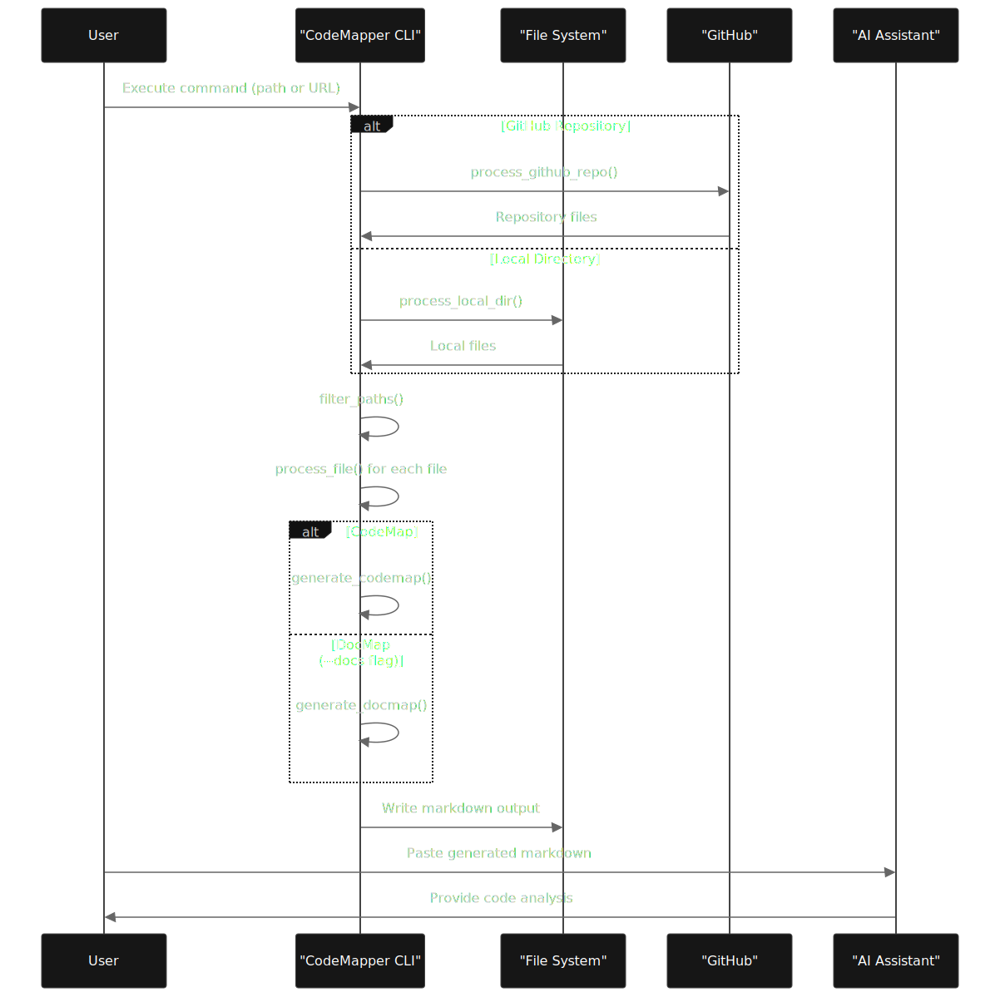

# CodeMapper Overview

Relevant source files

The following files were used as context for generating this wiki page:

* [README.md](https://github.com/shaneholloman/codemapper/blob/32e5c294/README.md)

## Purpose and Scope

CodeMapper is a Python tool designed to transform complex codebases into navigable, single-file Markdown artifacts. Its primary purpose is to bridge the gap between traditional code exploration and modern AI-assisted development workflows by providing a unified, accessible view of codebases that's optimized for both human readability and AI consumption.

This document provides a high-level overview of the CodeMapper system, explaining its core purpose, architecture, key features, and intended audiences. For detailed installation and usage instructions, see [Installation and Usage](/shaneholloman/codemapper/2-installation-and-usage). For deeper technical details about the system's components, see [System Architecture](/shaneholloman/codemapper/3-system-architecture).

Sources: [README.md34-41](https://github.com/shaneholloman/codemapper/blob/32e5c294/README.md#L34-L41)

## Core Functionality

CodeMapper serves as a solution for various code understanding challenges by:

1. Converting entire codebases (local or from GitHub) into well-structured Markdown documents
2. Generating specialized documentation maps focused solely on project documentation
3. Optimizing codebase representation for AI-assisted analysis
4. Providing a lightweight alternative to complex IDE setups for code exploration

The system achieves this through a command-line interface that processes either local directories or GitHub repository URLs, applies configurable filtering rules, and generates comprehensive Markdown output files.

Sources: [README.md120-134](https://github.com/shaneholloman/codemapper/blob/32e5c294/README.md#L120-L134) [README.md138-151](https://github.com/shaneholloman/codemapper/blob/32e5c294/README.md#L138-L151)

## System Architecture

CodeMapper is built with a modular architecture centered around these key components:

The core components handle distinct responsibilities:

* `main.py`: Entry point that processes command-line arguments and initializes the workflow
* `utils.py`: Contains utility functions for file traversal, content extraction, and output generation
* `docmap.py`: Specializes in identifying and processing documentation files
* `config.py`: Manages configuration options through specialized config classes

Sources: [README.md120-134](https://github.com/shaneholloman/codemapper/blob/32e5c294/README.md#L120-L134)

## Key Features

CodeMapper provides several key features that make it valuable for both AI engineers and hobbyist developers:

| Feature Category             | Capabilities                                                                                                                                                             |
| ---------------------------- | ------------------------------------------------------------------------------------------------------------------------------------------------------------------------ |
| Unified Code Visualization   | • Complete directory structure visualization   • Syntax-highlighted code content   • Intelligent file categorization   • Documentation aggregation              |
| AI Integration Optimizations | • Structured output format for LLM training/analysis   • Consistent formatting for token efficiency   • Documentation pattern support   • Metadata preservation |
| Git-Aware Processing         | • Respects `.gitignore` rules by default   • Direct GitHub repository URL support   • Shallow cloning for speed   • Smart binary file detection                 |
| Customization Options        | • Directory exclusion/inclusion controls   • Auto-excludes `.venv`, `.conda`, `node_modules`   • Documentation directory specification                             |
| Documentation Focus          | • Dedicated DocMap generation   • README file prioritization   • Multiple documentation format support                                                             |

Sources: [README.md43-73](https://github.com/shaneholloman/codemapper/blob/32e5c294/README.md#L43-L73)

## Processing Pipeline

The following diagram illustrates how data flows through the CodeMapper system:

This pipeline shows how CodeMapper processes different input types, applies filtering rules, extracts content, and generates structured output files.

Sources: [README.md120-134](https://github.com/shaneholloman/codemapper/blob/32e5c294/README.md#L120-L134) [README.md138-151](https://github.com/shaneholloman/codemapper/blob/32e5c294/README.md#L138-L151)

## Target Audiences and Use Cases

CodeMapper serves two primary audiences with distinct use cases:

### AI Engineers

### Hobbyist Developers

Sources: [README.md92-119](https://github.com/shaneholloman/codemapper/blob/32e5c294/README.md#L92-L119) [README.md166-181](https://github.com/shaneholloman/codemapper/blob/32e5c294/README.md#L166-L181)

## Workflow Integration

CodeMapper integrates easily into existing workflows, especially with AI assistants:

This workflow illustrates how users can generate code maps and then leverage them with AI assistants to gain insights about their codebase.

Sources: [README.md74-91](https://github.com/shaneholloman/codemapper/blob/32e5c294/README.md#L74-L91) [README.md104-111](https://github.com/shaneholloman/codemapper/blob/32e5c294/README.md#L104-L111)

## Output Types

CodeMapper generates two distinct types of output files:

1. **CodeMap** (`project_codemap.md`)

    * Complete directory tree with full structure
    * File contents with syntax highlighting
    * Smart handling of binary and large files
    * Navigation-optimized structure with TOC
2. **DocMap** (`project_docmap.md`)

    * Documentation-focused view
    * Prioritizes README files
    * Includes contents from documentation directories
    * Structured for easy consumption

These outputs serve different purposes: CodeMaps provide comprehensive codebase representation for deep analysis, while DocMaps focus on existing documentation for quicker understanding of project purpose and usage.

Sources: [README.md138-151](https://github.com/shaneholloman/codemapper/blob/32e5c294/README.md#L138-L151)

## Future Development

For information about planned features and enhancements, see [Project Roadmap](/shaneholloman/codemapper/4.3-project-roadmap).

Sources: [README.md152-165](https://github.com/shaneholloman/codemapper/blob/32e5c294/README.md#L152-L165)
